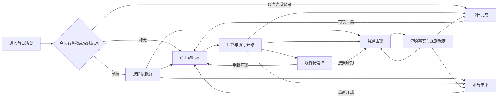
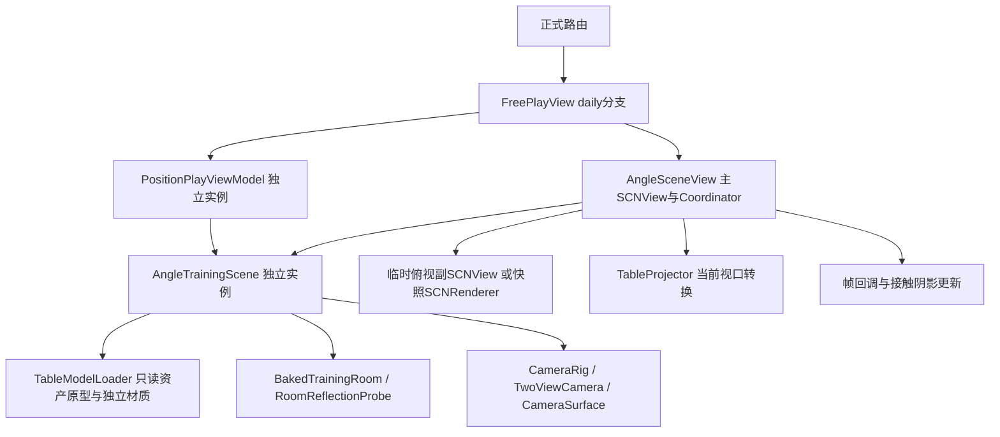

# 每日清台完整标准与跨页面复用分析

版本：1.3（C56核心模板与P01接入） · 2026-10-08。用途：推广到其他球桌页之前的统一查阅入口、现状审计和验证清单。

源码HEAD：`09118e2dc7d8105e55a338f8fd0afaf1753840c8`；有效视觉基线包含工作区C51–C56修改，以CURRENT及本轮源指纹为准。下文原37项测试是早期审计；新增复用测试/原生before/Figma提案独立记在P01 C56评审包。续接已完成P01首版接入、配置/缓存修复；当前工程/未验状态见[P01活动卡](../../../tasks/table-page-adaptation/P01-SHOT-SIMULATION.md)。旧审计测试与新44项单测/8次UI证据分列，不外推全页面。

**结论：每日清台是其他球桌页面的核心模板，所有适用组件、布局、状态、操作和基础能力直接继承；各页只保留业务差异。每日专属规则不作为所有页面的默认业务。** 当前已经有共享底座，不需要再复制一套球桌；真正需要补齐的是配置边界、宿主接入、状态隔离和逐页证据。

## 阅读顺序与证据约定

1. §1–4：页面、状态、操作和持久化；用于避免迁移漏功能。
2. §5–6：布局、外观及 DC01–28 覆盖；用于设计和评审。
3. §7–10：渲染、摄像头、缓存和跨页适用性；用于架构与实现。
4. §11–13：已验证结果、问题清单及推广前的执行顺序。

本文标记：**代码事实**＝本轮读取实际调用；**本轮测试**＝当前源码实际执行；**历史证据**＝已有批次记录；**建议**＝尚未实现或尚未决定；**待验**＝不能由现有证据推导。构建通过、逻辑测试通过、画面正确、触摸顺手、真机性能和用户认可分别记录。

## 1. 真源、版本与适用边界

|内容|真源|使用方式|
|---|---|---|
|当前实施和验收状态|[CURRENT](../../../tasks/daily-adaptive/CURRENT.md)、[B8](../../../tasks/daily-adaptive/B8.md)|读取最新补充；B8末尾的“尚未提交/云同步未验”是当时状态，已由10-08同步记录更新|
|设计原则和操作语义|[每日清台设计规范](每日清台设计规范.md)|DC01–28保留编号；旧页首“未实施”不能覆盖已完成的B1–B8工程事实|
|布局关系与测量方法|[基础布局与自适应标准](基础布局与自适应标准.md)|BL关系继续适用；旧“120候选尺长”须结合当前代码和B8区分实现与手感验收|
|功能状态与设计批次|[FUNCTION-STATES](../../../tasks/daily-adaptive/FUNCTION-STATES.md)|用于查找基础、展开、菜单、规则、结果和生命周期的图稿|
|实际行为|本文§14源码索引及当前代码|文档与实现冲突时登记差异，不悄悄把实现问题改写成规范|
|几何、坐标与物理资产|[table-geometry](../../../.kiro/steering/table-geometry.md)及其引用源码|禁止由截图比例重定义球桌尺寸、袋口、球半径或物理模型|
|Git/Figma交付|[同步核验](../../../tasks/daily-adaptive/GITHUB-FIGMA-SYNC-20261008.md)|精调、用户粗调两个文件各保留；云端命名版本读回不等于全部画面获认可|
|跨页排期|[推广方案](../../../tasks/table-page-adaptation/PLAN.md)、[页面清单](../../../tasks/table-page-adaptation/PAGE-INVENTORY.md)|本文是推广前置分析，P01实验成果保留，生产迁移另批推进|

有效组件版本以[核心模板清单](../../../tasks/table-page-adaptation/CORE-TEMPLATE-C56.md)为准：C47/B8基础与安全区、C49/B4/B8打点、C51球库及菜单r5、C54/55图标与四视角、C56状态。旧展开整屏不会随新批次自动更新，须按组件组合并核对当前App。B0是历史测量基线，不用重做或覆盖。D1/D2等展开设计及未确认体验须保留自己的状态。

用户此前把顶部黑区交给其他任务处理；当前提交已包含独立球房天花板工作，见[球房记录](../../../tasks/ROOM-CEILINGS-20261007.md)。不能再把“每日布局任务没有修”写成“当前代码没有天花板”，也不能据此认为所有机位遮挡已验收。

## 2. 完整页面与呈现清单

“页面”包括正式入口、同一球桌的模式、覆盖面板、规则决策、结果及系统状态；并不要求每项都有独立 SwiftUI 文件。

|ID|页面/呈现|进入、主要内容与退出|状态归属/推广边界|
|---|---|---|---|
|D01|训练首页入口|未开始、进行中、已完成三种入口状态；进入每日清台，返回后刷新|`TrainingHomeView`读取每日仓库；不推广每日完成标识到普通练习|
|D02|设置中的默认玩法|我的设置→每日清台→默认玩法|写`UserPreferences`；与球桌内“临时换玩法”区分|
|D03|待手动开球|首次无草稿或重新开局；保留球架，调整母球、方向、打点、杆速后击球|`DailyClearanceController`+`BreakFlowRunner`；新局不是自动击球|
|D04|2D基础球桌|完整俯视、球库、双侧控制、规则提示；切3D或返回|每日手机横屏；iPad横竖和实际窗口容量适配|
|D05|3D基础球桌|同一局与同一套主操作；额外观察控件|保护当前瞄准内容；不要求每个近景都露六袋|
|D06|3D全局/沿杆观察|通过相机控件显式切换；可继续手势观察|当前surface/merged分支含全局、站立持杆第三人称、俯身持杆第一人称及临时俯视；以C54/55和当前代码为准|
|D07|临时俯视|当前merged分支点击进入、再次点击退出；其他操作按权限禁用|观察态；不能重置选球、杆速、题目或规则。旧非merged分支另有按住控件|
|D08|球库单行/两行|容量选择；固定球槽，保留已进袋球；选择合法目标|C51隐藏母球；中八窄竖窗双行1–7/9–15、黑8右翼；正常横屏单行；不是编辑器的新增球库|
|D09|击球点展开|点击击球点；台内完整面板、拖动及四向微调；关闭后回主操作|输入属于当前杆/开球runner；必须保留合法打点范围|
|D10|击球点透明度|更多→透明度；当前值、连续调节、端点与关闭|仅控制展开白色球盘填充；不能连带淡化球、标记、数字或整页HUD|
|D11|更多一级菜单|显示低频入口、当前状态；显式关闭/返回焦点|`DailyHUDPresentation`统一持有；不叠加多个菜单|
|D12|瞄准模式子菜单|进袋/自由；禁用态、当前项；选后关闭|用户显式自由意图与临时自由回退区分|
|D13|轨迹子菜单|简/核心/完整，3D另有关闭|细节档是共享偏好；3D关闭为每日专属偏好|
|D14|玩法子菜单|中八、9/6/5/4球；有进度时经确认|临时换玩法不等于修改默认玩法|
|D15|显示开关|4×8网格、瞄准特写|当前共享偏好；迁移须确认跨页面影响|
|D16|重新开球确认|开球入口→重新开始/继续击球|取消必须保留本局；确认建立新球架/代次，不等于上一杆撤销|
|D17|换玩法确认|已有击球进度且未完成时显示|取消保留当前局；确认重建所选玩法|
|D18|普通规则提示|未定组、已定组、黑8锁定、非法选球、犯规等|文字/颜色由实际规则状态产生，不由图稿或预测成功率反推|
|D19|开球裁决待选择|弱开球/犯规后，根据`breakChoices`展示有效选项；必要时进入重开子选择|可选项必须完整，不能为了双按钮布局删除规则后果|
|D20|自由球摆放|全台/线后许可；拖动母球、约束/碰撞检查、保存落点|规则授权才可摆；普通编辑器可拖目标球的能力不得带入每日|
|D21|计算、击球、落袋和停稳|计算与动画状态明确；停稳事实送规则；旧异步结果失效|`isComputing`、`isPlaying`及runner阶段不是同一个状态|
|D22|重打|可撤销时恢复上一杆前球形、规则及选择上下文|终局、播放中或无撤销记录时受限；不重复记一次击球|
|D23|上一杆回放|有实际回放记录时播放；与“再玩一局”分离|消费既有记录，不能重复结算犯规/完成|
|D24|今日完成|完成摘要、再玩一局；重新进入能显示今日完成状态|首个当日完成记录与再次练习的当前结果分开|
|D25|失败/本局结束|结束原因与重新开球动作|保留结果事实，不能用镜头提示覆盖失败原因|
|D26|瞄准特写与辅助标注|按合法几何呈现、避让关键路径/球杆/袋口；收起有明确边界|解释作用，不是第二个选球或评分系统|
|D27|小窗口容量不足|无法完整操作时提示扩大窗口并保留返回入口|可恢复状态；禁止靠裁按钮、缩所有文字伪装可用|
|D28|离开、重进、前后台、旋转/缩窗|保存有效进度/前台时长；终止临时观察和待提交输入；按新窗口重排|不得把resize当新局；退出清理与跨日恢复另验|
|D29|最大字号、降低透明度/动态效果|长文字可读、操作可达；状态恢复|属于同一页面的完整使用状态；实际VoiceOver仍待验|

C56的时间/电量/FPS（含静止）是当前用户可见模板能力，补记D30；开发fixture、底层相机诊断和实验策略选择器不作为产品入口推广。

## 3. 状态模型与完整操作契约

### 3.1 不能合并为一个“正在玩”布尔值

持久化阶段实际为`manualRacked / playing / failed`，另有兼容旧草稿的`autoBreaking`；完成保存在独立`DailyClearanceCompletion`，不是draft中的completed阶段。旧autoBreaking恢复成手动球架。显示模式、相机观察、计算/播放、弹层、摆球许可是正交状态。

此图表达主要业务路径，不代表全部分支和时序实现。菜单和2D/3D切换不在这里建立新球局。

### 3.2 输入、动作和权限

|操作|必须保持的语义|当前接入与验证重点|
|---|---|---|
|点目标球/球库球|先验证在桌、合法目标；确认用户意图，不承诺进球|非法选择保留原输入；进袋球槽仍在，仅提示已进袋；母球点击不变成目标球|
|点袋口|选袋与预测结果分开；几何不可用时按已定回退策略处理|重复点击、快速换球换袋、计算中旧结果均不能覆盖最新意图|
|方向尺|调方向，可暂时进入自由；不自动出杆|下一次合法选择可退出临时自由；显式自由模式要继续保留|
|杆速尺|调整杆头速度，松手只完成最新预览|每日调用`endPowerDrag(commit:false)`；击球按钮是执行入口|
|打点拖动/微调|X/Y共同构成一次当前输入，预览与最终参数一致|合法打点边界由现有物理契约约束，不能任意放到圆盘方形角落|
|3D拖动/捏合/相机键|改变观察，不无故改目标球、袋口、打点、速度|路由到当前相机策略；识别摆球和HUD手势，不能所有拖动都变成orbit|
|临时俯视|保存/恢复观察上下文，限制不适用操作|结束、离页、失活都要清理；不把临时副本当新的业务场景|
|击球|只消费当前可执行的完整输入/结果|清待提交调参；准备撤销快照；播放结束只裁定一次|
|重打|恢复上一杆前业务和桌面|与回放、新局分开；撤销可用性由controller维护|
|回放|播放既有杆记录|不能再次调用每日完成/犯规结算；控制禁用从实际状态读取|
|开球/换玩法|确认后替换尝试，取消保留当前局|代次使旧开球回调无效；不复用上局待提交结果|
|返回/进入后台|停止临时交互，结算前台计时，保存已确认进度|不能把后台时间算成训练时长；恢复时不能重复计时|
|2D/3D切换|保持业务、球位和这一杆意图|不重建球架，不重新计分，不用普通参数刷新反复自动归位|
|旋转/窗口变化|重新算容量和实际投影|安全区只扣一次；保留scene/coordinator与当前局；全屏、浮窗、恢复全屏都要覆盖|

禁用矩阵不能用单个全局`disabled`取代：当前`dailyControlsDisabled`包含临时俯视、决策、播放、结果、待开球裁决和runner非racked阶段；球库还额外禁止开球模式；相机键还检查计算中及有效瞄准引用；重打、回放分别检查`canUndo`、`canPlayback`。开球入口与返回等例外须逐项保留，不能把所有控件机械同步禁用。

### 3.3 连续预览、事实与失效

- 每日显式启用连续预览、合法目标提供器和每日推荐策略；其他`PositionPlayViewModel`消费者未自动获得这些业务策略。
- 连续输入允许更新预览；旧球形、旧目标、旧参数对应的异步结果不得授权击球。离开、换局、重新选择等操作使旧任务失效。
- 裁定使用本杆真实`ShotFacts`和规则引擎；球库亮暗、目标合法集合、剩余球和自由球许可来自同一局状态。
- 母球进袋后，只有规则允许自由球且未终局时补回，再读取并保存桌面。不能按下一杆“预计母球进袋”触发补球。
- 2D/3D只是观看方式，不能改变同一输入的物理模型、碰撞事实或成绩。

## 4. 偏好、存储、计时与外部依赖

|状态|当前范围|推广要求|
|---|---|---|
|`dailyClearanceGame`|全局默认每日玩法；设置页持久化|不能把球桌临时换玩法自动写成全局默认|
|draft、completion|`DailyClearanceStore`的UserDefaults数据，按日读取|不是云同步球局；跨日草稿丢弃、损坏数据和旧版本有各自处理|
|前台用时|controller注入时钟；`flushActivity`清空activeSince保证幂等|离页/后台/终局不得重复累计；不能推广成所有练习的统一计时定义|
|`trajectoryDetail`|共享偏好|一个页面改变会影响其他消费者；逐页决定是否保留此共享语义|
|`daily3DTrajectoryHidden`|每日专属持久化|不影响2D方向提示，不默认为教学页隐藏答案/轨迹|
|`dailySpinDiscTransparency`|每日专属持久化，默认0.5并校验有限值/范围|只改变展开白盘填充，其他页面需要明确opt-in|
|网格、瞄准特写|共享偏好|菜单文案和实际显示同步；固定答题页是否允许须独立决定|
|球桌/台呢/球/球杆/球房外观|共享外观偏好，各scene实例安装|修改外观不能改变球位、机位、规则；缓存材质必须隔离|
|选球、打点、速度、计算任务|当前VM/开球runner与快照上下文|不得放入跨页面全局单例来“复用”|
|菜单、展开盘、临时观察|当前宿主呈现状态|离页清理，不持久化成下页默认弹层|

同日再玩一局不会覆盖已保存的首个当日完成记录：当前controller在已有完成记录时仅生成当前结果并清草稿。菜单中的“回放”、完成页的“再玩一局”和代码`DailyClearanceController.replay()`名称不能混淆。

依赖还包括会员/执行权限、路由、方向控制、场景生命周期、声音触觉和辅助功能。检查正式入口时须确认确实到达球桌，不能用会员弹层或DEBUG深链替代用户路径。

## 5. 可推广的布局与视觉标准

### 5.1 坐标和空间账本

`window → page（已消费安全区）→ stage → 2D外框T/内框I → 控件L/V/H`必须分别记录。window不是设备屏幕；stage不是球桌；外框不是2:1台呢内框；截图像素不是逻辑pt；AX框也不是实际触控证明。

2D依真实资产外框拟合，统一比例、不压扁、不裁袋；I来自物理几何与当前投影。Canvas与SceneKit转换继续调用共同函数，不为每页再写一组坐标换算。3D近景允许桌边出画，但当前球、目标、杆、关键路径及操作区需按其任务保护。

### 5.2 当前基础关系与参数

|项目|标准/当前实现|适用和边界|
|---|---|---|
|球桌优先|先预留必要操作容量，再拟合真实比例T|新增空间优先给桌面，不把整页UI等比放大|
|球库贴桌|胶囊可见下沿贴2D T上沿，间距0|不按图片透明边或伸出杆尾测量；3D共有HUD用参考布局，不追逐透视桌边|
|球库居中|C51目标序列对齐桌心，每日隐藏母球；进袋不删槽|隐藏母球属于每日业务；可编辑球形页面必须保留母球恢复/摆球路径|
|顶栏|返回/标题、球库、时间/电量/FPS、更多；2D/3D收入设置|44pt基础顶栏；真实标题与系统窗口按钮参与容量计算|
|双侧控制|侧列基准60pt，左右仪表成对；组间常用4pt|按圆盘、轨道、标签分别量，不强行把两侧所有外框做同高|
|方向/杆速|可见轨道32pt；当前Foundation按容量用144/120pt行程|两尺配对；120已进代码和模拟器，精调手感仍待真机|
|开球/击球点入口|当前基础档48/56pt，同档成对|辅助动作44/48pt；尺寸档来自内容容量，不按iPad名称分支|
|击球|当前Foundation60×60pt|独立执行动作；不能与杆速松手合并|
|球库球面|C51上限36pt，按36/34/30/25pt容量档选择；不反向缩桌|正常横屏始终单排；只有特别窄的临时竖屏，单排容纳失败才双排；不足时明确溢出路径|
|相机键|C54四个44×44pt、间隔4pt；竖列位于杆速左侧，整组中心对齐完整杆速外框|顺序全局观察/站立持杆/第一人称/临时俯视；只在相应3D能力成立时展示|
|打点面板|完整卡片限制在2D I内；3D使用稳定参考范围|当前紧凑档保留44pt方向键，扩大到上限后不随iPad无限长大|
|菜单/确认|有锚点、有当前值、有关闭；容量不足时内部滚动|长标题/辅助字号不截半行；确认动作保持可达|
|低容量|明确显示扩大窗口/返回|保留可恢复路径，不能隐去击球/关闭后仍声称可操作|

C51菜单r5覆盖旧“显示置底”：显示组在击球设置上方，内部顺序为视图、打点盘透明度、台面网格、瞄准特写；随后瞄准模式、轨迹与本页业务项。可点击图标/文字亮白，不可点击灰色，选中状态另用浅绿底，不能把灰色当未选中。开球空心球环与人物图标采用C54同源矢量，人物视觉微调不改变命中框。

C56状态块按时间→电量→FPS，32×41pt、更多左5pt，静止/真实帧率共用末行；真实系统状态栏可见时不重复时间电量。此为可采用的辅助信息，不应挤压教学读数或正文。沿用真实渲染计数，不通过FPS显示更新驱动渲染循环。完整变更证据见[C51](../../../tasks/daily-adaptive/C51.md)、[C54](../../../tasks/daily-adaptive/C54.md)、[C55](../../../tasks/daily-adaptive/C55.md)、[C56](../../../tasks/daily-adaptive/C56.md)。

这些数值是当前每日基础档的审计，不是所有页面必须照搬的常量。`DailyLayoutMetrics`仍包含Foundation与早期Space/Header方案分支；推广应先确认实际调用，不能把整个文件复制为新的通用布局器。

### 5.3 安全区与iPad

背景铺满当前App窗口，交互内容避开系统遮挡；“填满窗口”与“系统把窗口最大化”是两件事。应用布局不能把iPad浮窗强行当成全屏画板。

当前实现读取实际窗口、宿主已消费inset和状态栏遮挡交集，只补未消费部分；iPadOS窗口按钮的横向避让限定在顶栏，不能给整个球桌再加同样边距。手机横屏与iPad允许旋转的策略由宿主方向控制负责，不应塞进摄像头算法。

回归必须含：横屏→竖屏→横屏；全屏→窄窗；同一App从窄窗恢复最大化；参数/球局保留；坐标投影和点击随新viewport同步。B8已有相应定向历史证据，不能代替未来其他宿主的验证。

### 5.4 外观和无障碍的未闭合项

- 当前球库普通槽宽为`diameter+2`，两行高度为`diameter+4`；最小档约27×29pt。**这是已有B8明确记录的例外，本轮源码复核一致，不是所有H均达到44pt。** 手指误触和VoiceOver仍需验证；不可给相邻球各扩大成互相重叠的44pt热区来凑数。
- 保留选中、可击打、在桌、已进袋、禁用等不同事实；不能全部用同一种绿色解释。降低透明度时要实际看清面板，不能仅检查系统开关。
- 音效/触觉提示操作位移与动作反馈，数值仍由输入逻辑决定；模拟器不证明声音、触觉、握持或疲劳体验。
- 3D材质验收含近球、低角度、袋内观察侧、运动阴影及不同球房；全图均值和单次快照不能掩盖局部闪烁/条带。

## 6. DC01–28如何推广

|条款|推广内容|保留差异或必验项|
|---|---|---|
|DC01|球桌作为主要工作区|阅读/答题页还需保护题干和输入区|
|DC02|区分2D完整读盘与3D观察目标|固定2D/3D训练不能因此合并成绩或开放任意镜头|
|DC03|导航、球库、模式层次清楚|无球库/模式的页面不新增无用入口|
|DC04|目标序列居中、固定槽位|编辑球库是增删球，不套每日在桌筛选语义|
|DC05|颜色对应明确事实|教学角色色/答案反馈保留原定义|
|DC06|V/H分离、命中不重叠|当前球库窄槽例外不能宣称通用达标|
|DC07|成对仪表的关系和读数|仅有一个参数的页不强配另一条尺|
|DC08|粗调精调和有效行程|量程、灵敏度、数值单位按页面任务保留|
|DC09|调参与执行分开|演示自动播放页明确自己的播放语义|
|DC10|打点可见、可微调|没有打点能力的页面不加盘；受限练习保留限制|
|DC11|透明度范围明确|先决定页面是否opt-in每日白盘偏好|
|DC12|材质克制、选中/按下/禁用清楚|不能通过统一HUD色修改SceneKit材质配置|
|DC13|低频设置收纳、当前值可见|逐页设置能力表先完整盘点|
|DC14|辅助信息层次/关闭明确|题干、读数、解目录不能当装饰删除|
|DC15|特写解释几何且不遮关键信息|复用投影/避让规则，保护对象按页面定义|
|DC16|尊重当前杆用户意图|每日自动推荐/合法目标仅在明确适用页接入|
|DC17|反馈确认动作|不把选中反馈当进球、正确答案或已完成|
|DC18|相机观察权与调参分开|沿杆观察、固定题目镜头、导出镜头各自保留|
|DC19|普通信息和待行动决策分层|规则后果/错误恢复不能缩成同一种toast|
|DC20|开球、重打、回放边界|无开球页不新增每日开局流程|
|DC21|入口、草稿与结果连续|每日按日存储不能代替编辑器草稿或训练记录|
|DC22|连续响应与最终事实一致|求解器、编辑器和演示的更新成本各自验证|
|DC23|完整的窄窗/辅助功能操作|键盘、关闭、滚动、焦点、最大字号都算页面功能|
|DC24|按关系和容量适配|基于实际窗口，不复制设备名断点|
|DC25|观察/选球/摆球手势分工|每页声明可拖对象、触发条件及冲突优先级|
|DC26|声震不改变数值|跨页保持开关语义，真机单独验|
|DC27|场景空间感与HUD辨识分层|共享视觉语言不等于强制同一灯光/曝光|
|DC28|显示、规则、物理同源|不把普通击球整桌停稳标准机械套到教学事件切片|

每页任务卡应逐条写“适用/保留差异/不适用及原因→实际证据”，不能只粘贴DC编号。

## 7. 渲染复用：实际调用链与边界

### 7.1 当前各条管线并不相同

|消费者|场景/输出|已核对配置|复用结论|
|---|---|---|---|
|每日清台|`AngleTrainingScene`+`AngleSceneView`|setup前`configureDailyClearanceRendering()`：profile R/reflection、曝光-0.1、daily perspective及减少相机冗余写入|已经复用通用scene，但有每日局部opt-in|
|P01分离角与走位|同一scene/host与C56 FreePlayView模板|setup前分别调用`configureReferenceTableRendering()`、`configureShotAwareCamera()`；每日规则不启动|首版已接入，教学球数/摆球/偏好独立|
|其他普通交互球桌|同一scene/host类型，各VM持有独立实例|缺省profile A/reference；按宿主启用相机/交互|共享类型不代表与每日同曝光、同shader变体、同相机|
|详情/训练记录球桌|`DrillSceneController → DrillSceneView → AngleSceneView`|独立播放控制、2D/3D和投影；调用默认setup|本轮补齐两处直接消费者：`DrillDetailView`、`DrillRecordView`|
|教学静态桌底|`BTTableFigure → TableFigureRenderer`|plain离屏、正交、图像缓存，明确`mobileRendering:false`|复用资产/坐标，不能塞入实时全屏HUD|
|Drill缩略图|`DrillThumbnailRenderer → SCNRenderer`|plain离屏、固定代表性球形；非列表逐帧渲染|生成成本和缓存策略独立，不应随每日配置改变历史内容外观|
|球面/局部球感演示|`BallFaceRenderer`及`BallFeelView`局部SCNView|所查入口显式plain管线|保留局部展示目标；不能按整桌摄像头统一|
|外观组合预览|`AppearanceCombinationPreview`独立SCNView|mobile场景、固定预览机位、按需重绘、无交互|共享外观资源，不共享训练scene/camera状态|
|视频导出|`SequenceVideoExporter → SCNRenderer`|`useAppAppearance`选择mobile；否则plain/studio分支，独立相机配置和帧合成|同资产不保证同整页外观；HUD/教学文字需专门合成验证|
|房间反射烘焙|`RoomReflectionProbe → SCNRenderer`|按完整静态外观Inputs烘焙复制的房间/桌/灯；不改变活场景|独立资源准备路径，不是主屏幕视图|

**profile R/A是实现里的专用着色器方案标识，不能把A描述成“没有反射”、R描述成“唯一正确画质”。** 每日选择R不代表其他消费者应自动晋级；材质观感、兼容和整页成本要各自对照。

### 7.2 “一个渲染器”的准确表述

当前每日主`SCNView/scene/coordinator`在布局和模式变化时保持稳定，这是B8验证的身份连续性。`AngleSceneView.Coordinator.updateMergedOverlay`还会创建一个临时俯视`SCNView`，使用克隆渲染场景和独立正交相机；非merged路径使用`SCNRenderer`生成快照。反射烘焙和离线输出也各有renderer。

因此应写：**稳定主宿主＋按需派生渲染**，不能写“全应用只有一个SCNView/SCNRenderer”或“临时俯视零额外GPU成本”。本轮确认了创建/清理路径，尚未测临时俯视的真机GPU与峰值内存。

### 7.3 每个宿主必须满足的接入合同

1. setup前确定渲染配置；页面持有稳定scene实例。`updateUIView`更新外观、相机和交互，但当前并没有把传入的新scene重新完整绑定到旧Coordinator，因此**不应在同一host身份下随意替换scene实例**。
2. 一个活动scene只对应自己的可变球形、camera、动作和视口桥接。`closeupViewport`是单个weak引用；不得让多个同时可见页面共享同一mutable scene。
3. `TableProjector`的局部pt、窗口pt、世界坐标对应真实UIView；旋转/resize更新viewport及可读区域，不能沿用旧Figma坐标。
4. 渲染循环由真实活动驱动；调参、动画、相机阻尼和临时观察需要帧，静止期不靠每次SwiftUI update无限续渲染。
5. `dismantleUIView`解除临时叠层、观察/拖动、循环、delegate关联及scene/pointOfView；VM还要取消自己的异步任务和待提交输入。
6. ContactOcclusion等renderer delegate必须随相应管线接入；有节点不等于阴影已逐帧更新。离线渲染也要检查delegate与时间推进。

## 8. 摄像头复用：共享算法与不同策略

### 8.1 当前每日配置是组合开关

`FreePlayView`每日分支先配置scene，再`vm.setupScene()`，再`vm.enablePlayerCameraControls()`。后者读取`scene.usesDailyPerspective`，据此启用`usesSurfaceCamera / usesMergedCamera / usesSimpleCueCamera / usesTwoViewCameraControls`；普通宿主仅启用相应rail控制，不自动启用这组每日策略。

直接调用情况：每日与普通自由击球在同一`FreePlayView`入口调用；`ShotSimulationView`在首次出现时调用；`PositionPlayComposerView`在相机按钮动作内调用。**三者初始化时机也不完全相同。** 调用表已写入本轮证据，不能仅看同一个按钮组件认定相机完全一致。

续接已拆为`configureReferenceTableRendering()`与`configureShotAwareCamera()`，均在setup前显式调用；原`configureDailyClearanceRendering()`组合入口保留兼容。P01分别opt-in，其他消费者默认不改变；四种配置组合已验证。

### 8.2 所有权和事件边界

|层|负责|不能负责|
|---|---|---|
|页面/VM|当前题目/杆/目标、模式意图、阶段、生命周期|通过每帧更新强制覆盖用户观察|
|`ShotPlayCamera`及VM request方法|模式切换、合法观察请求、业务上下文交接|成为另一个规则/评分控制器|
|`CameraRig`|机位策略、viewport、切换/恢复、手势入口与约束|在无业务授权时换目标球或推进步骤|
|`TwoViewCamera`/`CameraSurface`|姿态/插值、surface参数与相机运动计算|持有每日完成、题目答案或球局存储|
|`cameraNode`与renderer|应用当前有效姿态并输出画面|反向推导业务阶段|

同模式请求应幂等；动画/异步请求带代次或上下文；手动观察、自动沿杆、全局和临时俯视只有一个当前姿态写入者。参数微调不能重复触发入场镜头。新球形/新局需要失效旧镜头上下文，但普通2D↔3D往返应按当前策略保留观察状态。

### 8.3 各类页面应该保留的相机差异

- **自由操作页**：可复用视口拟合、观察请求和业务保持；每日沿杆surface策略是否更适合，必须用本页代表球形和操作做对照。
- **规划/求解页**：全局、选球/袋、目标区域、解目录共同决定可读区域；不能只保护母球和当前目标而遮住后续两杆。
- **答题页**：固定2D/3D入口及成绩分记属于教学约束。代码能切视角，不代表产品应该允许切；提交答案、题号和得分不得因观察改变。
- **图谱/阅读页**：优先保留标注、角弧、数值和教学构图；不需要全套每日相机按钮。
- **视频/缩略图**：相机属于输出规格，要确定帧尺寸、镜头时间、构图和合成层；不能套手指交互相机的默认值。

## 9. 资源、缓存和并发隔离

|资源|当前机制|已证明/剩余风险|
|---|---|---|
|USDZ桌体原型|`TableModelLoader`锁保护解析和clone，几何/材质再copy|适合共享只读原型；不共享球位、动作或材质可变实例|
|球房节点|`BakedTrainingRoom`缓存当前一种style原型，输出clone+geometry/material copy|本轮测试验证材质透明度/隐藏不污染下一实例；不是所有style节点常驻缓存|
|房间反射probe|完整静态外观Inputs键，LRU最多3项；预过滤资源随probe复用|续接验证外观刷新/切回复用/淘汰后活probe有效/scene释放，静态烘焙排除动态球影和袋口角色；不证明全部外观组合视觉正确|
|probe键完整性|首次从传入scene烘焙，包含桌体/灯光；键只有room style|**待专项验证**：首个消费者的桌面外观/配置是否影响后续同style采样；已有隔离测试未覆盖该首入顺序问题|
|预览轨迹|已有保留节点/材质、几何依赖和输入失效机制|本轮测试验证不因无关输入重建或延长渲染窗口；不能据此保证全局无泄漏|
|临时俯视副本|克隆场景、复制/同步展示节点、退出清理|需要测频繁进入退出的活对象数、峰值内存、运动同步；不能与业务原scene共同写同一局|
|静态图像缓存|例如`TableFigureRenderer`缓存输出|若将来引入可变外观，需把外观/版本加入键或显式失效|

probe首入顺序是审计风险，**当前尚未证明有用户可见错误**。本轮已完成正反首入顺序、同源重复烘焙和外观变化纹理比较：首入差异未超出同源重复对照，但外观变化后仍命中旧缓存。见[P01核验报告](../../../tasks/table-page-adaptation/P01-C56-REUSE-REVIEW.md)。续接已修复完整外观输入与初始化时机，新增同机位两种外观的真实SceneKit图、动态球形/袋口隔离及淘汰/释放验证。纹理风险已修复；全部外观/真机持续成本仍待验，不把历史数据当当前故障。

SceneKit框架的节点锁不替代应用自身线程/代次管理。播放完成、取消、后台和下一杆的更新应沿用当前锁与生命周期合同；推广UI不能顺便重写物理、落袋库存或动画结算。

## 10. 逐页适用性与迁移边界

|页面族|可直接继承的标准|需保留/重新验证的部分|
|---|---|---|
|P01 分离角与走位|容量、安全区、双尺/打点/执行分离、菜单、状态反馈|最多两目标球、摆球与教学标注；lab02是旧实验，不是当前每日C56自然等价物|
|P02 自由击球|最接近每日的基础布局与主场景宿主|同文件两分支、普通玩法规则、可编辑球库、清台/开球；不得接入每日按日完成逻辑|
|P03 自由走位/试打/编排|共同投影、输入控件、相机请求、回放|内容入口、草稿/序列、步骤、区域约束、下一解；相机初始化时机|
|P04 思路训练/P05 打一走二想三/P06 防守|桌面容量、信息分层、完整输入与结果检查|规划区域、多球角色、步骤/解目录、任务特有工具；先列完整能力表|
|P07 翻袋/颗星|两页现有`SolverStageChrome`共同容器优先|库数、障碍、反解与自由操作分别测；一页通过不能覆盖另一页|
|P08 分离角/加塞吃库图谱|材质/控件语言、投影一致、参数反馈|教学事件切片、读数、曲线与展示镜头，不强制每日整杆业务|
|P09 角度训练/P10 瞄准点训练|安全区、答题和反馈可达、场景资源隔离|固定2D/3D入口、答案/成绩/限额、验证击球与重复提交保护|
|详情/训练记录嵌入球桌|实际容器拟合、播放/相机状态、投影|滚动/手势竞争、内嵌高度、步骤播放，不能强制全屏侧栏|
|理论阅读、球感和几何测验|静态桌体比例、标注可读、统一材质词汇|Canvas/静态底图/局部3D混合；不统一替换成实时SCNView|
|拍照提取/批量编排|坐标转换、可编辑桌面容量、明确确认|原图映射、校正、导入、批量工具条件入口；不扩大为识别算法改造|
|外观预览/缩略图/导出|资产、只读缓存和场景配置边界|输出管线、固定镜头、性能预算、合成与缓存键各自验收|

本轮静态盘点补齐了`DrillDetailView/DrillRecordView → DrillSceneView`和`BTPracticeCover → BTTableFigure`。这仍不是全部页面/路由的运行时巡游；产品变体、权限、嵌套导航和静态图片间接引用还需逐页任务卡覆盖。

## 11. 本轮验证与证据范围

本轮在独立模拟器`Daily-Standard-Audit-20261008`（iPhone 17 Pro / iOS 26.3，UDID `1D02D993-A84E-4376-9AE8-3465A6DD9967`）运行定向单元测试。按实际`Test Case`及`Executed`计数，结果登记在[本轮审计记录](../../../tasks/table-page-adaptation/DAILY-STANDARD-AUDIT-20261008.md)。源文件指纹与词法调用清单在`output/daily-standard-reuse-audit-20261008/source-inventory.json`。

|验证组|检查内容|不能推导|
|---|---|---|
|布局18项|球库换行、Foundation真实比例、安全容量、尺长/内边距、相机通道、打点卡、菜单视口、边界往返|手指误触率、系统真实窗口、所有字号视觉|
|渲染/资源隔离|每日profile局部性、房间材质clone、probe资源复用/释放、跨管线台呢恢复/阴影绑定|当前所有GPU像素正确、跨Runtime兼容、手机温升|
|相机与业务分离|序列步骤/意图、题目答案/成绩、重复切换、不同viewport拟合、每日surface opt-in隔离|所有真实入口手势、全部3D球形无遮挡|
|输入与预览|非法选球不污染意图、临时/显式自由区别、参数不改意图、保留节点、渲染活动、离页失效、共享轨迹偏好隔离|所有页面已接入每日连续预览|

历史B8的10项最终UI及70张状态图属于每日原生适配证据，本轮没有重新采集该矩阵，也没有把这些截图当作其他页面的验收。原37项审计未覆盖真机持续GPU/内存/温升、VoiceOver实际朗读或全页面视觉巡游。后续C56推广准备证据单列，不能把新增小范围检查外推为全量验收。

## 12. 已识别问题与验证优先级

|ID|判断|影响与处理|
|---|---|---|
|R01|已确认：主规范/分册部分状态文字落后于CURRENT|本轮增加明确当前入口；历史候选/失败不删除，不把旧“未实施”用于排期|
|R02|已解决：渲染与相机opt-in拆开，原每日组合入口保留|P01和每日实际消费者已验证；P02尚未迁移|
|R03|已确认：共享类型不等于同profile/同策略|逐页登记setup、mode、手势、投影、delegate、退出清理；不修改全局默认来求一致|
|R04|临时俯视派生renderer：6次往返主scene稳定、派生视图/scene释放通过|本轮P01 C56复验；真机GPU成本与长时内存未验|
|R05|已确认：当前球库小槽是触控例外|保留B8未验项；设计可比较更宽槽/不同排布或辅助选择，原生命中与真机再裁定|
|R06|host假设scene身份稳定；4次拆除/重进资源释放通过|同一host换scene不受支持；保持稳定实例，不把重进通过当替换通过|
|R07|已修复：完整外观键、安装后刷新、静态复制烘焙与容量3的LRU|当前单测及两主题实图通过；全部组合/真机成本未验，详c56-native-r01报告|
|R08|已确认：共享偏好与每日专属偏好并存|菜单迁移逐项决定作用域，尤其轨迹档、3D关闭、透明度、网格和特写|
|R09|缺证据：跨页shader画面和生命周期全集|逐页同条件原生图+至少当前/最低支持Runtime；检查shader错误、遗漏delegate和后台恢复|
|R10|缺证据：真机触感/辅助功能/持续性能|按风险执行；模拟器耗时、DEBUG诊断不能对外当真机结论|

R02/R07已完成上述定向修复；R03/R04继续作为架构/说明边界；R05仍是已知体验边界。普通页面不共享活scene的现状应保留。

## 13. 推广前与逐页执行顺序

1. **本轮基线整理**：完成本文、调用清单、定向测试与状态回写；把已知差异交给后续页面卡。此步不迁移生产UI。
2. **补关键复用证据**：优先R07缓存首入顺序、R04临时俯视资源生命周期、R06host身份；对每日、P01和普通自由击球做相同球形/机位/外观的原生对照。
3. **建立P01能力映射和设计差异稿**：重新对照当前每日C56组件组合与P01实际before；保留已确认的顶部球库/方向尺常驻等反馈，明确P01不具备哪些每日能力。先图稿与真实安全区，再改视觉代码。
4. **P01小范围接入**：优先使用现有组件和scene，页面业务不搬家；渲染/相机保持显式配置。完成功能、输入、退出和代表尺寸验证后交付体验。
5. **P02作为第二消费者检验**：确认相同合同确实成立，再把两页重复且稳定的部分提升到共用层；每日两分支回归同批执行。
6. **按页面族推广**：共享容器成对页面一起验；规划、答题、阅读、编辑、离线输出分别采用适合的壳与相机权限。每页保留适用性、设置和证据矩阵。

建议的配置分层（尚未实现/未形成新ADR）：布局容量输入、渲染外观配置、观察策略、交互权限、页面业务状态五个独立面。不要新建一个同时管理每日计分、答题答案、求解流程和导出镜头的“通用球桌ViewModel”。

每个迁移页至少交付：正式入口与权限前置；基础/展开/禁用/结果图；完整操作与设置表；2D/3D允许范围；小手机与iPad横竖/窄窗/回程；选球/调参/执行/回放/退出链；材质和相机对照；剩余问题。iPad系统窗口和相机viewport分别验，不能只改变预览画板尺寸。

**完成标准**：本文完成是“标准整理与现状审计完成”，不是“所有球桌页已统一”或“所有摄像头/渲染复用问题已解决”。后续按上列问题产生可复核证据，才能升级对应结论。

## 14. 源码索引

以下链接相对本文件，符号比固定行号更稳定；本轮精确行号见调用清单。

- 页面、入口与设置：[FreePlayView](../../../QiuJi/Features/PositionPlay/Views/FreePlayView.swift)、[TrainingHomeView](../../../QiuJi/Features/Training/Views/TrainingHomeView.swift)、[SettingsView](../../../QiuJi/Features/Profile/Views/SettingsView.swift)、[MainTabView](../../../QiuJi/App/MainTabView.swift)、[方向控制](../../../QiuJi/App/QiuJiApp.swift)。
- 状态与规则：[DailyClearanceController](../../../QiuJi/Features/PositionPlay/ViewModels/DailyClearanceController.swift)、[DailyClearanceRulesEngine](../../../QiuJi/Core/Rules/DailyClearanceRulesEngine.swift)、[DailyClearanceStore](../../../QiuJi/Data/Services/DailyClearanceStore.swift)、[UserPreferences](../../../QiuJi/Data/Services/UserPreferences.swift)。
- 布局/组件：[DailyLayoutMetrics](../../../QiuJi/Features/PositionPlay/Views/DailyLayoutMetrics.swift)、[DailyHUDPanel](../../../QiuJi/Features/PositionPlay/Views/DailyHUDPanel.swift)、[DailySpinTransparencyPanel](../../../QiuJi/Features/PositionPlay/Views/DailySpinTransparencyPanel.swift)、[BTShotInstrumentColumn及相机按钮](../../../QiuJi/Core/Components/BTShotInstrumentColumn.swift)。
- VM与相机：[PositionPlayViewModel及ShotPlayCamera](../../../QiuJi/Features/PositionPlay/ViewModels/PositionPlayViewModel.swift)、[CameraRig](../../../QiuJi/Core/Scene/CameraRig.swift)、[TwoViewCamera](../../../QiuJi/Core/Scene/TwoViewCamera.swift)、[CameraSurface](../../../QiuJi/Core/Scene/CameraSurface.swift)。
- 场景与管线：[AngleSceneView](../../../QiuJi/Core/Scene/AngleSceneView.swift)、[AngleTrainingScene](../../../QiuJi/Core/Scene/AngleTrainingScene.swift)、[MobileReferenceLighting](../../../QiuJi/Core/Scene/MobileReferenceLighting.swift)、[TableModelLoader](../../../QiuJi/Core/Scene/TableModelLoader.swift)、[BakedTrainingRoom](../../../QiuJi/Core/Scene/BakedTrainingRoom.swift)、[RoomReflectionProbe](../../../QiuJi/Core/Scene/RoomReflectionProbe.swift)。
- 其他输出：[DrillSceneView](../../../QiuJi/Core/Scene/DrillSceneView.swift)、[TableFigureRenderer](../../../QiuJi/Core/Scene/TableFigureRenderer.swift)、[DrillThumbnailRenderer](../../../QiuJi/Core/Scene/DrillThumbnailRenderer.swift)、[SequenceVideoExporter](../../../QiuJi/Core/Media/SequenceVideoExporter.swift)、[AppearanceCombinationPreview](../../../QiuJi/Features/Profile/Views/AppearanceCombinationPreview.swift)。

后续维护：新决定先更新对应DC/BL或页面规则，再更新本文相应差异和测试范围，最后回写CURRENT/页面卡。新设备、新管线或新相机消费者加入时必须补矩阵，不能只更新截图数量。

## 15. C56核心模板推广准备补充

用户明确每日是核心模板，全部适用内容继承；逐组件有效来源与D01–D30适用范围见[核心模板](../../../tasks/table-page-adaptation/CORE-TEMPLATE-C56.md)，来源返工、6项复用单测、P01 before和当前每日22种原生状态见[核验报告](../../../tasks/table-page-adaptation/P01-C56-REUSE-REVIEW.md)。旧简化菜单已撤回；历史37项审计保留，不重复计为本轮执行。
