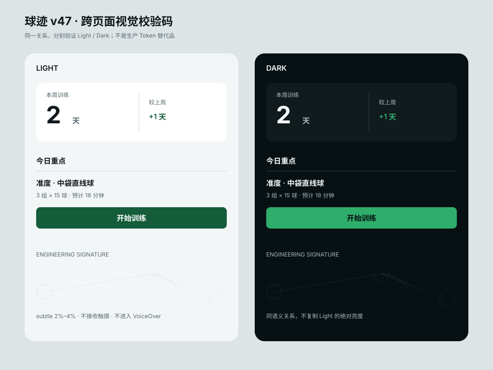

# v47 跨页面视觉校验码

> 版本：1.0 · 2026-08-30
> 批次：W2a
> 用途：R（根页）、D（数据页）、B（品牌页）三个真实 App 样板的共同视觉对照。
> 边界：这是关系规范，不是新的 Design Token 真源；生产代码继续使用现有语义 Token。

## 1. 四组固定关系

| 校验项 | 固定关系 | 允许页面差异 |
|---|---|---|
| Canvas / Surface | Canvas 承担连续背景；Surface 只承载独立交互、选择、输入或悬浮内容；分组优先用留白和细分隔 | 根页可比表单少卡；暗场工具不用此浅色关系 |
| Metric hierarchy | 核心数字使用展示级/统计级 Token并加 `.monospacedDigit()`；名称、单位、比较说明逐级降权 | 数据数量与单位由业务决定 |
| Section rhythm | 页面水平边距使用现有 `Spacing`；Section 间距明显大于行内间距；标题与正文不能等权堆叠 | 内容页可采用更长的编辑式节奏 |
| Engineering signature | 只画真实球路构成；`subtle` 2%–4%、`editorial` 1%–3% 且离开顶部淡出、`hero` 8%–12%、暗场工具 `none` | 位置和球路构图按页面语义确定 |

## 2. 共享能力审计

核实日期：2026-08-30。

| 能力 | 当前实现与调用面 | 裁定 |
|---|---|---|
| Canvas / Surface | `btBG`、`btBGSecondary`、`btBGTertiary` 已完整；浅色页面大量直接组合 | **足够**，禁止新增平行 Token 或全局改默认色 |
| Metric hierarchy | `btDisplay`、`btDisplaySmall`、`btStatNumber`、`btCaption` 已完整；现有页面组合不统一 | **足够**，先在样板页局部组合 |
| Section rhythm | `Spacing`、`BTRadius`、`BTLibrarySectionHeader` 已有 | **足够**，不新增通用 Section 容器 |
| 网格卡 | `BTContentGridCard` 生产调用覆盖 Training、PlanList、AngleHome、DrillCard | **足够**，v47 只调整页面密度与节奏，不改默认卡壳 |
| 搜索/筛选 | `BTLibrarySearchBar` 覆盖 Drill/Angle；`BTFilterChip` 覆盖 Training/Drill | **足够**，不改变默认选中色或 API |
| 封面氛围 | `BTAtmosphereLayer` 仅用于计划/练习封面和模版缩略图 | **不适合作页面背景**；受 v46 边界保护 |
| 球路主题 | `BTTrainingIcon` 是图标母题，`BTAtmosphereLayer` 是图片层；没有满足 `subtle/editorial/hero/none` 的页面级纯装饰能力 | **存在缺口，但 W2a 不建共享组件**；先由 R、D、B 样板做页面私有实现，至少两个确认后才进入 W2b |
| 暗场 chrome | `BTShotPageChrome`、`SolverStageChrome`、HUD 指标分隔已成熟 | **足够并保护**，不引入浅色背景语法 |

## 3. 已核实调用方

- `BTContentGridCard`：`BTDrillCard.swift`、`TrainingHomeView.swift`、`PlanListView.swift`、`AngleHomeView.swift`。
- `BTLibrarySearchBar`：`DrillListView.swift`、`AngleHomeView.swift`。
- `BTLibrarySectionHeader`：`DrillListView.swift`、`AngleHomeView.swift`。
- `BTFilterChip`：`TrainingHomeView.swift`、`DrillListView.swift`。
- `BTAtmosphereLayer`：`BTPlanCover.swift`、`PlanListView.swift`、`AngleHomeView.swift`。

## 4. 样板使用方式

1. R/D/B 开工前把本页 SVG 与 before 截图并排。
2. 样板只消费现有 Token；页面私有球路构图不得进入其他页面。
3. 样板通过后比较三份私有实现；只有至少两份需要同一 API，才进入 W2b 提取。
4. 新实现若不能在 Light/Dark、AX 字号与 Reduce Transparency 下保持可读，视为未通过。

## 5. W2a 结论

现有设计系统能够表达 Canvas/Surface、数据层级、Section 节奏、按钮、筛选和网格。唯一明确缺口是页面级球路工程签名，但当前没有足够的已确认调用方证明应立即抽共享组件。因此 W2a 完成时 **不修改生产 SwiftUI**；W2b 保持条件批。
