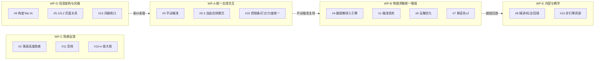

# 发布前系统优化方案（v2 细化稿，2026-07-03）

> 目标：把 App 的功能、页面、交互做统一完善，达到产品发布程度。
> 本文是**主控方案文档**：13 个优化点逐项分析（现状事实 → 缺口 → 实施方案任务级拆解 → 验收标准 → 量级）→ 合并成 5 个工作包 → 按 v1.0 / v1.x 分层 → 待拍板决策清单。
> 口径（用户已确认，2026-07-03）：
> - 「开放瞄准盘」= **手动移动瞄准方向**（当前瞄准全是求解器自动的），具体用在哪些页面由本方案提出建议。
> - 角度页重设计 = **整个角度 Tab 信息架构重排**。
> - 发布口径 = **分层**：v1.0 以「体验统一完整」为准，不以「内容全补齐」为准。
> 状态图例：⏳ 待拍板 ｜ ✅ 已确认 ｜ 🔧 可直接执行 ｜ 🧑 依赖人工（H-xx）
>
> **v2 变更（2026-07-03 下午）**：全部 13 点细化到实现级（文件/行号/任务拆解/DoD/回归面）；纠正 v1 草案 4 处事实错误：
> 1. 力度死 API 实名为 `StrokePhysics.velocity(forPower:)`（`BTPhysicsConstants.swift` L172–177），v1 稿误写为 `PowerSettings`。
> 2. ShootersPool 实拍视频引用为 **60 条**（含 `take_01` 的 drill JSON 计数），v1 稿写 62。
> 3. 裸 `Image(systemName:)` 实测 **221 处**（QiuJi/ 内，rg 统计）+ LiveActivity 3 处，v1 稿写 ~180。
> 4. `content/position_play/sequences/` 95 个 JSON = **91 个 `drill_c*` + 4 个 `seq_*`（编排台早期录制/测试件）**，drill 覆盖按 91 个文件的前缀去重计。

---

## 0. 总体判断

1. **工程底座已过剩，收敛不足。** 物理引擎（ADR-P10-09 后全测试网绿）、求解器矩阵（正解/走位反解/斯诺克/翻袋/反射/开球）、出片管线（95/95 序列已重渲，16GB 产物在 `build/position_play_export/`）都已就位；短板集中在三处：
   - **交互统一**：12 个场景类页面有 5 种控制形态（见 #5.1 盘点表），且**全 App 不存在手动瞄准**——所有瞄准都是求解器自动算的。
   - **信息架构**：角度 Tab「工具」分段挤了 9（+模拟器 1）张卡，学习/训练/工具的划分逻辑已经装不下现有能力。
   - **内容深度**：72 条 drill 骨架齐全，但结构化精讲（`items`）全库只有 c042 一条；95 条出片产物渲染完却没回填进 App（App 内引擎视频只有 c042 的 `full.mp4`/`full_3d.mp4`）。
2. **与 2026-06-18 战略「停止再加物理新功能」的张力**：本次 13 点中 #2（高度轴）/#4（翻袋解球引擎化）/#6/#7 属于物理增强。方案的处理是：**把「统一收敛」排 v1.0，把「物理增强」排 v1.x**，其中 #4 翻袋/解球因为已有 `EngineCushionTracer` 底座、属于「把已有能力接完整」而非新物理，可以提前。
3. **发布真正的硬闸门**其实在既有任务系统里：P8 人工项（TP-P7 订阅测试、TestFlight、App Store 资产、H-09 隐私政策）+ c042 `isPremium` 临时解锁回滚（`drill_c042.json` L12，`PROGRESS.md` L41 已挂账）。这些不在 13 点里，但必须纳入发布清单（见 §3 v1.0 表第 6 行）。

---

## 1. 13 点逐项分析

### #1 物理引擎瞄准逻辑优化

#### 现状（事实，精确到行号）

**求解流水线**（`QiuJi/Core/Physics/ShotPredictor.swift`，~799 行）：

| 环节 | 签名 | 行号 |
|---|---|---|
| 入口 | `static func predict(_ input: ShotInput, maxEvents: Int = 500, maxTime: Float = 15.0) -> ShotPrediction` | L131–150 |
| 备瞄 | `prepareAim(_:into:) -> AimContext?`——幽灵球 `ghostBallPosition` + `effectivePocketAimPoint` 管道法进球点 + 可行性闸门 | L166–202 |
| 搜索 | `solveAimOffset(baseAim:velocity:input:geometry:pocketCenter:ghost:) -> Float`（private） | L594–650 |
| 出解 | `buildPrediction(finalAim:context:input:result:maxEvents:maxTime:)`——高保真全模拟 | L207–272 |
| 自由杆 | `simulateFree(cueBall:aimDir:velocity:spinX:spinY:surfaceY:balls:...)`——按给定方向真实模拟（含 `extraBallPaths`） | L280–368 |

**输入输出结构**：
- `ShotInput`（L17–47）：`cueBall / targetBall / pocketIndex / velocity / spinX / spinY / elevation(默认0) / surfaceY / pocketAimOverride? / obstacles[]`。
- `ShotPrediction`（L71–124）：`feasible / infeasibleReason / cuePath / objectPath / separationAngleDeg? / cutAngleDeg? / pocketAimPoint / tangentDir? / aimDirection / ghost / firstContact? / cuePocketed / objectPocketed / simObjectPotted / cueCushionCount / objectCushionCount / cueCushionsBeforeContact / duration / finalPositions / cueFinalSpeed / extraBallPaths / pocketedBalls / events[]`——**回放/出杆/音效/出片全链路都消费这一个结构**，这是 #4 要求「翻袋解也产出同构 ShotPrediction」的原因。

**三级一维网格**（常量在 `AimScoring` L578–592，流程 L645–649）：
- 粗：±12°、步 0.5°（49 点）→ 中：±0.6°、步 0.1°（13 点）→ 细：±0.12°、步 0.02°（13 点）；每点跑一次短模拟（`searchMaxEvents=500`）。
- 评分（内嵌 `score(offset:)`，L612–630）：有效候选 = `acos(dot(碰后方向, 管道方向)) + |offset| × 1e-3 正则`；未碰到目标球 = `100 + cueGhostMinDist`；**碰前吃库直接判 100 分**：

```622:625:QiuJi/Core/Physics/ShotPredictor.swift
            // 管道法是**直击**：碰目标球前吃库（绕库 banking / kick）= 无效候选，绝不退化成绕库蹭袋。
            guard run.cueCushionsBeforeContact == 0 else {
                return AimScoring.invalidCandidate
            }
```

即：**当前瞄准求解器是「直击 only」**，翻袋/解球（kick）走的是另一条平行管线（`EngineCushionTracer`，见 #4）。性能：单杆中位 ~125ms、满台 ~663ms。

**剩余债务**（`tasks/qa-reports/PHYSICS-DEBT.md` + ADR-P10-04 Layer C）：
- D-B1 物理常量未用真实俯拍视频标定（🧑 需要用户拍视频）。
- D-B3（PHYSICS-DEBT.md L53）：「c055 翻袋、c057 K球吃库、c058 贴库、c061 解球、c066 开球，**单杆直瞄物理打不进**」——本质是 #4 的问题，佐证还有 `IMPLEMENTATION-LOG.md` L599「v1 烘焙器固有限制：不支持翻袋/吃库瞄准」。
- knife-edge（72° 等临界切角）引擎浮点非确定性偶发翻转。
- 裸引擎直连逃逸 0.1%（用户可见路径经 `predict` 高保真恒为 0，非阻塞）。

**回归面**（改任何求解逻辑都要过）：`PhysicsEngineTests` 23 个方法（`test_predictor_easyCornerPot` / `test_predictor_middlePocket_potsAcrossSpeeds` / `test_predictor_obstacle*` / `test_predictor_largeCutClearShot_directPotBothCorners` 等）+ `PhysicsInvariantTests` 12 个不变量（能量不增、无穿透、确定性可重复、悬袋球不落等）。

#### 实施方案

| 编号 | 做法 | 具体拆解 | 量级 | 层 |
|---|---|---|---|---|
| 1-a | 翻袋/kick 并入统一求解入口 | 与 #4 合并，见 #4 的 4-a/4-b | L | v1.x 前段 |
| 1-b | 常量标定 | ① 🧑 拍固定机位俯拍视频（直击/翻弹/旋转各若干杆）→ ② 提取帧序列拟合 e_b/滑动摩擦/滚动阻力/库边恢复 → ③ 改 `BTPhysicsConstants.swift` 常量 → ④ `PhysicsBenchmarkTests` 增加拟合样本回归钉死 | M + 🧑 | v1.x |
| 1-c | knife-edge 确定性 | `solveAimOffset` 细网格并列打破规则显式化（当前隐式取先到者）：并列时偏向 `|offset|` 小者；临界切角（`cutAngleDeg > 70°`）加 ±0.01° 容差带重验 | S | v1.x |
| 1-d | 真机手感验收（ADR-P10-09 后角袋/中袋/无吸球感）——已挂 PROGRESS ⏳ 待人工 | 🧑 按 ADR-P10-09 验收单过一遍分离角页 + 编排台 | 🧑 | **v1.0 前必做** |

**结论**：直击瞄准当前没有已知功能性 bug，v1.0 只需 1-d 人工验收兜底；「优化」的真正内容在 #4 的管线统一。

---

### #2 球落袋效果优化，引入高度轴（待定 ⏳）

#### 现状（事实）

- 引擎是**纯 2D 平面物理**：CCD 只算 XZ（`EventDrivenEngine` 注释明确「不含 Y」），落袋判据 = 球心水平投影入孔圈（`resolvePocket`，ADR-P10-09）。
- 落袋**观感**已有渲染层机制，与物理解耦，但 App 内与导出器不一致：

| 通道 | 实现 | 行号 | 有无 Y 下沉 |
|---|---|---|---|
| App 内回放 | `TrajectoryPlayback.solvePocketEntry(capture:velocity:pocketCenter:pocketRadius:speedScale:)`——三分支：速度近零单段 0.12s 回落；射线穿袋口圆则「冲到远端弧点（≤0.30s linear）→ 0.12s eased 回袋心」；不穿圆单段直达 | L73–126；常量 L43–55（`pocketPauseDuration=0.35`、`pocketFadeDuration=0.25`） | **无**（2D 顶视平面淡出） |
| 3D 导出 | `SequenceVideoExporter`：入洞段结束后按 `(real-entryEnd)/(pause+fade)` 归一化进度沿 Y 下沉，最大 **0.07m**，仅 `ctx.is3D` 生效 | L416–421 | 有（仅导出层） |

#### 两档方案

| 档 | 内容 | 改动面 | 量级 |
|---|---|---|---|
| **A. 渲染层假高度（推荐）** | 把导出器的下沉观感搬进 App 内实时回放（见下方任务拆解） | `TrajectoryPlayback.swift` 一处 + 3D 页验证 | **S** |
| **B. 引擎 3D 化** | 球态加 Y 轴（跳球/扎杆腾空、落袋自由落体）。涉及 `EventDrivenEngine`/`AnalyticalMotion`/`CollisionResolver`/`TableGeometry`/全部 CCD + **测试网重建**（PhysicsEngineTests 23 + PhysicsInvariantTests 12 + 各求解器测试全部基于 2D 假设） | 数千行级结构性大改 | **XL** |

#### 方案 A 任务拆解

1. `TrajectoryPlayback` 落袋 SCNAction 链（L377 附近 `pocketPauseDuration` 段）追加与导出器同参数的下沉：`SCNAction.customAction` 在 pause+fade 时段内 `y -= progress × 0.07`，与导出器共用常量（抽到一处，如 `TrajectoryPlayback.pocketSinkDepth`，导出器 L416–421 改引用同常量——**单一真源**）。
2. 2D 顶视下下沉不可见 → 同时段叠加「球体缩放 0.85 + 阴影淡出」表达坠落（顶视语义：球变小=离开台面平面）。
3. 落袋音效联动已存在（`ShotAudioScheduler` 按 `.pocket` 事件排程，见 #11），无需改。
4. 回归：分离角页/编排台/drill 回放/思路/斯诺克/三方案 6 条回放路径逐一目验落袋帧；`TrajectoryPlayback` 无单测（纯视觉），靠人工走查。

**DoD**：① App 内 3D 场景（Scene3D 瞄准/3D 回放）落袋有下沉；② 2D 顶视落袋有缩放+阴影坠落感；③ 导出器与 App 内共用同一组常量；④ 6 条回放路径无退化。

**建议**：v1.0 做 A；B 不建议进本轮范围（违反「停止加物理」纪律，且 3D 斜视角视频已能表达下沉观感）。⏳ 待拍板。

---

### #3 手动瞄准（原「开放瞄准盘，支持自定义打点」）

#### 现状（事实）——全 App 无手动瞄准，但底座七成是现成的

**已有但未暴露/未共享的资产**：

| 资产 | 位置 | 关键事实 |
|---|---|---|
| `BTAimWheel` 竖向棘轮角度轮 | `QiuJi/Features/BatchDrillStudio/BatchAuthoringView.swift` **L814–893**（private struct） | 公开属性仅 `bearing: Double` + `onNudge: (Float) -> Void`；`degreesPerPoint=0.3`（L818）；Canvas 画 1°/5°/10° 刻度（L841–858）；拖动 `onNudge(-dy × 0.3)`（L877–882）；整度触觉 `UIImpactFeedbackGenerator(.light).impactOccurred(intensity: 0.5)`（L884–886）。**整个文件被 `#if targetEnvironment(simulator)` 包裹（L16–L894），是编译期排除**，抽出后真机可直接用，无运行时限制要解 |
| 自由瞄准 VM API | `PositionPlayViewModel.swift` | `AimMode{pocket,free}`（L21–24）；`aimMode` didSet 初始化 `freeAimDir` 并 `recompute()`（L50–58）；`freeAimBearingDeg`（L386–391）；`nudgeFreeAim(byDegrees:)`（L396–406）；点桌面 `handleTableTap→setFreeAim(toward:)`（L357–369）、点球 `selectTarget`（L327–334）、点袋 `selectPocket`（L342–349） |
| 自由杆物理链路 | `PositionPlayShotSolver.swift` L18–29 | `recompute()`（VM L482–522）→ `currentShotIntent()` 构造 `PlannedShot(freeAim:)`（L535–539）→ 后台 `solve` → `ShotPredictor.simulateFree`——**全通** |
| 场景手势框架 | `AngleSceneView.swift` | `handlePan`（L337–416，含拖球：`hitTestBall` L291–322 SCN hitTest+48pt 投影回退；`dragSamplePoint` L198–212 含 52pt dead zone）；`handleTap`（L431–488）；屏幕→世界 `unprojectToTablePlane`（L325–333）；SwiftUI 桥 `bindProjector`（L90–108） |
| 切角/厚度读数 | `AngleSceneCalculator.swift` | `ghostBallPosition`（L35–51）、`contactPointOffset`（L64–66）、`cutAngle`（L702–722）、`thicknessName`（L914–922） |
| 厚度重叠图示 | `AngleDynamicView.swift` **L194–228**（private `ThicknessOverlapIcon`，单参数 `cutAngle`） | Canvas 两圆错位 `offset=2r·sin(α)`；26×14 小尺寸，**需抽共享并做参数化（尺寸/配色）** |

**不存在**：「拖动假想球/瞄准线手柄直接控制方向」的手势（全库确认）；编排台 View 未接 `nudgeFreeAim` 的任何 UI（`BTAimWheel` 只在批量出片台 L296–305 出现）。

#### 实施方案（一次建设，多处复用）

**任务 3-1：组件下沉（S）**
- `BTAimWheel` 从 `BatchAuthoringView.swift` L814–893 抽到 `Core/Components/BTAimWheel.swift`，脱离 `#if targetEnvironment(simulator)`；`ThicknessOverlapIcon` 从 `AngleDynamicView.swift` L194–228 抽到 `Core/Components/`，加 `size` 参数。
- 原两处调用点改引用共享版。DoD：批量出片台/角度与打点页行为不变（编译期两平台均过）。

**任务 3-2：瞄准射线拖动手势（M）**
- `AngleSceneView` 增加可选回调 `onAimHandleDragged: ((SCNVector3) -> Void)?` + `aimHandleNode`（瞄准线末端手柄，命中优先级高于拖球）：`handlePan .began` 先 hitTest 手柄，命中则进入「转向拖动」分支，`.changed` 经 `unprojectToTablePlane` 得世界点 → 回调 → VM `setFreeAim(toward:)`。
- 拖动中实时渲染：假想球贴目标球滑动（`ghostBallPosition` 反推：以当前方向求首碰球，画 ghost）、切角/厚度读数胶囊（`cutAngle`+`thicknessName`+`ThicknessOverlapIcon`）。
- 与既有拖球手势的冲突处理：手柄命中半径 44pt，优先于 `draggableBallNodes`。

**任务 3-3：接入位置（各 S，⏳ 待确认 D3）**

| 页面 | 接法 | 说明 |
|---|---|---|
| 编排台自由模式 | `PositionPlayComposerView` 底栏（L261–338）右侧加 `BTAimWheel`（`aimMode == .free` 时显示，接现成 `freeAimBearingDeg`/`nudgeFreeAim`）+ 场景手柄拖动 | 改动最小，VM 零改动，先落地 |
| 自由击球模式 | 见 #5.3，手动瞄准是该页核心交互 | 依赖 3-1/3-2 |
| 分离角与走位页 | `ShotSimulationView` 加「手动/自动」瞄准 chip：手动时用户定方向、物理如实模拟（进不进如实展示），与自动解虚线对比 | `ShotSimulationViewModel` 需加 freeAim 分支（参照 `PositionPlayViewModel` L50–58 模式，~60 行） |
| 思路/斯诺克/三方案 | **不加** | 这三页定位是「看答案」；想试自己的想法应引导去自由击球模式 |

**量级合计**：M。层：**v1.0**（「统一完善」的核心增量）。
**回归面**：编排台自由模式既有「点选定向」行为不得回退；`AngleSceneView` 手势改动要过分离角/编排台/球形生成器三页拖球回归。

---

### #4 翻袋、解球，引入物理引擎

#### 现状（事实）——已有引擎底座，但是两条平行管线

**管线 1（主线，直击 only）**：`ShotPredictor.solveAimOffset` 显式拒绝先吃库（L622–625，见 #1）。

**管线 2（翻弹专用，单球）**：`EngineCushionTracer`（`ReflectionSolverCore.swift` L279–502）：
- `shoot(start:target:seedDir:rails:speed:y:) -> [SCNVector3]?`（L375–426）：射击法反解——`miss(offset:)` 正向 `launch` 模拟（L384–400），先割线法（L404–408），失败则 ±7° 内 18 步粗扫 + 二分（L410–424），`build` 校验（L428–451）。
- `launch(start:dir:speed:y:) -> Launch`（L326–364）：单球 `EventDrivenEngine` 真实模拟（Han2005 库边、速度相关），返回 `polyline + rails + potted + pottedPocket`（L313–322）。
- **jaw 截断**：`railFor(normal:)`（L294–308）要求法向近轴对齐（purity ≥ 0.94），擦到 jaw 弧/中袋 fillet 斜法向 → nil → 追迹提前返回（L345–348），即**无 jaw 交互物理**。

**消费方**（都是「画线计算器」不是「击球场景」）：
- `BankShotCalculator.solveAll(cue:object:pocketIndex:surfaceY:realMode:power:maxCushions:limit:)`（L140–149）：理想镜像解 + `realMode` 时调 `EngineCushionTracer.shoot` 精修目标球段（L185–188）；`BankShotViewModel.recompute()`（L135–169）先出理想解再后台补真实解。
- `DiamondSystemCalculator.solveAll`（L132–135；真实模式 L167–170）；`DiamondSystemViewModel.recompute()`（L128–161）同构。
- **两页均无两球碰撞、无击打回放、无出杆动画、无音效**（无 `ShotPrediction` 可供 `TrajectoryPlayback`/`ShotAudioScheduler` 消费）。

**Drill 烘焙侧**：`ShotBaker.bake`（`ShotBaker.swift` L47–81）→ `ShotPredictor.predict` → 归一化 `DrillAnimation`（`generator:"ShotBaker/engine@v2-geom"`）；离线跑测 `DrillBakeRunnerTests` L35–77 打印 `===BAKE===` JSON 人工拷回。因管线 1 直击 only，c055/c057/c061 烘焙不出真实轨迹（D-B3）。

#### 实施方案（分三步，可独立交付）

**4-a 翻袋进袋统一求解（L）**
1. `ShotInput` 增加 `bankRails: [Rail]?`（nil = 直击，与现行为完全兼容）。
2. `prepareAim` bank 分支：目标球按 `bankRails` 库序镜像展开求初始方向 → `EngineCushionTracer.shoot(start: 目标球, target: 袋口, ...)` 精修目标球段 → 反推目标球所需初速方向/大小 → 得幽灵球方向。
3. `solveAimOffset` bank 分支：放开 `cueCushionsBeforeContact==0` 限制改为「母球段吃库数 == 0（母球仍直击目标球）」；评分改「目标球实际进袋 + 碰后方向 vs 精修方向夹角」。
4. `buildPrediction` 不变——**产出同构 `ShotPrediction`** ⇒ 回放（`TrajectoryPlayback`）/出杆/音效（`ShotAudioScheduler.play(prediction:)`）/出片（`SequenceVideoExporter`）全部自动可用。
5. 翻袋页升级：`BankShotViewModel` 把选中解转 `ShotInput(bankRails:)` → `predict` → 场景回放 + 底栏并入 A 类形态（见 #5.1）。
6. 新测试：`PhysicsEngineTests` 加 `test_predictor_bankShot_oneRail_pots` 等 3–5 条 + 不变量网全量回归。

**4-b 解球（kick）统一求解（M，依赖 4-a 骨架）**
- 母球段用 `EngineCushionTracer.shoot(start: 母球, target: 接触点, ...)` 反解绕库路线；接触点即幽灵球位置；接触后目标球段用现有管线评估。作为编排台/自由击球的「绕库瞄准」选项（UI 上是瞄准模式第三档：进袋/自由/绕库）。

**4-c 特殊球路重烘焙（S）**
- c055（翻袋）/c057（K 球）/c061（解球）用 4-a/4-b 跑 `DrillBakeRunnerTests` 重烘焙回填 `animation`；c058 贴库/c066 开球另议（贴库是精度问题、开球走 `RackGenerator` 管线）。

**已知风险**：jaw 截断（`railFor` nil）意味着贴袋口的翻袋线会精修失败——4-a 需在失败时回退理想镜像解并标注「近袋口路线未经引擎校验」；jaw 物理本身不做（XL，违反纪律）。

**层**：v1.x 前段（4-a 完成后 #1-a、#8 的特殊球路、翻袋/反射页升级都被解锁，是杠杆最大的物理项）。

---

### #5 界面统一 + 页面关系 + 自由击球模式

#### 5.1 场景页交互形态盘点（12 页实测）

| 页 | 文件 | 底部/控制形态 | 关键行号 |
|---|---|---|---|
| 分离角 | `ShotSimulationView.swift` | **A**：`BTSpinMiniIcon`(34) + 力度滑条 0.5–6.0 + 重置 + 击球胶囊；浮层 `BTSpinPadCard` | 底栏 L126–176；浮层 L184–192 |
| 编排台 | `PositionPlayComposerView.swift` | **A**：controlRow（同上）+ 双行球库 + 击球/录制(仅sim)/重打 | L261–338 |
| 球形生成器 | `RackGeneratorView.swift` | **A 变体**：状态行 + `BTSpinMiniIcon` + `Slider(4.0–9.0)` + 胶囊列（开球/送入…） | L131–219 |
| 思路训练器 | `SiluTrainerView.swift` | **B**：只读 spin 图标 + 解摘要 + 球库 + 求解/下一解/击球 | L195–278 |
| 做斯诺克 | `SnookerTacticsView.swift` | **B**：同 Silu 布局 | L154–238 |
| 三方案 | `PlanThreeView.swift` | **B**：同 Silu（「打一」替代「击球」） | L288–356 |
| 翻袋 | `BankShotView.swift` | **C**：无底栏；顶部 `ReflectionModeControl` + 右下 `BTSceneFAB` | 顶部 L58–68；FAB L176–192 |
| 反射 | `DiamondSystemView.swift` | **C**：同翻袋 | 顶部 L58–68；FAB L163–179 |
| 2D 瞄准 | `Scene2DAimingView.swift` | **D**：底 inset 数字键盘 + `BTSceneFAB`×2 | L75–84；L144–176 |
| 3D 瞄准 | `Scene3DAimingView.swift` | **D**：同 2D，但 FAB 是**自绘 64pt**（`fab(icon:title:action:)` L293–312，vs `BTSceneFAB` 56pt/双 Variant） | L110–121；L153–183 |
| 角度与打点 | `AngleDynamicView.swift` | **E**：无底栏；顶部指标胶囊 + 底部状态 banner | L71–95；L55–67 |
| 几何角度测验 | `GeometricAngleQuizView.swift` | **E 变体**：Scroll 内 actionChips + TextField + 确认按钮 | L129–146；L167–199 |

**统一方案：共享 `ShotControlBar` 组件（新建 `Core/Components/ShotControlBar.swift`）**
- 槽位：打点入口（`BTSpinMiniIcon`，`editable: Bool` 决定可否点开 `BTSpinPadCard`）+ 力度（`Slider` 或只读读数，range 注入）+ 可选瞄准模式 chip + 主操作按钮组（注入）。
- 收口路径：A 类三页先换（纯重构，行为不变）→ B 类三页换只读形态 + 加「试打」入口（跳自由击球带参数，见 5.3）→ C 类两页随 #4 升级为可击打后自然并入 → D 类只修 Scene3D 自绘 FAB 一处（换 `BTSceneFAB`，删 L293–312）。
- DoD：换装后 12 页截图对照无布局回退；`ScreenshotTourUITests` 全绿（其断言依赖中文标题与控件可达性）。

#### 5.2 页面关系与孤儿页清理

**确认的孤儿页**（生产代码零引用，仅 `#Preview`/测试引用）：

| 文件 | 行数 | 处置 |
|---|---|---|
| `AngleTraining/Views/AngleTestView.swift` | 298 | 删除（`AngleTestViewModelTests` 测的是 VM，VM 若仅服务此页一并删；若有共享逻辑先确认） |
| `AngleTraining/Views/SceneAnglePredictionView.swift` | 341 | 删除（含仅被它用的 `SceneAngleViewModel`） |
| `AngleTraining/Views/AngleHistoryView.swift` | 355 | 删 standalone wrapper，保留其中被 `StatisticsView` L75 使用的 `AngleHistorySection` |

**附带发现**：`HistoryRoute` 已注册 destination（`MainTabView` L58–60、L145–151）但全仓无 `historyPath.append`，其中 `.statistics` case 映射 `EmptyView()`——属于死路由，随 IA 清理一并处理（删或接真页面）。

#### 5.3 自由击球模式（新）

- **定位**：一张桌子 + 任意摆球 + **手动瞄准**（#3 的手势/轮盘）+ 可编辑打点/力度 + 真实物理回放。核心教学价值 = 「移动瞄准方向时，实时看母球-目标球相对关系」：假想球贴目标球滑动、厚度重叠图示（`ThicknessOverlapIcon` 下沉后复用）、切角读数、碰后两球方向预览（`simulateFree` 的 `extraBallPaths` 现成）。
- **实现路径（推荐）**：不新建第 13 个场景页，**从编排台派生**——编排台已有摆球/球库/自由模式/回放全链路（`PositionPlayViewModel` 自由分支全通，见 #3 现状表），缺的只是手动瞄准 UI（#3）和相对关系可视化。做法：
  1. 编排台自由模式补齐 #3 的两块 UI；
  2. 角度 Tab 新入口卡「自由击球」→ 路由到 `PositionPlayComposerView(initialMode: .free)`（`AngleRoute` 加 case 或复用 `positionPlayComposer` 带参数）；
  3. B 类页「试打」跳转带参数：当前球局快照 + 目标球 → 进入自由模式预置球形。
- ⏳ 待拍板 D2：独立页 vs 编排台派生。
- 量级：M（在 #3 之上增量）。层：**v1.0**。

---

### #6 优化反解算法

#### 现状（事实，`QiuJi/Core/PositionPlay/PositionPlaySolver.swift` ~882 行）

**外层网格**（`SearchParams.standard`，L56–63）：
- `spinXValues = [-0.3, 0, 0.3]`；`spinYValues = [-0.4, -0.2, 0, 0.2, 0.4]`；velocity `0.6…6.0` 步 `0.3`（等差闭区间，L260–268）≈ 3×5×19 = **285 候选** + 记忆化瞄准 57 次。
- `passThrough` 变体（L66–73）：spinY 3 档、velocityStep 0.15。

**精修**（`refineCandidate`，L397–470）：Hooke-Jeeves 模式搜索，参数 L42–48（`refineSpinStep=0.15 / refineVelStep=0.15 / refineMinStep=0.02 / refineMaxIters=12`）；**仅被 `solveRestRegion`（L325–364）调用**。

**斯诺克路径**（`solveSnooker`，L712–794）：`SnookerParams.standard`（L690–695）= 瞄准 21 档（张角半角 `asin(2R/dCT)` 的 ±0.92 倍均匀采样，L856–867）× spin 3×5 × velocity 0.6–5.0 步 0.4（12 档）≈ **3780 候选**，每候选 `simulateFree` + `evaluateSnooker`（L759–764）；**无精修**（`SnookerParams` 无 refine 字段；P16 卡 L75–79 明示「v1 无局部精修，靠 21 档密扫覆盖」）。

**性能**：情形 A ~1.41s、情形 B ~1.64s（并行后）。已知局限：粗网格漏 basin（精修治「找对但采样粗」，治不了「整个被跳过」）；无多杆连续求解（P13 明确 v1 不做）。

**回归面**：`PositionPlaySolverTests` 13 条（含 `test_refine_notWorse_andDeterministic`、`test_perf_productionParams_printsWallClock` 性能基线）。

#### 实施方案

| 编号 | 内容 | 具体拆解 | 量级 | 层 |
|---|---|---|---|---|
| 6-a | 自适应二次加密 | `solveRestRegion` 首轮后检测：解数 < 阈值或最优 basin 孤立 → 对空档 spin/velocity 邻域插半步长二轮采样（上限 ~80 次额外模拟，控制在 +0.4s 内）；`test_perf` 基线放宽需显式改断言并记录 | M | v1.x |
| 6-b | 斯诺克接入精修 | `SnookerParams` 加 refine 字段；`solveSnooker` top-N 候选走 `refineCandidate` 骨架（目标函数换 `evaluateSnooker` 的覆盖余量）；加 `test_snookerRefine_notWorse` | S | v1.x（并入 #7） |
| 6-c | 多杆连续反解（清台路线规划） | — | XL | v2 视产品定位再议 |
| 6-d | 搜索降保真（D-D2「双景观错位」风险已知） | 仅在 6-a 拖慢后再做 | M | 暂缓 |

**结论**：反解当前 1.4s 体感可接受，v1.0 不动；6-a/6-b 排 v1.x。

---

### #7 完善做斯诺克逻辑

#### 现状（事实）

- P16 v1 已交付：张角覆盖闭式解 `AngleSceneCalculator.snookerCoverage(cue:snookered:blocker:ballRadius:)`（L812–833；`alpha=asin(2R/dT)`, `beta=asin(2R/dB)`, `coverage=beta-alpha-|dTheta|`；`isFullSnooker ⟺ blockerCloser && margin≥0`）+ `PositionPlaySolver.solveSnooker`（见 #6）+ 独立页面（`SnookerTacticsViewModel.solve()` L307–343 → 后台 `solveSnooker` L326–328 → `showSolution/drawTrajectory/updateCueStickAiming` L353–362）。`SnookerSolverTests` 4/4。
- **v2 遗留**（P16 卡 L77–82 原文）：「被困球≠首触球（真安全球）、多障碍并集、逃脱难度评分、贴库加成 → v2」+「v1 无局部精修…若覆盖余量稳定性不足再加精修」+「合法性边界（必须有球到库等球种完整规则）v1 不强求，作提示而非硬闸」。L21–22 另列「把球主动顶到位当障碍（v2+）」。

#### 实施方案（v2 内容排序）

| 序 | 项 | 拆解 | 量级 |
|---|---|---|---|
| 1 | 被困球 ≠ 首触球 | `solveSnooker` 入参拆开 `firstTouchKey` 与 `snookeredKey`；`evaluateSnooker` 覆盖判据改为对 `snookeredKey` 计算、可行性判据对 `firstTouchKey` 计算；UI 三球角色点选升级为四角色（母/首触/被困/障碍，允许首触=被困兼容 v1） | M |
| 2 | 多障碍并集 | `snookerCoverage` 泛化为 `[blocker]`：各障碍张角区间求并集后与目标张角求覆盖；`evaluateSnooker` 同步 | S–M |
| 3 | 精修（=6-b） | 见 #6 | S |
| 4 | 逃脱难度评分 | 覆盖余量 + 最短逃逸路线库数（可复用 `EngineCushionTracer` 试探 1–2 库逃逸）合成评分展示 | M |
| 5/6/7 | 贴库加成 / 顶球到位 / 页面扩展位（解斯诺克逃脱/炸球堆/做杆留球） | v2+ | — |

**建议**：1（语义正确性）> 2 > 3 > 4；整体 **v1.x**，1+2+3 合计量级 L。
⏳ 待拍板 D7：v1.0 是否需要斯诺克页达到「1+2」水平，还是维持 v1 卖点先发布（建议后者）。

---

### #8 重新设计 drill 教学内容及视频标注效果

#### 现状（事实）——工程全通，内容断层

**内容盘点**（以仓库 JSON 实测为准）：

| 维度 | 事实 |
|---|---|
| Drill 总量 | `QiuJi/Resources/Drills/` 72 条 + `index.json`；schema 权威定义在同目录 `schema.md` |
| 结构化精讲 | **仅 c042 一条**含 `items`（7 节：技术原理→开局与击球顺序〔布局图〕→逐杆×3〔`params{spinX,spinY,velocity}`+`items`×3+`image`+`caption`〕→常见错误→进阶练习）；其余 71 条是旧四段纯 `title+content`（如 c010 L67–85） |
| `formations`/`clip` | 工程支持（schema L37–52、ADR-P12-02），内容 **0 条** |
| 实拍视频 | **60 条** drill 引用 `take_NN.mp4`（ShootersPool，Bundle `Resources/Videos/` ~257MB，gitignore L44–45）；引擎视频仅 c042（`full.mp4`+`full_3d.mp4`） |
| 序列真相源 | `content/position_play/sequences/` 95 JSON = 91 `drill_c*` + 4 `seq_*`；结构 = 意图+前后快照不存轨迹（`PositionPlaySequence` L141–147、`PlannedShot` L77–90） |
| 无序列 drill | **17 条**：fundamentals c006/007/008/043、c049、specialShots c054/055/059/060/061、combined c065–071 整块 |
| 出片产物 | 95/95 已重渲（2026-07-02，16GB）：每序列 `initial/final.png + sNN_still.png + cover.png + preview×12 + full.mp4/sNN.mp4(2D) + full_3d.mp4/sNN_3d.mp4 + full_3d@2160.mp4 + full.gif`——**未回填 App** |
| 视频加载 | `DrillContentService.videoURL`（L294–301）纯 Bundle 路径；**无任何下载器/缓存**（L251 注释留了 OTA hook）；分发决策 ADR-P11-10（P11 卡 L183–198）：生成视频走自建 REST OTA，Bundle 只进静帧 |

**标注（HUD）现状**（`SequenceVideoExporter.swift`）：

| 元素 | 实现 | 行号 |
|---|---|---|
| 打点+力度 HUD | `ShotHUDView`（`BTSpinMiniIcon(trueScale)` + 档名 + m/s + 力度胶囊 0.5–6.0 量程）→ `makeHUDImage` → `composeWithHUD` 黑底下条合成 | L719–760 / L685–693 / L696–715 |
| 预告线/假想球 | `RenderContext.drawAimLines(for:prediction:)` + `ghostBallNode` | L577–611 |
| 三拍叙事 | 观察 1.5s（无任何标注）→ 摆位 1.5s（线+ghost+静止杆+HUD）→ 出杆（触球清线） | L327–362 |
| 双机位 | `CameraMode.topDown2D / .perspective3D`；`teachingVideo()` / `teachingVideo3D()` L160–172 | L29–32 |
| **缺** | 切角/分离角读数 overlay、逐杆文字字幕——插入点已明确：SceneKit 层加读数节点，或 `composeWithHUD`（唯一 post-render 2D 合成层）扩展字幕条 | — |

#### 实施方案

| 步 | 内容 | 拆解 | 量级 | 层 |
|---|---|---|---|---|
| 8-a | **标注模板 v2 定稿** | ① 切角读数：`ShotHUDView` 加一列（数据源 `ShotPrediction.cutAngleDeg`，第 2 拍起显示）；② 逐杆一句话字幕：序列 JSON 加 sidecar 字段 `note`（`SequenceStep.note?` 字段已存在，L106–115！只需出片时读取渲染）——`composeWithHUD` 场景与 HUD 之间加字幕条；③ 改一处全管线生效，重渲用既有 `make position-export` | M | v1.0 定稿（全量重渲可后置） |
| 8-b | **95 条产物回填** | v1.0 精选 8–12 条代表作：`videos` 字段加 `{id:"full",...}` 条目 + mp4 进 Bundle（先核算：单条 2D+3D 约 ~50–150MB×12 需实测，超预算则只进 2D）；其余等 8-e OTA | S + ⏳D6 | v1.0 |
| 8-c | **精讲批量迁移** | 71 条旧四段 → 应用课模板：脚本从序列 JSON 生成逐杆 `params` + `items` 骨架（`.cursor/skills/content-engineering/SKILL.md` L177–191 公式）→ 🧑 人工审校技术准确性（对接 H-11，Batch 2–7 ⏳） | L + 🧑 | v1.x 持续 |
| 8-d | **17 条缺口序列补录** | 批量出片台（模拟器：截图→旋转→标定建球形→编排求解录制→JSON 落库）逐条建；combined 8 条是重点；c055/c057/c061 依赖 #4 | M + 🧑 | v1.x |
| 8-e | **OTA 视频通道** | 后端静态文件（H-14 服务器就位）+ App 侧 `DrillVideoStore`：按 drill 懒下载 + 本地缓存 + 播放降级（无网播 Bundle 静帧序列）；`DrillContentService` L251 hook 处接入 | M | v1.x |

⏳ 待拍板 D5：8-a 增项（建议：+切角读数、+逐杆字幕〔`note` 字段现成〕，不做对/错对比片——那是内容形态不是标注）；D6：v1.0 进 Bundle 精选条数。

---

### #9 角度 Tab 信息架构重排（✅ 已确认做 IA 层）

#### 现状（事实）

**路由与数据**（`AngleHomeView.swift`）：
- `AngleRoute` 17 case（L5–24）：`contactPointTable / aimingPrinciple / angleDynamic / geometricQuiz / scene2DAiming / scene3DAiming / ballFeel / bankShot / diamondSystem / shotSimulation / positionPlayComposer / positionPlaySolver / planThree / snookerTactics / ballExtraction / rackGenerator / batchDrillStudio(仅sim)`。
- 三分段：学习 4 卡（`learnEntries` L54–71：瞄准原理/角度与打点/浅谈球感/进球点对照表——全是硬编码文档页）/ 训练 3 卡（L73–86：几何角度/2D 瞄准/3D 瞄准）/ 工具 9+1 卡（`baseToolEntries` L100–137：翻/反/分/走/思/三/斯/拍/开 + sim 追加「批」）。
- 导航：卡片 `NavigationLink(value: entry.route)`（L205–207）→ `MainTabView` L43–48 `NavigationStack(path: $router.anglePath)` + `angleDestination(for:)` switch 17 case（L101–141）。
- **全仓无 `anglePath.append` 程序化跳转、无 deep link**——IA 重排的路由回归面很小。
- **真正的回归面在 UI 测试**：`AnglePosterCard` 用 `entry.title` 作 `accessibilityIdentifier`（L210）；`ScreenshotTourUITests` 按中文标题 tap（如 L125「翻袋解球器」）；`P5_AngleTrainingUITests` L10 `switchTab(.angle)`。**改卡片标题/分组必须同步这两个测试文件**。

**P12 承接关系**（ADR-P12-01，P12 卡 L32–76）：
- 决策 3：理论之家 = 角度 Tab「学习」区升级为**球理中心**（非第 6 Tab）；理论详情页 `navigationDestination` 可从 drill 详情直接 push（正交，尚未实现）。
- 决策 6 分阶段：阶段 1 = c042 竖切 + 学习区一张「球理」入口卡，**不重构 IA**；阶段 2 = 学习区重构成结构化球理索引、现有瞄准原理/角度与打点/浅谈球感并入、酌情改 Tab 名。
- 依赖：`16.billiard_theory/contracts/`（T01–T10/M01–M06/5 步决策流 JSON）**尚未 vendor** 进 13（`Resources/Theory/` 不存在）。
- **本次 IA 重排 = 把 P12 阶段 2 的「壳」先做了（分段与索引结构），理论内容填充仍按 P12 节奏走**——两者不冲突，但新 IA 的「学」分段要给球理索引预留结构。

#### 重排提案（⏳ 待拍板 D4，二选一）

**方案 R1（推荐）——按用户目的四分段**：

```
角度 Tab
├── 学（球理中心壳：现学习 4 页 + 「球理」入口卡〔P12 阶段 1 产物〕；P12 阶段 2 填充索引）
├── 练（测验类：几何角度 / 2D 瞄准 / 3D 瞄准）
├── 打（沙盘类：自由击球〔新，#5.3〕/ 分离角与走位 / 走位编排台 / 球形生成器）
└── 解（教练类：思路训练器 / 三方案 / 做斯诺克 / 翻袋 / 反射）
    工具尾部：拍照建球形（供「打」「解」输入球形）；批量出片台维持 sim-only 不进正式 IA
```

**方案 R2——维持三分段，工具内加二级分组标题**（滚动分区：沙盘/教练/计算器/内容工具；改动最小）。

#### R1 任务拆解

1. `AngleHomeView` entry 数组重组为四组 + 新「自由击球」卡（路由见 #5.3）+ 「球理」入口卡占位；卡片副标题文案按新分组重写（当前「思/斯/开/拍」单字水印用户难懂——水印字保留但副标题写清楚用途）。
2. `MainTabView.angleDestination` 同步（新增 case）。
3. 孤儿页删除（#5.2 三个文件 + 死 `HistoryRoute.statistics`）。
4. UI 测试同步：`ScreenshotTourUITests` 中文标题引用 + `P5_AngleTrainingUITests`；截图导览重录。
5. 写 ADR（IA 重排属跨模块边界变更，按 00-orchestrator ADR 触发清单）。

量级：R1 = M；R2 = S。层：**v1.0**。

---

### #10 打点/力度/瞄准/球重叠——统一显示与场景

#### 现状（事实）

**打点**：
- `BTSpinPad`（`Core/Components/BTSpinPad.swift` L11–69，`@Binding spinX/spinY`）已真实化：皮头 11mm 真实比例斑 + 打滑极限 0.5R + 曲率拉心 + 1% 步进微调四向键；`BTSpinMiniIcon`（L81–126）有 `trueScale` 参数（默认 false 归一化）；`BTSpinPadCard`（L247–322）浮层。
- **不一致点**：`DrillSpinIndicator`（`Core/Scene/DrillSceneView.swift` L472–506，drill 回放 overlay）还是旧版画法——spinX/spinY 直接线性映射到边缘（L481–484）、固定 `size×0.22` 红点（L499），无 trueScale/打滑极限圈。

**力度**（三种语义范围 + 一处死 API + 一处不一致量程）：

| 范围 | 位置 | 语义 |
|---|---|---|
| 0.5–6.0 m/s | `PositionPlayComposerView` L286、`ShotSimulationView` L135、`BatchAuthoringView` L533（均为内联 `Slider(in: 0.5...6.0, step: 0.1)`） | 主场景击球初速 |
| 4.0–9.0 m/s | `RackGeneratorViewModel.powerRange` L65 | 开球（合理独立） |
| 1.0–4.5 m/s | `CushionReflectionSettings.minPower/maxPower`（`ReflectionSolverCore.swift` L248–249） | 翻袋/反射模拟发力（合理独立） |
| **死 API** | `StrokePhysics.velocity(forPower:)`（`BTPhysicsConstants.swift` L172–177，配套 `maxVelocity=6.5`/`powerGamma=1.8`/`deadZone=2.0` L165–169）——0–100 힘度映射，全仓零引用 | 删除 |
| **量程不一致** | `DrillPowerBar`（`DrillSceneView.swift` L510–538）vMin/vMax = **1.0/6.5**（L390–391，对数映射 L392–396），与主场景 0.5–6.0 不一致 | 对齐 |

**瞄准辅助**：辅助元素（假想球/瞄准线/进球线/90° 垂线/分离角线/切角读数）在 8 个场景页的显示是**逐页手工挑选**的，无成文规则（斯诺克页 ghost 隐藏、反射页无假想球——决定合理但没文档化）。

**球重叠/贴近**：摆位层有 `clampMultiBall`（球心距 ≥2R+1mm）防重合；2D 顶视两球贴近时无放大辅助。现成组件：`BallExtractionView` 的 loupe（**L644–664，private func**，2.6× 放大、d=120 圆形裁剪 + 十字准星）——**是 private 方法非共享组件，复用需先抽出**（`BatchBallExtractionView` 都没复用它，是独立实现）。

#### 实施方案

| 编号 | 内容 | 拆解 | 量级 | 层 |
|---|---|---|---|---|
| 10-a | `ShotControlBar` 统一组件 | 见 5.1（可编辑/只读两形态收口 A/B 类页面） | M | v1.0 |
| 10-b | `DrillSpinIndicator` 换单一真源 | `DrillSceneView` L472–506 整块删除，改 `BTSpinMiniIcon(spinX:spinY:diameter:24, trueScale:true)`；目验 3–4 条带 spin 的 drill 回放 | S | v1.0 |
| 10-c | 力度清理 | ① 删 `StrokePhysics.velocity(forPower:)` L172–177（连带 L165–169 三常量确认无他用后删）；② `DrillPowerBar` vMin/vMax 改 0.5/6.0 与主场景一致（对数映射保留）；③ 三处内联 `0.5...6.0` 抽公共常量（如 `ShotTuning.velocityRange`） | S | v1.0 |
| 10-d | 瞄准辅助显示策略表 | `UI-IMPLEMENTATION-SPEC.md` 新增「页面 × 辅助元素」矩阵（8 场景页 × 6 元素，含 `showSeparationAngle` 设置项的覆盖范围声明）→ 逐页对齐实现 | S(文档)+M(对齐) | v1.0 |
| 10-e | 贴近球放大镜 | ① loupe 从 `BallExtractionView` L644–664 抽到 `Core/Components/BTLoupe.swift`（参数化放大倍率/直径/内容闭包，改造为放大任意 SwiftUI 内容或场景快照）；② 拖球时球心距 < 3R 自动浮出，松手隐藏；③ 接入编排台/自由击球/分离角 | M | v1.0/v1.x 边界 ⏳D9 |

---

### #11 音效

#### 现状（事实）——代码基础设施 100% 就绪，缺的只有素材文件和两处接线

**基础设施**（`QiuJi/Core/Audio/`）：
- `ShotSound.swift`：`ShotSoundKind` 枚举 + `assetPrefix`（L16–35）。
- `ShotSoundBank.swift`：AVAudioEngine + 12 播放器池；`prepare()` L47、`play(kind:intensity:)` L74；加载逻辑 L120–128 每类尝试 `<prefix>`+`<prefix>_1..6`、支持 `.caf/.wav/.m4a/.mp3/.aiff`、子目录 `Audio/`；**缺文件静默 no-op**。
- `ShotAudioScheduler.swift`：`play(prediction:)`（L31–60）——`cueStrike`@t=0 + 遍历 `prediction.events` 按 `event.time` 排程；`cancel()` L63–66；速度归一化 `referenceSpeed=4.5` L21。

**已接 6 条回放路径**（PROGRESS 旧记录写 4 条，实测 6 条）：

| # | ViewModel | play / cancel 行号 |
|---|---|---|
| 1 | `ShotSimulationViewModel` | L391 / L399 |
| 2 | `DrillSceneView` | L132 / L208 |
| 3 | `PositionPlayViewModel` | L766 / L775 |
| 4 | `SiluTrainerViewModel` | L716 / L725 |
| 5 | `PlanThreeViewModel` | L900 / L909 |
| 6 | `SnookerTacticsViewModel` | L526 / L538 |

**缺口**：
1. 🧑 **音频素材**（H-18，`HUMAN-REQUIRED.md` L227–243）：`Resources/Audio/` 只有 CREDITS.md；需 Freesound CC0 下载 4 类 7 文件：`sfx_cue_strike.caf`、`sfx_ball_hit_1..4.caf`、`sfx_cushion.caf`、`sfx_pocket.caf`——**v1.0 音效唯一硬依赖，可立即并行启动**。
2. 🔧 接线：`RackGeneratorViewModel` 开球回放无 `ShotAudioScheduler` 调用（grep 0 命中）——开球是全 App 声音密度最高的场景，补 `play(prediction:)`/`cancel()` 对（参照上表任一 VM，~10 行）。
3. 翻袋/反射页无回放故无音效——随 #4 升级自动解决，不单独做。
4. `SequenceVideoExporter` 导出视频无音轨——⏳ 教学视频要不要配音效（AVAssetWriter 加音轨 + 按事件时刻混音，M 量级），建议 v1.x。

量级：接线 S；素材 🧑 30–45min。层：**v1.0**（素材 + 开球接线），导出音轨 v1.x。

---

### #12 非引擎教学资源引入

#### 现状（事实）

- 已有：60 条 drill 引用 ShootersPool 实拍视频（`take_NN.mp4`，Bundle ~257MB，gitignore；导入脚本 `scripts/import-videos-to-app.py`）；`DrillTutorialView` 支持 `image`/`clip`（静态 PNG + 可选 mp4）与全屏查看——工程就绪，`clip` 内容 0 条。
- 未有：真人姿势/握杆图（讨论记录限定基础功 ≤30 张，未落地）、外部 URL/网页教程（schema 无字段）、理论配图类型 2/3。
- 理论配图三类（ADR-P12-01 决策 4 + SOP-C）：类型 1 标注图（复用 `AngleTrainingScene`，T01–T03/T09）／类型 2 参数扫描演示（需新增 sweep+多轨迹叠加管线，阶段 2）／类型 3 战术决策图（编排台多杆 + 平面设计，T05–T08/T10/M01–M06）。
- 版权红线（SOP-B）：社媒素材「拿球形 idea 不拿片段」——提取球形+教学点 → 编排台复刻 → 引擎生成示范。

#### 收敛定义（⏳ 待拍板 D8，可多选）

| 选项 | 内容 | 对应缺口 | 建议 |
|---|---|---|---|
| 1 | 真人实拍（姿势/握杆/站位照片，自拍或授权） | fundamentals 8 条示范空缺（恰好多数无序列、不适合引擎表达：c006/007/008/043 在 17 条无序列清单内） | **做**，🧑 拍摄 + `tutorial.sections[].image` 挂接（字段现成） |
| 2 | 理论图文（16 contracts 挂接 + 参数扫描配图） | = 执行 P12 阶段 1/2，非新事项 | **做**，按 P12 节奏 |
| 3 | 外部内容（链接/嵌入第三方视频） | schema 无字段 | **不做**（版权/审核风险） |
| 4 | ShootersPool 实拍视频去留 | 与引擎视频关系 | **并存**，引擎视频优先展示；257MB 体积压力走 D10 |

量级取决于拍板；层：v1.x。

---

### #13 整体 App 风格统一

#### 现状（事实）——已知债务清单（实测更新）

| 项 | 位置/证据 | 量级 |
|---|---|---|
| 裸 `Image(systemName:)` **221 处**（QiuJi/）+ 3 处（LiveActivity），`BTIcon.` 引用仅 19 处（其中 ProfileView 8 + IconToken 自身 11） | Top10：ActiveTrainingView 13、DrillDetailView 11、ProfileView 9、TrainingHomeView 8、PlanThreeView 7、HistoryCalendarView 7、Scene3DAimingView 7、BTSetInputGrid 7、CustomPlanBuilderView 6、Scene2DAimingView 6；U-I05/06 原文见 `UR-20260601-IconSystem.md` L54–72 | M（脚本辅助+增量） |
| Scene3DAimingView 自绘 64pt FAB ≠ `BTSceneFAB`（56pt/双 Variant，被 Scene2D/翻袋/反射使用） | 自绘 `fab()` L293–312；调用 L158–163、L174–176 | XS |
| `BTChipRow`/`ReflectionModeControl` 寄居 `Features/AngleTraining/Views/ReflectionModeControl.swift`（L6–38 / L43–83），被 9 个文件跨 Feature 引用 | BankShot/Diamond/Silu/PlanThree/Composer/Snooker/RackGenerator/BatchAuthoring 均引用 | XS（移文件+归位） |
| 明暗边界：场景页实际是**黑底 background 而非 preferredColorScheme**（13 个文件 `.background(Color.black...)`，另毛玻璃控件内局部 `.environment(\.colorScheme, .dark)`）；真正强制 dark 只有 `SubscriptionView` L41；Onboarding 强制 light（L41）；`GeometricAngleQuizView` 黑底+品牌绿按钮+半透明白卡混合（L39/L200/L205–206） | 策略未文档化 | S（定策略入 SPEC）|
| 场景页控制条五形态（见 5.1 盘点表） | = 10-a | — |
| App Icon 仍占位 | 🧑 跨项目（18） | — |
| c042 `isPremium=false` 临时解锁 | `drill_c042.json` **L12**（对照 c038–c041 均 true）；UI 测试 `testDrillC042TutorialDemo`（`ScreenshotTourUITests` L132–163）为验收用可保留 | XS（发布前回滚 JSON 一行） |

#### 实施方案：一次「风格收口冲刺」（并入 WP-D）

1. **组件归位**（XS×3）：`BTChipRow`/`ReflectionModeControl` 移 `Core/Components/`；Scene3D 自绘 FAB 换 `BTSceneFAB`（64→56pt 目验一次布局）。
2. **明暗策略文档化**（S）：`UI-IMPLEMENTATION-SPEC.md` 写明三档——场景页 = 黑底暗语言（不动系统 colorScheme）；常规页 = 随系统；特例页（Paywall 强 dark / Onboarding 强 light）逐一列名。GeometricAngleQuizView 按场景页规范对齐输入区样式。
3. **BTIcon 迁移**（M，可分批到 1.0.x）：按 Top10 文件顺序批量替换；先在 `IconToken.swift` 补齐所需常量分组；封装统一 `.symbolRenderingMode(.monochrome)`+weight 的 modifier（U-I06 修复方向）。
4. **10-b/10-c**（打点指示器/力度清理）随本冲刺走。
5. **发布回滚项**：c042 `isPremium` 改回 true（提交前最后一步，防验收期误回滚）。

层：**v1.0**（BTIcon 迁移可容忍到 v1.0.x）。

---

## 2. 工作包重组（13 点 → 5 个 WP）

13 点间有大量重叠，按改动内聚性重组：



| WP | 内容 | 合计量级 | 关键依赖 |
|---|---|---|---|
| **WP-A 统一击球交互** | BTAimWheel/ThicknessOverlapIcon 下沉 + 瞄准射线拖动手势 + 假想球相对关系可视化 + 自由击球模式（编排台派生）+ ShotControlBar 统一 | **L** | 无外部依赖，纯工程 |
| **WP-B 物理求解统一** | 翻袋/kick 并入 ShotPredictor（4-a/4-b）→ 特殊球路重烘焙（4-c）→ 斯诺克 v2（被困球语义+多障碍+精修）→ 反解自适应加密（6-a）→ 常量标定（1-b） | **XL** | 4-a 是解锁键；标定🧑 |
| **WP-C 观感反馈** | 落袋下沉观感（方案 A，常量单一真源）+ 音效素材🧑与开球接线 + 贴近球放大镜（loupe 组件化） | **M** | H-18 |
| **WP-D IA 与风格** | 角度 Tab 四分段重排（R1）+ 孤儿页清理（3 页 + 死路由）+ 组件归位 + 明暗策略文档化 + BTIcon 迁移 + UI 测试同步 | **L** | R1/R2 拍板；改标题必须同步 ScreenshotTour/P5 UI 测试 |
| **WP-E 内容教学** | 标注模板 v2（`note` 字段现成）→ 95 产物精选进 Bundle → 精讲批量迁移🧑 → 17 条序列补录🧑 → OTA 通道 → 非引擎资源（拍板后） | **XL・持续** | 8-a 模板拍板；H-11 人工审校；H-14 后端 |

---

## 3. 分层路线

### v1.0（发布线：体验统一完整）

| 序 | 事项 | 来源 | 量级 |
|---|---|---|---|
| 1 | WP-D：角度 Tab IA 重排 + 孤儿页删除 + 卡片文案 + UI 测试同步 + ADR | #9 #5.2 | M |
| 2 | WP-A：手动瞄准（轮盘下沉+拖动手势+假想球关系）+ 自由击球模式 + ShotControlBar 收口 | #3 #5 #10-a | L |
| 3 | WP-C：落袋观感方案 A + 音效素材(🧑H-18)与开球接线 | #2 #11 | S+🧑 |
| 4 | WP-D：风格收口（FAB/组件归位/DrillSpinIndicator/StrokePhysics 死 API/DrillPowerBar 量程/明暗策略；BTIcon 可延到 1.0.x） | #13 #10-b/c/d | M |
| 5 | WP-E：标注模板 v2 定稿（切角读数+note 字幕）+ 精选 8–12 条引擎视频进 Bundle（体积实测后定，⏳D6） | #8-a/8-b | M |
| 6 | 发布硬闸门（既有任务系统）：TP-P7 订阅测试🧑 → c042 isPremium 回滚（`drill_c042.json` L12）→ H-09 隐私政策🧑 → TestFlight🧑 → App Store 资产/提交🧑 | P8 | 🧑 为主 |
| 7 | ADR-P10-09 真机手感人工验收🧑（物理已改，发布前必须过一遍） | #1-d | 🧑 |

### v1.x（发布后第一批迭代）

1. **WP-B 4-a/4-b**：翻袋/解球统一求解 + 翻袋/反射页升级为可击打（并入 A 类控制形态）+ c055/c057/c061 重烘焙（#4，最大杠杆）
2. **WP-E 持续**：精讲批量迁移（71 条脚本骨架 + 🧑审校）+ 17 条序列补录 + OTA 视频通道（`DrillVideoStore`）+ 导出视频音轨
3. **斯诺克 v2**：被困球≠首触（四角色）+ 多障碍并集 + 精修（#7 #6-b）
4. 反解自适应加密（#6-a，性能预算 +0.4s 内）
5. 非引擎资源（#12：fundamentals 真人图🧑 + P12 理论挂接执行）
6. 常量标定（#1-b，🧑俯拍视频）+ knife-edge 确定性（#1-c）
7. BTIcon 全量迁移收尾

### 明确不做 / 待议

- 引擎 3D 化（#2 方案 B）——XL、违反工程纪律、收益可由 3D 机位替代。
- jaw 弧交互物理（#4 已知风险项）——同上；翻袋解在 jaw 截断时回退理想解并标注。
- 外部第三方教学内容嵌入（#12-3）——版权/审核风险。
- 多杆连续反解（#6-c）——v2 视「学练记闭环」优先级再议。

---

## 4. 待拍板决策清单

> **2026-07-03 用户拍板：D1–D14 全部按建议列执行**。附加硬约束：**所有 UI 相关修改必须构建后在模拟器实测并逐张核验截图美观性**（写入 `tasks/phases/P18-release-convergence.md` DoD）。

| # | 决策 | 我的建议 | 状态 |
|---|---|---|---|
| D1 | 落袋高度：渲染层观感（A，含 2D 缩放坠落表达） vs 引擎 3D 化（B） | A | ✅ A |
| D2 | 自由击球模式：编排台派生 + 直达入口 vs 独立新页 | 编排台派生 | ✅ 编排台派生 |
| D3 | 手动瞄准落点：编排台自由模式 + 自由击球 + 分离角手动开关；思路/斯诺克/三方案不加 | 如左 | ✅ 按建议 |
| D4 | 角度 Tab IA：四分段 R1（学/练/打/解） vs 三分段+二级分组 R2 | R1 | ✅ R1 |
| D5 | 视频标注 v2 增项：+切角读数 +逐杆字幕（`SequenceStep.note` 字段现成）；不做对错对比片 | 如左 | ✅ 按建议 |
| D6 | v1.0 进 Bundle 的引擎视频精选条数（8–12 条？先实测单条体积再定 2D/3D 取舍） | 精选 + 其余 OTA | ✅ 精选+OTA（条数待体积实测） |
| D7 | 斯诺克 v2 是否卡 v1.0（否则 v1 现状发布） | 不卡，v1.x | ✅ v1.x |
| D8 | 非引擎资源范围：真人图(1) + 理论挂接(2)；外部内容(3)不做；实拍与引擎视频并存(4) | 如左 | ✅ 按建议 |
| D9 | 贴近球放大镜进 v1.0 还是 v1.x | v1.0（拖球体验直接受益，loupe 抽组件成本低） | ✅ v1.0 |
| D10 | ShootersPool 实拍视频 257MB 去留（Bundle 体积 vs 内容丰富度） | 保留但按需精简 + 后续 OTA 化 | ✅ 按建议 |
| D11 | iPad 支持去留：当前设备族 1,2 但全库无 size class 适配（见 §6.3） | v1.0 改 iPhone-only，iPad 排 v1.x | ✅ iPhone-only |
| D12 | 转化漏斗埋点：自建后端轻量事件上报 vs 仅 App Store Connect（见 §6.2） | 自建轻量事件（辩论结论「埋点不许后补」） | ✅ 自建轻量事件 |
| D13 | 训练提醒本地通知是否进 v1.0（当前 UserNotifications 零引用，见 §6.2） | 进（S 量级，留存基础设施） | ✅ 进 v1.0 |
| D14 | 首启「啊哈」路径：Onboarding 完成后落训练 Tab 现状 vs 引导进核心卖点场景（见 §6.2） | 至少加一步「试一杆」引导 | ✅ 加「试一杆」引导 |

---

## 5. 执行衔接（拍板后）

- 立新 Phase 卡：`tasks/phases/P18-release-convergence.md`（WP-A/C/D + 发布闸门）与既有 P12（WP-E 承接）、P16（斯诺克 v2）、P10（WP-B 承接）挂钩，避免另起炉灶。
- 命中 ADR 触发的点：4-a（求解器架构扩展，跨模块）、R1 IA 重排（若采纳）需各写 ADR。
- 人工依赖汇总（可提前并行启动）：H-18 音效素材（30–45min，v1.0 唯一音效硬依赖）、TP-P7 订阅测试（30min）、H-09 隐私政策（1h）、ADR-P10-09 真机手感验收、#1-b 俯拍视频（v1.x 前）、#12-1 真人姿势照片（v1.x）。
- 回归纪律（每个 WP 收尾必过）：物理类改动 → `PhysicsEngineTests`(23) + `PhysicsInvariantTests`(12) + `PositionPlaySolverTests`(13) + `SnookerSolverTests`(4)；IA/文案改动 → `ScreenshotTourUITests` + `P5_AngleTrainingUITests`；组件收口 → 12 场景页截图对照。

## 6. 发布视角补充问题清单（2026-07-03 下午新增）

> 13 点几乎全部集中在**角度 Tab + 动作库 + 物理/内容管线**。站在「产品发布」角度重新扫一遍产品/功能/UI/交互/合规/稳定性，以下是 13 点之外的缺口。已核实代码现状（非推测）。

### 6.1 合规与审核硬风险（优先级最高，部分有周级 lead time）

| # | 问题 | 现状证据 | 处置 | 量级 |
|---|---|---|---|---|
| R1 | **订阅页两个占位链接必被审核拒**：`SubscriptionView` 服务条款/隐私政策指向 `https://example.com/terms`、`https://example.com/privacy` | `SubscriptionView.swift` **L352/L356**；而 ProfileView L371 / AboutView L123 已用 `https://qiuji.app/privacy`——同一 App 内两套 URL | 统一换 `qiuji.app`，与 H-09 隐私政策页面上线联动；订阅页按 Schedule 2 要求必须有可打开的条款+隐私链接 | XS（代码）+ 🧑H-09 |
| R2 | **PIPL 首启隐私同意弹窗未做**：`compliance-checklist.md` §2.1 三项全部未勾；`RootView` 只判 `hasCompletedOnboarding`，Onboarding 无隐私政策同意步 | `RootView.swift` L7；`AuthState.swift` L26–35；checklist §2.1 | 首启弹窗（政策摘要 + 同意/退出），进 Onboarding 首步 | S |
| R3 | **App 备案（ICP）无任务跟踪**：大陆 App Store 上架强制要求 App 备案号（2023.8 起），自建后端域名（qiuji.app）同样需网站备案；任务系统 grep 无对应 H 项 | `tasks/HUMAN-REQUIRED.md` 无 ICP 条目 | **立即新增 H 项启动**——个人开发者备案周期通常 1–4 周，是目前唯一可能卡死发布日期的外部流程 | 🧑（lead time 长） |
| R4 | 订阅元数据合规复查：恢复购买已有（`SubscriptionView` L345）、账号注销已有（`SettingsView` L40–46 + `BackendSyncService.deleteAccount` L136）✅；剩余按 `compliance-checklist.md` §3 IAP 清单在 TP-P7 一并过 | 已核实存在 | 并入既有 TP-P7 | — |

### 6.2 产品层缺口（13 点未覆盖）

| # | 问题 | 现状证据 | 建议 | 层 |
|---|---|---|---|---|
| P1 | **首启「啊哈」路径未设计**：Onboarding（`Features/Profile/Views/OnboardingView.swift`，强制浅色）完成后直接落主 TabView，没有把新用户引到任何核心卖点（物理沙盘/求解器）；2026-06-18 增长方案明确「首启啊哈流程前置」 | `RootView.swift` L7 二元切换 | Onboarding 末步加「试一杆」：直达一个预置好球形的场景页（自由击球模式落地后即是最佳载体，与 WP-A 联动）；⏳D14 | v1.0 |
| P2 | **留存基础设施为零**：全库无 `UserNotifications` 引用——无训练提醒、无连续打卡通知；记录 Tab 有日历但没有任何把用户拉回来的机制 | rg 零命中 | 最小版：设置页「训练提醒」开关 + 本地通知（每日固定时间）；打卡/streak 排 v1.x；⏳D13 | v1.0 边界 |
| P3 | **转化漏斗埋点缺失**：observability 策略=不引第三方 SDK（合理，PIPL/Privacy Manifest 友好），只靠 App Store Connect——但看不到「啊哈到达率 / 付费墙曝光→打开→购买 / 功能使用分布」；2026-06-18 辩论结论明确「**埋点不许后补**」 | `.kiro/steering/observability.md`；全库无 analytics 代码 | 自建后端已有（H-14 就位）：加一张轻量事件表 + App 侧 `EventLogger`（批量、匿名 ID、仅功能事件不采内容），Privacy Manifest 增量申报；⏳D12 | v1.0 |
| P4 | **付费权益与实际内容量的匹配**：订阅页承诺什么？当前结构化精讲 1/72、引擎视频精选 8–12 条、isPremium 分布未审计——如果权益页写「全部精讲课程」会构成误导（审核风险 + 差评源） | #8 现状 + `SubscriptionView` 文案待审 | v1.0 前做一次「权益页文案 ↔ 实际内容量」对照审计，措辞按当下真实量写（如「持续更新中」）；与 D6 联动 | v1.0 |
| P5 | **训练 Tab / 记录 Tab 完成度未纳入本轮**：13 点全在角度 Tab；训练计划、日历、统计的空状态/首启无数据形态没有系统走查记录；已发现死路由 `HistoryRoute.statistics → EmptyView()` | `MainTabView.swift` L149–150 | 补一轮「三态走查」（首启空 / 少量数据 / 正常）覆盖训练+记录+我的三个 Tab，问题按 UR 工作流记录；死路由随 WP-D 清理 | v1.0 |

### 6.3 UI / 交互补充

| # | 问题 | 现状证据 | 建议 | 层 |
|---|---|---|---|---|
| U1 | **iPad 声明支持但零适配**：`TARGETED_DEVICE_FAMILY = "1,2"`（pbxproj L1860 等），全库无 `horizontalSizeClass`/idiom 判断；场景页/五 Tab 在 iPad 上未验证过，且上架需交 iPad 截图 | rg 零命中 size class | **v1.0 改设备族 1（iPhone-only）**，iPad 适配作 v1.x 专项（场景页大屏其实是加分项，值得做但不是现在）；⏳D11 | v1.0（改配置 XS） |
| U2 | **无障碍基线缺失**：场景页大量固定字号 + 自绘控件；常规页未审计 Dynamic Type 断行、VoiceOver 标签 | — | 定「最低无障碍验收单」：常规页支持 Dynamic Type 至 XL 档不破版、可点控件全有 accessibilityLabel；场景页声明豁免（画布类）；并入 10-d 走查 | v1.0 低成本项 |
| U3 | 小屏（iPhone 13 mini / SE 类尺寸）场景页底栏挤压、竖屏锁定行为确认 | — | 并入 §6.2-P5 三态走查的设备维度（一台小屏 + 一台大屏） | v1.0 |
| U4 | 评分引导只藏在「关于与反馈」（`AboutView` L83 `requestReview`），无场景化触发 | 已核实 | v1.x：在高光时刻（完成一次训练/打进关键球后）按频控触发 `requestReview` | v1.x |

### 6.4 稳定性 / 性能发布基线

| # | 问题 | 现状 | 建议 | 层 |
|---|---|---|---|---|
| S1 | **包体积从未实测**：USDZ 98.3MB + 实拍视频 ~257MB + 引擎视频精选待进 + 音频——安装体积可能 350–450MB | 无记录 | 出一次 Archive 实测 App Store 交付体积（App Thinning 后），定预算上限并回填 D6/D10 决策 | v1.0 必做 |
| S2 | 低端机性能：iOS 17 最低支持 = iPhone XS 代；SceneKit 场景页 + USDZ 在最老支持设备上的帧率/发热未验证 | 无记录 | 真机验收（1-d）时带一台老设备过场景页 | v1.0（并入 1-d）|
| S3 | 崩溃收集路径：策略已定（TestFlight/Organizer + dSYM 上传在 Makefile archive），无需新做 | `observability.md` | 发布清单确认项 | — |

### 6.5 对 §3 分层路线的影响

v1.0 表追加三行（不改变原 1–7 序号）：

| 序 | 事项 | 来源 | 量级 |
|---|---|---|---|
| 8 | 合规修复：订阅页占位链接（R1）+ PIPL 首启同意弹窗（R2）+ **App 备案立即启动**（R3🧑） | §6.1 | S + 🧑 |
| 9 | 产品收口：首启「啊哈」引导（P1）+ 权益页文案审计（P4）+ 三 Tab 三态走查（P5）+ iPhone-only 配置（U1）+ 包体积实测（S1） | §6.2/6.3/6.4 | M |
| 10 | 留存/埋点基础设施：训练提醒通知（P2，D13）+ 轻量事件上报（P3，D12） | §6.2 | M |

> R3（App 备案）建议**今天就启动**——它与代码进度完全并行，但审批周期不可控，是唯一可能决定发布日期下限的项。

---

## 附：现状事实索引（探索来源）

- 物理/求解器：`QiuJi/Core/Physics/ShotPredictor.swift`（predict L131 / solveAimOffset L594 / simulateFree L280）、`EventDrivenEngine.swift`、`QiuJi/Core/PositionPlay/PositionPlaySolver.swift`（网格 L56 / refine L397 / solveSnooker L712）、`QiuJi/Features/AngleTraining/ReflectionSolverCore.swift`（EngineCushionTracer L279）、`ShotBaker.swift`、`tasks/qa-reports/PHYSICS-DEBT.md`
- 页面/IA：`QiuJi/App/MainTabView.swift`（angleDestination L101–141）、`QiuJi/Features/AngleTraining/Views/AngleHomeView.swift`（AngleRoute L5–24 / entries L54–137）
- 交互组件：`QiuJi/Core/Components/BTSpinPad.swift`、`BTSceneFAB.swift`、`QiuJi/Features/BatchDrillStudio/BatchAuthoringView.swift`（BTAimWheel L814–893）、`QiuJi/Features/PositionPlay/ViewModels/PositionPlayViewModel.swift`（freeAim L386–406）、`QiuJi/Core/Scene/AngleSceneView.swift`（手势 L337–488）、`AngleSceneCalculator.swift`
- 内容：`QiuJi/Resources/Drills/`（72 JSON + schema.md）、`content/position_play/sequences/`（91+4 JSON）、`QiuJi/Core/Media/SequenceVideoExporter.swift`（HUD L685–760 / 三拍 L327–362 / Y 沉 L416–421）、`tasks/curriculum-map.md`、`tasks/phases/P11-position-play-composer.md`（ADR-P11-10 L183–198）、`P12-content-system-theory.md`
- 音效：`QiuJi/Core/Audio/`（Bank/Scheduler）、`tasks/HUMAN-REQUIRED.md` H-18（L227–243）
- 风格：`QiuJi/Core/DesignSystem/IconToken.swift`、`tasks/ui-reviews/UR-20260601-IconSystem.md`（U-I05/06）、`QiuJi/Features/AngleTraining/Views/ReflectionModeControl.swift`
