# 权威球形基准图集

> **定位**：人工球形设计工作流方案 v1 · 批次 B2 产出。渲染图为主，官方原图链接为辅。
> **日期**：2026-07-20 **状态**：初版
> **坐标真源**：[`20260716-权威球形基准库.md`](./20260716-权威球形基准库.md)（只转录、不改写）
> **渲染脚本**：`scripts/render_benchmark_formations.py`（袋口/球径对齐 `scripts/b5_audit_drills.py`）
> **图片目录**：[`benchmark-figures/`](./benchmark-figures/)

## 坐标契约（渲染口径）

- 坐标系：Canvas 归一化 2D；原点=台面左上角；X∈[0,1] 左→右；Y∈[0,0.5] 上→下；台面 2:1。
- 球半径 R = 0.028575/2.540 = 0.01125；袋口中心表与 `b5_audit_drills.py` 一致。
- 图例：**橙色虚线环** = `[推测]`（估读 ±0.03）；**绿色实线环** = 非推测（事实/事实描述+换算）。
- `[未转写]` 项：只保留文字，**禁止编造坐标**，不产出球位图。

## 分类索引

| 分类 | 有渲染图的基准项 | 文字-only（未转写/未获取） |
|---|---|---|
| `fundamentals` 基础功 | bu-f2-stop | pat-s1-speed, pat-s2-straight, xinrui-1-1, cbsa-l9 |
| `accuracy` 准度 | bu-f1-cut, bu-f6-pocketing | pat-s3-angles |
| `cueAction` 杆法 | bu-f4-draw, bu-f3-follow | bu-exam-vii-draw-matrix |
| `separation` 分离角 | bu-f5-stun, bu-f7-wagon | — |
| `positioning` 走位 | bu-f8-grid, bu-s1-line | — |
| `forceControl` 控力 | bu-f5-stun-force | pat-s1-speed-force |
| `specialShots` 特殊球路 | bu-s2-rail-cut, bu-s7-bank, bu-s6-kick | — |
| `combined` 综合 | bu-s3-9ball-l1, bu-s4-8ball-l1 | — |

## 基础功（`fundamentals`）

### bu-f2-stop — BU Exam I F2 — Stop Shot（定杆递进）

- **B1 来源节**：§一 F2
- **官方原图/文档**：<https://billiarduniversity.org/documents/BU_Exam-I_Fundamentals.pdf>
- **可信度**：目标球 X=[事实：半钻石位]；Y 与白球档位线=[推测]
- **变量与考核要点**：定杆精度（白球残余滚动）× 击球距离（0.5–6.5 diamond）
- **计分**：递进制，10 分
- **说明**：转录：目标球 X=0.9375 [事实：半钻石位]，Y≈0.09 [推测]；白球档 k：X=1−0.125k（同一 Y）[推测]。图中目标球因 Y 为估读，整体按 [推测] 视觉标记。分类：fundamentals（§八复用说明）+ cueAction 映射项。

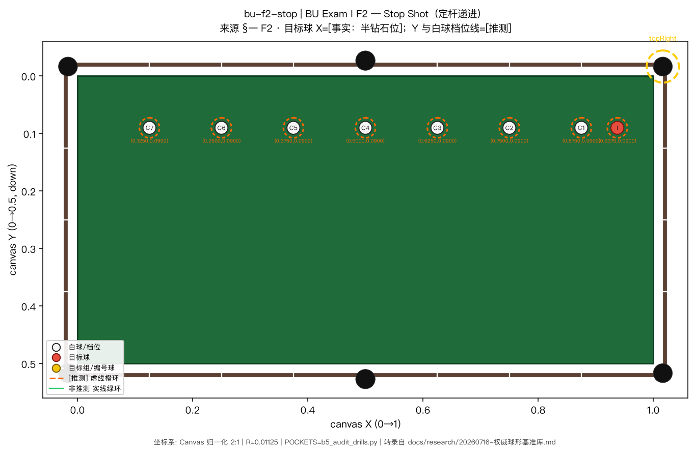

- **渲染图**：[`benchmark-figures/bu-f2-stop.png`](./benchmark-figures/bu-f2-stop.png)

### pat-s1-speed — PAT Start #1 — Stoß-Geschwindigkeit（力度控制）

- **B1 来源节**：§四 4.1 #1
- **官方原图/文档**：<http://www.pat-training.de/patsites/patstart/PATStartLeseprobe.pdf>
- **可信度**：[未转写] 球位依图；仅知目标区宽=2 diamond=0.25
- **变量与考核要点**：速度 4 档（½/1/1½/2 台程）+ 无意识塞控制
- **计分**：3 轮 × 4 球，每球 1 分
- **说明**：禁止编造坐标。目标区为 2-diamond 容差带（归一化宽 0.25）；球位 [未转写]。

> **[未转写/不可渲染]** 本项无完整可转录球位坐标，仅保留文字，不附图。

### pat-s2-straight — PAT Start #2 — Stoß-Geradlinigkeit（出杆直线性）

- **B1 来源节**：§四 4.1 #2
- **官方原图/文档**：<http://www.pat-training.de/patsites/patstart/PATStartLeseprobe.pdf>
- **可信度**：[未转写具体门位]；门宽=4r=0.045 已知
- **变量与考核要点**：出杆直线度（门宽 2 球径）+ 速度窗口
- **计分**：4 轮 × 3 门，每杆 1 分
- **说明**：门宽=4r=0.045；纵向 diamond 线 X∈{0.125k}；具体门位 [未转写]。

> **[未转写/不可渲染]** 本项无完整可转录球位坐标，仅保留文字，不附图。

### xinrui-1-1 — 新锐一级 1.1 基本功

- **B1 来源节**：§六 一级 1.1
- **官方原图/文档**：<https://buole.com/article_detail/id/137.html>
- **可信度**：[未转写] 仅位图
- **变量与考核要点**：基础击球稳定性
- **计分**：满 20
- **说明**：官方「如图所示」位图，坐标未转写。

> **[未转写/不可渲染]** 本项无完整可转录球位坐标，仅保留文字，不附图。

### cbsa-l9 — CBSA 技能等级 9 级题名（推球/直球）

- **B1 来源节**：§七
- **官方原图/文档**：<https://mp.weixin.qq.com/s/oQBjQz6AIUU3wybOrbvdbA>
- **可信度**：[未获取] 完整考题图
- **变量与考核要点**：推白球 / 中袋直球 / 半台底袋直球
- **计分**：每题 3 次×4 分等（见 B1）
- **说明**：公开渠道未见坐标级考题图。

> **[未转写/不可渲染]** 本项无完整可转录球位坐标，仅保留文字，不附图。

## 准度（`accuracy`）

### bu-f1-cut — BU Exam I F1 — Cut Shot（角度球递进）

- **B1 来源节**：§一 F1
- **官方原图/文档**：<https://billiarduniversity.org/documents/BU_Exam-I_Fundamentals.pdf>
- **可信度**：白球档位线=[事实：长库 diamond]；目标球≈(0.94,0.44)[推测]
- **变量与考核要点**：切角（档 1 近直球 → 档 7 大角度+长距离）；击球距离
- **计分**：递进制，10 分
- **说明**：转录：白球档 k：(1−0.125k, 0.25) [事实：档位在长库 diamond 线上]；目标球 ≈ (0.94, 0.44) [推测]。⚠ B1 §九：F1 档位-切角括注与估读坐标存在疑点，引用时以官方图复核为准。

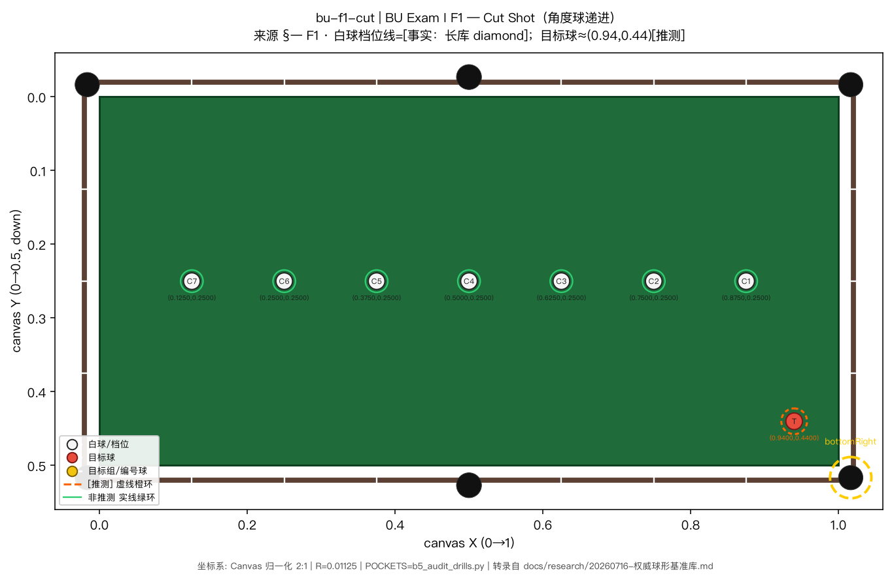

- **渲染图**：[`benchmark-figures/bu-f1-cut.png`](./benchmark-figures/bu-f1-cut.png)

### pat-s3-angles — PAT Start #3 — Winkel-Bälle（角度球）

- **B1 来源节**：§四 4.1 #3
- **官方原图/文档**：<http://www.pat-training.de/patsites/patstart/PATStartLeseprobe.pdf>
- **可信度**：排线 X=0.8125 由 1.5 diamond 换算[事实协议]；纵向排布与起端 Y[推测]
- **变量与考核要点**：切角系列（白球自摆）+ 顺序压力
- **计分**：3 轮 × 5 球，每杆 1 分
- **说明**：B1 给出排线 X=0.8125 与球心距 0.045，但未转写 5 球的具体 Y。本脚本不编造 Y，故不渲染球位；见 atlas 文字条。标记 renderable 时若 balls 空则跳过画球。

> **[未转写/不可渲染]** 本项无完整可转录球位坐标，仅保留文字，不附图。

### bu-f6-pocketing — BU Exam I F6 — Ball Pocketing（组合准度）

- **B1 来源节**：§一 F6
- **官方原图/文档**：<https://billiarduniversity.org/documents/BU_Exam-I_Fundamentals.pdf>
- **可信度**：两白球位[推测]；10 条目标线路[未转写]
- **变量与考核要点**：瞄准与出杆（10 条固定线路）
- **计分**：进球数，10 分
- **说明**：10 条线路的目标球位 [未转写：详见官方图]——图中仅画已转写的两白球位。

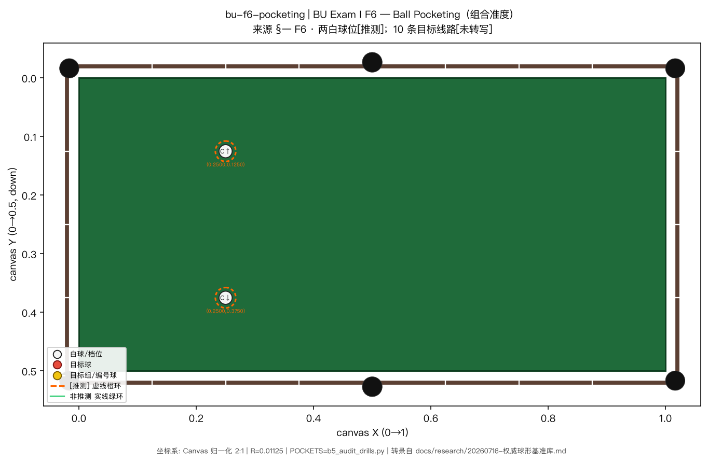

- **渲染图**：[`benchmark-figures/bu-f6-pocketing.png`](./benchmark-figures/bu-f6-pocketing.png)

## 杆法（`cueAction`）

### bu-f4-draw — BU Exam I F4 — Draw Shot（缩杆递进）

- **B1 来源节**：§一 F4
- **官方原图/文档**：<https://billiarduniversity.org/documents/BU_Exam-I_Fundamentals.pdf>
- **可信度**：目标球与缩回矩形均为[推测]
- **变量与考核要点**：缩杆距离控制 × 击球距离
- **计分**：递进制，10 分
- **说明**：转录：目标球 (0.9375, ≈0.06) [推测]；缩回矩形 X∈[0.5,0.75], Y∈[0,0.125] [推测·图纸估读]。

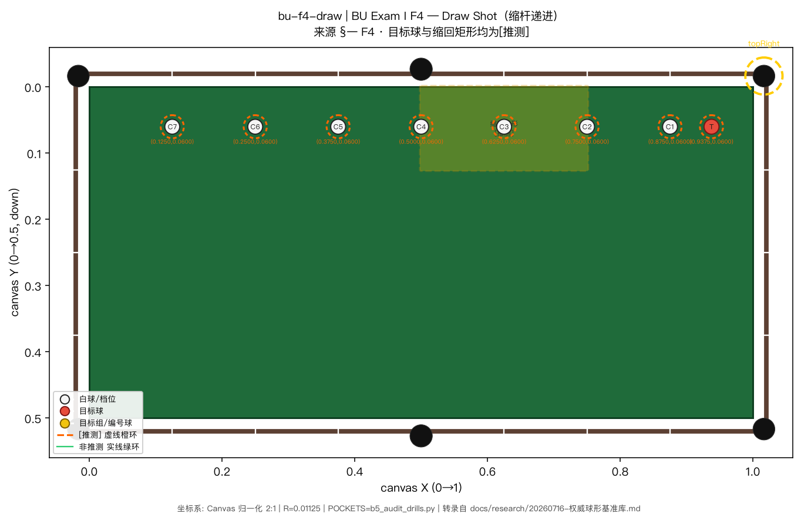

- **渲染图**：[`benchmark-figures/bu-f4-draw.png`](./benchmark-figures/bu-f4-draw.png)

### bu-f3-follow — BU Exam I F3 — Follow Shot（跟杆递进，档4示例）

- **B1 来源节**：§一 F3
- **官方原图/文档**：<https://billiarduniversity.org/documents/BU_Exam-I_Fundamentals.pdf>
- **可信度**：档4示例与靶区均为[推测]
- **变量与考核要点**：跟杆力度控制 × 击球距离
- **计分**：递进制，10 分
- **说明**：转录：靶区中心 ≈(0.94,0.09)[推测]；档4：白球(0.5,≈0.09)、目标球(0.625,≈0.09)[推测]。

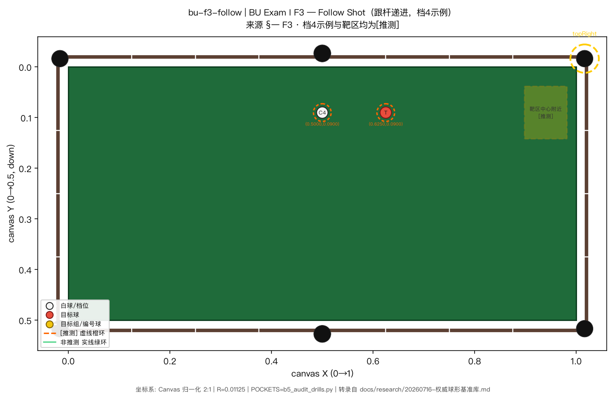

- **渲染图**：[`benchmark-figures/bu-f3-follow.png`](./benchmark-figures/bu-f3-follow.png)

### bu-exam-vii-draw-matrix — BU Exam VII — Draw Matrix（缩杆矩阵，结构说明）

- **B1 来源节**：§三 Exam VII
- **官方原图/文档**：<https://billiarduniversity.org/exams/>
- **可信度**：[未转写] 无逐格摆球坐标；仅变量结构
- **变量与考核要点**：距离{1..4}diamond × 缩杆距离{1..4}diamond = 16 组合
- **计分**：每杆 1 分 × 25/12 归一到 100
- **说明**：二维变量矩阵范例；图纸坐标本轮未转写。

> **[未转写/不可渲染]** 本项无完整可转录球位坐标，仅保留文字，不附图。

## 分离角（`separation`）

### bu-f5-stun — BU Exam I F5 — Stun Shot（斯登递进）

- **B1 来源节**：§一 F5
- **官方原图/文档**：<https://billiarduniversity.org/documents/BU_Exam-I_Fundamentals.pdf>
- **可信度**：目标球=[事实描述+换算]；靶位档1–3[推测]
- **变量与考核要点**：斯登/切线方向控制 + 速度档位（1–7 diamond & 有无弹库）
- **计分**：递进制（移动的是靶不是球），10 分
- **说明**：转录：目标球 (0.5, 0.25+0.0225)=(0.5, ≈0.2725) [事实描述+换算]；靶位档1/2/3 中心 ≈((4+k)×0.125, 0.25) [推测]。档4贴右短库与档5–7 弹库复用未画完整纸靶尺寸（B1 未给矩形半宽）。亦映射 forceControl（§八）。

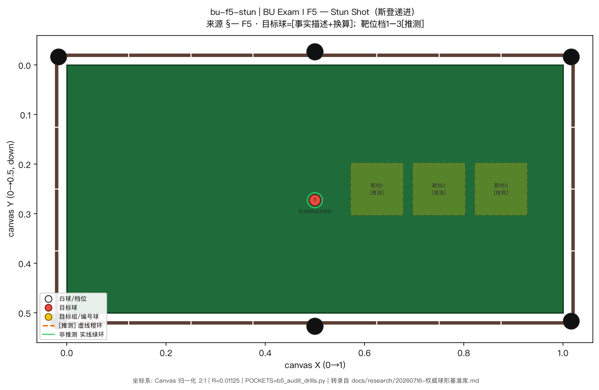

- **渲染图**：[`benchmark-figures/bu-f5-stun.png`](./benchmark-figures/bu-f5-stun.png)

### bu-f7-wagon — BU Exam I F7 — Wagon Wheel（车轮走位）

- **B1 来源节**：§一 F7
- **官方原图/文档**：<https://billiarduniversity.org/documents/BU_Exam-I_Fundamentals.pdf>
- **可信度**：目标球[推测]；10 靶球[未转写]
- **变量与考核要点**：分离角/切线方向控制 × 白球行进方向（10 向扇面）
- **计分**：命中数，20 分
- **说明**：10 靶球沿右半台库边扇形 [未转写]——图中仅画已转写目标球。

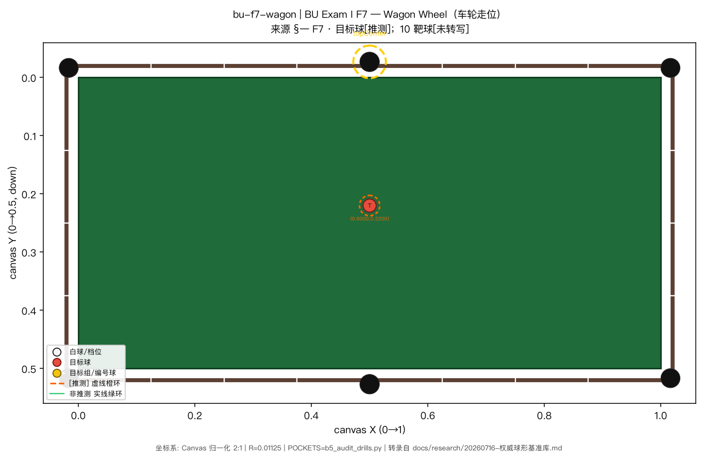

- **渲染图**：[`benchmark-figures/bu-f7-wagon.png`](./benchmark-figures/bu-f7-wagon.png)

## 走位（`positioning`）

### bu-f8-grid — BU Exam I F8 — Grid Target（走位网格）

- **B1 来源节**：§一 F8
- **官方原图/文档**：<https://billiarduniversity.org/documents/BU_Exam-I_Fundamentals.pdf>
- **可信度**：白球/目标球/5靶中心均为[推测]
- **变量与考核要点**：走位落点（5 个区域档）× 力度
- **计分**：命中数，20 分
- **说明**：转录：白球≈(0.22,0.25)、目标球≈(0.165,0.15)[推测]；5 靶中心≈(0.28,0.09)/(0.72,0.09)/(0.5,0.25)/(0.28,0.41)/(0.72,0.41)[推测]。图中靶区为中心附近示意框（B1 未给纸靶半宽）。

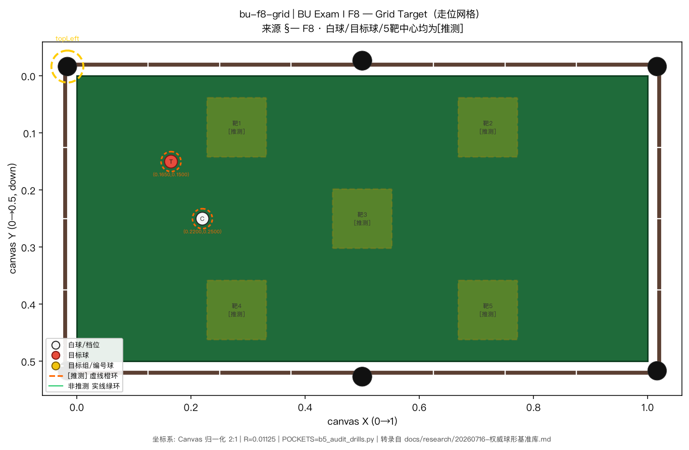

- **渲染图**：[`benchmark-figures/bu-f8-grid.png`](./benchmark-figures/bu-f8-grid.png)

### bu-s1-line — BU Exam II S1 — Line of Balls（一线球）

- **B1 来源节**：§二 S1
- **官方原图/文档**：<https://billiarduniversity.org/documents/BU_Exam-II_Skills-Bachelors.pdf>
- **可信度**：中线 Y=0.25[事实]；X 序列[推测]
- **变量与考核要点**：走位精度（不碰邻球）、顺序规划
- **计分**：合法连进数，max 4（Bachelors）
- **说明**：转录：Y=0.25[事实]；X≈0.91/0.82/0.73/0.65（相邻球心距=8r=0.09）[推测]。

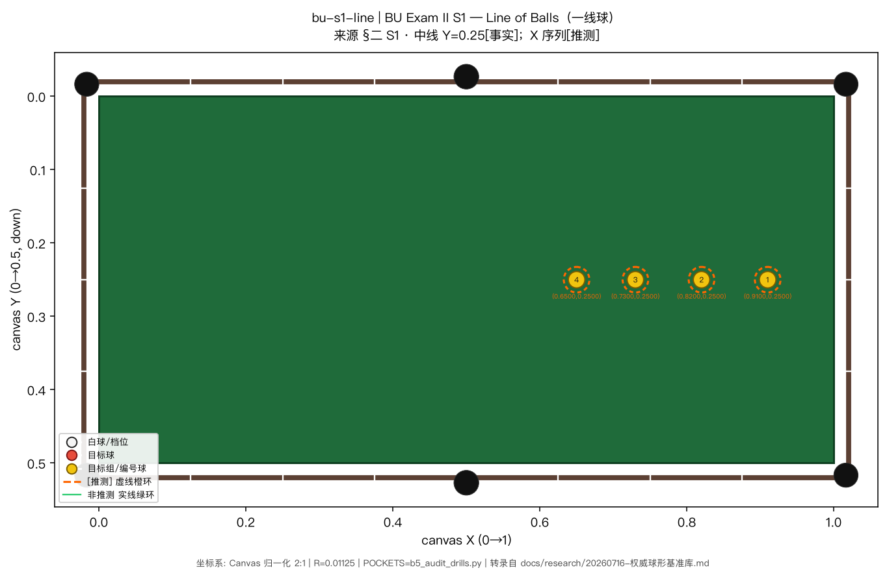

- **渲染图**：[`benchmark-figures/bu-s1-line.png`](./benchmark-figures/bu-s1-line.png)

## 控力（`forceControl`）

### bu-f5-stun-force — BU Exam I F5 — Stun Shot（力度/行进距离档，同分离角项）

- **B1 来源节**：§一 F5
- **官方原图/文档**：<https://billiarduniversity.org/documents/BU_Exam-I_Fundamentals.pdf>
- **可信度**：与 bu-f5-stun 同一转录；§八 forceControl 映射
- **变量与考核要点**：速度档位（白球行进距离 1–7 diamond & 有无弹库）
- **计分**：递进制，10 分
- **说明**：与 separation/bu-f5-stun 同源坐标；按 §八 变量拆分归入 forceControl。

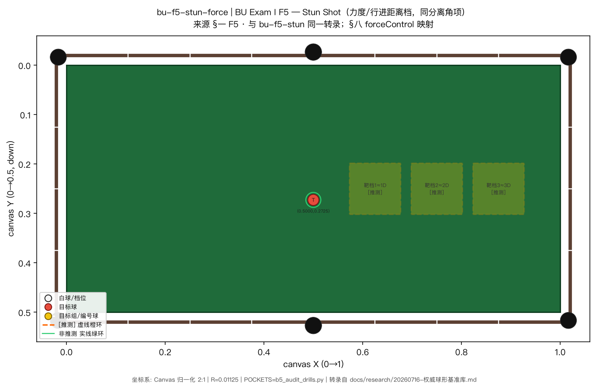

- **渲染图**：[`benchmark-figures/bu-f5-stun-force.png`](./benchmark-figures/bu-f5-stun-force.png)

### pat-s1-speed-force — PAT Start #1 — 力度控制（§八 forceControl 优先映射，未转写）

- **B1 来源节**：§四 4.1 #1
- **官方原图/文档**：<http://www.pat-training.de/patsites/patstart/PATStartLeseprobe.pdf>
- **可信度**：[未转写] 球位依图
- **变量与考核要点**：速度 4 档（½/1/1½/2 台程）
- **计分**：3 轮 × 4 球
- **说明**：与 fundamentals/pat-s1-speed 同项；坐标未转写，不附图。

> **[未转写/不可渲染]** 本项无完整可转录球位坐标，仅保留文字，不附图。

## 特殊球路（`specialShots`）

### bu-s2-rail-cut — BU Exam II S2 — Rail Cut Shots（贴库切球）

- **B1 来源节**：§二 S2
- **官方原图/文档**：<https://billiarduniversity.org/documents/BU_Exam-II_Skills-Bachelors.pdf>
- **可信度**：全部球位[推测]；贴库 Y 取库边线（球心应距库 r，B1 原文如此标注）
- **变量与考核要点**：贴库球薄切准度 + 全台走位
- **计分**：合法连进数，max 7
- **说明**：转录：≈(0.25,0.01)/(0.72,0.01)/(0.99,0.25)/(0.72,0.49)/(0.28,0.49)/(0.01,0.25)/(0.5,0.25)；B1 注贴库球 Y 取库边线，实际球心距库 r=0.01125。

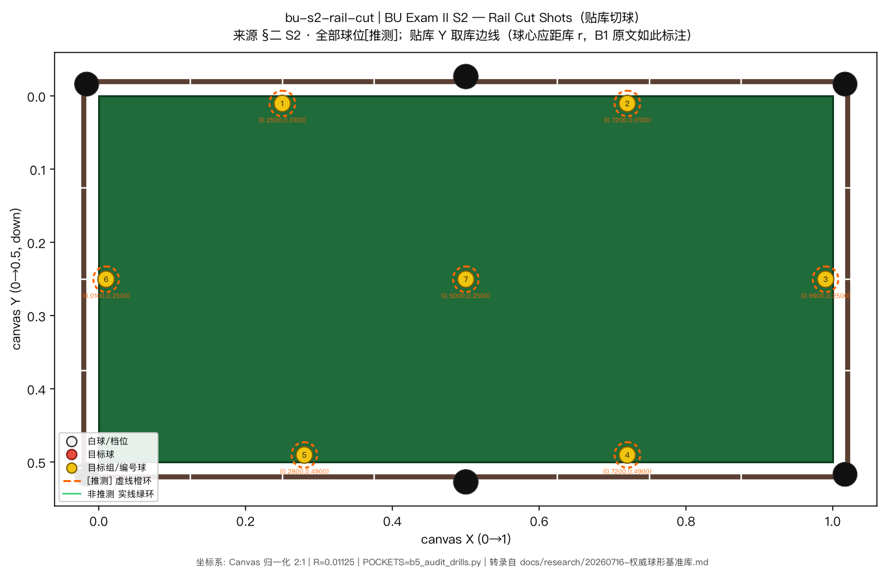

- **渲染图**：[`benchmark-figures/bu-s2-rail-cut.png`](./benchmark-figures/bu-s2-rail-cut.png)

### bu-s7-bank — BU Exam II S7 — Bank Shots（翻袋）

- **B1 来源节**：§二 S7
- **官方原图/文档**：<https://billiarduniversity.org/documents/BU_Exam-II_Skills-Bachelors.pdf>
- **可信度**：三球位[推测]
- **变量与考核要点**：翻袋入射角（3 档微变角度）
- **计分**：成功数，max 3
- **说明**：转录：球1≈(0.39,0.25)、球2≈(0.345,0.25)、球3≈(0.30,0.25)（球心距=0.045）[推测]。

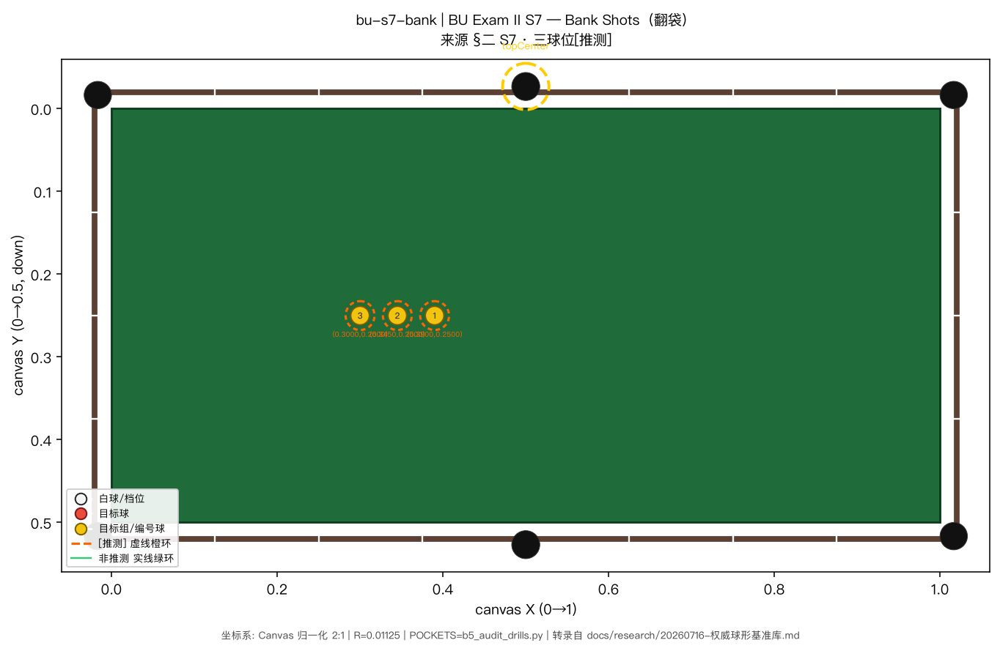

- **渲染图**：[`benchmark-figures/bu-s7-bank.png`](./benchmark-figures/bu-s7-bank.png)

### bu-s6-kick — BU Exam II S6 — Kick Shots（一库解球）

- **B1 来源节**：§二 S6
- **官方原图/文档**：<https://billiarduniversity.org/documents/BU_Exam-II_Skills-Bachelors.pdf>
- **可信度**：全部[推测]
- **变量与考核要点**：一库解球入射角（3 个角度档）
- **计分**：成功数，max 3
- **说明**：转录：白球≈(0.165,0.145)；目标球≈(0.28/0.39/0.5, 0.25)[推测]。先弹下长库。

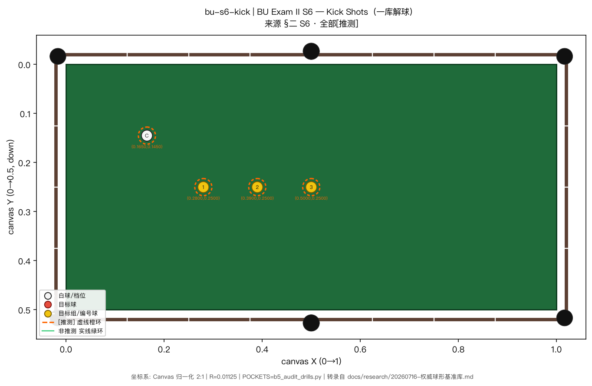

- **渲染图**：[`benchmark-figures/bu-s6-kick.png`](./benchmark-figures/bu-s6-kick.png)

## 综合（`combined`）

### bu-s3-9ball-l1 — BU Exam II S3 — 9-Ball Patterns（布局1）

- **B1 来源节**：§二 S3
- **官方原图/文档**：<https://billiarduniversity.org/documents/BU_Exam-II_Skills-Bachelors.pdf>
- **可信度**：布局1[推测]；布局2/3[未转写]
- **变量与考核要点**：走位串联、顺序约束下的多杆规划
- **计分**：3 局取两低分相加，max 10
- **说明**：转录布局1：5(≈0.15,0.15)、8(≈0.375,0.15)、9(≈0.61,0.15)、7(≈0.15,0.35)、6(≈0.39,0.35)[推测]。

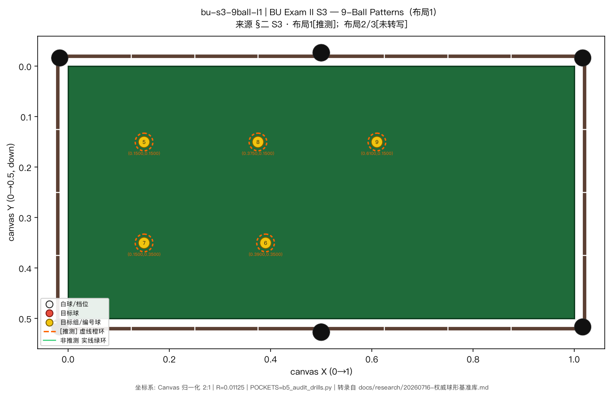

- **渲染图**：[`benchmark-figures/bu-s3-9ball-l1.png`](./benchmark-figures/bu-s3-9ball-l1.png)

### bu-s4-8ball-l1 — BU Exam II S4 — 8-Ball Patterns（布局1）

- **B1 来源节**：§二 S4
- **官方原图/文档**：<https://billiarduniversity.org/documents/BU_Exam-II_Skills-Bachelors.pdf>
- **可信度**：布局1[推测]；布局2/3[未转写]
- **变量与考核要点**：有障碍下的进攻路线选择
- **计分**：同 S3，max 10
- **说明**：转录布局1：花色≈(0.15,0.15)/(0.15,0.35)/(0.5,0.35)/(0.84,0.35)，8号≈(0.84,0.15)[推测]。

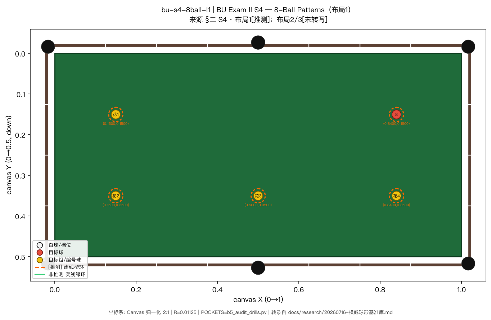

- **渲染图**：[`benchmark-figures/bu-s4-8ball-l1.png`](./benchmark-figures/bu-s4-8ball-l1.png)

## 重跑方法

```bash
# 在仓库根目录（建议 worktree）
uv venv .venv-b2 --python python3.12   # 若尚无 venv
uv pip install --python .venv-b2/bin/python matplotlib
.venv-b2/bin/python scripts/render_benchmark_formations.py \
  2>&1 | tee build/b2-logs/render-run.log
```

## 版本记录

| 版本 | 日期 | 变更 |
|---|---|---|
| v1 | 2026-07-20 | B2 初版：8 分类图集 + matplotlib 渲染脚本 |
