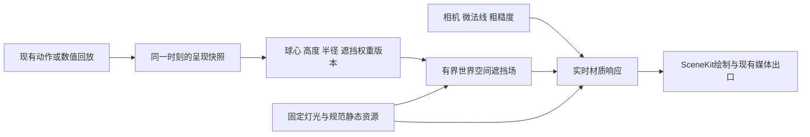

# 从计算组织重构球迹渲染

2026-10-02，第二轮架构提案。用户明确要求从源码、数学方法和架构寻找大幅优化，不以新的真机测试起手。本轮是设计工作，不改生产实现。前轮“下一步先测S0”不再作为本轮工作入口。

**后续方向更新：用户提出两种3D视角与第三人称固定算法轨道，要求联合考虑。** 2D承担直观全盘阅读；第三人称上下进退、两模式左右滑动，具体参数/手势语义仍讨论中。保留现有取景不再是产品前提；以[相机与渲染联合契约初稿](CAMERA-RENDER-CONTRACT.md)明确轨道视线域、实际相机帧及压缩有效域，旧FOV/眼位/切镜时机不自动继承。受约束相机有助于表示拟合，不将两维轨道等同两维BRDF或节能保证。物理、同帧一致性和实际资源护栏继续保留。

## 核心判断

**最值得改变的是台呢光照与球影的计算域：将与相机无关的遮挡，从每次屏幕片元着色中移出，形成按球状态失效的世界空间场；再将固定面光源的材质响应与动态遮挡分层。** SceneKit继续承担场景、交互和现有出口，Metal compute承担领域计算，必要时使用受控SCNRenderer安排同帧执行。

这是新的球桌渲染架构，超过10-01“不改变资源/接口/公式”的小优化计划。提出它不需要先重做性能测试；代码已足以证明存在重复的几何计算。实际设备毫秒和画质误差属于实施后未知，不能从复杂度直接虚构收益百分比。

## 当前方法的结构限制

`MobileReferenceLighting.swift:377–457,869–906` 在片元里：

1. 对球做support判断，选择近影64个或远处8个面光源采样；
2. 每个近影样本再遍历候选球，求球—射线几何和确定性过滤；
3. 将同一样本的可见度用于漫反射和GGX镜面积分，最后用解析矩形漫反射校准。

因此，阴影附近的核心工作含 **可见片元数 × 灯样本数 × 局部球数**。球静止时改变相机，球影几何没有改变，这组遮挡仍随每一帧重算；改变显示尺寸，也会增加同一世界空间关系的求解次数。当前mask确已排除不相关球，不能把全部区域都说成64×16；但它没有改变计算域。

`MobileTableRendering.swift:152–271` 已按presentation状态批量上传球数据，并在值未变化时跳过上传。这减少CPU绑定，**没有缓存片元计算出的可见度**。停绘、R预积分反射、静态房间烘焙也都已存在，不作为新方案收益。

## 目标结构

把更新原因拆开，而不是让“这一帧有动画”触发全部重算：

| 变化 | 几何遮挡场 | 片元/材质响应 | 其他需要更新 |
|---|---|---|---|
| 仅相机转动/瞄准视线变化 | 内容可复用；放大要求更精细级别时另请求或原公式回退 | 更新视角镜面/纤维掠射 | 投影、拾取与叠层 |
| 球仅绕自身旋转 | 球形遮挡可复用 | 球号/法线方向更新 | 球体姿态 |
| 球心、高度或有效opacity变化 | 更新旧+新support覆盖的局部区域 | 消费同帧的新版本 | 呈现状态 |
| 台呢色/球号变更 | 几何visibility可复用 | 材质更新 | 若规范probe政策改变再单独处理 |
| 灯rig、接收面几何或采样规则改变 | 失效相关全部场 | 更新相应材质与静态响应 | 资源版本重建 |
| 房间内容改变 | 是否影响直接遮挡由实际rig决定，不能无条件全失效 | 反射/环境资源更新 | 规范probe版本 |

阴影场复用的是输入关系，不是上一帧屏幕图像；正常相机运动不引入重投影拖影。静态场也不等于静态最终画面。

## 第一切片：搬移几何可见度，保留原积分关系

第一版不使用“一灯一个平均阴影值”。对明确的床面接收chart保存原近影采样点各自的联合透射：

`T_j(p) = ∏_i (1 − a_i b_ij(p))`

这里a保留当前有效遮挡权重，b保留原球—射线及lightCellRadius过滤，j保留两灯各32个采样点和次序。消费端仍使用当前法线、roughness、视线计算每个样本的BRDF，再乘对应T。生成过程中球心、球高、opacity参与；相机和球自身旋转不参与。

**改变的工作**：相机每帧导致的逐样本球几何遍历，改为球状态变化时的有界场生成；片元读取缓存的透射。**仍保留的工作**：视角相关GGX/法线处理、解析漫反射校准、材质采样，以及不适用chart区域的原路径。

有限网格插值不是像素精确等价；若后续采用FP16，还有量化误差。必须分开写“原积分关系保持”和“空间表示近似”；空间误差不能保证、无可靠chart或缓存不足的区域直接走当前公式，不降低显示分辨率/目标帧率，也不漏阴影。不能将同材质TaiNi中的库面、床沿、袋口全部当Y=0.8平面；按当前资产真实接收几何建立chart，独立于相机裁剪，保留边界和高度，无法表示的面不接入。屏幕外球仍可能对屏内接收面投影，不依据当前取景删灯光遮挡候选。

**交叉审查后的首版选择：先做有界床域的持久场，blocker版本改变时完整生成该缓存覆盖域，不在第一版同时引入dirty tile、轮转大纹理和page迁移。** 当前256×128只用于容量设计示例，R32Float的64通道一场为8MiB；guard/元数据/资源替换另计。它不证明空间质量足够，不强行把整个近景放进该分辨率。未承接区域仍用原公式。

保持同一传统MTLCommandQueue、tracked且直接绑定的场纹理，GPU按compute(k)→draw(k)→下一次需要的compute→draw访问，可以复用一份场而非无条件三份。CPU快照/uniform仍用有限在途slot。若引入独立queue/export、无法保证真实资源追踪或同时保留多内容版本，再选择独立场及显式同步并重新列预算。队列commit顺序本身不是完整的hazard保证。

第二阶段才扩展有总容量上限的局部tile/patch：

- 球变化脏区包含旧、新support和过滤/采样边界；离开区域恢复T=1。
- 脏区重建对全部相关球重新求联合乘积；不能只更新移动球，也不能除旧透射撤销遮挡，旧值为零时该操作不成立。
- 静止球与移动球重叠时保留关联；原公式退路覆盖满台/高球/不满足接收域的最坏情况。
- 内存预算统计全部在途版本、page table、边界texel和工作资源；容量不足同帧退回公式，不能无限扩atlas或等GPU读完再阻塞UI。
- 空间分辨率由世界跨度与局部质量要求决定；本提案不将512×256当获批质量值。使用2D纹理打包可减少对材质纹理array支持的假设，具体布局在实施卡冻结。

接触AO首版继续当前片元公式；它的远距尾项不能直接套用有限direct-shadow support。场完整生成和后续局部生成都针对逐样本V，不把AO、镜面或最终颜色无条件混进同一缓存。

**质量选择来自函数误差，而非“近景/远景”标签。** 对每cell和每灯样本用原几何函数求保守区间包络，无法证明分支时放宽为[0,1]。同一快照四角的双线性重建落在其凸包内；包络宽度可给V误差界，再按原光权重/BRDF传播到E与S。仅四角有限差分不能证明cell内部误差。smoothstep内有 `|∇blocked|≤3/(4f)(|∇d|+|∇f|)`，联合透射的导数界可由各球因子界相加；界过宽则细分或原公式回退。误差容差与能表达的normal/view域须在实施契约里冻结，不能把专项提出的候选数值当用户已批准放宽画质。

同球阵下，反复移动相机无需重做遮挡场内容。首版球运动时完整生成其承接域，后续局部更新再使工作与变化区域相联系。这是本轮选择该切片的结构理由；频繁开球、大量cache miss、极近景和带宽压力是它的明确反例，不保证每个场景都赢。

## 更大的算法收益：固定照明响应与动态可见度分离

第一切片还保留64样本BRDF，是改计算域的起点，不是终点。第二阶段研究减少方向维度：

**漫反射方向矩。** 固定灯样本的几何权重和方向可预先表示；当所有样本都位于当前微法线正半球时，`Σ c_j T_j max(0,n·l_j)`可写为`n·Σ c_jT_j l_j`。原漫反射的遮挡比例可由遮挡/未遮挡两组方向矩求出，再保留已有解析矩形积分。这是带明确前提的重排；法线越过灯光半球、非床面或灯采样分支不同则不能直接使用。方向矩能保留微法线响应，单个平均visibility不能。

**镜面角响应。** 用覆盖法线、视线、roughness的响应基底或LUT压缩固定面光积分，动态可见度投影到同一方向表示后再组合。目标将运行时64方向求和改为较少系数的重建。GGX与遮挡相关，有限基底是近似；需要定义可表达的参数范围及误差，并保留窄高光/复杂遮挡的高频余项。不能只按N·V做二维表就声称支持任意微法线和面光方向。

具体可写为 `C_m(p,B)=Σ_j q_j(p)T_j(p,B)φ_m(l_j(p))`，片元只重建 `S≈cΣ_m C_m η_m(n,v,roughness)`。q是与材质无关的灯几何权重，φ是方向基，η是当前材质核的系数。球动生成C；相机动只改变η。基底rank L若远小于64，才得到积分维度的减少；compute投影64×L、系数旋转与读取也计成本，不能称SH9天然够用。静态系数LUT、方向转换与动态联合透射三个层次各有独立依赖与误差。

**无遮挡响应＋局部修正是并列候选。** 原式恒等于 `S=S0+Σ_j w_j(T_j−1)BRDF_j`。保存受影响方向mask，只对透射非1的J个样本修正；无遮挡S0用离线响应拟合或LTC。J最坏仍为64，S0替代引入独立误差，因此不保证全场更优；但遮挡只影响少数方向时，它比每片元读取完整64通道更有机会，且保留visibility与BRDF的耦合。这条路线和完整角投影按核误差/资源成本竞争，不预选某个低阶数。

**LTC是可选的材质积分方法，不能单独解决球影。** 它用拟合分布和解析多边形积分替代逐样本BRDF；仍需联合可见区域/遮挡表示，而且BRDF拟合非完美。当前S/RS已有单球解析遮挡均值乘积与低采样镜面，不把直接启用旧profile当本方案。[原作者说明](https://eheitzresearch.wordpress.com/415-2/)

这三项的目的都是降低实际运行时工作量。新增模块、把MSL搬到另一引擎、改成ECS本身不会消除这些积分。

## 数学上已经排除的捷径

当前漫反射是`E_analytic × Σ(w_jT_j)/Σw_j`；镜面是`Σ(w_jT_jBRDF_j)`。取两样本w=[1,1]、T=[1,0]、BRDF=[9,1]：原镜面9，平均透射乘无遮挡镜面得到5。因此同一个灯平均阴影不能保留两种加权响应。

两颗球遮挡同一半边灯：各自平均透射0.5；正确联合平均0.5，两个平均相乘0.25。逐球积分结果相乘会改变重叠阴影；不能把旧S路径称为精确替代。以上是当场算术反例，不需要手机测试。[数值记录](architecture-arithmetic.json)

## 成本模型与交叉点

记P为近影片元求值数，q=64，k为当前support内平均候选球数，N为新版本需生成的场texel数（首版为完整承接域，后续为脏区），c_g为一次球几何判断成本，c_t为一次场读取成本：

- 当前几何部分约`P × q × k × c_g`，另有support、BRDF与非近影成本。
- 场方案约`N × q × k × c_g + P × q × c_t + 分区/同步/版本维护`。
- 球阵固定的后续帧N=0；动态时只有在减少的几何工作大于采样/管理增量才获益。不能将N<P直接当耗时比，也不能忽略原k已被mask降低。

容量模型：512×256、64通道FP16一状态16MiB，两完整状态32MiB；两灯标量图只有0.5MiB但丢失上述角关联。故“低分辨率一个阴影贴图”既不天然等价，也不天然低成本。全桌密集64通道不作为默认方案；局部池必须把在途版本纳入容量。[可复算容量与反例](architecture-arithmetic.json)

相比之下，256×128的单份R32Float场为8MiB，2-texel层边界collar的2D打包约8.38MiB；不因传统buffer三重缓冲建议而自动复制三份大场。该网格约9.92mm/texel，明显不能无条件保证毫米级接触影细节；质量路由需由原过滤函数的梯度和接收位置误差建立，不仅按“看起来近”分类。提高分辨率、加patch或替换资源仍须计入总峰值，不能突破既有护栏却仍称原范围交付。

独立反方代入当前rig：床中心正常球影64样本的filterRadius约1.446–3.207mm，小于该网格9.922mm间距；这已足够否决“该分辨率全面够用”，无需设备实验。它不是全域最小宽度，不外推其他球高/位置。

首切片沿用既有**新增GPU资源峰值≤16MiB**护栏，统计field、collar、certificate、输入slot与retired资源等全部新增分配；现有资源仍受原整体护栏约束。仅接一个interactive session，导出先用原路径。旧+新field超额时先编码原公式，异步退役旧资源后再分配，避免峰值双份或CPU阻塞。专项24MiB候选不进入最终首版契约；若以后扩大预算须另列变更，不能称符合原护栏。

近影世界跨度、最低过滤宽度、采样分辨率和可见片元密度共同决定适用范围。本轮不虚构实际GPU倍数或最低能耗结果，但已给出了删除工作、保留工作和退化边界。

## 帧所有权与承载方式

不能在didApplyAnimations回调中发一个异步任务，随后用上一版场绘制新球；也不能每帧`waitUntilCompleted`换取同帧一致性。建议为结构切片设一个负责同帧排序的FrameCoordinator：

1. 消费现有业务/动作与相机输入，指定本帧唯一时间；
2. `SCNRenderer.update(atTime:)`推进一次；在动画、约束等最终采样阶段完成后，从实际呈现状态建立值快照并核对session/generation；
3. 对球心/高度/opacity单独生成blocker版本，安排必要的field更新；
4. 同一command buffer先编码compute，再用**不再更新动画**的`render(withViewport:commandBuffer:passDescriptor:)`编码SceneKit；
5. 使用匹配版本资源，present/commit；完成后回收在途资源。

本机SDK明确后一个render方法不推进动画；`render(atTime:...)`则会再次update，不能混用造成双推进。两个公开方法最低iOS11，覆盖17。[Apple SCNRenderer](https://developer.apple.com/documentation/scenekit/scnrenderer)

帧快照拆presentationRevision、blockerRevision、cameraRevision、receiver/rigVersion，而不是单个sceneDirty。球号旋转变更presentation但不变blocker；离屏视频使用相同时间取样/场消费接口，保留当前物理轨迹。现有SCNAction兼容、取消代次、在途材质资源和媒体接口须在实施卡明确，不把值快照设计称已经完成迁移。

首版固定场来自device、显式tracked、同queue直接绑定；Apple传统Metal自动追踪要求这些条件。heap/untracked、间接绑定或跨queue不得照搬结论，必须增加可覆盖实际访问的同步/独立资源。快照也不自动冻结SCNMaterial：field绑定固定，场只在GPU中更新；CPU材质/纹理句柄的切换由frame owner控制并保留旧资源到完成。不假定所有SceneKit回调都在主线程。[Apple同步条件](https://developer.apple.com/documentation/metal/resource-synchronization)

高层SCNMaterialProperty不能证明内部的direct binding。首版实现必须落实实际绑定条件，或在app-owned commandBuffer以公开GPU event边界安排compute完成→SceneKit render开始及render完成→下次改写；iOS12已有该接口。同步载体不成立则用当前公式，不靠commit顺序猜测。input slots全部在途时不覆写也不CPU等待；沿宿主在途上限跳过本次提交并由后续取样追上，不宣称这种背压已达性能目标。

对受控宿主切片，需要处理现有SCNView拾取/投影适配；不要同一场景同时让SCNView和SCNRenderer推进。也不需因此全量重写球/杆/袋口、物理、相机或全部页面。局部SCNProgram可用于精确承载新参数布局和输出；仅在modifier无法可靠表达时采用，不作为额外收益本身。

## 实施顺序

1. **形成计算与依赖契约**：明确bed接收域、原采样/过滤、快照字段、失效键、池容量、公式退路和输出空间。该工作来自代码与数学，不是新测试批次。
2. **实施一个结构切片**：床面逐样本联合透射场＋匹配快照＋同command-buffer排序，保留原BRDF/R/物理；纳入实际CameraFrame与相机提交权限，现有rig可作兼容入口，新相机策略独立替换取景入口。仅一个消费端接入，其他出口通过共同接口逐步适配。
3. **压缩材质响应**：方向矩解决适用范围内漫反射；镜面基底/LTC由完整误差说明决定，不无声换成平均阴影。
4. **统一领域渲染资源**：规范反射捕获、材质语义、派生资源与媒体复用；独立记录其冷准备/维护收益。
5. **最后评估宿主替换**：只有SceneKit对这些算法与帧图产生实质限制时扩大Metal范围。架构先让计算方法成立，避免先整引擎搬家。

实施后的公式/同帧/质量和设备验证是交付关口，不是提出本架构的前置条件。当前推荐进入第1–2项设计与实施准备；不再将“先重新测一次才分析”作为下一步。

## 研究附件与状态

专项报告：[算法](architecture-algorithms.md)、[光照与接收面](architecture-lighting.md)、[帧与资源架构](architecture-runtime.md)、[理论反方](architecture-critique.md)。主控独立读取当前源码、核对SDK更新/绘制语义，数值记录只做静态代数与容量计算。报告不声称这些模块已实现。

交叉讨论已完成：算法最初偏稀疏页/FP16多版本，光照最初列三场容量，帧架构偏单持久场；反方指出首片混合这些方案会扩大状态证明及资源成本。最终统一为有界full生成、单R32场、真实同步、误差路由、16MiB新增总峰值，dirty页后置。专项历史候选以各自末尾交叉回应校准。方向矩不能替代镜面的异议保留；角投影与S0修正是进一步减少64次积分的候选，不以角色共同意见宣布最低能耗。
