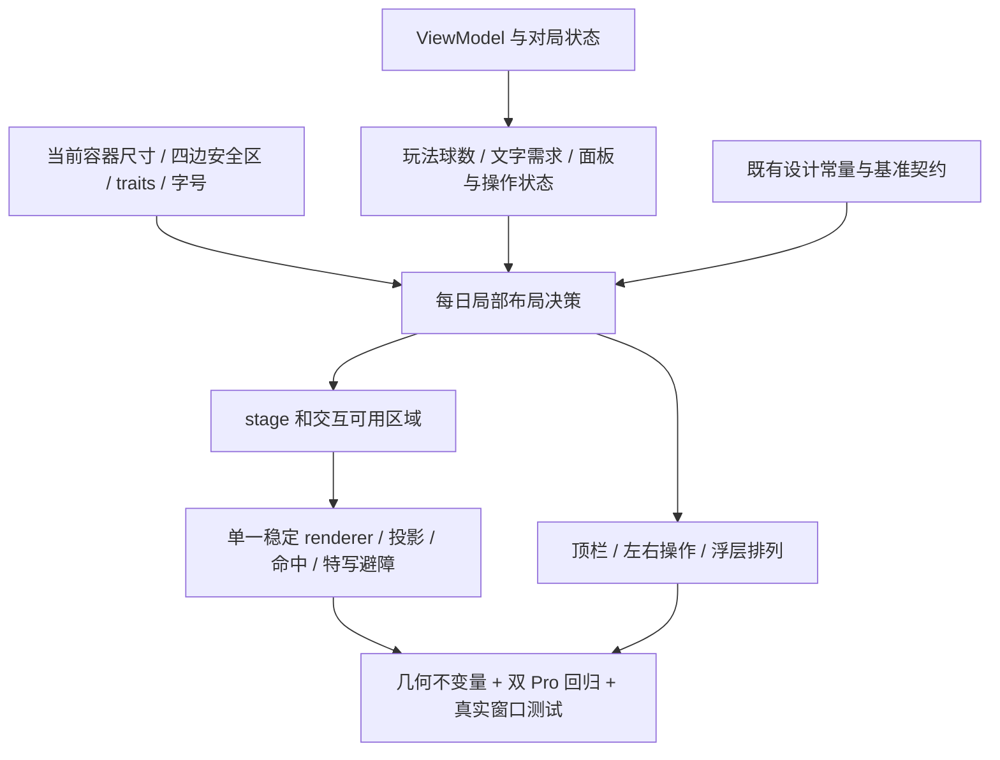
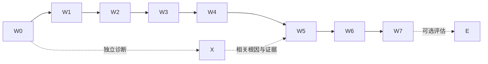

# 每日清台自适应布局完整实施方案 v2

> 2026-10-06 状态更正：本文件保留历史执行事实；后续需求、验收与排期以[方案v3](DAILY-ADAPTIVE-LAYOUT-PLAN-V3-20261006.md)为准。W2/W3总体设计验收已重新打开，不能依据下文旧完成状态直接推进旧队列。

**历史版本存档，当前真源为v3。** 日期：2026-10-06。旧执行时点状态：**W0–W3局部布局准入完成，W4面板与辅助字号进行中；X首次SIGBUS未关闭**；其中W2/W3总体验收现已重新打开。执行勘误v2.1：用户已通过DR-323 r4撤销准备门控与整场景预加载，并修复模拟器Metal派发；以当前按需加载入口为准，不恢复已撤销架构。方案形成时只产出文档，之后的实现与运行以[执行记录](../output/daily-adaptive-execution-20261006/EXECUTION.md)为准。

**恢复后的源码差异**：`DailyClearanceEntryView`、`DailyClearancePreloader`及ready/failure回调已删除；首页/直达进入`FreePlayView(.dailyClearance)`，onAppear同步`setupScene(loadsDefaultLayout: false)`，`DailyTableOrientation`维护方向所有权。本文第5.1节与旧锚点中这些名称只描述暂停前风险，不能作为恢复后的实现目标。W0/W5现在采集页面出现→场景构建→方向请求/实际bounds→有效viewport与退出恢复；保留原基准保护、跨窗口与业务状态要求。旧75图是用户视觉参考，新源W0r3另建技术before。

**执行修订 v2.2（2026-10-06，用户明确反馈）**：小屏打点面板整体必须在球桌内框内，不能仅白盘圆心/底边入框。264pt卡片、160pt白盘是Pro与宽裕iPad的设计上限，不是小屏强制尺寸；按实际未缩放2D内框容量收小白盘与卡片，四向键44pt保持。2D/3D使用同一内框锚，设置开启后平移也受内框约束；iPad不随桌面增大而放大。此用户修订覆盖下表旧“264×264基准必须保持”对小屏的解读。W4r6自动化通过仅为旧版本历史证据，W4须以新规则重验后再准入W5。

本方案使用 `issue-collection-restructure` 技能编排，承接现有图文审计、双 Pro 基准和 iOS 原生布局调研。v2 覆盖 [v1 规格](DAILY-ADAPTIVE-LAYOUT-SPEC-20261005.md)中的未来实施规则与 A–E/X 排期；v1 的尺寸审计、冻结源和图像证据继续有效，不能重写成改造后的结果。遇到冲突，以本方案的实施要求为准，历史事实以原证据为准。

排期前置：W0 核对当前工作树、基准身份、可用 Runtime 和窗口测试能力；后续只使用核实过的构建与设备。现有工作树含其他任务改动，不能重置或整体覆盖。第三方技能安装不是实施前置。

## 1. 用户决策与交付边界

1. **第一优先保护 iPhone 16 Pro / 17 Pro 当前标准字号效果**：信息层级、组件比例、视觉节奏、2D/3D 球桌构图、核心动作位置和操作逻辑。两台分别与自己的 before 比较。
2. 数字先解释设计意图，再决定是否调整：A 设计常量、B 弹性空间、C 比例/坐标约束、D 内容断点、E 无依据补偿。固定 pt 并不等于硬编码缺陷。
3. 普通 UI 不按参考屏宽整体缩放；世界坐标到视图坐标的转换保留正确比例。不得用缩字、压扁球桌或叠加点击区域掩盖空间不足。
4. 顺序：**保护基准 → 小屏及其他 iPhone → Max → iPad 基础 → 可选 Expanded**。iPad 的真实窗口缩放、恢复和状态保持属于基础正确性。
5. 范围为每日清台：入口/退出、2D/3D、顶栏球库、左右操作、相机、打点盘、透明度、更多/玩法/开球相关弹层、确认/结果/提示及其状态变化。首页、今日训练、训练详情、全局设置统计页只在共享组件受影响时做回归，不开展全 App 重新设计。
6. 第一轮维持现有信息架构和横屏操作意图。iPad 窄窗口应按实际可用空间适配；确实不能可靠操作的空间必须可解释、可返回、可恢复，不能无限准备或裁掉按钮。
7. 不改球桌物理尺寸、球规则、杆速业务范围、打点含义与相机控制权；不引入通用响应式框架，不顺带换视觉材质或升级最低系统版本。
8. 本文中的实现、测试与真机验收均为**待执行工作**。历史截图通过不代表新增适配通过，模拟器结果不代表真机握持、遮挡或误触体验通过。

最终交付包括：局部布局契约与实现、内容断点依据、跨窗口状态契约、自动化保护集、逐项问题关闭记录，以及包含 before/after/差异解释的图文报告。不能只交付一个“响应式布局工具类”。

## 2. 已有证据、当前事实与待验证项

|证据层|已知情况|如何使用|
|---|---|---|
|旧版广域审计|2026-10-05 18:03 源，27 次流程、260 图；记录 iPhone 13/iOS 17 顶栏重叠、大字号透明度标题截断等|作为复现线索，不能直接宣称当前版仍有同一缺陷；[原报告](../output/daily-adaptivity-audit-20261005/REPORT.md)|
|当前技术基准|23:07 冻结，双 Pro 同构建、同实际 Runtime 26.3.1/23D8133；各 31 个采样点，17 Pro 额外 13 个重复样本，共 75 图|[双机对照](../output/daily-layout-spec-20261005/compare.html)、[图文规格](../output/daily-layout-spec-20261005/index.html)、[全部原图](../output/daily-layout-spec-20261005/gallery.html)。31 是采样点数，不是互不重复的独立状态数|
|当前基准审查|标准字号未发现顶栏可见碰撞、透明度标题截断；2D 完整桌框/六袋；3D 瞄准机位部分裁切属于既有构图|保护当前效果；不能要求所有 3D 机位都显示六袋，也不能把静态截图当作命中或连续帧证明|
|当前代码核查|2026-10-06 00:22 对照旧 manifest 的 893 个既有源码/配置/测试条目，无差异；12 个计划主锚点另存 SHA|[核查记录](../output/daily-adaptive-plan-v2-20261006/source-check.json)。这是所列条目的比较，不涵盖新增文件、所有资源或未来执行时的变化|
|缩放审计|在冻结QiuJi Swift源码检索与每日消费链中，未发现参考屏宽驱动的整页UI缩放|保留合法坐标变换；结论只覆盖原审计范围，见[缩放分类](../output/daily-layout-spec-20261005/analysis/scale-audit.md)|
|已知交互约束|球库横向按钮宽为 27/32pt；标准 Pro 的密度与当前设计一致|不冒称所有触点达到 44pt，不直接为每球加 padding 导致重叠。溢出布局另设可操作槽位，基准密度保留并记录例外|
|现有自适应基础|左右动作和结果已使用 `AnyLayout`；结果动作使用 `@ScaledMetric`；renderer 保持单实例，并已有布局后 viewport 同步|在现有机制上改进，不再造一套平行系统|
|需要补证|更多菜单末项滚动可达、Display Zoom、真正的 iPad resize/恢复、边缘触点、连续切换帧、VoiceOver|列入 W0/W2–W7；缺少测试环境必须写未验证，不能用容器截图替代系统窗口证据|
|独立稳定性线索|旧版 SE 首帧空桌、iPad 准备等待经重试恢复；mini 曾出现系统异常尺寸/rdar 环境问题|X 分流调查；保留首次失败，区分产品、时序、模拟器环境，不通过放宽等待或换 fixture 宣告修复|

注意：四/五/六球玩法以 9 号终局合法；“真实手动待开球”必须禁用 `fixtureSettled`，并验证 0 杆、待开球和控件状态。旧报告中的误判或旧采集器行为不得重新带入验收。

## 3. 架构：用当前容器和内容维护布局

### 3.1 原生机制选择

iOS 布局主要使用逻辑点 pt；截图像素与 display scale 单独记录。固定字号、圆角、按钮尺寸可表达设计语言，不需要随设备像素密度改值。[Apple Images](https://developer.apple.com/design/human-interface-guidelines/images)

SwiftUI 由父级提出可用尺寸，子视图测量并返回尺寸，再完成放置。Size Class 用于粗粒度环境判断，具体是否放得下由容器和内容决定；不要将“iPad”或“regular”直接等同于宽阔窗口。[Apple 自定义布局说明](https://developer.apple.com/videos/play/wwdc2022/10056/) · [Layout](https://developer.apple.com/documentation/swiftui/layout)

|问题|本项目优先机制|限制与落点|
|---|---|---|
|普通间距、排列和剩余空间|Stack、Grid、alignment、弹性 frame、明确的最小内容需求|先修局部约束；没有必要就不创建自定义 Layout|
|文字组横排放不下|`ViewThatFits` 或明确容量分支|候选用于轻量 HUD；可压缩文字可能“被判定放得下”却已截断，需阅读验收；不能把整个 SceneKit 场景复制进候选|
|相同子元素横竖重排|`AnyLayout`|保持子视图身份及业务状态；沿用左右动作/结果已有模式，不能仅换容器名就保证所有状态不丢失。[AnyLayout](https://developer.apple.com/documentation/swiftui/anylayout)|
|顶栏中心球库与两翼协调|先量测各组需求；必要时局部 `Layout`|只有内建布局无法清晰表达中心锚与不相交要求时使用；不把全 App 包成“自适应引擎”|
|舞台尺寸及坐标变换|保留必要的 `GeometryReader`、命名坐标空间和 UIKit bounds 转换|`onGeometryChange` 可观察提炼后的 Equatable 信息，不能形成尺寸写回自身的反馈循环；关键投影不做延迟更新来掩盖抖动|
|安全区与系统占位|容器安全区、按需 `safeAreaInset` / `safeAreaPadding`|背景可延伸，交互区域单独保护；现有特殊全屏 stage 不机械替换，安全区只扣一次。[UIKit Safe Area](https://developer.apple.com/documentation/uikit/positioning-content-relative-to-the-safe-area)|
|相对容器尺寸|仅当语义确实对应系统认可容器时使用 `containerRelativeFrame`|它不等于任意直接父视图尺寸，不替换每日中央 stage 的局部测量。[API](https://developer.apple.com/documentation/swiftui/view/containerrelativeframe(_:alignment:_:))|
|辅助字号|系统文字样式、局部 `@ScaledMetric`、换行与重排|`@ScaledMetric` 响应 Dynamic Type，不是屏幕比例工具；不全局缩放 HUD。[ScaledMetric](https://developer.apple.com/documentation/swiftui/scaledmetric)|
|UIKit / SceneKit 桥接|所属 window scene、当前 view bounds/traits、稳定 `SCNView`|复用已有 `LayoutAwareSceneView` 与 `updateViewport`；保持布局、投影、命中与可读区域一致|

项目最低 **iOS 17.0**（`project.yml`），不用为此次适配提高下限。已核查 API 可用性：Layout/AnyLayout/ViewThatFits 为 iOS 16；safeAreaInset 为 15；safeAreaPadding/containerRelativeFrame 为 17；onGeometryChange 的单 newValue action 可回部署至 16，old/new action 为 18。实施时仍以实际 SDK 编译检查为准，不照搬技能里的更高系统版本 API。

### 3.2 最小职责划分

- **设计层**：每日专属语义尺寸，保留标准值及来源；不修改全局 token 默认值。可命名为 `DailyLayoutMetrics`，这是建议新增的类型，当前不存在，不强制文件拆分形式。
- **决策层**：读取当前容器、内容量测和状态，产出排列与区域。可采用局部纯函数/值类型；不能把所有屏幕坐标缓存到 ViewModel，不能每次 body 都建全局布局对象。
- **呈现层**：SwiftUI 摆放 HUD；`ShotTableLayout`/`CameraRig` 继续负责球桌几何与投影；`AngleSceneView` 接收实测 frame。已有 `dailyCameraReadableFrame` 和布局同步链优先复用。
- **状态层**：对局、选球、杆速、打点和相机归原有业务所有者；布局改变不能重建 ViewModel、重新架球或触发一次击球。

布局输入不使用型号名、全局 `UIScreen.main.bounds` 或参考屏宽比例。屏幕刷新率等非布局能力读取不属于此次禁用范围。

### 3.3 坐标与重算契约

明确区分窗口全局 pt、宿主本地 pt、stage 本地 pt、SCNView 本地 pt、场景米、截图 px。命名与函数入参必须表达空间；转换以实际所属 window/view 完成。

同一有效布局更新内，stage、renderer bounds、readableFrame、相机投影、球/袋命中与特写障碍应一致。这里的“同一代次”是正确性要求，不强制引入新的版本号系统；先复用现有同步路径，确需检测过期异步结果时再增加最小标识。

无效/暂时为零的过渡尺寸不能污染业务状态或成为永久缓存。不要用 SwiftUI 最小高度撑出的溢出 frame 反证“可用空间足够”。安全区、栏位预留与全屏延伸各指定一个负责层，不重复扣除。

## 4. 按区域确定设计常量与回退规则

|区域|基准必须保持|空间不足或增大时的规则|验收重点|
|---|---|---|---|
|顶栏 / 球库|Pro 球面 30pt、现有居中关系、球序/分组、返回/2D3D/更多位置|按可见轮廓与真实命中需求分配两翼及中部。放不下时，优先固定核心入口、仅目标球区横向滚动；保留母球入口。溢出档可使用独立 44pt 槽，所有球完整可揭露|不以 740 或推导的单一新数字作为万能断点；透明镜像翼是装饰空间，不能简单三段 frame 求和判失败。边缘点击、滚动与点选互不混淆|
|左右操作 / 低高度|60pt 操作列、48pt 上入口、32pt 尺视觉宽、144pt 行程、击球尺寸和既有位置节奏|先收缩弹性空隙，再调整动作组排列；左右列及外侧相机一起核容量。只有仍不足时才评估非基准档缩短行程，并同步验证精细调节|完整标签/读数、可达端点、不落出安全区；左侧横排向外伸出部分计入边界；不得改杆速范围或松手自动击球语义|
|打点盘|264×264 卡片、160 白盘、44 操作键、当前底部锚与默认透明度；2D3D同锚|先变局部承载位置；仍放不下时用每日专属受限尺寸面板。可覆盖并屏蔽下层相应交互，但关闭与回中可达|不能把四键一起缩小；不因3D镜头变化而跳位；拖动中重排不得把旧坐标继续落到新盘|
|透明度|标准 Pro 宽252及当前样式|辅助字号/容量不足时标题、百分比、关闭分组重排；宽受安全容器限制，低高度内容可滚动且关闭固定可达|标题完整、百分比不拆散、滑条端点和关闭可用；回标准字号恢复基准；不靠 minimumScaleFactor 抵消辅助字号|
|确认 / 结果 / 提示 / 更多|信息优先级、原动作语义、互斥关系|使用内容驱动换行/重排；普通列表与长菜单允许滚动。只在对应弹层处理内容，不让整个球桌页面竖向滚动|末项真实可达，结果按钮不被底部遮挡，多个反馈不互盖；长文案/最大辅助字号有阅读路径|
|2D / 3D / 特写|场景世界比例、2D完整桌框与六袋、3D各机位意图；特写避袋/路径/球杆约束|视口利用剩余空间，投影重算，特写重新避障；3D瞄准机位不强制全桌入框|同一球/袋的显示与命中一致；模式往返 renderer 身份稳定；不恢复曾修复的黑场、错误视角或特写遮挡|
|Max / iPad 基础|保持字体按钮设计尺寸和同一核心流程|扩大有效台面、有界留白；仅在具体文本/面板上设置内容限宽，不能给整张球桌任意套 maxContentWidth|不粗暴拉伸 iPhone UI；空间变大后应恢复正常档，不滞留紧凑状态|

**断点必须来自容量。** 为每个排列记录“固定动作需求 + 内容实测需求 + 必要间距 + 安全空间”；尺寸跨阈值前后验 T−1pt / T / T+1pt，并做来回连续变化。适配可采用离散排列档位，档位内采用弹性空间；不需要为每个机型写一套布局。

已有 8pt 台面上移、2pt 球库留缝、标题微调有设计意图，不因是 offset 就删除。214 等复合高度项先拆出来源，未解释前标为待核实，不能换成另一个无依据数字。

最小可操作窗口由内容实测产生，不在本方案臆造宽高。退化顺序是：收缩空白 → 局部滚动/重排 → 局部面板承载 → 实测确实无法操作时明确受限态。受限态保留返回，扩大窗口自动恢复原对局；它不能用于规避正常支持的 iPhone/iPad 窗口测试。

## 5. 窗口、入口与交互状态契约

### 5.1 入口不能只等“宽大于高”

当前 `DailyTableOrientation.notifyWhenReady` 同时要求 scene 方向、window 宽高比、view 宽高比符合 landscape；`DailyClearanceEntryView` 又等待 ready 与预加载 model。iPad 窗口比例与方向可能不按这一假设同步，属于**静态风险**，尚未证实是旧版“正在准备球台”的根因。当前等待页已经有返回按钮，不得以“新增返回”冒充修复。

W0 先分别记录方向请求结果、实际窗口/宿主尺寸、ready 回调、模型获得和首个有效 viewport。W5 根据复现证据决定是否解耦“方向请求”与“内容可呈现”，不直接删除所有守卫或无条件放行。

目标：在有效容器与模型准备就绪后进入正确布局；暂不可用显示可理解的等待/失败/受限状态；退出取消当前所有权下的异步工作，迟到回调不得重入。支持的冷/热入口不能永久等待；超时界限由 W0 冷热启动测量与日志确定，不能仅延长测试 timeout。

Apple 的 iPad 窗口指导强调缩放过程和恢复后的体验；因此真实窗口验证不以固定横屏全屏截图替代。[iPad 窗口设计](https://developer.apple.com/videos/play/wwdc2025/208/) · [UIKit 窗口适配](https://developer.apple.com/videos/play/wwdc2025/282/)

### 5.2 状态变化表

|变化时的状态|要求|可验证结果|
|---|---|---|
|静止对局 / 选球|重算布局，保留局面、杆数、目标、杆速和打点|变窄→变宽后业务快照相同；正常档恢复|
|方向 / 杆速 / 打点 / 摆球拖动中|坐标域变化时结束旧手势会话，保留最后有效业务值；恢复后下一次手势重新取起点|旧触点不会落到另一球/位置；不自动击球；无残留 dragging/busy|
|相机观察 / 临时俯视 / 模式切换|保留相机控制权与临时状态语义；取消被中断的按住手势时正确恢复，不能卡在临时视图|resize 后能返回；renderer 不重建；镜头不会被布局反复重置|
|击球动画 / 回放|保留正在进行的业务事务，布局不重新发射/重播；不接受过期坐标操作|只结算一次，不丢球、不重置架球；结束后输入恢复|
|打点盘 / 设置 / 更多 / 结果打开|重新锚定并保证关闭/主要动作可达；系统菜单若因几何变化关闭，不丢设置和对局|无浮层残留、点击穿透或下层被永久禁用；阅读/操作路径完整|
|后台→前台 / 退出→重进|按已有持久化与生命周期语义恢复；先取得当前实际尺寸再允许坐标相关输入|不读旧窗口 frame；正常入口、深链和 fixture 入口分别有证据|

先使用既有取消/恢复机制；如果必须扩展，限定在当前交互会话，不能为了适配取消整局或改规则。几何实现前加载 `geometry-spatial-reasoning` 并复核坐标契约。

## 6. 验证设计：从截图比较到可维护的保护集

### 6.1 分层矩阵

|层级|必测代表与变量|覆盖内容|
|---|---|---|
|Baseline|16 Pro、17 Pro；与现有证据一致的系统/语言/字号/方向/设置|各31采样点；本机before/after；标准效果优先。记录实际window pt、scale、Runtime build，不凭设备标签推断|
|Smaller / Standard|SE 类低高度、mini 类窄空间、iPhone 13/iOS17 历史失败组合、其他标准 iPhone|实际支持的横屏方向、安全区、顶栏、双尺、全部入口与面板；mini 环境异常另记，不能算布局通过|
|Larger|Pro Max|台面利用、留白、操作距离、面板位置；不把放大控件作为默认方案|
|Expanded 基础|iPad 小/大尺寸；全屏及系统实际允许的窄/短窗口、旋转、连续 resize 和恢复|记录真实 window bounds、traits、安全区和系统窗口控件占位；不同系统的分屏/窗口功能按实际支持测试|
|内容 / 系统变量|中八/九/六/五/四球、未分组/全色/花色、待开球/正常/完成/失败；标准/最大普通/AX3/最大AX字号|断点附近以中八最大球数为压力例，短球库防错误空白/居中；长文案、粗体/高对比度等按受影响组件补测|
|环境补充|Display Zoom、VoiceOver、Reduce Motion；当前中文和系统文字变长情况|只测实际支持的本地化；不声称已实现英文/RTL。每日强制深色是既有设计，系统明暗测试重点是入口、弹层和返回边界|

不要把每个维度做无意义的全排列。固定双 Pro 核心集；其他设备用等价类和最高风险状态组合。新增断点测精确边界及恢复；同一组件在未受影响状态不重复全矩阵。iOS17兼容性和当前Runtime分别保留，执行时新增OS只增补兼容层，不自动替换旧基准。当前方向请求为landscapeRight；另一侧安全区可先做局部布局边界测试，但不能冒充真机landscapeLeft已通过，也不为测试擅自改变产品方向策略。

### 6.2 四层证据

1. **布局/几何单测**：容量边界、无负尺寸/非有限值、无交互区域相交、四边安全区、2D比例、有效区域与转换往返；验证有意义的不变量，不逐行复刻实现公式。
2. **组件预览/受控宿主**：任意宽高、内容与字号组合，检查断点；仅证明所给容器布局，不能证明真实 iPad 系统 resize、方向回调和 SceneKit 生命周期。
3. **原生交互/UI 测试**：真实点按/拖动/滚动、模式往返、窗口状态恢复；配截图、AX frame、状态值、renderer身份/viewport诊断。必要时使用 `performAccessibilityAudit` 辅助发现问题，不能仅凭 audit 零失败宣布可访问性合格。[Apple Accessibility Audits](https://developer.apple.com/documentation/accessibility/performing-accessibility-audits-for-your-app)
4. **真机检查**：基准 iPhone、小屏与 iPad 的握持、遮挡、误触、方向/杆速精细调节、VoiceOver，以及连续 resize 后流畅性。环境未具备就保留对应未验证项，不虚构完成；不要求重新做不相关性能专项。

### 6.3 回归准入与差异判定

- **先资格、后比图**：代码/资源/构建身份、设备、OS、语言/字号、方向、fixture/随机局面、设置、等待条件均需记录。过期 source、错误模式、无有效 frame、空桌异常、系统窗口污染的图不能成为 golden。
- **静态 HUD**：逐控件比位置、尺寸、文案、状态、可见和命中区域；基准标准档原则上保持一致。任何差异必须解释，不能被全图平均值稀释。
- **场景**：固定局面与机位，分离正常动态内容；基准重复13对的 MAE 0.001247–0.057550/255 仅是当时观测，不能直接作为统一通过阈值。要用同源重复样本估计噪声，仍需审视构图、球/袋/线及遮挡。
- **噪声处理透明**：若屏蔽 FPS/系统时间等动态区，保存原图、mask和理由；不遮罩按钮/文字/关键球桌区域，不用自动对齐抵消真实UI位移。既有重复比较未做 mask/registration。
- **已知例外有边界**：27/32pt球按钮、特定3D裁切等记录具体区域/状态/原因；不写全页 accessibility ignore 或宽泛截图豁免。新溢出分支的触点必须单独验。
- **金图更新**：只有明确的预期设计变更及独立复核才更新，保留历史版本。失败后重跑通过不能删除首次失败与根因记录。
- **连续行为**：静态31点之外，为切换/resize首帧、拖动取消和退出恢复保存事件序列或短录屏；截图通过不代替这些检查。

### 6.4 现有可复用测试与缺口

|现有 selector（已核实存在）|用途|局限|
|---|---|---|
|`QiuJiUITests/DailyAdaptivityAuditUITests/testCoreStateTour`|13点核心采样|采集成功不是布局验收通过；仍需审 findings|
|`…/DailyAdaptivityAuditUITests/testExtendedStateTour`、`testManualRackedTour`|16点扩展与2点真实待开球|明确 fixture 与 normal/manual，不混用|
|`…/V52DailyClearanceUITests/testDailyModeSwitchKeepsRendererAndTableHitCoordinates`|renderer身份、模式往返、球坐标及实际点击|固定尺寸切换，不代替系统resize|
|`…/V52DailyClearanceUITests/testSpinPadDragKeepsPointClearOfFingerInBothModes`|打点盘手势|需增加几何变化中断情形|
|`…/V52DailyClearanceUITests/testLandscapeEntryPaletteAndPortraitReturn`|入口、球库、返回|不证明iPad窄窗口ready条件|
|`QiuJiTests/ShotTableLayoutTests`|既有比例、bounds与完整桌框不变量|需补实际新布局边界，不删除原断言|
|`QiuJiTests/AngleSceneViewPanArbitrationTests`|场景与祖先手势仲裁|不覆盖全部新增球库滚动交互|

拟新增测试主题：内容容量 T±1、顶栏溢出滚动/边缘点按、面板AX阅读/关闭、拖动中resize取消、iPad入口/恢复、首次有效viewport、返回正常档、渲染器不重复创建。**这些测试尚不存在**；实施批次确定准确 selector 并回写清单，不能在方案期冒称已运行。

构建/测试用 `xcodebuild build-for-testing` 后显式 `test-without-building -only-testing:<已核实selector>`，记录实际 project/scheme/destination 与环境。采集器读取 `DAILY_ADAPTIVITY_DIR` / `TEST_RUNNER_DAILY_ADAPTIVITY_DIR`；执行时必须验证测试进程实际收到新批次目录，避免落入旧报告的默认路径。普通 V52 测试还会生成 xcresult 附件，保持每批 resultBundle/DerivedData 独立。

本方案不要求“跑全部测试后全仓零 diff”。先存执行前 dirty 状态与文件指纹，再审本批增量；如后续改为全量写盘测试或零diff门禁，先完整盘点 scheme/testplan 默认集及所有写文件测试。任何修正断言的任务须附原文、失败机制与仍被保护的语义，禁止删断言求绿。

## 7. 实施批次、依赖与完成标准

每批以“一次会话完成修改、针对性验证和交付”为目标。常量/职责合并处理；顶栏、双侧低高度、模态文字分别有独立验收面；入口与连续窗口同步分开，防止把多个状态机塞进一批。以下 **8 个主批次 + 1 个独立调查分支 + 1 个可选评估**，不是8次必须一次成功的承诺；发现新根因时升版调整，不能暗中扩大。

|批次|范围 / 量级|依赖|主要落点|
|---|---|---|---|
|W0 基准资格与机制预检|冻结本次输入、补验证能力/入口时序探针、确定矩阵与契约 / M|本方案|证据/测试采集；入口只做必要诊断，不改布局|
|W1 局部布局基础|每日语义尺寸、容器/坐标职责，保持现状输出 / M|W0|FreePlayView；必要的每日局部值类型|
|W2 顶栏容量与球库|小屏/标准宽度、内容断点、溢出与可达性 / M|W1|dailyLandscapeHeader / Palette|
|W3 双侧高度与Max|低高度回收/重排、双尺与相机边界、大尺寸空间 / M|W2|dailyLandscapeBody / Left / RightControls|
|W4 面板与辅助字号|打点盘承载、透明度、确认/结果/菜单阅读路径 / M|W3|每日面板/结果；共享组件仅必要显式参数|
|W5 入口与窗口生命周期|复现后处理ready、方向/尺寸分离、退出恢复 / M|W4；消费W0诊断|DailyClearanceEntryView / DailyTableOrientation；必要时预加载边界|
|W6 iPad真实窗口与投影|连续resize、安全区、手势中断、场景同步与恢复 / M|W5|既有AngleSceneView同步链、每日frame/overlay|
|W7 全链验收与维护收口|最终矩阵、真机记录、图文报告、常设保护集 / M|W2–W6|测试/报告/规格/进度；不夹带重设计|
|X 稳定性/环境调查|首帧空桌、准备等待、mini系统异常的分流 / S起|W0线索；可独立诊断|仅按证据定位；修复规模另评估|
|E Expanded价值评估|多列/侧栏/信息重组的收益与成本 / S|W7基础达到要求，独立产品决定|仅提案，不是本轮实施前置|

X 的无关环境问题不必阻塞全部布局开发；但若阻断某个必测组合，必须修复/建立等效且可解释的测试条件，或将该项保留未验，不能让 W7 宣称全量通过。

### W0 — 先让之后的改动可被可靠比较

- 范围：确认当前源/资源/构建与23:07参考关系；保存 dirty 清单；列出实际可用设备/Runtime、Display Zoom、系统窗口操作能力。确认采集目录不会覆盖旧报告。
- 补齐 entry 四段时序和实际 bounds 记录；正常入口/深链/fixture 分开，记录 pending 属于方向、模型还是 viewport。诊断不足时允许最小 DEBUG-only 探针，禁改等待业务来让测试通过。
- DoD：隔离构建成功；双Pro基准资格通过，两台各31点及同源代表重复采样；旧问题在当前版的“复现/未复现/环境阻断”清楚；矩阵、当前测试命令、噪声判定和窗口采集方法可复用。尚无条件执行的真机/窗口项明确挂到W7，不能计通过。
- 交付：本批 evidence manifest、baseline资格报告、精简执行清单。**进入W1前，双Pro参考和before源必须可追溯。**

### W1 — 建立局部基础，先证明基准不变

- 范围：将本轮需要触碰的常量命名并注明意图；整理容器、安全区、stage/全屏renderer职责，保留实际值和既有转换。只提取即将复用或需测试的决策，不对整个大文件做无关重构。
- DoD：构建；几何相关既有单测；双Pro31点与W0比较无未解释差异；renderer/命中往返用例通过。新增纯函数只测边界/不变量。共享默认值与非每日路径无新增行为变化。
- 交付：尺寸分类→消费者→职责表；低成本局部接口；before/after差异说明。若仅命名已造成位移，先修复再继续。

### W2 — 顶栏容量与真实命中一起解决

- 范围：对当前版重现的顶栏冲突建立失败证据，落地内容容量与局部溢出；保留Pro标准档。覆盖最大/短球库、分组、禁用与选择状态。
- DoD：构建；容量边界单测；先双Pro核心13点，再SE/窄容器/iPhone13历史组合；所有球包括首尾可揭露、点击选择正确、滚动不误点；返回/模式/更多触点不重叠；断点T±1与来回恢复通过。末尾补双Pro受影响玩法采样。
- 交付：实测断点依据、触点/可见区域图、缺陷前后图与交互记录；保留27/32pt基准例外，不夸大44pt达标。

### W3 — 低高度两侧操作与Max利用

- 范围：拆清214等复合高度需求；同时处理左右组、外侧相机和可伸缩空隙，确保球桌消费真实剩余空间。Max保持正常尺寸并合理扩展舞台。
- DoD：构建；双Pro核心保护；SE/低高安全区组合/Max的2D3D图和实际拖动；双尺端点/细调、击球与回放/重打/相机可达；2D不变形；布局不把剩余高度撑成溢出。若缩短非基准尺行程，必须另附精度/业务映射证据，不能仅截图验收。
- 交付：两侧容量账本、正常/受限档转换表、Max有效台面与留白比较。共享instrument默认行为保持原样。

### W4 — 面板、结果与辅助字号闭环

- 范围：在W3实际stage上处理打点盘、透明度标题与百分比、结果/确认和菜单。优先改每日承载；如共享卡片新增参数，默认保持旧行为。
- DoD：构建；双Pro标准31点；标准/最大普通/AX3/最大AX与最窄/最低组合；完整读到标题/数值/末项，能关闭、回中、滑到两端；盘内拖动/四键正确，底层无穿透；恢复标准字号无基准回归。若改共享组件，按调用图回归受影响非每日页面。
- 交付：各面板容量与阅读路径、AX audit发现和逐项处理、共享消费者影响清单。未通过VoiceOver的部分不能写“无障碍完成”。

### W5 — 入口就绪与退出恢复

- 范围：沿W0证据定位方向、模型、viewport各阶段；有必要才解耦ready条件，保留所有权、取消和返回逻辑。不得将静态怀疑直接写成根因。
- DoD：构建；正常入口/深链、冷热启动、退出再进、后台恢复；支持的iPhone/iPad窗口都能就绪或有合理可恢复受限态，无永久准备；实际对局不重置；迟到回调不重开页面；双Pro入口/31点基准通过。等待失败保留全时序。
- 交付：入口状态/回调契约、根因与修复证据；若复现表明无需改入口，提交验证结论而非强行改代码。预加载内部若成为根因，先读取其实现并把确切锚点加入本方案再修改。

### W6 — 真实窗口变化与场景一致性

- 范围：真实iPad窗口全屏→窄/短→恢复，旋转及安全区/系统控件变化；将第5节状态变化表应用到现有同步链。不会只改变SwiftUI宽度却遗留旧投影。
- DoD：构建；布局/几何/仲裁测试；窗口稳定点截图与连续过程记录；2D3D往返renderer身份不变；场景球/袋实际命中正确；拖动中变化安全结束、不误击球；回放/结果/面板后能恢复；双Pro完整31点保护通过。
- 交付：真实window/traits日志与时间线、resize前中后图/短录屏、业务快照和命中证据。观察scene创建次数及重复layout/update；出现卡顿时有针对性profile，不进行无依据全局性能改写。

### W7 — 形成可长期运行的回归流程

- 范围：按第6节跑最终分层矩阵；真机检查与模拟器分栏；收口缺陷状态、已知例外与剩余限制。把最小保护集接入现有测试流程，不新建不必要的平台。
- DoD：最终源构建成功；双Pro完整保护与其他iPhone/Max/iPad基础组合逐项有结果；全部新增/复现缺陷有复验；既有基准无未解释回归。真机或系统窗口项缺失时，结论为“模拟器/局部完成，某项待验”，不能勾选完整基础适配完成。
- 交付：可浏览图文报告、逐图审查索引、before/after/差异及证据manifest、明确的回归触发规则、最新锚点与进度。E不影响本批完成定义。

## 8. 技能与并行执行安排

|工具/技能|本轮角色|使用边界|
|---|---|---|
|[issue-collection-restructure](../.cursor/skills/issue-collection-restructure/SKILL.md)|本方案的任务整理与拆批|已使用；后续改变范围/依赖时升版|
|[swiftui-design-system](../.cursor/skills/swiftui-design-system/SKILL.md)|现有视觉token、组件契约和历史设计意图|项目真源；不可被外部通用审计规则覆盖|
|[ios-architecture](../.cursor/skills/ios-architecture/SKILL.md)|职责边界、局部结构与架构审查|不借适配重做业务层|
|[simulator-matrix-qa](../.cursor/skills/simulator-matrix-qa/SKILL.md)|多设备采集、环境核验与复验闭环|按本方案限定每日范围；真实窗口与真机仍需单独证据|
|[geometry-spatial-reasoning](../.cursor/skills/geometry-spatial-reasoning/SKILL.md)|坐标/投影/命中变更前置|先定坐标系、数值验证和不变量|
|[Axiom SwiftUI](https://github.com/CharlesWiltgen/Axiom/tree/2fd07665a3c5fde9f628050b31aead509e42ed49/axiom-codex/skills/axiom-swiftui)及其布局审计|优先参考原生布局机制选择、状态身份、窗口适配方法|调研过，未安装；固定frame/GeometryReader的启发式警告只作线索，不能机械判错|
|[SwiftUI Expert](https://github.com/AvdLee/SwiftUI-Agent-Skill/tree/9897311e3e42cc77e87603226e74bea711092fbd/skills/swiftui-expert-skill)|可选第二视角，复查局部布局和可访问性|调研过，未安装；过滤高于iOS17的API，不能套百分比高度或新视觉风格|
|[SwiftUI Pro](https://github.com/twostraws/SwiftUI-Agent-Skill/tree/be297ff80dddec529af1f9b1f1f114aab6c9d11c/swiftui-pro)|辅助通用代码review|不是本项目主规范；其较新系统/语言默认假设不能覆盖当前目标|

结论：**现有项目技能负责设计与验收，Apple 文档和 Axiom 方法补布局机制，Expert 可作补充。** 没有必要先安装多套重叠技能，也不因未安装而阻塞。外部材料只作为有来源的研究参考；未来选择安装/纳入时先检查版本和与项目契约的冲突。

实施可以并行“源码/测试影响审查”和“截图独立审查”，主控负责统一契约与验收。W1–W6大多修改同一 `FreePlayView`，**实现主链串行**；不能让多个智能体同时写同一文件后靠最后覆盖合并。共用模拟器也串行，独立设备才允许隔离采集。

模型安排延续用户授权：gpt-6.1-sol适合锚点核查、测试矩阵整理、图像逐张审查和独立报告；涉及入口所有权、SceneKit同步、手势取消的实现由主控/架构角色集中负责。子智能体自报通过后，主控仍检查原始输出与代表原图。每个执行批次仅加载自身所需技能和相关契约，避免重复吞入全部历史。

## 9. 维护、失败处理与交接

常设三档：每次每日HUD/布局变更跑双Pro核心与目标断点；共享尺寸/renderer/生命周期变更跑双Pro31点和受影响消费者；阶段交付跑第6节代表矩阵及真机记录。新增内容导致容量变化，也应触发布局回归，不能只按Swift文件名触发。

每项问题记录：ID、源/构建、设备与实际window、OS、状态、复现步骤、原图/交互日志、影响、根因假设、负责批次、修复后证据、残留限制。状态使用“历史线索 / 当前复现 / 未复现 / 环境阻断 / 修复待验 / 已复验”，禁止将未复现自动归为已修复。

基准失败先停止向下一批推进，保留证据并修本批最小问题。不能覆盖golden、回退其他任务改动、改变fixture避开失败或放大通用阈值。必要回退只撤回本批所有的差异；没有提交时以明确patch/文件指纹识别归属。

每批交接必须包含：执行前后源身份、变更文件与共享消费者、完成的DoD、准确测试命令/exit状态/xcresult、原图与审查索引、所有失败重试、未验证项目、下一批唯一入口。主控更新本方案清单和 `tasks/PROGRESS.md`，有真实设计决策再记讨论/实现规格，不把方案文字登记成已实现。

进度：W0 ✅（2026-10-06，r3）　W1 ✅（布局准入；FL-124另记X）　W2 ✅（r5顶栏；AX描边交集保留）　W3 ✅　W4 🔄　W5 ☐　W6 ☐　W7 ☐；X 新增FL-124：W1首次临时俯视SIGBUS，原selector复跑/旧源对照/6轮stress通过但未定位未修复；mini环境待复核；E未进入。

**当前W4。** 当前技术before为W0r3；旧75图保留为用户视觉参考，W6/W7补真实窗口及环境项。

## 10. 源码锚点索引

核实日期：**2026-10-06**。以下文件/函数及所列起始行已读源码确认；执行时若发生漂移，以函数名重新定位，不照搬行号。本表无虚构现有组件；前文 `DailyLayoutMetrics` 和新增测试主题均明确为建议。

|实际文件|起始行与已核实内容|相关批次|
|---|---|---|
|`QiuJi/Features/PositionPlay/Views/FreePlayView.swift`|10 `DailyClearanceEntryView`：ready/model门控、返回、预加载与释放；88结果动作ScaledMetric；195每日容器分支|W0/W1/W5|
|同上|1001 `dailyResultLayout`；1127透明度面板（1165固定宽252）；1437每日尺寸；1452 `dailyLandscapeBody`、1495实测stage、1511单renderer背景测量|W1/W3/W4/W6|
|同上|1578左操作；1645 `dailyActionSlot`；1656右操作；1735相机offset；1816 `dailyPaletteDrop`；1835顶栏；1929球径；1950球库；1986球按钮；2015打点锚矩形|W2/W3/W4|
|`QiuJi/App/QiuJiApp.swift`|265 `notifyWhenReady`三组方向/比例条件；281 `applyOrientation`；290 `restorePortrait`；302 `request`|W0/W5|
|`QiuJi/Core/Scene/AngleSceneView.swift`|97 `makeUIView`安装onLayout；201 `updateUIView`；634 `updateTwoViewReadableFrame`；833 `synchronizeDailyViewportAfterLayout`；851 `updateViewport`；1723 `LayoutAwareSceneView`|W1/W6|
|`QiuJi/Core/Components/ShotTableLayout.swift`|20 `ShotTableLayout`；55 `landscapePlayingRect`；85 `dailyPowerBarHeight=144`|W1/W3/W6|
|`QiuJi/Core/Components/BTSpinPad.swift`|11 `BTSpinPad`测量/手势；147 `SpinPadDragSession`；301固定160白盘；332 `BTSpinPadCard`|W4/W6|
|`QiuJi/Core/Components/BTShotInstrumentColumn.swift`|16组件；42 `fixedPowerBarHeight`；91作用到powerBar；300 `ShotPlayerCameraButtons`|W3；只有需要新增参数时修改|
|`QiuJiUITests/DailyAdaptivityAuditUITests.swift`|4采集类；9输出目录；160核心；206扩展；258真实待开球|W0/W7|
|`QiuJiUITests/V52DailyClearanceUITests.swift`|4 renderer/命中测试；64打点拖动；991入口/球库/返回|W0–W7相关子集|
|`QiuJiTests/ShotTableLayoutTests.swift`|9测试类；56边界不变量；138横屏完整桌框|W1/W3/W6|
|`QiuJiTests/AngleSceneViewPanArbitrationTests.swift`|9测试类；25–73场景与祖先手势仲裁用例|W2/W6|
|`project.yml`|13最低iOS17；30 Swift5.9配置|全部批次兼容性|

共享消费者不能遗漏：`BTShotInstrumentColumn` 除每日还被普通自由击球、PlanThreeView、SiluTrainer、PositionPlayComposer、BatchAuthoring、SnookerTactics、CushionEnglishAtlas、SeparationAngleAtlas、SolverStageChrome、ShotSimulation、BreakFlowRunner使用。若只改每日显式入参，不必全改这些页面；若改组件默认值或内部测量，则逐个按实际调用路径评估并列出回归子集，不能只测每日宣告共享层通过。

预加载内部当前只定位到 `QiuJi/Features/PositionPlay/ViewModels/DailyClearancePreloader.swift` 的 acquire/release入口，**内部根因待W0/W5读取定位**；本方案不预先指定改其实现。

## 11. 版本记录与本次交付核查

|版本|日期|变化|
|---|---|---|
|v1|2026-10-05|完成尺寸意图、缩放审计、同源双Pro75图和初步A–E/X批次|
|v2|2026-10-06|补齐原生机制选择、入口/窗口/交互生命周期、连续变化验证、技能使用边界与持续维护；改为W0–W7主链，替代旧未来排期|

本次验证仅为文档/方案验证：源码锚点核查、既有manifest比较、链接检查、文档体积门禁与修改范围核对；具体结果保存于[交付核查](../output/daily-adaptive-plan-v2-20261006/delivery-check.json)。没有新增模拟器结果，旧75图仍是before参考。

W2收尾（2026-10-06）：W2r5冻结源`9e01a5e9c1f03b75b5d571e398ee3637808d85ce227d4cbf6879d07625c0cdfa`，11单元/16测试退出0，114原图逐张独审；双Pro58对geometry/existence零变化。MAE255范围0–0.0119321394553、均值0.0047279809951仅描述差异。 容量以同字体SwiftUI Text自然宽59.666667pt量测，regular保留原fit行为，上层仅预算原2pt压缩；exactT=749.333333及±1pixel/±1pt标题完整、恢复通过。每日iOS<26 header尾延伸0，26保留24pt，共享Menu默认不改。Max2D/3D首尾滚动选择/恢复及renderer身份断言通过。iOS17 More44×44、mode67×41，实际相邻边缘动作通过但AX描边0.5×41pt交集保留，不称几何零交集。27/32pt例外仅限球库。 W2仅顶栏资格完成，W3进行中；SE y=-0.5、低高菜单网格裁切/3D透明度端点邻眼等W3/W4保留。FL-124/X未定位未修复；真实窗口/真机、iOS18–25/mini环境不外推；未提交发布。 原DoD“触点不重叠”仅按实际操作不误命中完成；字面AX零交集不计通过。FL-125解决且历史保留。

W3收尾（2026-10-06）：18单元/26测试退出0、254原图独审；双Pro26核心对照geometry/existence零变化。低高仅回收外padding，双尺144/动作44/击球60保持；SE自然instrument258/padding4.5，mini257.666667/4.666667。三尺寸实际双尺端部/细调、SE手动杆速及击球/回放/重打/相机均有证据；主冻结与补充UI harness源分开。见[W3收尾](../output/daily-adaptive-execution-20261006/analysis/W3-closeout.md)。W4开始，X/FL124、真机/VoiceOver未关闭。
