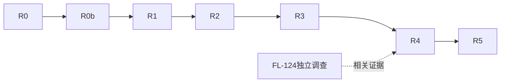

# 每日清台自适应方案 v3：从设计目的决定尺寸

> 2026-10-07状态：后续需求与排期已由[实施方案v4](DAILY-ADAPTIVE-IMPLEMENTATION-PLAN-V4-20261007.md)接管。以下为v3原始记录，旧“真源/待实施”不再调度；既有实现、测试、失败证据保留。

日期：2026-10-06。状态摘要（实时交接见[CURRENT](daily-adaptive/CURRENT.md)）：**R0/R0b完成；R1原生候选/定向验证已交付，方形动作取舍待评审；R2–R5待实施**。

本文件是每日清台后续适配的需求和排期真源，覆盖 v2/v2.1/v2.2 中冲突的未来实施要求。旧实现、失败记录、测试与截图保留，不能重写成 v3 已通过。R0/R0b仅整理资料；R1已修改局部布局并保存独立原生候选，实时结果见CURRENT。

设计依据：[每日清台设计规范](../docs/design/daily-clearance/每日清台设计规范.md) DC01–DC28，覆盖整体设计、取舍与历史替代关系；[截图图册](../output/daily-clearance-design-spec-20261006/index.html)。本方案负责排期与实施，设计语义先读该规范，不能只消费下面五项尺寸例子。

来源：用户本轮五项设计说明及 iPhone 16 Pro 原图；[归档原图](../output/daily-adaptive-semantic-review-20261006/user-reference.png)；[复审报告](ui-reviews/UR-20261006-daily-adaptive-semantic-review.md)。本方案按 `issue-collection-restructure` 与 `plan-batch-execution` 编排。范围仅每日清台及必要共享回归，不接管其他球桌页试点。

## 1. 对现有设计的理解

16 Pro 参考图是在有限横屏高度内建立的平衡：顶栏一排球库，桌面居中并尽量撑大；两侧集中操作，开球/打点对应、方向/杆速双尺对应；主动作与辅助动作有大小层级。当前按钮、间距和尺长共同形成这一结果。

这些数值首先是该容器下的参考解。保护这个解，不等于让所有容器使用同一组固定值。各尺寸必须能解释：为什么需要、受哪个空间限制、空间多了是否增长、增长到哪里停止。

用户明确要求：

1. 球桌在屏幕中尽可能大。
2. 球库保持一排，大小支持手指点选。
3. 两侧按钮在剩余空间内尽可能大，同时保持布局、美观和主次。
4. 16 Pro 的力度/瞄准条已经尽可能长；iPad 使用合理的固定长度，不随屏幕无限拉长。
5. 接近 1:1 的可用空间也应有合理布局。

本方案保留物理尺寸、业务规则、单 renderer、2D/3D 操作语义、已撤销的预加载/准备门控不恢复。标准 16/17 Pro 的参考构图继续保护；不自动把这一保护扩展成全尺寸常量约束。

## 2. 布局决策顺序

1. 取得实际页面可用区域、四边安全区、文字自然尺寸、控件内容和状态；区分 window、page、stage、桌外框、台呢内框。
2. 为核心交互保留可用的触点、读数和间隔，禁止靠叠加触点、隐藏动作或缩字来挤空间。
3. 在满足操作约束的布局候选中，保持真实桌比例并扩大桌面；检查是哪一轴限制大小。不能只把剩余矩形叫作“最大球桌”。
4. 在不损伤桌面和操作路径的剩余空间内，扩大有收益的按钮、球库触点；保留层级与整齐对齐，不把所有东西同比例放大。
5. 双尺长度独立于页面尺寸：保持成对等长、刻度可读和实用行程。16 Pro 保留现有144pt有效行程；iPad首个候选也以144pt为固定参考，实机发现不足时再有依据调整固定值，不能按iPad宽高比例拉长。
6. 同步浮层、相机按钮、命中和投影；最后检查动态切换与真机手感。

“尽可能大”是带操作约束的目标，不是只追求一个面积百分比。每个代表容器保存选中方案与至少一个相关备选的空间账本，解释剩余空白。若另一个可操作方案能增大桌面且不损害其他要求，当前方案不能仅凭测试绿收口。

## 3. 各组件的尺寸语义

|元素|16 Pro参考|其他容器的处理|验收重点|
|---|---|---|---|
|球桌|保护参考构图，真实内框2:1，外框另取资产尺寸|按当前可用区域等比例最大化；先处理占宽/占高布局瓶颈|桌外框和内框都记录，不用stage面积代替桌面积；保留六袋/边框，3D按既有机位意图验|
|球库|现有单行30pt球面、32×44pt AX按钮是参考事实|保持单行；宽裕空间优先改善球与独立触点，合理封顶；短球库不强行铺满|实际球面、触点、间隔、全部球可达、边缘点选分别验证|
|侧边按钮|48pt开球/打点，44pt辅助动作，60pt击球|在真实剩余宽高内有界增长；不得为增长无依据加宽侧栏挤小桌面|开球/打点对齐，主次清楚，触点不相交，触达距离适合使用姿势|
|方向/杆速尺|32pt可见宽，144pt有效行程，左右等长|长度采用固定偏好及容量约束，宽度和标签独立排布；不跟随桌高无限增长|有效行程一致、标签/读数完整；最大最小值、连续调节和手指遮挡|
|侧栏与相机通道|60pt操作列；相机额外通道有既有用途|属于布局预算，不是所有容器强制保留的宽度；须核对3D相机及模式切换稳定性才可回收|不能因2D暂时无相机按钮就直接删除3D必需区域|
|打点大盘|264pt整卡/160pt白盘是宽裕容器上限|保持v2.2：整卡包含于未缩放2D内框；小屏收盘、键44pt；iPad不随桌面放大|2D/3D同锚，设置并列后仍入内框；容量不足有真实呈现分支|
|顶栏高/间距|44pt头部及既有间距|参考偏好；受内容及触点约束，不把字号、球和头高强绑一个scale|不截断、不重叠；尺寸变化不能侵占桌面却没有可用性收益|

球库特别约束：旧27/32pt宽例外只能说明已有密度，不能证明小屏或iPad手指舒适。保持参考外观与改善触点分别处理，禁止给相邻按钮重叠的44pt热区。小屏先回收装饰留白、协调标题/模式组；仍容不下可用的一整排时，保留现有单行滚动能力作为降级候选，必须交付实际点选/拖动证据，不能把所有球缩得更小来获得“全显示”。“单行”不等于已获准常态隐藏部分球；是否需要滚动应由实际容量决定并清楚展示。

## 4. 按空间形态处理

|形态|首选布局与比较项|不能做的事|
|---|---|---|
|参考横屏手机|继续顶部球库＋左右操作，优先保护16/17 Pro|为了统一参数改变已认可效果|
|更短/更窄手机|回收无用间距、辅助动作重排；核对侧栏和相机预算后比较桌面收益|把桌外上下空白误判为可以直接纵向拉长球桌|
|Max/宽屏平板|桌面优先吃新增可用空间；按钮/球库在剩余空间内增长并封顶；双尺保持实用定长|所有控件永远固定原尺寸，或全部随屏幕放大|
|近方形/较窄平板窗口|比较现有左右栏与利用桌上下空余区放置操作组的候选；顶栏球库仍单行|把布局重排推到“可选Expanded”，只把手机样式放在中央|
|极小窗口|先尝试合理重排；确实低于操作容量才给可返回、可恢复的受限呈现|计算fits=false却照旧绘制；隐藏关键操作或无限等待|

近方形候选的具体方向：桌面占主要横向空间，操作组可移入其下方余量，仍保留开球、重打/回放、打点、成对双尺、击球与3D相机入口。双尺不因移动而擅改手势方向。用实际自然高度和触达距离比较后确定布局，不在方案里编造1.3等设备比例断点。此方向是待原生验证提案，不是已认可新界面，也不启动已归档的手机竖屏方案。

[容量草稿](../output/daily-adaptive-semantic-review-20261006/geometry-ledger.json)中800×800pt为受控假设：现有容器扣除侧栏后stage568×756；示例下方预算200pt、顶栏44pt、间隔16pt后stage784×540。默认外框模型下桌宽约561→775pt。它只证明值得比较这种结构，不证明该200pt预算装得下所有控件，更不代表真实iPad窗口测试。

## 5. 已执行工作的处理

|旧批次|本轮结论|保留|重新打开的工作|
|---|---|---|---|
|W0|基准/工具证据保留，语义覆盖补齐|源身份、双Pro原图、真实frame、环境记录|新增桌/操作空间账本与近方形候选；旧图不等于v3通过|
|W1|基础抽取保留，尺寸分类返工|每日局部类型、单renderer与原坐标职责|拆清硬约束、参考偏好、上限、弹性区域；不再统称design constants|
|W2|内容量测修复保留；撤回完整适配完成结论|真实文字量测、单行/滚动路径、iOS17菜单修复|球面/触点的空间使用及小屏点选；取消无条件沿用窄触点例外|
|W3|局部低高度修复保留；重新执行布局设计|自然高度测量、动作重排、上下padding回收|桌面占比、按钮剩余空间增长、近方形结构，新的完成标准|
|W4|保留缺陷修复，仍未完成|面板自然高度、空白命中、避让、R7整卡入内框|消费新的stage/操作布局后再验组合；极小容量分支；R7双Pro未闭合|
|W5/W6/W7|未完成；重排依赖|业务/窗口/投影验证要求|不使用已删除EntryView/Preloader作目标；近方形设计前移，真实系统resize仍必测|
|X / FL-124|保持未关闭|首次异常证据|按实际复现调查，不把重跑成功算修复|

## 6. 修订后的执行批次

|批次/量级|范围与已核实主锚点|依赖|DoD和交付|状态|
|---|---|---|---|---|
|R0 / S|计划、源码、代表原图和既有测试证据复审|用户反馈|逐条处置W0–W4；原图归档、证据边界、源指纹、容量草稿和本方案|完成|
|R0b / S|每日整体设计规范、历史决定与原图分析|R0；用户追加整体提炼要求|28项设计契约、50张历史原图、替代关系与未验清单；明确推断/现行规则/待验证；R1起逐项引用DC编号|完成（文档整理，不是新App验收）|
|R1 / M|DailyLayoutMetrics、FreePlayView.dailyLandscapeBody/LeftControls/RightControls；参考手机、SE、Max与近方形候选|R0/R0b|每种尺寸说明限制轴与空白用途；原生候选保留全部操作；按钮/尺/桌比例及2D/3D同状态对照；参考Pro保护。先交付这一个批次，不启动旧全矩阵|候选已交付；14单测/6定向UI通过，方形动作取舍待评审，见R1卡|
|R2 / M|Header、dailyLandscapeHeader/Palette、相关DailyLayoutMetricsTests|R1|单行、触点独立；球数变化、断点两侧/恢复、首末球真实点按与拖球；宽裕容器不无故保留最小球|待实施|
|R3 / M|SpinPad/Panels、DailySpinTransparencyPanel、FreePlayView浮层；共享BTSpinPad默认回归|R1/R2|整卡入内框、相邻控制/击球可达；标准/最大AX阅读和真实命中；正常/极小容量路径|待实施|
|R4 / M|FreePlayView当前入口、DailyTableOrientation、AngleSceneView现有同步链|R3|真实iPad窗口resize/恢复、手势中断、模式切换及renderer/业务状态；不可用环境列未验|待实施|
|R5 / M|报告、常设保护集、真机记录|R1–R4|最终源上的受影响组合、逐项视觉及功能结论；FL-124状态；体验与安装/提交/发布分开|待实施|

R1实施前按规范§8列出受影响DC编号、保留关系与比较候选，再保存新source/build/before身份，核对工作区其他任务变更。涉及结构的候选先交付可比较原生结果；既有明确方向持续落实，不逐步索要许可。不要为了恢复旧队列跳过新判据。

## 7. 验收口径

每个代表容器同时记录：window/page/stage、桌外框/内框、限制轴、可回收空白、球面/点击槽、按钮和双尺有效区、控件遮挡、内容/业务状态、源/构建/OS/scale。桌面面积比例是诊断值，不设置跨宽高比统一百分比门槛。

- 原图目视回答：桌是否足够大、空白有没有用途、按钮是否过小/过大、两尺是否实用而成对、球库是否易选、整体是否延续参考。
- 几何/交互回答：无扭曲/裁切/触点相交，动作可达且路由正确；滚动与拖球、面板与底层输入分别检查。
- 受控任意容器验证断点，真实iPad窗口验证系统事件与投影；两种证据不可替代。
- 保留旧测试的业务不变量，只替换被用户修订的旧尺寸断言，逐条说明变更原因。双Pro基准、共享消费者、iOS17仅按影响重验；不以大量重复测试代替设计判断。
- 原始图不覆盖，候选不是golden；模拟器可点不等于手指舒适，真机触感未检查就如实保留。

## 8. 版本与状态边界

v2/v2.1/v2.2：历史布局/生命周期勘误与面板修复；原证据保留。
R0历史检查点：2026-10-06 用户纠正尺寸语义；R0复审完成，W2/W3总体验收重新打开，结构适配前移。该检查点未改App、未新构建、未安装、未提交或发布。

R0b历史检查点（2026-10-06）：用户要求全面提取每日设计原则，不限五项适配例子。R0b完成整体规范与图册；后续批次按规范逐条追踪，当时未启动R1代码或旧矩阵；当前状态见文首。

## 9. 设计规范接入执行与跨会话恢复

本节为v3流程补充，不改变R1–R5产品范围或把待验证方向视为认可。当前进度/在途命令集中到[CURRENT](daily-adaptive/CURRENT.md)，本方案只保留批次汇总。首次执行与恢复按[交接协议](../.agents/skills/table-page-adaptation/references/session-continuity.md)读取最小相关资料；R1已有[具体批次卡](daily-adaptive/R1.md)，后续批次到开工时按实际代码补卡，不预先复制大量方案。

### 全部契约的批次覆盖

|批次|主验收DC|保留/影响回归|设计完成判断|
|---|---|---|---|
|R1 空间结构|DC01、DC02、DC07、DC08、DC24|DC03–06、DC12、DC18、DC23、DC25、DC27、DC28|真实桌框账本、备选取舍、原生同条件对照、完整操作与参考关系|
|R2 顶栏/球库|DC03、DC04、DC05、DC06|DC01、DC12、DC16、DC17、DC23、DC25；尺增益受影响则DC08、DC26|目标序列/母球/状态正确，单行可达且独立触点真实点选|
|R3 浮层/显示|DC10、DC11、DC13、DC14、DC15、DC19、DC23|DC09、DC12、DC18、DC25、DC28|整卡/辅助层避让、菜单末项、最大字号、空白命中与关闭实际验证|
|R4 生命周期|DC09、DC16、DC17、DC18、DC20、DC21、DC22、DC25|DC02、DC10、DC11、DC14、DC24、DC28|真实窗口/中断/重开/模式/选球/显式击球状态与源身份相符|
|R5 综合与体验|DC12、DC26、DC27、DC28，汇总DC01–DC28|按实际变更补相关跨页共享回归|每条都有有效证据或明确未闭合项；功能、视觉、真机及用户判断分别记|

主验收分配不代表此前可以破坏该条。条款不适用须写理由；仅列DC编号、只有自动测试通过或引用旧图均不足以通过设计验收。每条实际结果留在所属批次卡/报告；本表只作覆盖路由，防止产生第二套互相漂移的结果表。

### 对已执行工作的影响

W0/W1基础与W2–W4局部修复保留；v3重新打开的W2/W3总体结论维持。新规范扩充各批DoD：R1先解释空间与取舍，R2必须证明单行可点，R3按完整组合面板验，R4维护用户意图与状态，R5补体验及未覆盖边界。旧通过只有在源码、状态和检查目的仍匹配时复用，禁止整体推翻已有修复或恢复旧全矩阵。

用户新反馈落盘顺序：现行设计/页面决定 → 受影响批次及证据失效范围 → CURRENT → PROGRESS摘要。用户明确过的方向持续执行；存在实质新取舍时交具体可比较产物再问，不增加固定审批环节。

2026-10-06 R1执行：当前源8张before，按真实外框比较左右与桌下结构，候选迭代及失败证据见[本轮审阅](ui-reviews/UR-20261006-daily-r1-space.md)。方形动作位置为原生待评审取舍，未将候选自动升级为设计标准。
