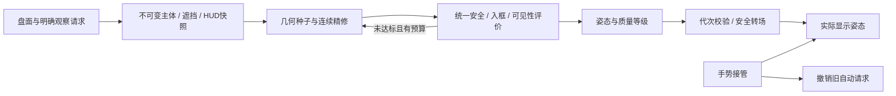

# 每日清台观察相机：通用约束求解方案 v1

2026-10-01。用户要求通用算法及可行方案，不为个例打补丁。本轮由架构/几何、生命周期、QA三个子智能体只读评审，主控核对现有源码并补数学探针。**状态：设计完成，核心几何公式已做数值检查；生产求解器未实施，整套方案尚未经过App/真机验收。**

关联：[覆盖审查](DAILY-CAMERA-COVERAGE-AUDIT-20261001.md)、[现有r4算法](DAILY-CAMERA-FORMATIONS-20261001.md)。新增方案不能据此关闭FL-094 r6。

## 1. 目标、范围与不可承诺事项

标准观察用于辨认本杆母球、目标球、目标袋开口和必要球路，保留适当上下文、自然透视及稳定操作。全局继续35°、双侧长库、最短路固定角速度；第一人称和进袋后回切的业务时机不在本方案中重写。仅每日清台分阶段接入，其他共享宿主保持既有入口。

通用不等于单一固定参数；它意味着每个盘面使用同样的输入、约束、评价和求解步骤。禁止根据球形编号、特定袋号、某球位置范围加入专门修正。角/中袋几何差异是资产输入，不能成为硬编码相机分支。

不能承诺任意盘面都同时满足100%无遮挡、所有路线入框、球很大、眼位接近杆后及有限镜头。这些条件可能冲突，搜索也不是全域最优证明。输出须区分满足要求、质量受限、预算耗尽和输入失败；“搜索未找到”不能自动写成“数学上无解”。

坐标契约：SceneKit世界米制，X–Z水平、Y向上；台呢Y=0.80m，球R=0.028575m。使用加载后的实际变换、台面高度与资产版本。物理孔心、视觉marker、真实开口是三个不同概念；现角袋marker比物理孔心各轴向内12mm，不能互代。口沿随正式USDZ变化重新提取，禁止复制旧文档袋口常量到求解器。

## 2. 输入、输出与职责

输入为不可变值快照 `ObservationRequest`，包含：

- `revision`：盘面/选择/相机意图/viewport/HUD/资产版本；异步结果只向仍匹配的请求提交。
- `subjects`：母球必需；目标球、真实袋开口、必要路线按当前明确选择存在。自由观察/开球没有目标或袋时用同一角色模型，不消费旧目标。
- `balls`：所有当前在桌球的稳定ID、球心、半径及可见状态，全部参与遮挡；不要求全部入框。
- `cuePose`：实际打点、杆向和抬杆，以及显示球杆的姿态包络。真实杆向只作站位偏好，不通过两个几乎重合点重新推导观察方向。
- `staticVisibilityGeometry`：实际可见球桌的库、jaw、皮革、木沿等遮挡网格及真实开口；房间安全域和其他可遮挡实体。几何缓存为纯数值，不引用可变节点树。
- `viewport`：SCNView实际尺寸、safe area及转换后的HUD视觉遮罩。触摸热区或透明容器不自动算视觉遮罩。
- `policy`：允许眼位域、镜头边界、缩放边界、质量目标、搜索预算。这些是有版本的产品参数，不冒充几何定律。

输出 `ObservationSolution`：世界眼位E、朝向Q、VFOV、当前主体/基准、质量指标、约束余量、分支状态、耗时/评估次数及请求版本。

建议结果类型：`adequate`、`limitedVisibility`、`limitedReadability`、`limitedFraming`、`budgetLimited`、`noValidatedPose`、`invalidInput`；附原因，可同时存在多种质量不足。另记录普通观察域/扩展观察域/关系回退域，不把机位族当成成功等级。找到了满足条件的姿态只证明该姿态可用，不证明最优。

相机不调用进球solver作准入。ghost出桌、此杆撞其他球、进不了袋属于击球/线路信息，不等于相机输入非法；这些球形仍可观察。相机输入失败仅指非有限坐标、丢失必需实体、无效视口等。真实动力学测试可另外给盘面打标签。



## 3. 分开处理眼位、构图与镜头

求解变量为眼位三维E、yaw/pitch两个朝向自由度；roll保持world-up，俯视附近用台面轴建立稳定基，避免叉积退化。镜头用 `t=tan(VFOV/2)`，横向角由aspect确定：

`HFOV = 2 atan(aspect × t)`。

给定E与朝向，先求容纳必需实体的最小可行t，不在眼位网格上固定FOV后不断退远。这样主要连续搜索只有五维，无需引入第三方优化库。最小镜头负责可读性；必要上下文通过构图padding/偏好表达，不能贴边塞满就叫宽视野。

E改变实体互相遮挡；朝向与FOV改变入框、HUD交叠及屏幕尺寸。同一眼位下，单纯扩FOV不会解除真实遮挡。

最终姿态以eye/orientation/lens为权威。旧rig的pivot只是表示适配：视线与球心平面的交点在台外并非错误。接近水平时不靠夹pivot改变已求解姿态，应保留直接eye/Q表达。

## 4. 统一评价器

### 4.1 安全与实体入框

所有候选使用同一个 `ObservationEvaluator`；默认、种子、精修终态、恢复和实际输出没有“先返回再补检查”的通道。

安全硬条件：有限姿态、眼位在实际房间安全域、镜头不穿入球桌/杆/障碍实体、主体在近远裁剪范围内、镜头和缩小边界合法。高度偏好与真正碰撞安全分开，不能把“人通常站多高”当碰撞公式。

构图使用实际HUD之后的可用区域。第一版可提取保守可用矩形并评价多个矩形；精评直接判主体投影与视觉遮罩。固定中央65%仅保留为旧基线比较，不作为通用真值。关键实体不能只检中心点。

球体可精确按视锥侧平面的支撑函数检查。相机坐标X右/Y上/Z为正depth，安全矩形NDC范围[l,r]×[b,u]。右侧平面法向为 `n=(1,0,−r×aspect×t)`；球心c、半径R满足：

`n·c + R|n| ≤ 0`。

其余三侧使用对应法向；近面要求 `c.z−R ≥ zNear`。该判据检查整球，不依赖经纬采样是否恰好命中轮廓极值。对包含光轴的矩形，固定眼位/朝向下可对t二分求最小镜头；若光轴不在选定矩形内，先调整朝向或改用一般可行性搜索，不能无条件假设单调。

袋嘴边界和路线用真实有限几何。球面点/孔缘稀疏采样只能作近似，不能当完整包络证明。每个自然镜头上限都考虑aspect耦合：H85°/V55°在874×402下实际V上限约45.708°。r4边界可作首轮实验基线，不宣称已获得自然透视的最终标定。

### 4.2 全盘可见性

对两球各自的无遮挡投影轮廓均匀面积采样，解析求射线首次进入该球表面的距离。再检查所有其他球和静态遮挡体是否更早命中。不能射到球心后把球自身也当遮挡。

`visibleFraction = 未被更近实体挡住的投影样本 / 完整无遮挡轮廓样本`。

另报告屏外裁切和HUD遮挡，分母不能随裁切变小，让只露一点的球得到100%“可见”。记录遮挡主体ID/材质角色；球号材质辨识可由真实截图补验。只统计面积也不充分，需要可见区域宽度、主要轮廓/连通区域尺寸。

袋开口必须从当前可见资产提取真实内部区域，或与资产独立对拍确认内部没有被台呢/皮革覆盖；jaw端点、捕获多边形和名义孔圆不能直接代替。袋开口使用台呢表面处的真实暴露开口区域，评价开口面积、口宽和jaw内侧边界。视线抵达开口平面之前的库、皮革或球才属于开口遮挡；开口之后的袋内壁/网兜不自动算成看不到袋。marker入框不算袋开口可见。

粗评用解析球和经过资产对拍的有限库代理；精评使用真实可见网格的BVH和更密轮廓采样。现物理网格的TaiNi/Leather集合不是完整视觉遮挡体，不能直接冒用。视觉代理必须核对透明/镂空材质、背面剔除与深度写入语义；未知材质不能静默当作完整不透明实体。最终候选若精评不通过必须回到搜索或降级，不能为了预算用粗评冒充成功。

有限样本的面积比例是估计值；在门槛附近加密并报告分辨率变化，不以单个恰好过线的数宣布达标。生产无需每帧做GPU深度读回；测试使用独立对象ID图/真实hitTest验证数值评价器。

### 4.3 清晰度、自然感与宽视野

报告母球/目标球的投影直径、可见连续区域大小、袋开口投影口宽、线路可读性、上下文留白和边缘位置。先提高最差主体质量，不能用很清楚的母球平均掉几乎看不见的目标球。

质量目标可写为：`A(q)=min_i min(1,V_i/Vmin_i,S_i/Smin_i)`，袋口补口宽与开口面积条件。V是可见比例、S是屏幕尺寸；目标值由真实画面辨识任务校准，参数具有统一单位和版本。达标后再降低偏离自然站位、过宽镜头和移动代价；不要求为了面积从95%到96%就搬到奇怪位置。

不在本设计中宣称12pt、80%或某个俯角是通用真值。首批实现先报告完整指标，与真实截图对照选择一套统一质量档位，再冻结参数进入保留集验收。现7.34pt下限是已测风险证据，不是接受标准。

## 5. 有界多种子连续求解

采用确定性、多种子、连续精修；每个种子都由角色/几何生成：

1. 基于真实杆向的自然杆后站位。
2. 围绕本杆主体包络的左右、近远和不同高度种子。
3. 必要时均匀覆盖允许观察域；不要只在旧机位±40cm里寻找“通用解”。

搜索域分层：普通站立观察域→允许的较高/侧向观察域→安全的关系阅读回退域。每层使用同一评价器、同一质量目标；扩大的是明确有界的允许眼位，禁止无限扩镜头。扩展域只是候选域，不自动意味着更好或达标。

粗种子先剔除安全/明显镜头不可能项，对剩余求最佳朝向及最小可行镜头。保留若干不同空间簇的好候选，避免全落在同一局部极值。采用有界pattern search：试眼位/yaw/pitch正负方向，只有实际质量改善才接受，逐级缩小步长。10cm可作种子间隔，最终精度由投影误差与视觉稳定预算决定；不得直接返回10cm网格点。

排序顺序：安全可行→必需主体构图可行→质量不足程度→自然感/上下文→移动与稳定代价。安全不能被一个加权总分抵消。视口、镜头、球径和移动项先无量纲化，不能直接相加米、度、像素和比例。

遮挡样本计数不光滑，适合粗排序/精评；精修使用投影余量、障碍角度余量和连续软惩罚作引导，接受时仍检查真实指标。软惩罚只帮助搜索，不代替硬边界。预算按固定评估次数，壁钟只做取消/过期保护；同一输入/版本/预算应确定性复现。

```text
solve(request):
  validate roles, viewport, asset version
  for domain in approvedDomains:
    seeds = geometricSeeds(request, domain)
    candidates = coarseEvaluateAndKeepDiverse(seeds)
    refined = boundedContinuousRefinement(candidates)
    verified = exactSafetyAndDenseVisibility(refined, request)
    adequateCandidates = filterFrozenQualityContract(verified)
    if adequateCandidates not empty:
      return adequate(bestNaturalAndStable(adequateCandidates))
    retain best current-request safe result and diagnostic reasons
  return best validated limited result if available
  otherwise return noValidatedPose or budgetLimited with no pose
```

不得将最后一行写成“保留上一个球形镜头就是成功”。有安全但未达标的当前请求姿态，应明确给出limited结果。有效输入但没有任何已验证安全输出时返回noValidatedPose（可行性未知），不提交新姿态或半写reference/context；预算确已耗尽才标budgetLimited。只有已充分验证的可行性证书才能区分“已知有可行解却没找到”；有限搜索失败本身不是无解证明。

## 6. 连续性与转场

连续精修消除人为网格台阶，但非凸、可能不连通的可行域不保证唯一全局连续解。不能通过无限增大jump容差掩盖问题。

- 显式观察重进：从最新输入独立求标准解，不消费旧手动倍率/俯角，也不拿历史手动眼位作自然站位基准。
- 同一自动请求族的连续更新：上一有效自动解可作临时种子/分支稳定参考；只有新候选改善超过几何采样误差与稳定预算才切换。当前分支不可行则不能用滞后继续留在非法姿态。
- 对完全对称输入，多个镜像机位可能同样好；质量应对称，确定性的选侧规则允许打破姿态对称。对称断言不能强迫非唯一解只有一个位置。
- 真正跨可行分支时，检查实际动画连续和安全，并记录分支切换，不要求不可能的终态Lipschitz保证。

转场在eye空间和视线方向上执行，每帧重建world-up基；不能直接对两端朝向作普通四元数SLERP后假定roll仍为0。反向视线与俯视附近由确定性台面基处理退化。lens在tan-half空间连续；限制实际角速度和线速度，时长随路程变化。全局继续已有60°/秒最短路。观察的舒适速度需设备验证，不能对所有转角固定0.95秒。

凸房间域内眼位直线插值留在域内，但仍可能穿桌/杆；碰撞轨迹检查采用扫掠体/BVH保守区间界。若直接路径不安全，在同一安全域中求中间点并验证每段；必要时保留安全姿态并重新规划。有限中间帧采样仅是测试证据，不是全路径证明。过程中可以降低构图质量要求，眼位安全不能降低。

## 7. 手势、重进、缩放和恢复

观察所有权只有 `automatic/manual`，运动另分 `stable/transition`。细看是用户明确操作的意图，FOV不决定所有权或自动恢复约束。手动缩回标准FOV仍保留用户构图；再次点击观察才重新标准化。上下滑动固定眼位、只改注视方向，横向沿既有交互约定操作。

统一事件入口：观察请求、手势开始/增量/结束、视口变化、2D挂起/恢复、取消、上下文发布。`deltaX=0`、`deltaY=0`、`pinch=1`必须不改变姿态；不能靠下一次零轴调用补做夹角。

手势接管从实际显示姿态建立current=target，撤销旧自动请求/转场，不从尚未到达的目标接管。自动结果完成后同时核对request revision和相机所有权。选球/选袋的明确转镜意图与后台推荐/数据发布分开；下一杆推荐不能夺回手动控制。

显式进入观察原子更新标准姿态、activeContext和reference。当前目标已进袋/选择失效时，重建当前有效主体角色，不保留已离台目标当必需球。第一人称到观察保持当前播放时机：指定目标等本杆目标实际capture，自由瞄准等第一颗非母球capture，无相应capture则杆末；开球保留专用规则，不退回触球立即站起。重开依既有新球架全局规则，不新增相机特例。

缩放统一为一个 `ProjectionScaleBoundary`：同viewport下两种视角共用全局35°最远档的桌子最小占屏尺度；保留当前8%全局放宽、观察标准距离×1.15的较严护栏及房间安全界。尺度沿用 `max(投影桌宽/视口宽, 投影桌高/视口高)`，不偷换为易受俯角压缩的面积。参数仍是现阶段产品策略。

镜头与退远沿一条可逆曲线控制，在统一可行域边界截取手势增量，不换模式、不改另一轴、不瞬间居中。台面跨near plane时，不能将不可投影点直接当零尺寸，也不能直接复用“所有点在前方”的二分；应保留连续的几何距离安全护栏，并在获得有限投影后使用共同尺度。非单调段求连通合法前缀，不能假定整条曲线单调。

区分不可变的EntryReference与ControlReference：前者由本次显式请求的标准解确定15%硬护栏，后者绑定接管时实际姿态，只用于控制曲线，不可再次乘1.15扩硬上限。转场开始即绑定该entry的护栏；若接管起点已在其外，不跳镜，只接受朝合法域改善的缩放，不能继续退远。完整转场结束提交标准控制基准；反复取消、接管不得累计放宽。若起点因resize/手动朝向已违反占屏边界，零输入保持，禁止继续恶化缩小；只允许改善或明确复位，不能任意横拖突然夹俯角。安全问题另由实际输出守卫处理。

automatic在viewport/HUD改变时重新求解。manual保持世界眼位、朝向和VFOV，仅更新aspect与边界，不为了全线路入框自动移头。任意aspect变化时不可能同时固定眼位、朝向、镜头角且保证全部主体入框；标准取景保证属于automatic。2D同尺寸恢复实际快照；automatic在输入变化后重算，manual保留控制权；2D进入时冻结当前实际姿态并取消未完成转场，不恢复旧转场剩余进度。返回后manual保持冻结姿态；automatic若原转场未完成或输入已变化，以新代次求解并从冻结姿态开始新转场。旧异步回调没有提交权限。

## 8. 无解与可用回退

先松弛自然站位等软偏好，再在允许眼位域内侧移/升高；不能松弛房间安全或用户共同缩小边界。若达不到全部观察质量，返回当前盘面的安全limited机位，并说明具体是遮挡、尺寸、入框或预算受限。

关系阅读回退可采用较高侧向/俯视观察，使用相同实体评价和镜头边界；它仍可能只有limitedReadability，不能套“俯视必然好用”的假设。全局35°只有经过当前请求检查才可作为已验证回退；不强行切换按钮模式，不增加内部诊断toast。必要的产品反馈或是否增加独立辅助视图，另凭实际无法兼顾的证据决定，本方案不先引入新UI。

## 9. 工程落地顺序

| 阶段 | 最小交付 | 验收条件 |
|---|---|---|
| S1 状态与快照 | Daily明确事件/所有权/reference/version；旧几何暂保留 | 零输入不变、重进无记忆、过期回调不写、手动不被推荐抢占、同/异尺寸恢复语义明确 |
| S2 评价器 | 全盘快照、真实HUD、精确球体投影、球/静态网格遮挡、真实开口 | 与独立SceneKit投影及可见像素oracle对拍，不能只与自身评分比较 |
| S3 通用求解 | 有界多种子、连续精修、分层质量与失败返回 | 独立oracle证明相同request/资产/HUD/policy存在adequate姿态时，在验收预算下须输出adequate；limited或budgetLimited计为未达标；候选所有分支命中；最差质量与连续性报告 |
| S4 过渡与接入 | 安全轨迹、实际姿态接管、统一缩放和恢复，Daily配置接入 | 原生手势/跨杆/resize/中途取消，真实HUD截图与其他宿主回归 |
| S5 冻结验收 | 冻结策略参数后跑独立保留集与真机 | 无隐性降级、清晰度视觉接受、耗时/帧预算与手感有设备证据 |

实现建议仍放Core/Scene：请求/结果值类型、纯评价器/求解器、CameraRig控制与过渡分别负责；VM提供业务事实，View提供实际HUD占用，不复制业务状态到相机。新增文件只在实施时落地，不引入SPM，不整包重写三个视角。

静态网格按实际资产/变换缓存；当前全盘最多16球，解析射线—球检查数量有界。只在明确entry、automatic上下文或视口/HUD变化求完整解；手动帧只做轻量边界/插值。SceneKit快照提取在场景拥有队列执行，纯值搜索可后台取消运行；不在后台访问活节点。

首轮性能目标建议：正常目标设备一次标准entry后台求解p95≤50ms，主线程提交不占超过约2ms预算，持续帧不做全量搜索；记录冷几何准备、粗评、精评和提交各自耗时。**这些是待测预算，不是已达性能结论。**固定计算预算用来保证确定性与可诊断；耗尽时返回budgetLimited，不能标为无解。

## 10. 新增测试设计

独立oracle分层：精确数学不变量→实际SCNView投影→真实SceneKit hitTest/对象ID可见像素→真实SwiftUI HUD→原生操作/设备性能。每层只声明自己证明的内容。

布局按全盘球数2～16、六袋、实际球面间隙、库/jaw净距、真实杆姿、切角/球距、观察遮挡与击球通道分层生成；输入不先经solver筛掉难球。每层报告成功/limited/预算耗尽、各分支、最差值与分位数，不能只报总例数。

重点新增断言：

1. 新增不占理想击球通道但占观察视线的球，会影响visibility指标；远离所有主体视线的球不应触发大幅站位变化。
2. 实体中心入框而轮廓/袋开口出框时必须拒绝adequate；裁切不能提高可见比例分数。
3. 固定眼位改变FOV不改变未裁切的真实遮挡；眼位变化后遮挡按新射线重算。
4. 同一完整request从不同历史zoom/俯角显式entry得到同一标准结果；手动gesture的零轴和单位pinch严格no-op。
5. 每个临界分支作连续微扰；稳定分支不出现网格台阶，真实分支切换的动画安全连续并可解释。
6. 布局、袋号、杆姿、障碍和HUD一起镜像后质量等价；非唯一对称机位不强制逐坐标唯一。
7. 构造normal、扩展域、limited、预算耗尽、输入失败；确认实际执行，失败不半写reference/context。
8. 数据发布、明确转镜、手势接管、目标进袋、杆末、取消、重开、重打和2D恢复按事件序列交叉；旧代次没有提交权限。
9. resize分别检automatic重算和manual保持，实际safe area/侧栏/打点盘变化另验，不能以不同尺寸各自新建代替。
10. 过渡有安全终点但中途穿杆/桌的构造例必须被轨迹校验捕获；near-plane和俯视基退化不产生NaN。

将历史反例最小化放回归集；分层生成集用于发现/调参，另外冻结未用于调参的保留集。若依保留集调整算法，该集合不再算独立验收。可行性反例要附独立验证的已知可用眼位，不能拿更密网格“找到的最好值”冒充全域最优。证书必须绑定相同request、资产、HUD与policy并经独立oracle确认adequate；只返回limited不能通过该验收。

真实模型图不能替代App含HUD截图；单元rig调用不能替代手指触控。对质量参数先完成实际截图辨识任务，再冻结统一档位；用例数量、模拟器通过和真机主观接受分别记录。

## 11. 本轮已有验证及边界

主控执行[数学探针](/Users/song/projects/13.billiard_trainer/build/daily-camera-general-design-20261001/verify_projection_math.py)：1000组随机球体/矩形/aspect，84000个极值与采样点检查，支撑函数最大残差约1.78e−15m；933组镜头可行输入检最小镜头、扩镜头保持可行和镜像一致，1000组轴向射线检首次球面命中/前后遮挡顺序，另5000组检离轴、擦边两侧及未命中。933组最小镜头另验证略缩小即不可行，而非只检返回值可行。[结果](/Users/song/projects/13.billiard_trainer/build/daily-camera-general-design-20261001/projection-math-results.json)。只证明解析球与矩形的公式，不含真实HUD、USDZ或完整搜索。

几何子智能体补[球群探针](/Users/song/projects/13.billiard_trainer/build/daily-camera-general-design-20261001/geometry-feasibility-probe.py)：中心目标加六个相切邻球，384投影面积样本、504眼位，标准眼位估计可见51.30%，采样最佳92.71%。不含库/墙/杆、并非全域最优，也不是击球可行证明；它说明全盘可见性指标对眼位选择有实际意义。

球群探针的目标投影可见性示意如下：左为标准眼位，右为采样最佳眼位；绿色是可见目标表面，红色是被邻球遮挡的区域。这是解析射线遮罩图，不是App截图或真实球桌渲染，比例以384样本结果为准。


相切球群也说明“所有球完整轮廓同时毫无重叠”不是可承诺的标准：中心球与三个120°邻球的三对相切投影要同时不重叠，需要眼位满足三个公共切平面，三方向和为0却要求0=3R。此论证针对全部四球轮廓，不等于某一个目标球必然无法完整看见，不能据此豁免目标辨识验收。

本轮未替换生产CameraRig、未构建/安装新App；FL-094 r6的四类生产问题仍开放。下一步按S1～S5推进，不能用本次数学检查宣布完整通用算法已在产品中验证。
