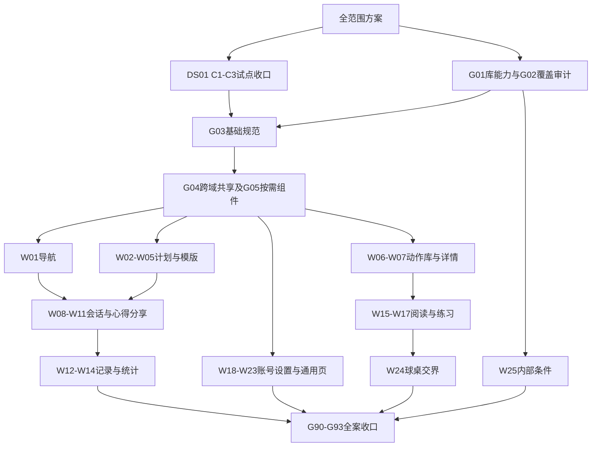

# 问题集合｜全 App Figma 设计系统建设方案 v2.0

> **本文件是本轮需求真源。** 日期：2026-10-11（Asia/Shanghai）。状态：详细方案已编制；DS01仍HOLD，推广尚未开始。方法：`issue-collection-restructure`＋`app-design-system-rebuild` v0.1.0，单主控串行执行，不调度子智能体。
> 唯一状态/恢复入口：[CURRENT](CURRENT.md)。本文件取代[v1.6活动排期](PLAN-history-before-v2-20261011.md)，旧证据、用户决定与成果保留。当前先完成DS01，再按依赖推广；本次“写方案”不表示新设计获准或App代码实施获准。
> 配套：[Figma组织规范](FIGMA-ORGANIZATION.md)、[全范围映射](WHOLE-APP-COVERAGE-v2.md)、[源码锚点](SOURCE-ANCHORS-v2.md)、[执行协议](EXECUTION.md)。球桌专项继续保持原维护权，纳入全App总目录与覆盖检查。

## 1. 用户需求与本轮交付

| 编号 | 用户已明确的要求 | 本方案落实 |
|---|---|---|
| U01 | Figma作为长期维护的完整设计系统 | 变量/样式→组件→布局模板→页面实例→代码对应；新增页面沿用体系 |
| U02 | 覆盖整个App，沿用试点闭环 | 38个原页面族、117条原覆盖项逐条有归属；球相关专项有独立映射，不遗漏 |
| U03 | 先完成既定五尺寸，再推广设备型号 | 固定五窗口×浅深色；额外型号/窗口化扩展后置，适用方向单列 |
| U04 | 重复内容不逐个重新制作 | 相同模板仅选真实代表内容；结构、交互差异保留，不删真实状态 |
| U05 | 复建后要核对；修Figma与修代码区分 | 同态原生比对、差异分类、Figma修复与代码实施分轨 |
| U06 | 先试点闭环；已有成果不白做 | DS01先关闭；E图册/原图/源包经新鲜度检查后复用，保留历史 |
| U07 | 不用子智能体并行，资源跟不上 | 单人串行制作、复核；Figma/模拟器单写，明确断点和资源释放 |
| U08 | 技能支持实践更新 | 项目先记录事实，通用经验经验证后更新技能版本，不降验收线 |
| U09 | 用issue-collection写详细全App方案 | 真实代码锚点、需求映射、依赖、可执行小批、DoD及版本记录 |
| U10 | Figma文件组织也要考虑 | 总索引、共享库、业务域文件、唯一主归属、状态/尺寸命名与迁移回退 |
| U11 | 现有App中不合理的也要记录 | 每族必查现状问题，记录证据/影响/优先级/建议/状态；见[App问题台账](APP-ISSUES.md)，不混成Figma误差或直接改码 |

本文的任务顺序、组件分层和拟议文件命名是执行方案，不冒称用户已逐项批准视觉稿。正常复建和等价结构整理沿用已有授权；涉及新的视觉/业务取舍，先做具体候选与对比，再提交那一项决定。无需为每个普通页面重复确认。

最终交付应让维护者能：从总目录找到任一生产页面；找到页面的模板/状态、五窗口结果及原生证据；修改一个共用组件并追踪消费者；理解真实浅深色规则；从代码符号找到设计；知道哪些仍未验、哪些是现存App缺陷。

## 2. 现状与采用依据

本次为源码与既有报告核查，未重新读取Figma现场、未运行App。下列数量是CURRENT所载历史库存，不能当作全App设计系统完成率：174个已有限验收Figma状态、568张原生参照、38页面族/117覆盖条目；DS01 r7/r8结构与编辑恢复已有证据，但整体同态还原仍HOLD。

本轮实际读源码得到的关键约束：

- 五Tab为训练、动作库、练习、记录、我的；以`AppTab.title`与当前路由为准。旧规格出现“角度/历史”不用于重命名现状。
- `BTTemplateCard`实际定义在`Core/Components/BTDrillCard.swift`，P02/P03共用；其自定义Layout以右侧文字决定卡高，封面宽度另算。不能用一般等高HStack模型假定还原已正确。
- `BTContentGridCard`是训练/动作/练习共用外壳，但封面比例和内容因域而异；`BTDrillCard`横排与网格卡不可强行合并成一个外观。
- `DrillPickerSheet`定义在`ActiveTrainingView.swift`且被模版编辑复用；`TrainingShareView`被记录详情复用；历史与统计在同一宿主保活。按调用关系拆批，不按目录拆重复实现。
- `DrillTutorialView`区分单/多球形并打开媒体查看器；P18有12篇理论、6张教学页及一个生产入口待定位的目录。不同交互图不能只因阅读背景相同便去重。
- `OnboardingView`当前生产body强制dark；`SubscriptionView`当前body未见同样强制，Root测试入口另有主题规则。旧UI规范摘要存在漂移；按真实启动链/源码＋原生核对，不照抄旧Light/Dark结论。
- 登录、StoreKit、通知、照片选择、法律外链含系统/外部界面；系统UI不算自建组件。`P38`为内部/条件入口，不能当普通生产全设备页面。

源码核实日期、符号、行号及指纹见[锚点索引](SOURCE-ANCHORS-v2.md)。这不是完整代码审计或最新安装包核验。执行每个族前重新检查该族依赖闭包，存在漂移才补采/重验受影响项。

## 3. 范围：全App可追溯，制作责任不重叠

### 3.1 普通与混合页面

P01–P35覆盖导航、训练、内容、阅读、记录、账号、订阅、设置、分享、表单、提示等。混合页外围UI可组件化；球桌、图解、照片、3D预览保留独立真实资产或专项组件引用，不把整页烘焙成图片。

全局设置、每日局内设置、训练提醒是三个不同对象。图表中的普通文字/线条/数据形状应可编辑；真实教学图像可以是图片，计算/拖动类交互必须有专项来源与状态，不伪装成已在Figma实现原生能力。

### 3.2 每日清台与其他球桌页

P36引用[每日CURRENT](../daily-adaptive/CURRENT.md)；P37逐项展开[球桌清单](../table-page-adaptation/PAGE-INVENTORY.md)。采用命名空间`APP/P36`、`APP/P37`、`TABLE/P01…`、`DAILY/Cxx`，避免同名P-ID误指。

本包负责目录连通、来源/版本/组件关系、主题/尺寸/方向结果与交界核查；不重新设计物理、相机、击球控件，也不覆盖用户已调整的每日稿。已有专项设计系统若缺五尺寸或组件化，登记真实缺口和具体专项任务；只有引用链接不算可编辑覆盖完成。

手机球桌横屏按专项已确认方向，不能为了凑普通竖屏375×667等画板创造未支持方向；对应横屏尺寸及适用依据在专项矩阵登记。iPad横竖按专项合同。普通页面的五尺寸设计验证也不等于App已支持相应原生窗口。

### 3.3 条件/内部/外部

P38只整理真实内部入口与界面来源，默认不推广为生产组件库；系统授权/购买/照片/通知/评分用真实参照和触发/返回说明。无法稳定出现的系统状态标条件未验，不能用自绘假截图填绿。真实扣款、账号注销、外部发信或发布不属于复建动作。

### 3.4 全局保护

保持训练计量、owner归属、课程编排、订阅权益、保存/恢复、数据模型与教学事实。封面、图标、理论和视频来自已有真源，本轮不换品牌、不重写内容、不重烘焙球桌素材。若将来需要跨14/15/16/18项目更改，先明确其任务与输入，再同步双方Hub；当前仅引用，无新增对外发布。

## 4. 设计系统结构

| 层 | 内容与制作原则 | 首批实际锚点/验证 |
|---|---|---|
| 基础规范 | 保留源码语义的颜色、字型、间距、圆角、效果、图标；浅深mode及别名；不发明新的视觉值 | Colors/Assets、Typography、Spacing/BTRadius；字形与实际中文换行验证 |
| 基础组件 | 按需补按钮、状态徽标、搜索、筛选、分段、输入、列表行、反馈 | BTButtonStyle、BTFilterChip、BTSegmentedTab、BTEmptyState等，核默认/选中/禁用/忙碌实际分支 |
| 业务组件 | 计划卡、模版卡、动作卡、课程行、记分组、统计块、权益/账号区块 | 保留真实状态接口和消费者，避免为每条数据或设备新建主组件 |
| 布局模板 | Tab根页、列表/网格、表单、详情、阅读、模态、会话等候选 | 是拟议模板分类，G02审计后冻结；不能假称全部已有代码组件 |
| 页面实例 | 五尺寸主题代表、真实业务状态、必要长文/键盘边界 | 所有可复用区从主组件/组合模板实例化，页面可留一次性正文/保护资产 |
| 来源与维护 | code symbol→token/component→template→page→evidence | 手工映射可先交付，Code Connect能力/发布另验，不能以映射表冒称已连接 |

通用库只收跨族共用能力；单域组件在业务文件本地维护。一个页面无必要做成包揽所有状态的巨型Component：先建立有清晰接口的组合模板，页面层只承载本页数据和必要的宿主差异。主题用变量mode，不复制两套主组件；设备宽度由布局规则表达，真实结构差异才设变体。

SF Pro与中文字体按实际字体run与排版证据对应；当前远程字体故障不等于永久不可用。任何替代导致换行/截断变化均不能当作像素误差放行。固定图标几何等不必为了绑定率强绑所有数字；明确例外。

## 5. Figma文件组织与迁移

详细规则以[FIGMA-ORGANIZATION](FIGMA-ORGANIZATION.md)为唯一真源；本节概述。

- 沿用00总入口、10训练、20动作库与阅读、30练习、40记录与统计、50我的与账号、60设置与外观、70引导与通用界面八份现有文件，保持已知链接。
- 规划独立`01 基础规范与共用组件`库；只有实际能力与跨文件实例验证成立后创建/启用并登记真实file key，不提前填URL。
- 总入口负责导航与覆盖，库负责共享变量和组件，业务文件负责本域组件/模板/实例；每日与球桌保留现有专项文件，通过总入口汇总。
- 各域依次设说明目录、域组件、P-ID业务Page、差异候选、证据、历史；状态以Section区分，五尺寸横向、Light/Dark相邻，不按每个设备建一份文件。
- 现状参考、组件化现状、优化候选、已选目标分区。未选稿不可成为默认交付入口；历史174态不因迁移自动增加。
- 跨文件库引用须验证真实main-component key/变量绑定和更新恢复；普通复制只是本地主组件副本。能力受阻时先保留文件内可维护结构，并列出跨文件同步HOLD，不能称完整共享库。
- 每次迁移一个组件族，保留旧节点→新节点映射，核覆盖、实例关系、样式/媒体/导出，再切目录；不得一口气搬空八文件或按名字批删。

文件重命名只是最后的整理动作；建议目标名`球迹｜设计系统｜NN 域`，原名登记alias。方案交付不表示已经改名或迁移。库发布/团队启用涉及共享影响时先做好可审查变更清单，再依已有明确授权或必要批准执行，不把新建文件当发布。

## 6. 逐页面族执行闭环

1. **冻结输入**：核源码/构建/数据/实际文件版本，确认范围、状态、保护区、设备与工具所有权。复用有效原图；旧图与当前源不一致则保留历史、补采。
2. **建立最小状态清单与App问题记录**：分默认、真实结构变体、容量样例、系统/条件；记录各状态的生产入口或测试来源。没有源码分支不自动补造“失败页”。同时检查现有App的布局、信息层级、交互、反馈、一致性和可访问性；问题按APP-I编号进入[台账](APP-ISSUES.md)，区分实证缺陷/建议/待验证；未检查项明确列出。
3. **先组件再页面**：补必需token/组件；先代表窄宽与内容探针，确认空项占位、文字驱动高、裁切与固定层，再组完整实例。
4. **同态对照**：同窗口/主题/字号/数据/权限/版本，核内容、关键锚点、字体换行、颜色、图标、首尾/区块衔接、固定CTA与安全区；差异归类，修复Figma侧问题。
5. **扩至矩阵**：模板基本状态五尺寸×浅深；条件状态按风险组合补齐。运行不支持的窗口明确标“设计目标/原生未验”。
6. **编辑恢复**：变化的主组件或token真实传播到代表实例并准确复原；未改变部分复用证据，不每次全库重验。
7. **主控复核与交付**：暂离制作视角，按原始需求/原图重新检查；分别给结构、视觉、运行、保存结果。生成目录/对照/manifest，登记未过项与下一动作。
8. **沉淀与接续**：补代码映射/消费者、记录实际耗时与经验、释放本次资源，更新CURRENT；当前族必需DoD通过才记完成。

某采集受阻不停止无依赖的组件修复/规格整理；不得基于未验布局批量迁移消费者。等待用户视觉取舍时可继续现状复建中无依赖部分。失败/未知写入先读回实际节点再决定剩余动作，不重放已消费脚本。

## 7. 尺寸、状态与验收精度

### 7.1 固定五尺寸

| 键 | 窗口pt | 基础验证 |
|---|---|---|
| phone-small | 375×667 | 短高、长标题/密集内容、固定按钮与键盘 |
| phone-standard | 402×874 | 首个同态样本与完整闭环 |
| phone-large | 440×956 | 行列容量、滚动、内容衔接 |
| pad-portrait | 834×1210 | 内容最大宽、列数/模态容器与真实安全区 |
| pad-landscape | 1210×834 | 宽屏重排、较短可视高；原生支持单独验证 |

每模板主状态形成十格核对记录，记录中可以是已验/待修/未验/条件/有依据不适用，不用空白画板冒充完成。强制单一外观页面仍核系统Light/Dark输入下的实际有效外观，可共用同一设计实例引用，不能发明不存在的浅色稿。

浅深/五尺寸在模板层验证，不把动作ID、日期、每条记录再乘十。变体若改变布局算法，补相应尺寸边界；仅数值变化选容量代表。大字号、键盘、权限、长文在高风险页保留专项检查；全型号、多Runtime和全面无障碍/真机性能扩展另排，不因当前五尺寸静态通过就宣称这些已通过。

### 7.2 四类质量与保存状态

| 结论 | 必需证据 | 不能替代它的东西 |
|---|---|---|
| 结构可维护 | Component/Instance关系、属性接口、绑定、布局/裁切、编辑恢复与例外表 | 看起来一样、节点数量多 |
| 同态内容/布局 | 同数据原图＋实际Figma导出，逐图检查文字/媒体/位置/首尾 | 容量样例、理论offset、单纯JSON对齐 |
| 精确系统视觉 | 字体/SF符号/材质的真实渲染比较，按项限定通过范围 | 字体load成功、笼统“接近” |
| 原生行为 | 正确入口、滚动/键盘/选择/返回保持及必要状态操作的实证 | 静态原型连线、Figma动画 |
| 保存与恢复 | 本地.fig完整性、云端独立读回、备份回导分别有结果 | 文件存在、ZIP CRC或本机可见单独作为全通过 |

验收前确定精度；数值容差来自像素比例/平台精度/实际测量，不临时放宽。PNG差分用于定位，不设一个全局误差百分比遮盖关键文字/按钮错误。旧证据复用须源依赖、导出尺寸、theme和内容一致，不能只用文件名或HEAD。

### 7.3 差异处理

- **Figma复建误差**：本批修复并回归受影响组件/实例。
- **原生现存缺陷**：保留“现状如此”的证据，另立产品问题；不得升为推荐设计规范。
- **获准优化**：生成独立目标稿、理由、受影响状态；具体稿确认后才进入实现准备。
- **工具表达限制**：留能力探针/影响/下一验证动作，不能默改字体、缩字或栅格化普通UI。
- **缺失来源**：保留HOLD；既不补造数据，也不删分母。

## 8. 排期与可执行批次

### 8.1 先完成的横切小批

小=单一调查或少量文档；中=一个组件族/一个页面模板及定向核对；实际目标为一次有界会话能验收。负载超出时在写入前再拆范围，保留已完成证据，不把会话长度当质量截止。

| 批次 | 范围与量级 | 依赖 | 完成标准 |
|---|---|---|---|
| G00 | 本v2方案、覆盖映射、组织规范、源码锚点；中 | 本轮用户请求 | 原117项无漏重、38族有owner、锚点存在与指纹、文档链接/体积检查；不算页面完成 |
| DS01-C1 | 无徽标卡候选、空status/封面/文字驱动高；中 | r8实证 | None/Scheduled/Practice/Both与3/4/5行代表探针、五宽浅深约定检查；与实际字体/素材对齐，候选通过才迁正式 |
| DS01-C2 | P02/P03同fixture首屏、衔接与稳定尾屏；中 | C1布局规则明确 | 修复R-02锚点差并补R-03同态；真实一卡/空态与容量稿分列，缺尾屏不能关闭 |
| DS01-C3 | 本族五尺寸页面差异、消费者回归、备份和复核；中 | C1/C2 | 收口卡全部必需项有证据；记录仍未过的精确视觉/原生支持，不能隐含豁免 |
| G01 | 八文件实际组件/变量与库能力审计；小至中 | G00；可在DS01采集受阻时只读准备 | 实际file/key/权限/来源与未知清单；一个跨文件组件+变量传播/恢复能力有证据，发布未授权则只读准备 |
| G02 | 117项与现有图册按模板/分支/专项去重并冻结设计分母；中 | G00 | 每原ID有类型/主归属/模板或待定位项；漏项不能默认复用；不重做B01全部盘点  **2026-10-11初版✅**：[66模板/117项](TEMPLATE-MAPPING-v1.md)，18项映射检查通过；条件/系统/专项另账，不计页面验收 |
| G03 | 共用语义token、字体映射、必要文字/效果样式；中 | DS01-C3、G01/G02 | 本轮依赖token清单、来源、mode/alias、实际中文/数字渲染及布局检查；其他token随消费域增补 |
| G04 | 共享库最小迁移与两域消费者验证；中 | G03与实际能力 | 共享层唯一owner、main key与变量绑定，跨域改动传播/恢复、旧新ID/回退记录；若能力受阻标共享库HOLD |
| G05 | G05-A按钮/反馈；G05-B搜索/筛选/分段，按需两子批；中/子批 | G03；跨文件消费等G04 | 两类真实消费者保持现状差异；各新增机制一次编辑恢复、浅深与紧凑/宽屏探针 |

DS01保持原ID，以上C1/C2/C3是其收口子批，不再次计算试点成果。G01/G02准备可提前，但任何业务推广以试点质量闭环为前置。G04若受跨文件能力阻碍，可继续文件内候选准备，不把跨域共享问题永久延期后称全案完成。

### 8.2 业务工作包（不是一次执行整个域）

下表是全范围工作包。**每个工作包必须按§8.3生成有界子批才能执行**；同文件并不要求一次处理全部逻辑。所有包共同依赖试点关闭、所用基础规范通过；表中列额外依赖。

| 包 | P-ID/范围 | 模板/主要真实分支 | 额外依赖、复用与专属DoD |
|---|---|---|---|
| W01 | P01 全局壳 | 五Tab选中、导航、训练胶囊/最小化/恢复、全屏训练；锁屏/灵动岛另列 | G04；与W08联验宿主、系统拥有/自绘内容区分 |
| W02 | P02/P03 训练首页/货架剩余 | 今日无安排/待练/进行中/完成，内容选择排序、官方/自建、菜单确认反馈 | DS01不重做；G05；以源码分支补真实缺口，长页衔接/固定CTA与返回位置 |
| W03 | P04 计划详情 | 四主操作、四课程状态、展开、编排今天/激活切换 | W02；明确UI四态和课程组合，代表课程内容复用，不穷举全部课程 |
| W04 | P06 共享动作选择 | 搜索、多选/取消、已选集合、空结果 | G05；唯一主组件由10维护，模版与会话两宿主引用；原生选择语义不改 |
| W05 | P05 模版创建编辑 | 空/有动作、名称、排序、项目剂量设置、保存失败、键盘 | W04；与DS01实际数据/封面对应；不可仅核保存后卡片 |
| W06 | P14/P27 动作库/收藏 | 搜索筛选网格、横排行卡、无内容/无命中/收藏空、Free/Pro/已练 | G05；20拥有内容组件，50收藏引用；网格和行卡接口/布局分别验 |
| W07 | P15 动作详情 | 单/多球形、收藏/权益、加入今日或模版、球形选择；场景保护 | W05/W06；列表/计划/训练等多入口映射到同页；场景容器改变需专项联合核查 |
| W08 | P07 训练会话与记分 | 总览、单项输入、自定义键盘、休息/时长、退出确认/保存错误 | W01/W04；大包拆总览、记分、休息/结束三模板；记录/剂量/草稿语义不改 |
| W09 | P08 心得正文/总结 | 心得输入/跳过/忙碌、总结有无心得；历史编辑宿主引用 | W08；同正文两宿主唯一组件，保存幂等与结果区分；不把壳重复计页 |
| W10 | P09 分享 | 主题、字体、统计展示、相册保存失败、系统权限 | W09；分享卡主题与App主题分开；真实保存/系统权限有证据才通过 |
| W11 | P10/P11 心得与补记 | 搜索/无命中、日阅读编辑、补记/编辑补记、老日期提示/失败/键盘 | W09；按心得列表、阅读、补记拆模板；记录详情复用同一补记表单 |
| W12 | P19 记录日历 | 空/非空、月/日选择、免费范围、加载错误重试 | W01；复用已有五窗空态，不以空态覆盖真实记录；固定日期fixture |
| W13 | P21/P22/P23 记录详情编辑 | 普通/补记、心得宿主、数据编辑/非法值、删除反馈、认知明细 | W09–W12相关输入；每种详情/编辑单独子批；分享/补记/心得不复制 |
| W14 | P20 统计 | 空/非空、周期、免费遮罩/Pro、错误重试、图表 | W12；按冻结数据核坐标/标签/图例，保留统计口径；同宿主保活不假设切Tab重建 |
| W15 | P16 精讲与媒体 | 单/多球形、结构模板、缺图、长阅读、全屏图片/视频 | W07；按结构去重不逐动作制作；媒体与图文外壳分别验，正文不改写 |
| W16 | P18 理论/教学阅读 | 12理论+6教学+目录入口未知；按真实布局/交互分族 | W15阅读规范可复用；逐条归族、不同图解状态保留；与TABLE/P11避免双重维护 |
| W17 | P17 练习首页 | 学/理/练/打/解、搜索、分区、无结果、权益与专项目的地 | W06；共用网格外壳并保留不同封面；全部生产目的地有真实去向 |
| W18 | P24/P28 我的/登录 | 游客/登录、月概览、Apple入口、合并/云同步/错误 | G05；登录系统页单列；准备状态不等于真实认证，不操作用户账号数据 |
| W19 | P25/P26 资料/目标 | 昵称/头像裁剪/球种等、周目标与进度、提醒跳转 | W18；头像系统选择与App裁剪分开；残留alert先核置值路径，不强造可达状态 |
| W20 | P12/P33 设置与提醒 | 设置完整分区、浅深/跟系统、开关、清缓存/注销反馈、时间星期 | W18相关状态；P12主归10、P33主归60；已有设置十格复用有效部分，不能虚构独立声音页 |
| W21 | P34/P35 装备外观 | 球房/球桌/台呢、贴纸、球杆选择与组合预览 | W20；三个SceneKit选择页、两图像选择页分组；预览渲染保护，选中和长列表完整 |
| W22 | P29/P30 订阅与权益 | 产品加载、方案/购买/恢复/失败、登录、权益状态、外部管理 | W18；多入口同一订阅页；系统StoreKit条件/真实购买与设计模拟严格区分 |
| W23 | P13/P31/P32 帮助/介绍/关于 | 折叠帮助/跳转、介绍分页/跳过、关于/法律/评分/反馈 | W02/W18相关入口；介绍强制主题按现源，外链只记入口/返回，不发布消息 |
| W24 | P36/P37 球桌专项汇总 | 每日/自由/走位/求解/角度/瞄准点/测验/提取等来源索引 | G02、W07/W16/W17交界；展开专项清单、真实设计节点/版本/矩阵，缺口有专项任务，引用不冒充重建 |
| W25 | P38 内部/条件 | 手机登录测试、工作室、测试宿主、模拟器Pro入口 | G02；标明条件/生产可达性，与TABLE内部编排交叉引用，不把内部样本写成生产验证 |

同一包可能含多个模板，本表量级为中至大工作包，**不承诺25个会话完成**。顺序优先共用收益与高频训练路径，再内容/记录/账号/设置；独立包可在阻碍时换序，但只有一个活动写入批。

### 8.3 真正执行的小批粒度

每个模板使用`Wxx-Tnn`稳定ID；G02给出初始模板映射后按以下顺序建立任务卡：

| 子批 | 有界范围 | 依赖与DoD |
|---|---|---|
| Wxx-Tnn-A | 1个模板的来源/组件＋402×874浅深主态，最多2个紧密结构差异样本 | 核相关源码/fixture、变量与实例、标准同态首尾、缺陷分类；复杂长阅读/会话按单一结构变体再拆A1/A2 |
| Wxx-Tnn-B | 同模板375×667、440×956浅深，共4格 | A主布局通过；仅扩手机差异与风险状态，已有有效原图/图稿直接复核复用 |
| Wxx-Tnn-C | 同模板834×1210、1210×834浅深，共4格＋该模板收口 | B或等价布局证据；Pad设计/原生分别判，完成适用状态、映射、保存/复核 |
| Wxx-Tnn-Snn | 每批1个弹层/键盘/结构变体或最多2个共用机制的紧密状态 | 默认先标准浅深，涉及布局再补边界；沿用A/B/C证据不重复全页生成 |

组件已稳定、十格已有有效证据的简单模板可合并A/B/C成一批，但必须先记录复用依据与剩余检查，不删除矩阵。复杂页面不足以一次完成时在写入前按模板/状态拆细，不能在一个长批里不断扩量。每个子批继承§6–7，且必须写具体原ID/状态/窗口/输入/输出/开放项，以及App现状问题检查范围与APP-I关联。发现原生问题不得因本轮不改代码而略过记录。

不预先创建几百个空任务卡。全范围映射先保证不漏，下一批展开到可执行粒度，其余保持有依赖/DoD的工作包。完成一批更新CURRENT后继续下一项，无需逐批询问“是否继续”。

### 8.4 依赖图（箭头表示前置，不表示并行）

W07加入模版依赖W05，W13分享/补记依赖W10/W11等细依赖仍以表为准；最终G90必须检查全部工作包，不能仅按图末端判断前面全部已验。

### 8.5 最终收口小批

| 批次 | 范围 | 完成标准 |
|---|---|---|
| G90 | 全App覆盖/入口/状态漏项；中 | 原117项及新增增量逐项可追溯，38族全部有结论；模板复用、系统条件、专项缺口不混算；无孤立页面/入口 |
| G91 | 共享库与变更演练；中 | 一次颜色mode/组件内容改动能在实际消费者传播并恢复；孤立/重复主组件、断开实例、硬编码例外清单闭合 |
| G92 | 核心跨域路径与原生对照回归；按路径小批 | 训练→结束→记录、动作→加入→模版、资料→设置→提醒/权益等适用路径证据；专项返回/宿主边界纳入；原生运行与真机未验项分别列 |
| G93 | 文件整理、交付与恢复；按实际文件小批 | 总目录到各文件/节点有效，当前/候选/历史清晰；变更文件本地备份、云读、独立回导分别完成或保留未验；维护说明、映射、证据索引齐全 |

全案最终完成不能仅依“都有画板”：所有必需项通过，或者用户明确批准限定范围/延期并记录去向。工作包的独立部分可完成，关键共享/精确视觉/专项缺口仍开放时不称完整设计系统已交付。

## 9. 当前缺口与风险处理

| 问题 | 已知证据/影响 | 所属批与处理 |
|---|---|---|
| DS01 R-01卡片高/空徽标 | r8实测空status仍占19高、封面撑高，违背原生文字驱动高 | C1候选修复；不能推广旧布局 |
| R-02稳定尾屏/内容锚点 | 原生892与Figma902.3333历史差；实际尾屏缺证 | C2定位差异/有效滚动证据；理论offset不充证 |
| R-03同态数据 | 四卡容量稿与真实一卡不一致、UUID影响封面 | C2冻结fixture/资产，分别保留容量与业务实例 |
| 中文字体/阅读换行 | 20域已存在字体/换行HOLD；远程load不等于渲染 | G03及W15/W16真实字run和容器核对；不缩字掩盖 |
| 跨文件维护未知 | 八域本地实例不自动联动；库可用/发布权限未重验 | G01/G04小探针，能力失败有方案与明确HOLD |
| 大载荷/未知写结果 | 历史Figma崩溃且部分已建 | 小批/精确ID/分段回执，先发现remaining，禁整批盲重导 |
| 源码与旧规范漂移 | 产品介绍主题等已发现差别 | 每族启动核依赖；规范差异登记，不静默统一App |
| 普通Pad横向原生支持 | 已有设计目标不证明真实运行支持 | 每格单列，所缺运行支持转代码问题，无授权不修 |
| 系统/账号条件 | 真实授权/购买/通知可能不可复现 | 隔离设计与系统验证；不造假、不动用户真实数据 |
| 双重页面归属 | 训练分享/选择器/阅读/球桌跨域复用 | 唯一主owner与多入口引用；G90查漏重 |

工具限制与App缺陷分别记录；不把超时自动归因App，也不无限重试。新能力/焦点/路径证据成立后再重试，失败版本不覆盖。

### 9.1 App现存问题的处理闭环

问题记录为本轮必需成果，修复实施按授权另轨。台账统一保存复现场景、证据、影响、优先级、建议、确认程度、责任批次及状态。已确认原生缺陷保留现状稿并做标注，不能纳入推荐规范；有价值的优化先给原版/候选/理由和消费者范围，再让用户决定。APP-I001现有空态遮挡已入账，来源确认不等于App修复完成。全案G90核问题是否逐族检查、是否都有去向；不要求未经授权修完全部原生问题才能交付忠实现状的设计系统。

## 10. 持续维护与技能更新

设计系统后续修改按：变更提议/来源→组件或模板候选→影响消费者→定向验证→版本与迁移说明→实际更新/恢复核查。兼容新增属性与破坏性接口变化区分；破坏性变化先保留旧组件版本，消费者迁移并核验后才停用旧版。

组件维护记录至少包含：主文件/节点或key、语义ID、源码路径/符号与hash、属性/状态、消费者、版本、例外、最新验证及下一责任动作。源代码发生变化只重核影响闭包，不重复扫全仓和重采全部截图。

实践反馈先记任务卡：发生了什么→证据→原因确定程度→处理→是否复用价值。通用改进进入技能、小幅升版并做结构/案例/必要实跑校验；节点、UUID、临时故障和本页数值留项目。不能为通过当前批次降低标准、扩大代码权限或写死临时平台限制。

当前技能v0.1.0只通过静态/案例校验，尚需真实页面闭环反馈。本次全App方案不使技能自动升级，也不证明其端到端已运行通过。

## 11. 进度与成本

五维分开：基础规范、共用组件、模板、业务映射覆盖、代码对应。分别写已验/所需/未知；G02未冻结模板分母前不报全App百分比。额外列原生同态、精确视觉与保存恢复的开放项。

实例率分母只包括适合复用的UI单元，独立图片/说明不充数；变量绑定率以约定可绑定属性为分母并列固定几何例外。画板/截图数只是库存。已验旧图若改作新模板实例，需要新结构关系验收，不能直接平移旧“通过”标签。

每小批记录：源码/数据准备、采集、组件制作、页面组装、复核、返工、等待及总耗时。DS01及随后2–3个闭环后按同复杂度估剩余工作，给范围和阻碍，不承诺组件化会立即线性提速。节省来自复用模板/原图/稳定验收，不能靠减少必需核对。

## 12. 授权与后续App实施

当前推进Figma复建与方案整理，不改App生产源码、不提交/发布。原生已有缺陷形成问题单；新目标稿确认后另开对应实施批，才加载SwiftUI/测试技能、明确改动文件与DoD。实现批应包含构建、影响测试、原生同态与跨消费者回归，真机体验另记。无需为了纯方案编制运行iOS构建。

Figma与App长期对应采用每次变更记录来源与消费者，不承诺工具自动双向同步。Code Connect若采用，验证实际支持/映射并另记发布状态；手工对应本身不能冒充已接入。

## 13. 本次方案验证与版本

本次应执行：源码锚点存在/符号与hash核验、117条映射无漏重、38族覆盖、工作包依赖有效且无环、活动文档链接、`verify-doc-size`与本批`git diff --check`。结果见[验证报告](../../output/app-interface-redesign/plan-v2/VALIDATION.md)。未运行Figma迁移、模拟器、代码构建和跨文件库传播测试。

| 版本 | 日期 | 变化 |
|---|---|---|
| v1.0–v1.4 | 2026-10-08至10 | 原通用重设计→先现状图册→多文件→模板去重，历史完整保留 |
| v1.5 | 2026-10-11 | D019长期设计系统目标与DS01试点 |
| v1.6 | 2026-10-11 | D020单主控串行及技能维护 |
| **v2.0** | **2026-10-11** | 按用户要求用issue-collection重组为全App设计系统详细方案，纳入文件组织、全部原ID映射、分层验收、25业务工作包及有界子批、App现存问题台账；旧并行/重设计排期归档，DS01状态不变 |

当前下一执行动作仍为DS01-C1：依据当前主组件和原生布局建立修正候选，按串行收口卡取证。G00方案完成不能替代试点闭环。
