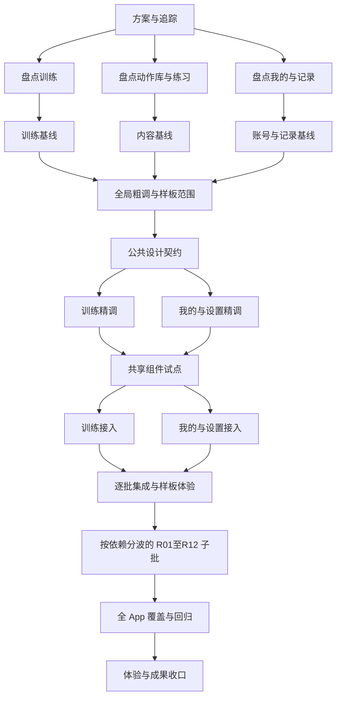

# 问题集合｜全 App 通用界面重设计 v1.3

> **本文件是本轮需求真源。** 日期：2026-10-08（Asia/Shanghai）。当前先执行 E 系列：把 App 现状按尺寸和浅深色整理为按功能域命名、总索引统一导航的完整图层可编辑 Figma 文件组。B03-A 候选保留，重设计选择与实现暂缓。固定恢复入口：[CURRENT.md](CURRENT.md)。
> 使用 `issue-collection-restructure`，并结合串行/并行委派技能组织。排期前置：先盘点生产入口与状态，再确定全局粗调；获准的精调版本作为代码输入。每日清台与其他球桌页继续由各自工作包管理。
> 当前授权：用户 2026-10-08 明确“好的，开始吧”，按本方案启动执行，沿用已确认模型与并行安排。具体视觉方向/精调获准版本依既定评审记录；当前指令不预先代表尚未生成的图稿已通过。

## 1. 需求回显与覆盖

| 编号 | 来源与需求 | 落点 |
|---|---|---|
| R01 | 用户认可每日清台的 Figma 粗调、精调、代码实现流程，希望推广至整个 App | §4 流程；B03–B07 与后续 D/I/V 批 |
| R02 | 排除已有其他工作处理的“和球相关的”部分 | §2 边界；PAGE-INVENTORY 的纳入/混合/外部分类 |
| R03 | 页面与文档多，要用 issue-collection 写可执行方案 | §5 批次、依赖、量级、DoD；§8 源码锚点 |
| R04 | 所有中间生成文档、成果及进度都要记录，能看出现在/成果/下一步 | CURRENT、ARTIFACTS、批次记录及 EXECUTION 的更新协议 |
| R05 | 能独立的内容用子智能体并行执行 | §6 波次；EXECUTION 的所有权、worktree 与资源锁 |
| R06 | 用户明确“页面批用 gpt-6.1-sol，公共组件与验收用 gpt-6-astra” | 每批模型列；DECISIONS D003；后续沿用，无需重问 |
| R07 | 用户认为很多现有内容已很好；先把全部范围页面的现状、浅深色与不同尺寸放进统一可编辑 Figma，并行执行 | §4.1、§5.5 E 系列；B03 及其依赖暂缓 |
| R08 | 用户明确选择完整图层，文字、颜色、控件位置都能改 | §4.1 完整图层验收；整图、控件位图及文字轮廓不计普通 UI 完成 |
| R09 | 不必单一Figma文件；整个App按清晰文件命名与内部内容组织 | [FIGMA-ORGANIZATION](FIGMA-ORGANIZATION.md)；D014，多文件＋总索引，唯一主归属 |

执行建议与用户拍板分开记录。样板页选择、具体视觉方向、混合页精确边界仍是方案建议；不得把上一轮助理建议自动写为用户批准。确认可合并在一次具体图稿评审中，不为常规盘点逐页请求许可。

## 2. 范围与相邻工作包

### 2.1 纳入

- App 导航与页面外壳；训练、动作库、练习入口、记录、我的等生产入口下的普通界面。
- 信息层级、布局、字号、颜色、图标使用、组件状态、搜索/筛选、列表/卡片、表单、阅读、统计、分享、提示和弹窗。
- 账号、订阅、产品介绍、设置及其子页；适用的空、加载、失败、权限、进行中、完成状态。
- iPhone 紧凑/常规尺寸、iPad 横竖与可变窗口、Light/Dark、大字号、键盘与读屏；按页面风险组合覆盖，不机械穷举所有维度的笛卡尔积。

### 2.2 球相关与混合页面

- 球桌/球/物理/轨迹、相机、击球仪表与专用控件、球桌渲染和模型材质归原工作包。本轮只链接：[每日清台](../daily-adaptive/CURRENT.md)、[其他球桌页](../table-page-adaptation/PLAN.md)。
- 动作详情、训练记录、理论阅读：可以设计球桌外的文字、导航、布局与操作；嵌入球桌/图解标为保护区域。改变其可用空间、滚动/手势关系时必须联合回归，不能用“未改渲染代码”免验。
- 球房/球桌/球杆/贴纸等设置：列表、选择反馈、导航作为混合候选；模型、材质和预览渲染本体由球相关工作负责。B01/B03 明确边界后再实施。
- 练习首页的入口和教学阅读外壳纳入；专用训练、求解器、测验内的球桌及相关控制仍引用原工作包。成绩记录展示、限额提示等交界逐项登记，避免两边漏管或重复改。
- 内部批量制作工具、测试专用入口先盘点并单列，不以源码中存在 View 就认定它是普通用户页面。

### 2.3 业务与既有资产约束

训练计量、编排语义、数据归属、保存/撤销/恢复、订阅权益与购买结果保持当前产品契约。若设计需要改变业务流程或数据模型，先写清触发场景、前后行为、受影响规格和必要 ADR，再按用户授权决定；本轮不顺带重写后端或内容。

已有封面、教程正文、图解、图标是设计输入。标题排版和信息组织可以设计；事实文案、教学内容、品牌资产替换分别路由到对应真源，不通过批量 UI 整理暗中改写。

### 2.4 与旧全页预览方案的关系

[问题集合 v58.4](../../问题集合_v58.md) 是 2026-09-07 的独立纯预览方案，文档记载 P0–P4 尚未执行，采用逐页文生图/左右对比、逐页审核后再另排实施。本工作包承接用户本轮的 Figma 流程规划；不自动恢复 v58 队列、不宣称旧任务已完成或取消，也不借旧授权启动本轮代码。B01 将找到的旧页面单元/问题/成果映射到新 P-ID，逐项注明复用、历史参考或仍由旧方案负责，避免两份计划重复生产同一批成果。旧稿须通过新鲜度核验才能用作基线；v58 特定预览阶段的范围不能自动等同本轮范围。

## 3. 文档职责与单一入口

| 文件 | 唯一职责 | 维护者 |
|---|---|---|
| [CURRENT](CURRENT.md) | 人可直接读的当前阶段、成果入口、批次状态、待办与下一动作 | 主控 |
| 本 PLAN | 需求、范围、批次定义、依赖、DoD、模型和变更版本；批次状态只链接 CURRENT | 主控 |
| [PAGE-INVENTORY](PAGE-INVENTORY.md) | 页面/弹层/状态覆盖、真实入口、源码、保护区与当前适用成果 | 主控汇总；域执行者交付增量 |
| [ARTIFACTS](ARTIFACTS.md) | 文档、设计稿、截图、原始测试、失败候选、备份的索引与版本来源 | 主控汇总 manifest |
| [DECISIONS](DECISIONS.md) | 用户决定、建议、待定问题、评审反馈、返工归属与关闭证据 | 主控 |
| [FIGMA-ORGANIZATION](FIGMA-ORGANIZATION.md) | Figma文件注册、唯一页面归属、内部命名、来源与备份规范 | 主控；执行者回传实际链接 |
| [EXECUTION](EXECUTION.md) | 派发、并行所有权、资源锁、验收、回写、恢复和归档协议 | 主控 |
| `batches/<批次>.md` | 该批输入、DoD、执行轨迹、证据、剩余问题与交接 | 批次负责人提交，主控验收 |

`tasks/PROGRESS.md` 与 Project Hub 只保留摘要和 CURRENT 链接，不复制整个批次表。不再另建一份独立进度真源。阶段文档按需生成；未生成的成果写“未生成”，不得提前注册成已交付。

## 4. 设计到实现的固定流程

`生产入口/状态盘点 → 原生现状基线 → 全局粗调 → 代表页精调 → 公共组件试点 → 页面实现 → 原生对照与体验 → 同类推广`

### 4.1 当前前置：统一现状图册

按 D011/D012/D014，当前顺序改为 `现行源码与原生证据核验 → E00 矩阵与图层能力验证 → 分批补采/完整图层重建 → 统一 Figma 对照验收 → 再恢复粗调`。现状图册忠实保存已有界面；发现的问题登记，不借重建修改版式。B03-A 原稿另存，不混入现状完成数。

- 按[文件组织规范](FIGMA-ORGANIZATION.md)分功能域文件，由00总索引统一导航；每个文件内按P-ID、页面状态组织；每个画板标注实际窗口、外观、数据状态、构建/截图来源和核验日期。球相关整页继续链接原专项，混合页面的真实图像/场景作为独立保护图层。
- 基础尺寸矩阵为 375×667、402×874、440×956、834×1210、1210×834 pt，各 Light/Dark。每格须使用对应真实窗口证据，不能把截图拉伸或反色来补齐。五档是校准目标，安全区、page、sheet 和键盘占用另测；实际窄窗与支持的手机横屏另列。
- 普通 UI 保留原生 Text、背景、分隔线、控件、图标与分组；文字内容、填色和控件位置可直接修改。真实照片、封面、教学图解和 3D 预览允许保留独立图片层。整页图片、控件图块和字形轮廓不能代替完整图层。
- 滚动页保留完整内容及真实视口/滚动位置；弹层、键盘、空态和异常态按矩阵单列。系统拥有的界面只引用真实截图及触发/返回记录，不假造可编辑 App UI。固定深色页面记录“Light 输入仍呈 Dark”，不擅造另一套配色。
- 以小批逐格登记原生证据、图层包、Figma 节点、实际导出对照、改字/改色/移动及复原结果；本地保存、云端读回和独立回导分别记录。准备好 JSON 不等于已迁入 Figma。
- 117 是既有覆盖条目数，含条件/系统/外部边界，基础 1170 格是核对表，不能称为 1170 张必须重绘的页面或全部状态总数。共享正文唯一重建，引用关系留在所属宿主。

以下原设计到实现纪律在恢复 B03 后继续有效。

1. 先确定用户任务、主要操作、前后路径，再调整排版；整条训练/查阅/复盘路径要连贯。
2. Figma 保留用户粗调原稿、精调候选、获准实现版本。三个角色可以是文件或页，但必须有独立可追溯入口；不覆盖用户手调成果。
3. 粗调即记录窗口、安全区、滚动区、固定区、弹层和键盘占用；精调补组件状态和适配规则。校准设备不是生产代码分支。
4. 每次评审提供原版/候选/改动理由/待决定事项，优先让用户看少量关键差异；已有批准的规则直接复用。
5. 原生验证同时看外观和实际操作：点击命中、键盘、滚动、返回恢复、状态持久化、无障碍与跨尺寸。静态 Figma、测试通过、真机体验分别记账。
6. B03 只建立样板需要的组件子集；试点证明可复用后再扩充。共享 token 或组件的改动必须核对全部消费者，包括被排除的球桌页面。

## 5. 批次与完成标准

量级指执行和验收负载，不含等待用户评审的时间；以下首段每批目标 ≤1 个有界会话。若实际超过，先拆分并升版本，不能边派发边扩范围。整个 App 的总页数、总工期和完成百分比在 B01 盘点前不承诺。

### 5.1 首段可执行批次

| 批次 | 范围/成果 | 量级 | 依赖 | 类型/执行模型 |
|---|---|---|---|---|
| B00 | 源码预核、方案与追踪体系；本轮立案 | 小 | 用户本轮指令 | 主控；页面调查 sol、独立规划审查 astra |
| B01-T | 训练、计划、编排、训练过程/记录的生产入口与状态完整盘点 | 中 | B00 | 页面；gpt-6.1-sol |
| B01-L | 动作库、练习入口、教学阅读外壳及共享选择器盘点 | 中 | B00 | 页面；gpt-6.1-sol |
| B01-P | 我的/账号/设置/订阅/介绍、记录/统计的入口与状态盘点 | 中 | B00 | 页面；gpt-6.1-sol |
| B02-T/L/P | 对应域原生现状采集；每个后缀是独立批，首轮主入口与高风险状态 | 中/批 | 对应 B01 | 页面采集 sol；复核 astra；设备操作排队 |
| B03-A | 合并页面地图、粗调核心路径与五 Tab 概览；裁定保护区域与样板范围 | 中 | 全部 B01/B02 | 横切串行；gpt-6-astra |
| B03-B | 样板所需公共组件/状态/适配规则与 Figma↔SwiftUI 对应表 | 中 | B03-A 的全局方向 | 横切串行；gpt-6-astra |
| B04-T | 样板建议：训练首页及本文件内今日内容选择弹层精调 | 中 | B03-B，粗调方向确认 | 页面；gpt-6.1-sol |
| B04-P | 样板建议：我的/通用设置外壳精调，不扩到全部子设置 | 中 | B03-B，粗调方向确认 | 页面；gpt-6.1-sol |
| B05-C | 只实施样板需要的公共组件与导航外壳增量，登记跨消费者影响 | 中 | 两样板精调输入已获准 | 横切串行；gpt-6-astra |
| B06-T | 训练样板原生接入与定向功能/视觉自证 | 中 | B05-C、该样板精调获准 | 页面；gpt-6.1-sol |
| B06-P | 我的/设置样板原生接入与定向功能/视觉自证 | 中 | B05-C、该样板精调获准 | 页面；gpt-6.1-sol |
| B07 | 逐批集成、样板跨域路径验证、用户体验反馈与规则修订 | 中 | B06-T/P 自证与合并 | 收口串行；gpt-6-astra |

以上样板是可替换的排期建议，B03-A 按实际问题和用户偏好确定；替换时更新本表与依赖，不把两个完整业务模块塞进一个样板批。

### 5.2 首段 DoD

| 批次 | 可验证完成标准 |
|---|---|
| B00 | 真源声明/需求/依赖图/DoD/源码锚点/版本记录齐全；所有中间成果有入口；模型选择已记录；本地链接和文档门禁通过；未开展的运行验证明确列出 |
| B01-* | 枚举生产路由、直接 NavigationLink、sheet/fullScreenCover、系统入口与仅测试入口；每项含 P-ID、入口链、源码符号/日期、状态、保护区、共享消费者与风险；“生产代码入口已定位”与“原生导航已验证”分列，后者留 B02 实跑；未定位项有负责人和下一动作；重复入口指向同一页面；主控独立读关键代码 |
| B02-* | 按盘点逐项记录已采集/未采集/不适用及原因；主入口真实导航可达；截图含 build/源码版本、运行时、窗口、安全区、外观、数据/权限状态；高风险弹层/长文本有基线；不能复用未核对新鲜度的旧图 |
| B03-A | 页面地图与全局粗稿有可打开入口；范围交界、关键任务路径、五 Tab 名称和主次层级明确；原稿保留；样板范围及全局方向有用户选择记录；其余具体页面不据此自动获准 |
| B03-B | 每个拟改公共组件有现状、候选、消费者、状态、适配与命中约束；Figma/代码对照；样板必需组件与后续组件区分；获准项有具体版本，未知项不写死 |
| B04-* | 同一候选覆盖约定状态/尺寸/外观与保护区；原版/候选对照已目视；编辑源、本地导出/manifest与 Figma 链接齐全；获准实现版本有用户记录，未确认候选不能写成设计通过 |
| B05-C | 最小共享变更、完整调用方清单与兼容策略；主树构建与适用门禁；代表消费者（含球桌）功能/截图复验；组件契约/DR 与适用规格同步；禁止未迁移页面默默变样 |
| B06-* | 只改白名单；构建、相关既有测试与必要的新边界测试、同状态前后截图及目视通过；数据/业务契约保持；原始日志/xcresult/图片可定位；未完成的真机体验独列 |
| B07 | 主控逐文件读 diff、独立读取原始证据；每次代码集成后构建及受影响检查；跨 Tab/详情/返回/训练最小化路径适用部分通过；用户体验反馈逐条归属，未关闭项不写最终收口 |

### 5.3 后续推广工作包

下表是**范围队列，不是可以直接一口气派发的批次**。B03-A 依据盘点把每包拆成 `Rxx-Dnn`（粗调补齐/精调）、`Rxx-Inn`（实现）与 `Rxx-Vnn`（验收），每批 1–3 个紧密相关页面/弹层、≤1 会话；大详情/编排/训练流程单页也可能需分批。子批创建后写入本方案修订及 CURRENT，不另起失联方案。

| 包 | 范围 | 先后/共享约束 | 模型 |
|---|---|---|---|
| R01 | 计划列表/详情、今日课程编排 | 承接训练样板；同文件的局部弹层归同一执行者 | D/I sol，V astra |
| R02 | 模版创建/编辑、动作选择/剂量设置 | 依赖 R01 的入口与共享选择契约 | D/I sol，V astra |
| R03 | 动作库列表/搜索/筛选、收藏 | 共用卡片与选择器；收藏虽在 Profile 目录也归本包 | D/I sol，V astra |
| R04 | 动作详情、加入安排、精讲/媒体阅读外壳 | 依赖 R03；球桌/教学资产保护，与球桌工作包协调 | D/I sol，V astra |
| R05 | 训练过程、记录输入、休息/最小化外壳 | AppRouter 与 ActiveTraining 共享契约先行 | D/I sol，V astra |
| R06 | 心得、总结、分享、训练辅助工具 | 与 R05/R07 共用的编辑/分享页指定唯一所有者 | D/I sol，V astra |
| R07 | 记录日历/列表、训练详情/编辑、认知记录详情 | 历史/统计容器不能同时写；引用 R06 成果 | D/I sol，V astra |
| R08 | 统计图表、时间筛选、空/不足数据/权益态 | R07 容器契约就绪；不改统计口径 | D/I sol，V astra |
| R09 | 练习首页、教学/理论目录与阅读外壳 | 只管通用导航/阅读，题目/球桌专用交互单列 | D/I sol，V astra |
| R10 | 个人资料/头像/目标、登录/同步与退出反馈 | 账号状态与 owner 数据契约不变 | D/I sol，V astra |
| R11 | 设置子页、声音/提醒、外观选择外壳 | 球相关预览边界明确；系统弹窗与设备操作排队 | D/I sol，V astra |
| R12 | 订阅/订阅状态、介绍/关于/帮助与剩余低频界面 | 共用 Subscription/Login 由本包或 R10 独占；真实购买与模拟态区分 | D/I sol，V astra |

D 批继承 B04 的 DoD，I 批继承 B06，V 批继承 B07；每个子批还必须补本页状态和测试项。公共需求变更抽成独立 `Cnn`（astra）先落地；页面批不能各自复制一套组件解决。

最终 `B90`（astra）做全 App 路径/状态漏项审查与适用功能、适配回归；`B91`（主控+astra）整理并复核用户体验结果与完整成果目录。完结条件是范围项全部有“验收完成”或用户明确批准的“保留/排除/延期及去向”，不能因文档数量或测试数量够多而判全案完成。提交、安装、发布按实际授权另记。

### 5.4 依赖图

### 5.5 E 系列：现状完整图层图册（当前先行）

| 批次/队列 | 范围与依赖 | 完成标准 | 执行 |
|---|---|---|---|
| [E00](batches/E00.md) | 117 原条目与尺寸/外观核对、当前源码/历史原图映射、每日 Figma 方法复用、独立文件与原生图层能力证明 | ID 无遗漏；未知/条件不补造；真实 Text/改色/移动并复原；实际导出及保存状态；独立审查与全量归档 | T/LP 两名 sol 并行，Figma astra 单写，主控 SHELL/台账，独审 astra |
| [E01](batches/E01.md) | 我的＋完整设置，先常规手机 Light/Dark；依 E00 字体和原生图层链路可用，先核最新源和取证资源 | 真实完整滚动/来源/字号/窗口；普通 UI 全图层；Figma 导出逐图对照、改字改色移动复原；不足不计完成 | 页面 sol，导入及复核 astra；每次单页/单尺寸/至多3紧密状态 |
| E-T / E-L / E-P / E-SHELL | 原 ID 继续用 E00 矩阵；E01 验证后逐族按当前证据展开小批 | 普通页主状态 5尺寸×2；关键状态按风险组合；系统/条件宿主单列；迁入与源证据分别计数 | 页面准备并行≤3；Figma 桌面串行 |
| E90 | 各域迁入后统一目录、漏项/源漂移检查、文字/颜色/位置可编辑抽查 | 每项已验或明确条件/外部归属；实际 Figma 节点与原图对应；本地保存/云读/回导分列 | astra＋主控 |

E00 各域 `batches.json` 是候选容量与分组资料，不是全状态×10的强制截图配额或全部可直接派发批次。主控在每个实际批次卡冻结具体状态、窗口和源版本；每批 ≤1 会话。普通页面的主状态保留五档浅深色；失败、支付、权限等不安全或不可稳定触发的状态继续记条件，不能造假或为美化矩阵删条目。

当前依赖：`E00 → E01 → E-T/L/P/SHELL 分波 → E90 → 恢复 B03 用户选方向及后续设计`。上方 B00–B91/R01–R12 为保留的原重设计路径，E 阶段不执行这些改版或 App 代码。受阻时先完成无依赖的盘点/源核验/分层规格；插件和字体恢复必须实际验证，不能用截图或轮廓稿降低 R08。

## 6. 并行策略与模型

已确认页面工作使用 **gpt-6.1-sol**；公共组件、架构边界与验收使用 **gpt-6-astra**。本轮只读规划子智能体不修改公共文档，结论由主控复核并落盘。后续模型不变时不重复确认；不可用时如实报告，不声称 Cursor 的模型在 Codex 可用。

| 波 | 可并行内容 | 必须串行内容 |
|---|---|---|
| E | 现状 T/LP/SHELL 矩阵、分层规格、原图核验；后续不同页面图层包 | 单个 Figma 桌面导入及保存、共享规格、设备/构建与中央文档；复核与作者分离 |
| W0 | B01-T/L/P 的独立源码调查，最多 3 个子智能体 | 主控合并页面 ID/重复入口；共享台账只由主控写 |
| W1 | B02 各域准备数据与核图 | 共用模拟器/桌面操作按资源锁排队；全局 B03-A/B |
| W2 | B04-T/P 独立页面方案、可隔离的 Figma 文件/页成果 | 同一桌面 Figma 会话单写者；组件发布、用户粗稿/获准版归档 |
| W3 | B05-C 后 B06-T/P 代码可在独立 worktree 并行 | B05-C 共享层；主控逐个集成、构建、复核 |
| W4 | 样板稳定后的互不相交 R 子批，每波最多 3 个 | 共享层变更、每批合并、跨域回归、B90/B91 |

同波名单必须根据**具体文件白名单两两求交**，不能按目录名认为独立。Figma 文件/节点、测试文件、截图目录、Fixture、模拟器 UDID、DerivedData 也属于所有权表。实现树从已冻结的真实基线创建；当前工作区有未提交的每日/球桌工作，不允许 reset、stash 全仓或只从旧 HEAD 启树丢掉这些成果。细则见 [EXECUTION](EXECUTION.md)。

## 7. 验证与证据

- 文档/只读批：实际源码与本地链接检查、清单/需求覆盖、`make -f scripts/Makefile verify-doc-size`、本批 `git diff --check`。不为纯文档编制跑 iOS 构建。
- 代码批：最终源码 `make -f scripts/Makefile build`、`verify-gate`、`verify-doc-size`、本批 diff 检查；根据影响运行对应 XCTest/XCUITest。基线既有失败要有前后证据、归属与影响，不删断言或放宽门禁。
- 视觉批：同内容/状态/尺寸前后图，真实运行入口与关键图原图目视；适用 Light/Dark、紧凑手机、iPad 横竖/窄窗、长文本/大字号与键盘。跨共享层必须增加代表性的球桌消费者回归。
- Figma：节点链接、版本、导出源和本地备份、导出尺寸/hash；本地保存、云端独立读回、备份回导分别写状态，不互相代替。
- 产物一经生成即登记；失败图、弃用候选、返工日志与原始测试保留。原始文件很多时按 manifest 全量索引；ARTIFACTS 记录该组入口，不能只登记最终成功图。
- 证据必须绑定源码/配置版本、批次与生成条件。关键依赖变化后旧证据标为历史/待重验，不能继续充当当前验收。

## 8. 已核实源码锚点

核实日期：2026-10-08。完整页面锚点与尚未核实项见 [PAGE-INVENTORY](PAGE-INVENTORY.md)；本轮仅源码事实，不是运行验收。行号会漂移，执行前按符号重新定位。

| 事实/影响 | 锚点 |
|---|---|
| 当前五 Tab 为训练/动作库/练习/记录/我的，早期规格的角度/历史不是现行展示名 | `QiuJi/App/AppRouter.swift:3`，`AppTab.title:10` |
| 导航栈、跨 Tab 训练最小化、全屏训练入口是共享接入面 | `QiuJi/App/MainTabView.swift:7`、`:72`、`:79`；`AppRouter.swift:54` |
| 今日内容选择与首页在同文件，不能拆给两人并写 | `TrainingHomeView.swift:177`、`TodayCourseSelectionView:2029` |
| 计划详情四态与课程四态，编排弹层同文件 | `PlanDetailView.swift:4`、`:24`、`:143` |
| 动作详情跳精讲、试打、球形选择、加入训练与订阅 | `DrillDetailView.swift:157`、`:162`、`:167`、`:170`、`:185` |
| 记录与统计同一宿主，训练详情还作为 sheet 使用 | `HistoryCalendarView.swift:24`、`:42`、`:59` |
| 我的页持有 Profile 导航、登录、订阅与介绍弹层 | `ProfileView.swift:31`、`:67`、`:86`、`:94`、`:97` |
| 设置同时包含设备偏好、球相关设置与账号操作 | `SettingsView.swift:18`、`:24`、`:50`、`:135` |
| 全局 spacing/radius 和按钮改动影响全部消费者 | `QiuJi/Core/DesignSystem/Spacing.swift:3`、`:14`；`BTButton.swift:5` |
| 筛选器共享于首页/动作库，分段控件共享于首页/记录等 | `BTFilterChip.swift:6`；`TrainingHomeView.swift:1721`；`DrillListView.swift:300`；`BTSegmentedTab.swift:3` |
| 测试深链不等于生产入口，存在测试专用 PhoneLogin 路径 | `QiuJi/App/RootView.swift:68`、`:112` |

未写完整路径的 Feature 文件由 PAGE-INVENTORY 定位；Core 组件统一位于 `QiuJi/Core/Components/`。源文件指纹及本轮调查/审查成果见 [B00](batches/B00.md)。

## 9. 版本记录

| 版本 | 日期 | 原因与影响 |
|---|---|---|
| v1.3 | 2026-10-08 | D014：按功能域分文件＋总索引；稳定命名/页/状态/尺寸层级，保持原ID和已有专项，E01设置迁入60文件 |
| v1.2 | 2026-10-08 | D011/D012：先完整保留 App 现状，新增 E00/E01 与各域图册阶段；统一文件、全图层及五尺寸浅深色；原重设计路径暂缓并保留 |
| v1.1 | 2026-10-08 | 记录用户启动执行授权，B01 分域调查落卡；不改变范围、模型或 DoD |
| v1.0 | 2026-10-08 | 按用户要求建立全 App 通用界面方案、进度与全量成果追踪；纳入并行波次、已确认模型、真实源码锚点、混合页边界与滚动拆批 |

后续在本文件递增版本；范围/依赖/模型/DoD 调整必须说明原因并更新受影响任务。被替代的设计和证据留在 ARTIFACTS，不通过多份“最新方案”维持活动排期。
