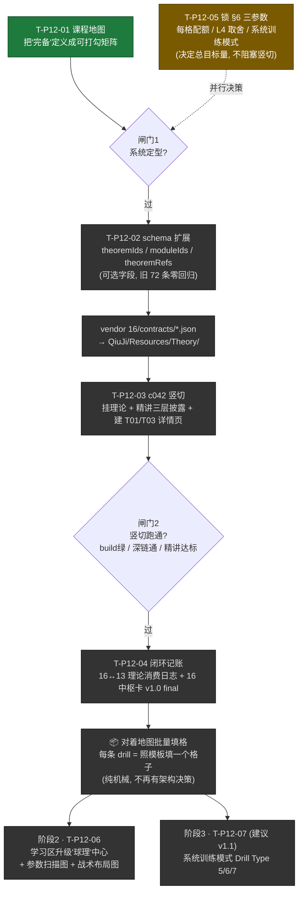
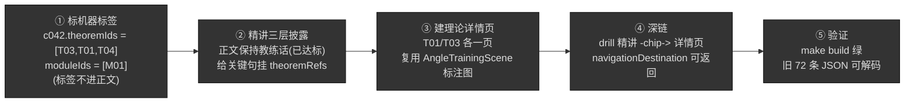

# 课程地图（Curriculum Map）

> **单一真源**：动作库内容的"完备"定义 = 本地图上所有**目标格子**均为 `COMPLETE`。
> 配套架构决策见 [`phases/P12-content-system-theory.md`](phases/P12-content-system-theory.md)（ADR-P12-01）。
> 理论编号引用 `16.billiard_theory/contracts/`（T01–T10 / M01–M06 / 5 步决策流）。
>
> 创建：2026-06-14。本文件随每条 drill 的"四件套"进度更新——"还差多少"永远是一个可数的数字，而非一种感觉。

---

## 0. 为什么有这张图（解决的真问题）

动作库 72 条的出身是 `docs/research/20260323-训练内容体系-动作库分类.md` 的 **MVP 覆盖量（每个技术点一条）**——它是一张**广度铺满的目录**，不是一条有先修依赖、难度爬升、相互衔接的**训练课程**，且**没有任何一条挂接 16 的理论**（已核实：72 条 JSON 无 `theoremIds`，工程未 import `contracts/`）。

本地图把"内容是否系统完备"从主观判断变成**可打勾的矩阵**：每个格子要么填满、要么是明确的缺口。这样大规模生产（录制示范 + 写精讲）才不会在"系统没定型"的状态下空转。

---

## 1. 单元格 Schema（每条 drill 在地图上的条目）

地图的最小单位是"一个被填满的格子"，不是"一条 drill"。每条 drill 记录：

```
drill_c042  初级蛇彩走位
├── 坐标:    [L2 高水平业余] × [positioning 走位]
├── 挂理论:  T03(切线) · T01(30°) · T04(速度分级) · N2(留角度) ；模块 M01(单球进位)
├── 球形来源: <自创 / 社媒-<出处> / 竞品 / 理论validation-case>  （见 ADR-P12-01 §社媒拿球形 SOP）
├── 四件套:  挂定理✅  引擎可达✅  示范素材✅  精讲(为什么/怎么打/自检)✅
└── 状态:    COMPLETE
```

**四件套**（一格 `COMPLETE` 的充要条件）：

| # | 件 | 判据 |
|---|----|------|
| 1 | 挂定理 | `theoremIds`/`moduleIds` 已标注（特殊球路允许 `理论未覆盖`，见 §3） |
| 2 | 引擎可达 | `shotIntent` 经 `DrillBakeRunnerTests` `feasible=✅`（或编排台序列复现一致） |
| 3 | 示范素材 | 编排台人工录制序列 → 出片（静帧 + 视频，按 content-engineering SKILL 媒体落位表） |
| 4 | 精讲 | 按"应用课/技术点"模板写就，含理论三层披露引用（ADR-P12-01） |

状态四态：`COMPLETE`（四件齐）/ `PARTIAL`（标差哪件）/ `EMPTY`（规划了但未建）/ `DEFERRED`（明确推迟到 v1.1）。

---

## 2. 双轴 + 横轴理论绑定

- **纵轴**：能力树 Level（对齐 16 handoff §4.1 + App 现有 L0–L4）
  - L0 新手 / L1 业余进阶 / L2 高水平业余 / L3 准职业 / L4 进阶球形（建议 v1.1）
- **横轴**：8 大类，每类**预先绑定**它该教的定理（挂理论靠查表，不逐条拍脑袋）：

| 横轴类别 | 绑定理论/模块 | 备注 |
|---|---|---|
| fundamentals 基础功 | （前理论：姿势/握杆/出杆）→ 瞄准接 T01/T02 直觉 | 理论"地基" |
| accuracy 准度 | **T03 切线** + T01/T02（假想球/接触点几何） | 进球几何 |
| cueAction 杆法 | T01(高杆 30°) · T02(定杆 90°) · T09(加塞) | |
| separation 分离角 | **T01 · T02 · T03**（三条定理核心战场） | 理论最硬一块 |
| positioning 走位 | T03 + T01 + **T04 速度** + N2(留角度) + M01 | |
| forceControl 控力 | **T04 速度分级** + N5(库边减速) | |
| specialShots 特殊球路 | T10 安全球；翻袋/K球/飞杆 **理论16未覆盖** ⚠️ | 见 §3 诚实缺口 |
| combined 综合 | **T05 反向规划 · T06 关键球 · T07 球团** + M04/M06 + 5 步决策流 | 理论"总装" |

---

## 3. 诚实缺口标注（不硬塞）

- **specialShots 的翻袋/K球/飞杆**：项目16 是清台/走位导向，**不含技巧球物理**。这些格子如实标 `理论未覆盖`，靠 App 已有的翻袋解球器/反射解球器单独支撑，**不硬挂 T 定理**。
- **项目16 状态是 candidate 不是 validated**（缺 ≥2 外部读者执行 48 局面）。挂接不受影响（理论内容已自洽），但 App 措辞**不把它说成"权威定论"**，留余地。

---

## 4. 真实当前填充（72 条实测分布，2026-06-14）

> 数据来自全量 drill JSON 的 `level` 字段（实数，非估算）。

| 类别 \ Level | L0 新手 | L1 进阶 | L2 高业余 | L3 准职业 | L4 | 行计 |
|---|---|---|---|---|---|---|
| fundamentals | 5 | 3 | 0 | 0 | 0 | 8 |
| accuracy | 5 | 1 | 4 | 2 | 0 | 12 |
| cueAction | 1 | 4 | 4 | 1 | 0 | 10 |
| separation | 0 | 3 | 4 | 1 | 0 | 8 |
| positioning | 0 | 4 | 4 | 2 | 0 | 10 |
| forceControl | 0 | 3 | 4 | 1 | 0 | 8 |
| specialShots | 0 | 0 | 5 | 3 | 0 | 8 |
| combined | 0 | 0 | 4 | 3 | 1 | 8 |
| **列计** | **11** | **18** | **29** | **13** | **1** | **72** |

**地图读出的事实**：

- 形状是**橄榄球**（L2 最胖 29 条，两头薄）。对"完整课程"两头偏弱。
- L0 无走位/控力/分离角/特殊/综合 —— **正常**（这些天然 L1+），不算缺口。
- ⚠️ **L1-accuracy 仅 1 条**（c032），从 L0 的 5 条准度直接跳 L2，**进阶台阶断裂**——真缺口。
- 完备工作量集中在：① 补 L1 衔接台阶；② 撑起 L3/L4 准职业区；③ **系统训练模式**（Name-5-Shots / Random-2-Points / 18 类加塞，来自 16 handoff §4.0，目前 **0 条**）。

**四件套现状（全局）**：72 条中 **1 条 `COMPLETE`**（c042，ADR-P11-14）；其余 71 条 `PARTIAL`（多数仅挂理论缺口 = 0、示范/精讲缺口大，且存量 `shotIntent` 数据用户已判不可靠，需编排台重录——见 PROGRESS）。

---

## 5. 地图文档的工作版式（逐格 checklist）

> 下方为格式样例。正式逐格清单在"⏳ 待生成"——需先锁定 §6 的待定参数。

```markdown
## [L2 · positioning 走位]   配额 ≥4   现状 4 格 / 1 COMPLETE
绑定理论: T03 · T01 · T04 · N2 · M01

- [x] drill_c042 蛇彩走位      四件套 ✅✅✅✅  COMPLETE
- [ ] drill_c037 关键球走位    四件套 ✅✅⬜⬜  PARTIAL(缺示范+精讲)
- [ ] drill_c038 两库走位      四件套 ✅⬜⬜⬜  PARTIAL(仅挂定理)
- [ ] drill_c039 组合走位      四件套 ✅⬜⬜⬜  PARTIAL

## [L1 · accuracy 准度]   配额 ≥3   现状 1 格 / 0 COMPLETE  ⚠️台阶断裂
绑定理论: T03 · T01/T02
- [ ] drill_c032 角度球         PARTIAL
- [ ] (待建) 五分点 1/2 球各角度  EMPTY  ← 缺口
- [ ] (待建) 中袋角度系列        EMPTY  ← 缺口
```

文档顶部放**总进度仪表**：`72 目标格 → X COMPLETE / Y PARTIAL / Z EMPTY`，每录完一格更新一处。

---

## 6. 待锁定参数（影响总目标量，需用户拍板）

1. **每格配额**：暂用"≥3–4 条/格"。是否按重要性区分（走位/分离角 5–6，基础功/控力 3）？→ 决定总目标条数。
2. **L4 准职业区**：v1.0 就铺，还是标 `DEFERRED` 到 v1.1？→ 决定工作量天花板。
3. **系统训练模式**（Name-5-Shots / Random-2-Points / 18 类加塞）：进地图作独立"格子"，还是单独立项？

> 参数锁定后，本地图将按真实 72 条 + 缺口逐格展开（§5 版式）。

---

## 7. 执行顺序（防返工 / 防拖延）

```
锁课程地图(有限终点)  →  c042 竖切打通(理论挂接+三层披露模板)  →  对着地图批量生产(纯机械填格)
```

- 地图锁了 → 不会录到一半发现编排错。
- 竖切通了 → 不会挂理论挂到一半发现 schema 不对。
- 进入批量录制时，每条都是"照模板填一个格子"的确定动作。

**当前阶段**：参数待锁（§6）+ c042 竖切（理论挂接，见 P12 T-P12-02/03）。**示范素材批量录制 ⏸ 暂停**，等用户在编排台录完（沿用 PROGRESS 2026-06-13 拍板）。

---

## 8. 全景流程图（这张图就是"我们在哪、往哪走"）

> 一句话心智模型：**先把"完整"画成一张能打勾的图（系统），再用一条 drill 把整条管线走通（竖切），最后照着图机械填格（批量）。** 三步之间各有一道"闸门"，闸门没过不许往下走——这就是防返工/防拖延的全部机关。

### 8.1 主干：三阶段 + 两道闸门



### 8.2 放大：c042 竖切内部 5 步（T-P12-03）

> 竖切的意义：把"挂理论→写精讲→建详情页→深链跳转→零回归"整条链在**一条** drill 上走通一次。通了，后面 71 条就只是重复这 5 步里的内容部分。



---

## 9. 进度说明（逐项事实，2026-06-14 实测）

### 9.1 任务进度表

| 任务 | 做什么 | 状态 | 现实/卡点 |
|------|--------|------|-----------|
| T-P12-01 | 课程地图（本文件） | ✅ 完成 | 双轴 + 72 条真实分布 + 缺口可数已就位 |
| T-P12-05 | 锁 §6 三参数 | ⏳ 待你拍板 | **不阻塞竖切**；决定的是后面批量的总目标条数/工作量天花板 |
| T-P12-02 | schema 扩展字段 | ⛔ 未开始 | `DrillContent` / `TutorialSection` 无理论字段；`Resources/Theory/` 目录不存在（实测 0 文件） |
| T-P12-03 | c042 竖切 | ⛔ 未开始 | `drill_c042.json` 无 `theoremIds`；精讲是纯教练话（**好消息**：天然符合"不写编号"，省一步改写） |
| T-P12-04 | 16↔13 闭环记账 | ⛔ 未开始 | 依赖 T-P12-03 先消费 contracts |
| T-P12-06 | 球理中心 + 配图 | ⛔ 阶段2 | 等战术/综合类 drill 上线再做，现在不碰 |
| T-P12-07 | 系统训练模式 | ⛔ 阶段3 | 建议 v1.1 |

**一句话现状**：✅ **系统定型已完成（地图）**，但 **闸门1 之后一行代码都还没写**。我们正卡在"闸门1 → T-P12-02"这一步的起跑线上。

### 9.2 下一个动作（就这一件）

```
T-P12-02 schema 扩展  →  vendor 16 contracts  →  T-P12-03 c042 竖切 5 步  →  闸门2 验证
```

- **现在该做**：给 `DrillContent` 加可选 `theoremIds?/moduleIds?`、给 `TutorialSection` 加可选 `theoremRefs?`（承袭 `shotIntent` 的"可选字段、旧数据零回归"模式），把 16 的 `theorem-tags.json` 等快照拷进 `QiuJi/Resources/Theory/`，然后在 c042 上走通竖切 5 步。
- **§6 三参数**：与上面**并行**——你定/我给推荐值都行，定了才能把地图 §5 逐格清单展开，但**不挡** c042 竖切开工。

### 9.3 为什么是这个顺序（防返工逻辑）

- **先地图再写码**：不会录/写到一半发现"系统没定型、白做"。✅ 已过。
- **先竖切再批量**：不会挂理论挂到一半发现 schema 设计错、71 条返工。← **现在这道闸门**。
- **批量阶段无决策**：每条都是"照 c042 模板填一格"的确定动作，纯体力活，不再有架构风险——这才是治拖延的终点。
