# UI 审阅报告：v56 色彩目标态文生图校准

> 日期：2026-09-03
>
> 角色：UI Reviewer
>
> 对象：动作库 Light/Dark、个人页 Light/Dark、练习大厅 Light、Pro 图标与材质，共 20 张目标态/探索图
>
> 结论：**保留现有星形/皇冠，只改变金色材质；三版 Light 与一版 Dark 对比后暂推荐细拉丝香槟金，但最终轮廓必须由确定性 mask 锁定。**

## 一、校准图

### 动作库：绿实底方案

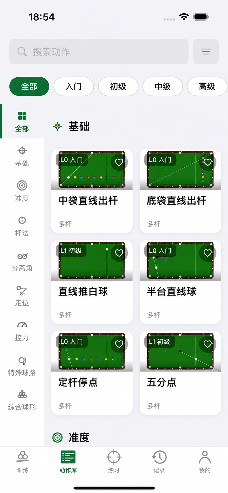

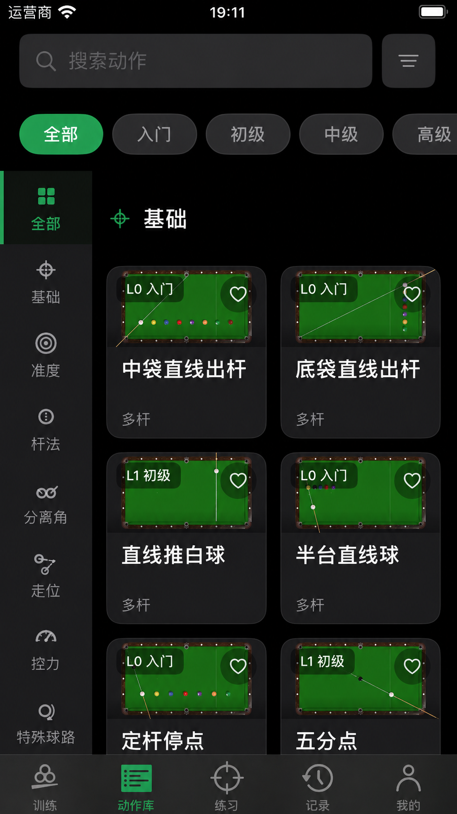

### 动作库：弱绿方案

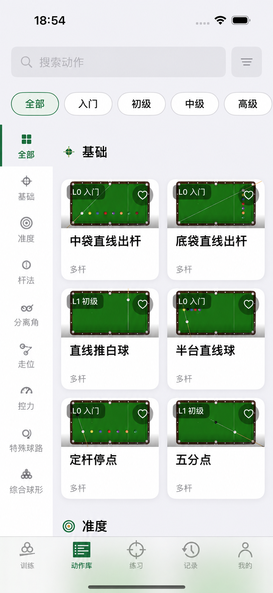

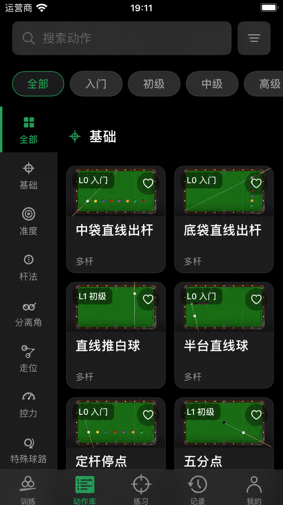

### 个人页与练习封面

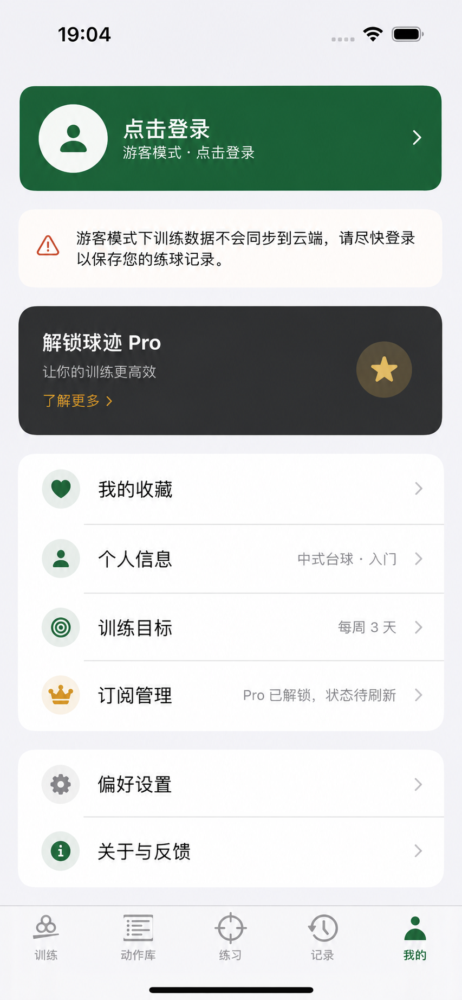

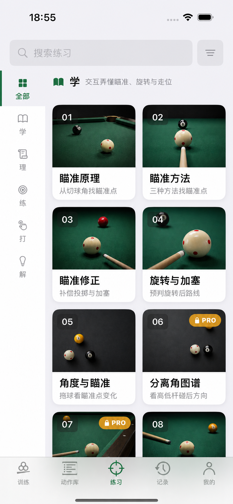

### Pro 金色：三种候选

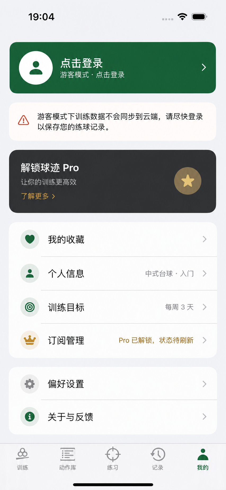

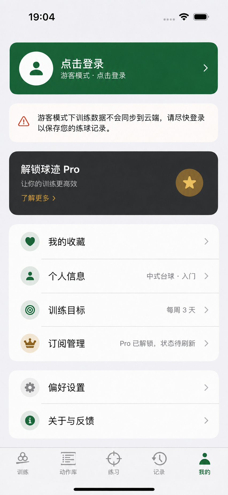

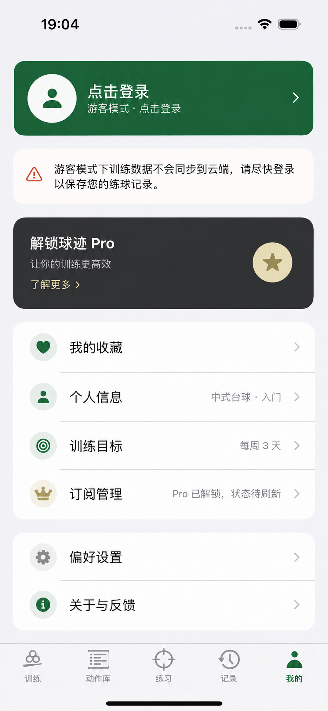

### Pro 自定义图标：放回页面比较

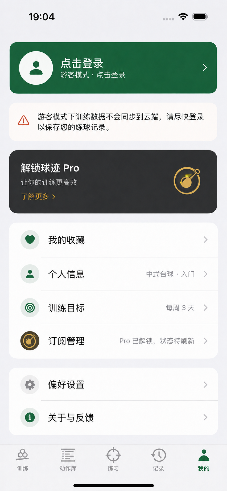

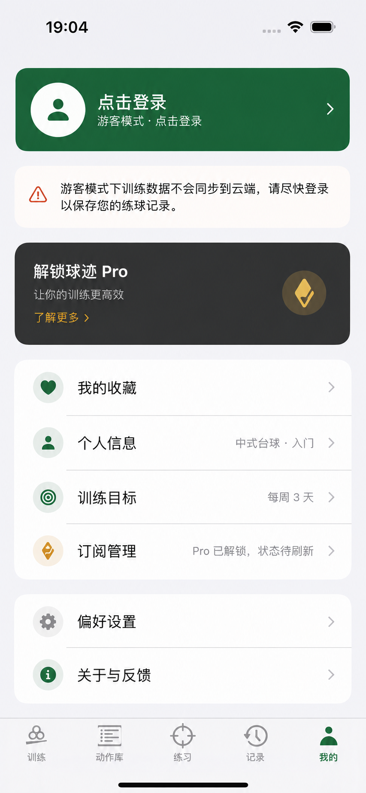

### 保留原星形/皇冠：三种生成式金色材质

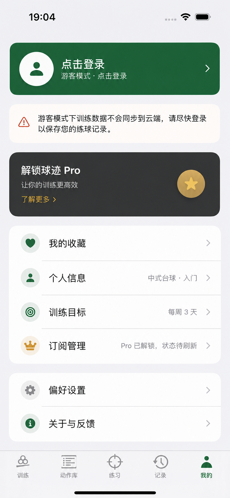

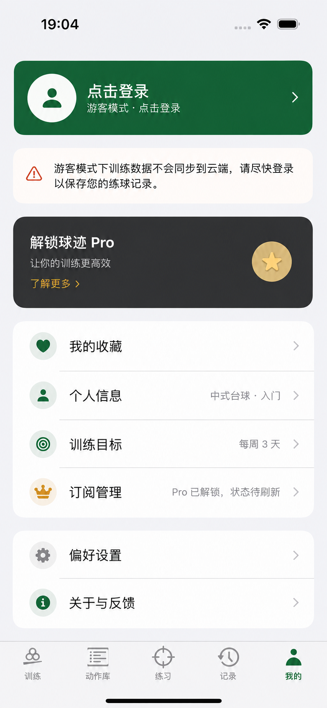

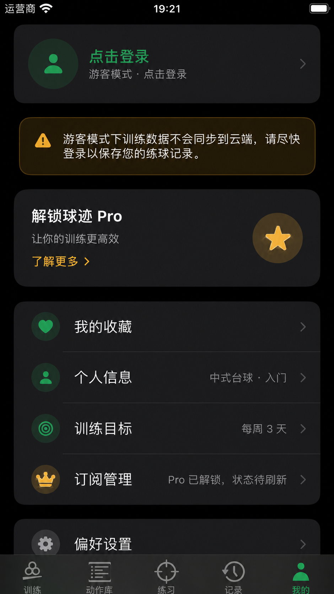

## 二、逐项判断

### V56-CAL-01 统一不等于全部实绿

- **现象**：实绿方案消除了 Light 黑 / Dark 白反相，方向正确；但动作库同时出现顶部绿 Chip、左侧绿栏目和底栏绿 Tab，三个层级都在争抢“当前”。
- **比较**：Light 弱绿方案明显更克制，仍能识别选中；Dark 弱绿方案方向更好，但当前生成图的底色/边框略弱，实现时需提高表面差或边框对比。
- **结论**：筛选默认采用 `btPrimaryMuted + btPrimary`，而不是统一绿实底；实绿留给主 CTA、关键二元切换或暗场 HUD 选择。

### V56-CAL-02 金色不能机械清零

- **现象**：普通导航不使用大面积金色后页面更干净；但动作库栏目标题里极小的金色定位点并未构成焦点竞争，反而保留台球产品识别。
- **结论**：v56.0 的“金色只留 Pro”过于绝对。金色应保留给 Pro，以及极少量品牌签名/成就/关键值；禁止用于警告、普通选中、图表默认系列和装饰性分隔。每个局部层级最多一个小面积金色焦点。

### V56-CAL-03 个人页方向成立

- **现象**：登录卡成为高面积绿色主行动、warning 降为浅色信息条后，首屏任务立刻清楚；Pro 仍能保持独立身份，无需取消黑金。
- **风险**：生成图把整个登录卡改为实绿，真实实现需验证 Guest 首屏是否过强，以及与底部选中 Tab 的平衡；不能照抄生成图的高度、字重和白色头像圆。
- **结论**：W4 方向成立，但应先做真实 SwiftUI Preview 的“绿文字白卡 / 低饱和绿卡”二选一，不直接锁死整卡实绿。

### V56-CAL-04 封面不能只靠统一黑罩

- **现象**：统一曝光和台呢绿后，01–04 的连续性明显提高；05–06 灰棚拍与绿色球桌仍天然分成两个摄影系列。
- **结论**：共享 scrim 有用但不是完整答案。W6 必须同时处理摄影系列分组/相邻排序与极端素材重选；若仅提高黑罩，会让所有封面变闷而仍保留色温跳变。

### V56-CAL-05 品牌绿不换色相，金色需要从单色升级为体系

- **品牌绿**：当前 `btPrimary` 为 Light `#1A6B3C`、Dark `#25A25A`；三版金色图均刻意保持它不变。现有问题主要是绿色在不同控件中的强度不一致，不是品牌绿本身不成立。
- **当前金色**：`btAccent` 为 Light `#D4941A`、Dark `#F0AD30`，橙黄感和亮度都偏强；大面积使用时更像活动/促销/警告，而不是付费权益。
- **香槟金**：三版中平衡最好。它保留了付费识别，又没有古铜金的土褐感，也比冷淡沙金更有可见度，建议作为主方向。
- **古铜金**：有传统会所和器材质感，但棕调明显，会放大用户已经感受到的“土”，不建议作为主色。
- **冷淡沙金**：最安静、最接近 quiet luxury，但白底上过淡，适合做高光/弱表面，不适合独立承担正文、图标和主 CTA。
- **对比度校验**：`#8C6B2F` 对白为 `4.93:1`，可承担 Light 普通字号前景；`#E7D3A0` 对 `#1C1C1E` 为 `11.52:1`，可承担 Dark 前景。`#C6A15B` 对白仅 `2.43:1`，只能做装饰/边框，或配深色文字，不能直接作为白字按钮背景。
- **结论**：不要把 `btAccent` 全局换成另一个十六进制色。应拆成 `premiumForeground / premiumSurface / premiumBorder` 三层，并让 warning、收藏、图表和物理黄先迁出；贵气来自炭黑、香槟金、暖白之间的面积和明度关系，而不是更亮的黄色。

### V56-CAL-06 自定义图标有效，但生成稿不能直接上线

- **现状根因**：Profile 大卡使用 `star.fill`，菜单行和其他 Pro 入口多用 `crown`。即使换成香槟金，也仍像系统模板里的普通会员入口，缺少球迹自己的付费身份。
- **精准走线章**：放回页面后台球语义最清楚，远看能理解为球、杆和走线；但外环、球、杆、接触点同时出现，小尺寸菜单行接近机械表盘，且与现有类 Q 品牌 Mark 有轮廓竞争。
- **台边钻石标**：页面气质更安静、更精致，在大卡和列表行都比皇冠/星星成熟；但现稿的圆孔与切口不够清楚，容易被看成笔尖、定位标或游戏等级符号，台球识别不足。
- **其余初稿**：四向钻石点结构太散；“高手章”像游戏盾牌；收紧版认证章仍偏 Q/靶心。这些不进入下一轮。
- **建议**：下一轮以 `16` 的克制轮廓为骨架，吸收 `15` 的“球 + 击球点”识别，但最多保留两种视觉元素；禁止外环、箭头、渐变和微型接触点。生成图只负责找形，选中后由 SwiftUI Path 或单色 SVG 确定性重绘。
- **使用范围**：同一 Pro Mark 应统一出现在推广卡、订阅行、Pro badge 和订阅页 Hero；不替换 `BTBrandLogo`，不用于普通成就、收藏或警告。

> **后续裁定**：用户已明确选择保留原星形/皇冠，本节仅保留为探索记录；自定义 Pro Mark 不进入 v56 实施。

### V56-CAL-07 保留轮廓，只增加生成式材质

- **哑光香槟金（17）**：克制，但大星形的圆形底接近哑光金币，层次仍偏平，未完全解决“付费质感”。
- **细拉丝香槟金（18）**：三版中最好。宽柔光、轻拉丝和边缘压暗能在黑卡上建立材质，同时没有珠宝闪光；菜单皇冠缩小后仍保持清楚。
- **柔光象牙金（19）**：最明亮，但中心过暖过浅，容易接近奶油塑料或珐琅玩具，不建议作为主方向。
- **结论**：推荐 `18`。最终资产应保留系统星形/皇冠作为确定性 mask，把生成的拉丝材质作为可替换填充；小尺寸皇冠可以降低纹理强度，文字继续用满足对比度的纯色金。
- **Dark 结果**：直接生成曾两次漂移为镂空金币/切面宝石；收紧后的 `20` 已回到实心星形，但仍比 Light 更立体。这不否定材质方向，却证明生成图只能提供表面参考，生产端必须由 SF Symbol mask 锁形、限制高光与描边。

## 三、对 v56 的修正

1. 选中态从“两种”细化为三级强度，但仍只有一种品牌语义：导航绿指示、筛选弱绿表面、主行动/关键切换实绿。
2. `btAccent` 从“只限 Pro”改为“Pro + 稀疏品牌签名/成就/关键值”，并明确禁止 warning 和普通 selection。
3. Profile 先做两种真实组件 Preview，再决定登录卡是否整卡实绿。
4. 封面验收加入摄影系列分组、相邻排序和 outlier 重选门槛，不把统一 opacity 当完成。
5. 文生图校准纳入代码前 G0；用户确认方向后才开始 W0/W1。
6. Pro 金色建议锁定“香槟金主方向 + 冷淡沙金弱表面/高光”，古铜金不进入实现；品牌绿的色相与当前动态色值不变。
7. 自定义 Pro Mark 已按用户裁定退出实施；保留既有星形/皇冠，只改变生成式材质。
8. 三种材质中暂推荐细拉丝香槟金；材质只进图标/徽章表面，文字继续使用纯色金。Dark 已补目标图，生产端仍需限制立体感。

## 四、证据边界

- 生成图适合发现层级问题，不适合验证文字、布局、触控、Dynamic Type、对比度或真实 Token。
- 图片中任何字形、尺寸、对象边缘或细节漂移都不算设计决定。
- 本轮没有修改 SwiftUI、Design Token、测试或 Asset Catalog；这里只修正方案。
