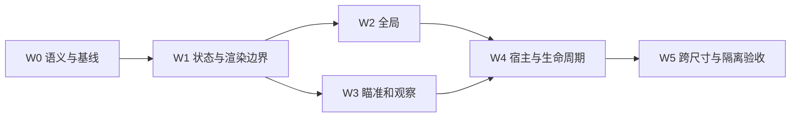

> **v1.7 本地试调版完成（2026-09-29，用户批准试改一版）**：本条覆盖下方v1.6历史说明。全局距离0.75～1.25C；观察基础母球水平距离1.65m、眼高台呢上0.90m，桌外最小退让0.38m，仅必要时加距；不按目标居中拉远升高。横拖增益0.0015rad/pt、竖拖0.001rad/pt，观察随倍率降低。输入主次方向2:1、次轴4pt有符号缓冲，可斜拖/转向；拖动60ms短跟随、模式转场保持world-up。瞄准横拖0.03°/pt调真实杆向，竖拖不改镜头；观察快照及进袋恢复沿用。最终81项核心与两平台6次原生UI执行通过，用户手感待试；完整证据见CAMERA-FEEL-20260929.md。

> 2026-09-29：用户否决整体视角重构并要求恢复旧版。本文件保留历史方案／验证记录，已停止作为当前实现或体验验收依据。当前恢复范围见 [回退记录](CAMERA-ROLLBACK-20260929.md)。

# 三视角隔离与相机重构方案 v1.6

> 2026-09-29后续：A01～A05已按v1.6修复，最终79核心+三尺寸10次原生UI通过，见[修复报告](CAMERA-INTERACTION-FIX-20260929.md)。[先前失败复验](CAMERA-INTERACTION-AUDIT-20260929.md)保留。D01/D02/D04不变，±8°为实施默认值，非用户数值确认。

> **本文件是本轮需求真源。** 创建及代码核实日期：2026-09-28。
> **状态：2026-09-29 A01～A05实现与三尺寸定向实操复验完成。** D01/D02/D04已确认；W0基线与消费者名单见[实施验收报告](CAMERA-ISOLATION-FINAL-20260929.md)。数值采用明确实施默认值，用户手感与真机证据单列。
> **范围：瞄准、观察、全局三种交互式3D视角的职责、几何、操作、状态与接入。** 2D、物理、选球规则、内容和视频导出不改语义。
> **前置：** 各批实施前明确§11中与该批有关的产品选择；依赖数值的批次再冻结参数。D01/D02及D04触发时机已确认，不再重复询问。用户若明确批准本稿推荐项，可直接采用，不再重复确认。尚未批准的建议不能写成用户决定。
> **覆盖关系：** 本稿对“观察对象决定眼位、观察球强制居中、三模式混用轨道状态”的裁定，覆盖DR-339/FL-094相关错误解释；保留用户已选C初始构图及已认可图标。旧《问题集合_每日清台交互与规则_v2》中的非相机需求继续有效；其相机事件逐项在本稿对照，不默默删除旧业务行为。

## v1.6 交互返工补充（2026-09-29，用户已授权修复）

本节覆盖v1.5中冲突的实现规定，D01/D04及各模式独立记忆保持。

- 相机手势仅在合法摆球能力存在时让位给拖球；非自由球的母球不注册为可拖对象，但点击母球进入瞄准仍保留。
- 新三模式使用原生UIPan识别后的二维增量，不再额外锁定单轴。水平/竖直可同时生效和同指转向；两模式下拖都增加俯视程度。瞄准桌面拖动维持不改镜头/杆向。
- 连续相机输入立即提交pose，不在每个样本重启0.16秒模式缓动；模式切换仍从当前可见pose平滑接续，过渡中输入沿用已有排队机制。
- `ObservationEntry.restore`用于模式按钮及正常进袋站起；恢复站位/朝向/倍率。`alongShot`用于显式选择目标球完成真实杆姿更新后；按当前母球+杆向重建桌外观察站位，眼高仍为台呢上0.84m，保留观察倍率并更新目标身份；不以目标投影居中计算眼位或朝向。
- 查看球/袋菜单仍是独立的原地查看请求；不偷偷改业务瞄准、不由目标位置决定站位。
- 观察pitch范围从−80～30°改为沿杆初始俯角上下各8°，并受俯角10～50°绝对边界限制；reference随观察状态记忆，只在显式沿杆请求时更新。这是本次修复采用的待手感确认参数。初始沿杆姿态沿用原几何，镜头不推进眼位；边界必须支持立即反向。
- 新验收必须真实拖动/双指捏合，覆盖A01～A05，保留合法自由球摆位、旧只读/导出策略、缩放记忆及击球生命周期回归。旧93记录点将用相同操作重跑并增加缺陷断言。

## 1. 需求回显：已经明确与尚未决定

### 1.1 用户明确要求（R）

| 编号 | 用户要求 | 本稿必须满足的含义 |
|---|---|---|
| R01 | 三种视角应该隔离，各有各的作用 | 各自拥有模式、计算器、操作规则和状态；不能由多个布尔值拼出模式 |
| R02 | 全局缩放、旋转均将桌中心放在屏幕中央 | 全局中心只来自球桌几何，不受选球、手指位置、瞄准方向驱动 |
| R03 | 全局不需要局部放大，缩小范围不要太大 | 整桌有限缩放；达到边界停止，不吸附球、不切其他模式 |
| R04 | 观察应模拟人在球桌旁边 | 眼位有独立的空间依据，关注对象不反推人的位置与高度 |
| R05 | 全局切出再回来保持缩放 | 保存全局自己的缩放；方向、俯角也独立保存，不能继承人的视角 |
| R06 | 切换后不要把目标从目标球变成母球 | 观察对象按身份保留；保留对象不等于强制其屏幕坐标为中心 |
| R07 | 观察视角强制目标居中、覆盖眼位高度不对 | 删除这项产品约束；视线调整与眼位调整必须分离 |
| R08 | 全局初始用C，眼睛/较大站立人/俯身人图标 | 保留已认可默认构图和图标，不借重构再做视觉方案选择 |
| R09 | “1和2，可以” | 瞄准不单独拖动摄像头，方向尺调杆向；观察双轴原地转头，保持站位和眼高 |
| R10 | “当目标球进袋后再站起吧，相当于进入观察视角” | 目标球实际进袋时由瞄准进入正常观察；取消接触时站起及杆末自动回瞄准 |

### 1.2 不能擅自当成已拍板的内容

- 观察默认身高、离库距离、两个人视角的镜头放大上限已完成画面对比并采用实施默认值；用户手感尚未确认。
- 首次观察站位以出杆侧初始化是推荐技术方案；具体数值未获用户确认。
- 跨App重启记忆没有被要求。本稿仅设计场景会话记忆，不新增持久化或同步字段。

### 1.3 本轮不做

不改打点/抬杆物理、碰撞/求解、目标合法性、杆数/成绩、球位、教学脚本；不新增走动摇杆或人物模型；不把录像镜头和图册镜头强行变成人视角；不发布或部署。独立模式可以共用纯数学与最终渲染器，不要求复制三套SceneKit节点。

## 2. 立项时实现事实与失败原因（基线记录）

以下为2026-09-28立项时工作区事实，锚点见§13；后续实现以DR-342/DR-343及验收报告为准。

| 编号 | 当前事实 | 问题 |
|---|---|---|
| F01 | `playerView`只有firstPerson/thirdPerson；另有`keepsWholeTableFramed`、两态`currentViewMode` | 三个产品模式没有单一状态真源；还存在无名的自由轨道状态 |
| F02 | `SmoothPose`、`OrbitState`、旧`currentZoom`阶梯都能描述相机 | 同一pose在过渡/手势/恢复时多次换表达，所有权不清 |
| F03 | `standingPose(pivot: focus ?? cue)`从目标反向找外框，再后退0.45m | 关注对象改动会移动眼位；不是单纯转头 |
| F04 | 新建观察姿态传入height=0.90，再限制0.72～1.12m | 旧眼高在缓存未命中时被重置；这些数值从未通过本轮用户验收 |
| F05 | 观察手势调用`constrainStandingOrbit`，再次按pivot重算站位/俯角 | 位置和注视持续耦合；竖拖实际升降眼睛而非抬低视线 |
| F06 | 第一人称初始按真实杆姿，随后横拖绕母球、竖拖改pitchOffset | 初始与手势不是同一种空间模型；仍高亮瞄准不能证明仍在杆上方 |
| F07 | 记忆键比较cue/aim/focus/viewport，未包含strike/elevation | 小幅杆向变化可重置观察；在其他模式改打点后，又可能恢复过时瞄准眼位 |
| F08 | 观察对象分别出现在VM的selectedTargetKey、rig世界坐标focus和候选数组 | 对象身份、当前坐标与构图参考被混为三份输入；跨页面传参不同 |
| F09 | `playerWasAdjusted`同时控制自动杆姿更新与击球自动切换 | 一个操作标记承担不相关业务政策 |
| F10 | `observe(at:)`、`enterAiming`、`playerPose`、`dailyPlayerPose`并存 | 同名按钮/菜单可能走不同规则，旧入口可绕过新限制 |
| F11 | 2D/撤销快照和新三视角缓存各自保存一部分状态 | 恢复当前相机不代表模式记忆、对象版本也一起恢复 |
| F12 | 旧测试断言观察对象必须居中、眼高等于新常量 | 测试验证了错误产品假设；绿灯不构成方案正确的证据 |

明确区分：旧版本本来就有“点目标后看目标”及自动装下两球的拉远抬高逻辑；上一轮新增错误是将目标居中推广到全部观察入口，并以目标重建桌边站位。本稿不主张整体回退工作区来解决局部设计错误。

## 3. 三种视角的目标、边界与优先级

### 3.1 对外产品定义

| 模式 | 要解决的问题 | 空间参照 | 不承担的任务 |
|---|---|---|---|
| 瞄准 `aiming` | 从真实击球眼位理解杆向、母球与击球线路 | 当前杆的真实支点、杆向、仰角与眼位偏移 | 绕球环游、全桌适配、把所有目标强塞进镜头 |
| 观察 `observation` | 人站在桌旁查看球形、线路和局部关系 | 独立站位、眼高、视线；关注对象只是语义信息 | 目标居中反推站位、因两球距离升空、承担全局鸟瞰 |
| 全局 `overview` | 看整桌布局、旋转理解空间分布 | 固定桌中心、环绕方向/俯角、整体倍率 | 根据球重定中心、按手指局部放大、依赖有效击球方向 |

“第一人称”在旧代码中专指俯身瞄准；本稿统一称“瞄准”。“观察”也是人眼视角，避免后续再用第一/第三人称名称暗示错误的空间关系。

### 3.2 冲突处理顺序

- 瞄准：真实眼位与杆姿一致 > 输入/击球一致 > 线路可读 > 目标屏幕位置。
- 观察：保存的站位与眼高 > 用户控制的视线 > 关注对象可见性。不能为了可见性偷偷移动眼位或改变高度。
- 全局：桌心居中 > 缩放范围有界/不突跳 > 用户保存的方向与倍率 > 所有旋转方向完整显示桌角。
- C档已经存在部分旋转方向裁角的已知取舍；不能为消除裁角不断退远，将它变成曾未选择的E档。
- 所有模式：观看操作不能修改物理输入、球位、合法目标、答案、得分或播放时间。

## 4. 必须拆开的几何和状态概念

| 概念 | 推荐表达（拟新增，不是现有API） | 谁能修改 |
|---|---|---|
| 眼位 | `CameraPose.eyeWorld` | 所属模式的眼位生成器、显式站位操作 |
| 视线/姿态 | `CameraPose.orientation`（四元数，保持世界up） | 所属模式的朝向生成器、允许的转头操作 |
| 镜头 | `LensState`（约定垂直FOV，换算水平FOV） | 所属模式的缩放政策；视口适配只能按该政策计算 |
| 观察对象 | `ObservationSubject`：球ID/袋ID/明确世界点/无 | 显式观察请求；业务选球由宿主先处理，相机只读其结果 |
| 环绕中心 | `OverviewState.tableCenter` | 真实桌几何初始化或桌模型变化；只用于全局 |
| 出杆参照 | `ShotCameraContext`：母球、strike、aim、elevation、geometry/shot revision | 宿主提供不可变快照；相机不得反写 |
| 站位参照 | `ObserverState.stance`：世界XZ、离地/台呢高度约定、基准朝向 | 首次初始化或显式重新站位；不被subject赋值覆盖 |

坐标契约：SceneKit世界米，X/Z水平、Y上；台呢高度取`scene.surfaceY`，球心高度另加实际半径。用户说的“屏幕中央”在全局指实际SCNView视口中心；HUD影响可读区域，不能偷偷平移全局中心来避HUD。

最终渲染接口只接收显式`eyeWorld + orientation + lens`。观察/瞄准不得再由“某个球pivot+距离”反推眼位。全局可以内部采用轨道公式，计算完再交给统一渲染器。

## 5. 各模式的实现方式

### 5.1 瞄准模式

**首次进入/真实杆姿变化：** 从同一帧`ShotCameraContext`求眼位。既有沿杆后退0.90m、上偏0.13m可作为旧画面基准，不宣称已定稿参数；必须保留实际strike与elevation，而非母球心替代支点。眼位算法只读杆姿，与观察对象和全局缓存无关。

**视线：** 以击球方向和瞄准构图偏移生成；抬杆时的视线补偿需单独命名和限幅，不能移动眼睛来“装下两球”。输入目标须显式命名，不从`context.last`猜是哪颗球。无目标但有合法自由杆向时仍能瞄准。

**手势D01（v1.7用户追加覆盖）：** 瞄准模式桌面横拖和方向尺均调真实杆向，相机跟随真实杆姿；竖拖不独立转头，双指有限镜头缩放。没有脱离杆向的相机轨道。

**依赖刷新：** aim/strike/elevation任一变化，眼位重新由最新杆姿推导；仅保留用户的镜头倍率等兼容偏好。不恢复依赖旧杆姿的整张pose快照。用户镜头缩放不自动取消杆姿跟随。

**失效：** 缺少母球或非有限/零方向，不生成伪姿态；保持最后有效显示并禁用不可用入口，或按明确宿主事件退出。不能因计算失败静默进入全局。

### 5.2 观察模式

**首次进入：** 优先用已保存有效观察站位。没有站位时，从当前出杆侧/母球与真实杆向确定一次桌边站位；推荐沿母球反向射线找外框后加眼位退距。关键是以出杆侧为依据，不能从被观察目标球发射射线。具体高度/退距在W0标定，不沿用DR-339常量作为已批准值。

**之后的恢复：** 保存并恢复站位XZ、眼高、视线yaw/pitch与镜头倍率。普通求解刷新、选择另一目标、轻微瞄准变化、切去全局，都不重算已存在的站位。新题/新桌等需要初始化的场景见§8。

**关注目标：** 保存球ID，而不是只缓存球坐标。点击新的合法目标时，沿用原有业务“选球并进入观察”的事件；已存在的观察眼位保持。将“让该球可见”作为一次视线调整请求，不能形成每帧居中约束。

**推荐取景方式：** 目标已在实际可读区域内时，默认不动相机；在区域外时，只做最小必要朝向调整使其进入区域。可读区域由实际视口与HUD遮挡测量，不写死“中央65%”作为跨设备标准。不要求球的投影恰好为(0.5,0.5)。如果转头边界或遮挡导致无法看清，停止自动调整，由用户切全局或显式重新站位；不自动升高/退远兜底。

**已确认手势D02：** 横拖原地左右看，竖拖原地抬头/低头，两者不改变眼位。捏合有限镜头缩放，不改站位/高度/对象。绕桌走动属于另一种空间操作；本轮不将它偷偷混入横拖。如果用户明确选绕桌方案，应独立定义桌边路径参数、朝向跟随规则和手势，而不是复用目标球轨道。

**人的高度：** 首次初始化和显式高度设置可以改变；普通视角切换、选球、手势转头不能覆盖。暂不新增调身高UI。禁止为了目标入画调用全桌拟合器。

### 5.3 全局模式

独立`OverviewState`保存yaw、elevation、相对C倍率；桌中心只来自桌几何。首次按已确认C生成基准，后续按钮切回恢复该状态，不能重新跑默认朝向或默认倍率。

横拖绕桌中心，竖拖改变全局俯角，缩放改变整桌距离；镜头视野按设备投影政策固定。缩放不得读取触点下的球、selectedTargetKey、aim或观察镜头FOV。缩放和旋转每一帧均保持桌心投影居中。

全局距离范围于2026-09-29经用户明确调整为0.75～1.25C；俯角仍为30～55°，C本身不重选。首次适配后不因yaw变化重新拟合距离。视口/桌模型真实改变时重新计算C基准，保留相对倍率和方向；不读取上一模式的distance作为新基准。

无有效母球、目标或解时仍可查看全局，只需桌几何和有效视口。0尺寸视口延后初始化，不用猜测屏幕尺寸。

## 6. 状态所有权与技术分层

### 6.1 建议结构

以下原为拟新增概念。W1已落地`InteractiveCameraMode`、`CameraPose`、`CameraSessionState`、`InteractiveCameraController`和`CameraPoseRenderer`；全局计算器已在W2落地，两个人视角计算器在W3落地。不新增SPM或Data层依赖。

```swift
enum InteractiveCameraMode { case aiming, observation, overview }
struct CameraPose { /* eyeWorld, orientation, lens */ }
struct CameraSessionState {
    // activeMode; aiming preferences; observer state; overview state;
    // observation subject ID; board/table/shot context; transition generation
}
```

- `AimingCameraPolicy`：杆姿快照→眼位/朝向；只读瞄准偏好。
- `ObservationCameraPolicy`：独立站位+视线→pose；处理一次观察请求，不能读写全局状态。
- `OverviewCameraPolicy`：桌几何+全局状态→pose；不能读球/杆姿。
- `InteractiveCameraController`：接收语义事件、选取唯一模式、管理模式切换与快照。
- `CameraPoseRenderer`：相机节点唯一写入者，接收绝对pose，不知道目标球/比分等业务。
- `CameraRig`可暂作旧宿主适配器；旧`enterAiming`和导出用`snapToAimPose`不能直接删除。新交互页面不再回退到旧zoom阶梯。

### 6.2 独立不等于互不通信

允许共享不可变桌几何、有效杆姿和对象身份。模式间传递的是明确事件/上下文，不是复制上一模式的pivot/radius/FOV。首次建立人类站位可以读取同一出杆侧；已有观察站位不得每次根据瞄准眼位覆盖。

`activeMode`是唯一产品状态；按钮高亮和可用性都由它派生。`transitioning`、`manualGaze`、`playbackPolicy`各表达一件事，不能再用`playerWasAdjusted`同时决定跟随、镜头切换与按钮状态。

### 6.3 推荐接口边界

| 意图 | 输入 | 允许变化 | 禁止变化 |
|---|---|---|---|
| `selectMode(mode)` | 目标模式、只读上下文 | activeMode、渲染过渡 | 其他模式的已存状态、业务选球 |
| `observeSubject(id)` | 稳定对象ID、当前世界信息 | 观察对象；按规则一次转头；明确进入观察 | 观察眼位/高度、全局状态、杆向 |
| `updateShotContext(snapshot)` | 带版本的杆姿快照 | 有效瞄准姿态、对象坐标解析 | 当前观察站位/视线、全局构图 |
| `handleCameraGesture(event)` | 语义手势+所属模式 | 仅该模式允许的自由度 | 隐式跨模式、物理输入 |
| `resetCurrentView()` | 当前模式、有效上下文 | 仅当前模式默认状态 | 全部模式一起重置 |
| `capture/restoreSession()` | 值类型快照、上下文版本 | 完整相机会话恢复 | 球位/成绩/求解状态 |

重复点击已选模式默认幂等，不偷偷当重置。重置入口是否展示不属于本轮新增UI要求；内部API先有明确语义。

## 7. 手势与切换契约

### 7.1 已确认手势矩阵（D01/D02）

| 操作 | 瞄准 | 观察 | 全局 |
|---|---|---|---|
| 横向相机拖动 | 调真实杆向，相机随杆姿更新 | 原地转头，不移动眼位 | 围绕桌心转动 |
| 纵向相机拖动 | 默认不接管 | 原地抬低视线，不升降眼高 | 调全局俯角 |
| 双指捏合 | 有限镜头倍率 | 有限镜头倍率 | 整桌有限距离倍率 |
| 到达缩放边界 | 停止 | 停止 | 停止 |
| 选目标球 | 由宿主选球规则决定；显式进入观察 | 沿新杆向建立基础站位，保留倍率 | 显式进入观察；保存全局状态 |
| 点模式按钮 | 恢复/更新对应模式 | 恢复/更新对应模式 | 恢复自己的方向和倍率 |

中性输入必须是无操作：某轴增量为0时该轴处理不得修改状态；两轴均为0或捏合`scale=1`时整个事件不得修改身份、高度、距离、跟随政策或缓存。当前UIKit主轴锁定仍会分别调用两个轴；迁移时应输出唯一语义事件，并保留未锁定前的无操作语义。

### 7.2 模式切换过程

1. 保存源模式自己的逻辑状态，不将混合动画帧写成源模式默认状态。
2. 验证目标模式上下文；有有效状态则恢复，没有才按该模式规则初始化。
3. 从当前实际可见pose过渡到目标pose；eye插值、orientation最短路径插值、lens独立插值。不要分别插值pivot/radius后无意绕另一个中心。
4. 动画不能反写杆向、观察对象、球位；不要同时开SCNTransaction和逐帧两套相机动画。
5. 每次转换带代次；连续点击只允许最新转换完成回调生效。
6. 手势中断从当前可见pose接管，但仍按目标模式允许的自由度处理。过渡中间眼位若不满足目标模式眼位约束，不得将它永久保存：W1须明确“完成必要眼位过渡、接管视线”或其他连续策略并做逐帧测试，不用立即投影造成跳变。
7. 普通渲染刷新只消费当前pose，不运行另一个模式的默认取景器或HUD自动锚定。

从人视角转入全局的过渡帧，桌心可能尚未居中，不能将其混称全局连续手势帧。推荐在必要的居中过渡完成后才应用全局手势增量；过渡期间记录输入，不丢手势。全局稳定/交互态的每一帧必须居中，不能以“正在阻尼”为例外。减少动态效果时直接应用目标pose，不走长距离眼位插值。

## 8. 事件、记忆与失效矩阵

| 事件 | 瞄准 | 观察 | 全局 |
|---|---|---|---|
| 切换出去/回来，同一上下文 | 保留镜头偏好，眼位基于最新杆姿 | 恢复站位、眼高、视线、倍率、subject | 恢复yaw/elevation/倍率 |
| 微调瞄准方向 | 更新真实眼位/朝向 | 不改变已保存状态 | 不改变 |
| 改打点、球杆仰角 | 从最新strike/elevation推导 | 不改变站位/眼高 | 不改变 |
| 力度或预测刷新 | 仅实际杆姿变化才更新眼位 | 不自动取景 | 不自动取景 |
| 显式点击合法目标 | 业务先完成选球；进入观察由明确事件发出 | 更新subject；已有站位不动；必要时一次转头 | 保存后进入观察 |
| 点击非法目标 | 全部镜头状态不变，仅保留原业务提示 | 同左 | 同左 |
| 点击母球 | 保留现有每日显式进入瞄准入口，不把观察记忆改成母球 | 观察subject仍保留原身份 | 全局记忆保持 |
| 目标被打进/暂时隐藏 | 由宿主提供有效杆姿，缺失时不重建 | subject标记失效，保持眼位/视线；不自动转向母球 | 不改变 |
| 自动推荐下一球 | 只更新业务候选和未来上下文，不自动切镜头 | 不改变用户subject/视线 | 不改变 |
| 2D往返 | 完整保存三模式会话与活动模式 | 同左 | 同左 |
| 视口改变 | 重算投影，保留杆姿模型与相对镜头偏好 | 眼位/朝向不变，按镜头政策适配 | 重算C基准，保留相对倍率与方向 |
| 瞄准出杆后触球 | 保持瞄准，不触发站起 | 不变 | 不变 |
| 本杆目标球实际进袋 | 尚未被手动操作取消的自动切换进入观察 | 保持/恢复正常观察状态，不追逐已落袋球 | 不抢走用户选择的全局模式 |
| 杆末 | 不按预判结果补发站起；无目标进袋则保持原模式 | 已进入观察则保持，不自动回瞄准 | 保持 |
| 同桌新杆 | 更新瞄准上下文 | 站位/视线保留，按ID验证subject | 保留 |
| 新题/新球形/重开 | 由宿主提供明确board epoch，重新验证 | 不因普通revision清空；是否需要新站位由显式“新场景”事件决定 | 同桌保留；桌模型变更重新拟合 |
| 重打/撤销 | 与业务自己的board快照同时恢复完整相机会话 | 不只恢复节点transform而遗留另一套缓存 | 同左 |
| 回放 | 渲染与会话快照分开，退出回放恢复原会话 | 不把移动球的每帧位置写成新的默认关注点 | 不自动跟球 |
| 退出场景/App重启 | 本稿不新增持久化；新场景按默认初始化 | 同左 | C默认 |

**失效不是自动取景命令。** 仅当用户主动点“观察”且从未有有效subject时，可以用当前合法选球作为首次观察对象；仍无对象时保留桌边朝向。不要把被打进的对象身份悄悄改成母球。此项是对旧“失效回母球”的方案修正。

**目标球进袋后站起（D04，已确认）：** 触球时保持瞄准，直到本杆目标球的进袋事件在实际播放时间线上发生，再通过正常模式切换进入观察。球停后继续处于观察，不自动回瞄准；后续瞄准由用户显式进入。它不是临时播放镜头，也不新增第四种模式。具体事件与防重规则见§11。


## 9. 接入范围、兼容与迁移顺序

### 9.1 宿主分组

| 组 | 已核实入口 | 策略 |
|---|---|---|
| 主验收 | 每日清台`FreePlayView`、`PositionPlayViewModel` | 三模式完整接入，显式球/母球点击与规则分离 |
| 同模型入口 | `SceneAimingView` | 同样的三个模式语义；新题由宿主明确失效，不能靠nil focus回母球 |
| PositionPlay共享页 | 自由击球、`PositionPlayComposerView`、`ShotSimulationView` | 共用VM适配，不改变各页选球/序列/只读语义；只展示现有允许的模式，不为了统一新增按钮 |
| 解与开球包装 | `ShotSceneCameraButtons`、`SolverStageChrome`、`PlanThreeView`、`SiluTrainerView`、`SnookerTacticsView`、`BreakFlowRunner` | 包装器提供当前真实解/杆姿；相机只读，不改解目录、重算方向或阶段 |
| 仅全局/只读 | 图册、静态训练图、`DrillSceneView`等 | 按能力接入全局或继续旧只读策略，不自动获得人视角；逐消费者记录 |
| 离线导出 | `SequenceVideoExporter.showAimingCamera`、`DrillStaticPreview` | 保留明确legacy/export策略，不读取交互会话；固定输入前后pose与画面核对 |

### 9.2 旧接口处置

- `usesRailCameraControls/usesShotAwareCamera`：在迁移边界映射成显式宿主能力；新控制器内部不再组合它们选择模式。
- `playerView/keepsWholeTableFramed/currentViewMode`：迁移期只作单向派生兼容读值，不能成为多份可写状态。
- `enterPlayerView`：宿主适配到`selectMode + ShotCameraContext`；不得默认nil focus隐含回母球。
- `observeWholeTable`：区分恢复全局与显式重置；yaw参数不得在某些分支静默失效，调用者必须表达意图。
- `observe(at:)`及查看球/袋菜单：转成观察请求，不能进入无名第四模式；世界点请求也不得重建眼位。
- `beginObservationPinch(at:)`：新交互路径不再保留“按触点选中心”的假接口；2D触点缩放照旧隔离。
- `enterAiming/enterObservation/currentZoom`：只保留经盘点的legacy消费者；新三模式禁止调用。
- `snapToAimPose`及导出直接写camera：显式export所有权，不能与交互render loop同时运行。
- `translatePivot/lockCueBallScreenAnchor`：不在新三模式运行后再次平移相机；HUD适配由各模式构图策略处理。
- 不全仓替换方法名，不回退其他任务对CueStick、打点、渲染和物理的修改。每批先保存本批增量，避免混入共享工作区其他脏改动。

## 10. 参数与可复现验收

### 10.1 参数冻结表（实施默认与用户确认分列）

| 参数 | 当前值/依据 | 本稿处理 |
|---|---|---|
| 全局C | 原拟合距离×1.18；已认可r4 | 保留用户选择，适配真实视口 |
| 全局缩放/俯角界 | 0.75～1.25C、30～55° | 2026-09-29用户明确确认距离范围；俯角保持原值；扩大范围后画面待验 |
| 瞄准眼位偏移 | 沿杆0.90m、上偏0.13m | 保留现有基线对照，修状态隔离不顺带重调 |
| 观察高度/退距 | 台呢上0.90m / 母球后方1.65m；必要时退至桌外0.38m | v1.7按旧每日基础站位恢复，去掉目标居中拟合；用户授权试改，手感待审 |
| 镜头FOV | daily水平上限56°/垂直上限40°；其他路径42°/48°等 | 统一单位与角色，再按模式标定，不以改FOV掩盖位置错误 |
| 人视角放大上限 | 1～1.25实际投影倍数 | 已改tan(FOV/2)换算并实测投影；不沿用FOV除法 |
| 观察视线区域/转头边界 | 每日真实中央场景区内缩16pt；pitch −80～30° | 固定眼位，仅在对象超出可读区时最小转头；其他宿主用可见场景区内缩16pt |

W0交付每个候选的eye XYZ、orientation、FOV、视口、球/桌投影尺寸、目标身份、输入动作；旧r4不可覆盖。所有高度记录注明相对台呢还是世界Y。

### 10.2 必须通过的不变量与反例

| 编号 | 场景 | 判据 |
|---|---|---|
| T01 | 三模式逐一改变自身状态 | 其他两模式快照不变，业务输入不变 |
| T02 | 固定eye，只改观察对象A→B | eye XYZ/眼高不变；不要求B在正中心；已在可读区域则不动视线 |
| T03 | 同一观察对象，轻微调杆向/力度并切出切回 | 站位、眼高、视线与镜头不被默认值覆盖 |
| T04 | 全局期间修改strike/elevation，再回瞄准 | 眼位匹配最新真实杆姿，不能恢复旧整张pose |
| T05 | 瞄准手势 | 没有绕母球移动；按D01所选政策处理，非相机操作不串改杆向 |
| T06 | 观察横/竖拖及捏合 | 按D02转头或显式走动政策；原地转头版本eye连续不变 |
| T07 | 全局连续缩放、旋转及边界多次重复输入 | 每帧桌心投影居中、FOV政策稳定、倍率有界、无模式跳变 |
| T08 | 目标→全局→瞄准→观察，随后2D往返 | subject身份保留、各模式状态独立恢复 |
| T09 | 同位置换球ID、球移动、球进袋、新题同ID复用 | 按board epoch与ID区分；不能以坐标相近误复用对象 |
| T10 | 0输入、主轴锁定前、取消手势 | 不改状态、不触发站位约束重算/缓存失效 |
| T11 | 连续快速切换/过渡中输入 | 从实际可见pose接续，旧完成回调无效，无单帧位置/朝向突跳 |
| T12 | portrait/landscape或iPad窗口改变 | 全局相对倍率保持；观察眼位不重设；瞄准杆姿不漂移 |
| T13 | 触球、目标进袋、未进球、母球/其他球进袋、手动切换、自动推荐、重打/回放/重开 | 触球不站起；实际目标进袋仅切一次正常观察；杆末不回瞄准；过期事件/预测提前完成不切；镜头事件不改变真实球局 |
| T14 | 无母球/无目标/零方向/0尺寸视口 | 全局仍按可用桌几何工作；人视角不输出NaN/伪默认机位 |
| T15 | 不同宿主点击同语义按钮 | 相同模式规则，宿主仅决定能力/上下文，不再选不同眼位公式 |
| T16 | 视频/只读旧路径固定输入 | 不读取交互状态，镜头输出与原基准一致；不得以交互修复重拍旧视频 |

数学测试以外，必须检查正常球形、远台、近库、斜杆、不同观察目标的实际页面。先验geometry和projection初始化，再对比画面。自动测试、模拟器截图、用户视觉判断、真机手感/温升分开记录。

### 10.3 既有断言调整清单（不删断言求绿）

| 位置/原断言 | 为什么在新需求下不再正确 | 替换与保留 |
|---|---|---|
| `CameraInteractionContractTests`的`assertCentered(subject, camera: camera)`和`assertCentered(target, camera: camera)` | 新规则允许原地转头和保持目标在可读区，并不要求屏幕中心；保留当前断言会逼着实现继续强制居中 | 改成eye不变、subject ID保持、已在区域不转头/越界只调整orientation；**全局桌心assertCentered继续保留** |
| `testStandingStaysOutsideEveryRailAtHumanHeightAndNeverZoomsToOverview`：`XCTAssertGreaterThanOrEqual(eye.y, 0.8 + 0.72 - 0.0001)`、`XCTAssertLessThanOrEqual(eye.y, 0.8 + 1.12 + 0.0001)` | 这些是上一轮候选参数。原地转头后这两条可能仍通过，不能宣称它们必然失败；但它们不能证明眼位没被重建 | 保留不穿桌与不隐式跳全局；改验证拖动前后眼高不变；数值边界等W0确认后独立测 |
| `testOverviewAndStandingRememberIndependentStatesAcrossAllButtonsAnd2D`：`assertMatrix(camera.simdTransform, overview)`、`assertMatrix(camera.simdTransform, standing)` | 现有用例没有改变杆姿，仍是有效恢复断言；没有理由删除，也不能泛化成所有模式一律恢复旧pose | 原样保留相等语义；另加瞄准更新strike/elevation后的正确变化反例 |
| `DailyShotCameraTests.testCuePoseUpdatesFirstPersonButNeverStealsManualObservation`：更新elevation后`XCTAssertEqual(camera.simdTransform, manual)` | 旧代码在瞄准横拖后阻止后续杆姿更新，即使playerView仍是firstPerson。采用D01后瞄准应跟随最新仰角，此处旧相等断言会失败 | 拆成“瞄准仍跟真实杆姿”“观察不被杆姿更新抢回”，保留原问题防护目的 |
| UI `testCameraZoomAndSubjectSurviveViewSwitches`：`XCTAssertEqual(pivot(), subject)` | 新模型不再用球pivot代表对象，且相同坐标不能证明同一球 | 新诊断输出mode/subjectID/eye/gaze/倍率，验证身份与各状态；继续保留真实双指输入和切换流程 |
| `testChangingSubjectAndMissingTargetDoNotRestoreStaleStandingPose`：隐藏目标后`assertCentered(try XCTUnwrap(vm.scene.cueBallNode).position, camera: camera)` | 本稿要求subject标记失效且保持视线；旧断言仍要求自动看母球，将与新规则直接冲突 | 换成无自动母球回退、眼位/视线不变、对象失效可诊断；保留业务selectedTargetKey不被相机改写检查 |
| `testTargetFocusPinchKeepsEyeAndSubjectAndStopsAtWideLimit`：`XCTAssertLessThan((rig.currentPivot - target).length(), 0.001)` | 新人眼模型不以pivot编码目标；此断言依赖被移除的状态表达，不能证明对象身份 | 改subjectID保持；保留`XCTAssertLessThan((camera.position - eye).length(), 0.001)`眼位检查及缩放到边界不跳模式 |
| 缓存优化等价、legacy orbit、rail旧模式测试 | 这些不是本轮错误产品前提 | 原样保留并按策略分组执行，不为新模式删除导出/旧路径保护 |

首轮原测试失败要分类：产品前提已被用户改正 / 新实现缺陷 / 测试夹具无效。每个改断言提交对应R/T编号和旧断言失败机制；禁止整体跳过测试类。无需以全量长跑作为每批门槛。

## 11. 决策状态与进袋站起规则

| 编号 | 事项 | 当前结论 | 状态 |
|---|---|---|---|
| D01 | 瞄准的桌面相机拖动 | 横拖及方向尺调真实杆向，眼位随杆姿；竖拖不单独转头；有限镜头放大 | v1.7用户追加覆盖 |
| D02 | 观察横/竖拖 | 两轴原地转头，站位/眼高不动；绕桌走动本轮不加入 | 用户已确认 |
| D03 | 观察首次站位与数值 | 从出杆侧初始化、已有站位优先；0.84m/0.38m实施默认，四球形新旧模型12图已审 | 实施基线已补；用户手感未确认，不冒称数值已批准 |
| D04 | 自动站起 | 目标球进袋后再由瞄准进入正常观察；不在触球时站起，不在杆末自动回瞄准 | 用户已确认触发时机与进入观察语义 |

D04落实为以下规则；第1条是用户明确决定，其余是与三模式隔离一致的实现边界，不冒充逐项用户原话：

1. **触发时机：目标球进袋后。** 出杆、皮头接触母球、母球撞目标球均不切换；到达目标进袋事件后进入正常观察，观察按钮选中，球停后继续观察。
2. **对象与时间：** 按本杆出杆时选定的目标球ID和shot generation匹配进袋事件，不读杆末自动推荐的新目标。事件随实际播放进度触发，不能因为预测结果包含进袋而提前站起，也不能延迟到全部球停。精确消费点需与现有进袋呈现核对，不新加固定延时或改变物理判进。
3. **状态恢复：** 走正常`selectMode(observation)`，恢复已存观察站位/视线/倍率；首次进入才按出杆侧建立站位。目标已进袋时标记subject失效，保持正常观察朝向，不重新盯母球、不强制盯袋口、不由落袋球位置重建眼位。
4. **尊重手动操作：** 自动站起仅承接瞄准出杆流程；观察/全局出杆不自动切换。出杆后若用户主动选择模式或操作相机，取消本杆尚未触发的自动切换，避免进袋时抢走用户控制。
5. **防重与取消：** 一杆至多触发一次；目标未进袋、只有母球/非目标球进袋不触发。重打、撤销、重新开局、退出或旧generation回调不触发。无明确目标的自由击球不猜测目标身份；日后若要“任意目标球进袋即站起”，另行定义。
6. **播放与球局隔离：** 本事件只切镜头，不改进袋裁决、得分、推荐、击球记录或播放时间。用户点历史回放不重新触发这项实时出杆策略，仍按回放原有保存/恢复规则处理。

v1.0的临时观察状态、杆末恢复出杆前模式和临时状态接管方案已撤销；不再实施。W4须同时移除新交互路径的两处接触触发（CueStroke可选开关与PositionPlayViewModel.launchBalls），接入按球ID/时间/代次匹配的进袋事件。实际事件适配API已在W4落地；验收使用SCNAction播放时钟及真实页面击球，不用求解最终结果提前切镜头。

## 12. 批次、依赖与逐批完成标准

### 12.1 批次表

| 批次 | 范围 | 量级 | 依赖 | 交付 |
|---|---|---|---|---|
| W0 | 语义审阅、D01～D04、眼位/视野候选基线与消费者名单冻结 | 小～中，一会话 | 本稿 | 决策表、可复现参数/画面基线；D01/D02/D04已确认，数值基线已完成，见最终报告 |
| W1 | 唯一模式、独立状态、绝对pose输出、转换代次/中断、旧接口适配骨架 | 中，一会话 | W0核心语义 | 新控制器及独立状态测试，现有页面暂不切新默认 |
| W2 | 全局独立策略、C基准、手势边界/记忆/视口处理 | 小～中，一会话 | W1 | 全局完整能力，T01/T07/T10/T12/T14 |
| W3 | 瞄准与观察的眼位/视线解耦；对象ID；各自手势与依赖规则 | 中～大，一会话 | W1、W0的D01～D03 | 两个人视角一起验证，T02～T06/T09；不混入全页面迁移 |
| W4 | 每日/角度训练/共享按钮宿主迁移、2D快照、播放/撤销事件、旧入口清理 | 中～大，一会话 | W2+W3；按已确认D04接入进袋事件 | 实际入口语义统一，T08/T11/T13/T15，消费者迁移清单 |
| W5 | 标准/小屏/iPad实际UI、非交互隔离、断言审查、文档收口 | 中，一会话 | W4 | T01～T16证据、真实页面截图与未验边界，用户手感待独立验收 |

W2/W3逻辑独立，但都会触及共享相机文件，默认串行执行，不自动创建多智能体并行任务。W4若因宿主数量超出一次会话负载，可按“每日+角度”和“共享包装+播放”拆子批，先在本稿升版本记录；不能仅为赶批次删除消费者。



### 12.2 每批DoD

**W0**
- [x] D01/D02/D04用户结论保留；D03实际画面对比及实施默认值已补，用户手感独立记录，不重复询问已确认事项。
- [x] 固定四球形、874×402视口，12张原生图和参数JSON；旧C基准由W2金标准保留，被否决目标pivot单列。
- [x] 相机节点写入点及按钮/菜单/球点击/播放/导出入口归属见最终报告消费者表；legacy明确保留原因。
- [x] 新人视角四球形实际图与旧目标pivot对照；实施默认值已标明，旧31+2不计作本稿验收，用户手感确认不冒充完成。

**W1 — ✅ 2026-09-29（仅基础层）**
- [x] activeMode唯一；三个状态可独立复制为完整内存快照；相机层不持有业务写入回调。
- [x] 渲染只认eye/orientation/lens；控制器只产出pose，renderer独占新路径节点写入，策略计算器将在W2/W3接入。
- [x] A→B→C中断、零时间/非法输入、旧回调代次、同模式重入有定向测试；实际零手势接线仍属W2/W3。
- [x] 通过Makefile编译/定向测试：13新测试+10旧回归，23/23；C金标准和旧pose矩阵基准通过，未改旧CameraRig生产行为。

证据与限制：[W1报告](CAMERA-ISOLATION-W1-20260929.md)。相机输出基础层已可用，不代表新交互、进袋事件或实际UI已验收。

**W2 — ✅ 2026-09-29（每日全局接入）**
- [x] 全局不读球/aim/手指命中；C只首次、显式重置或真实视口/几何变化时作为基准。
- [x] 连续过渡每帧桌心投影居中，边界重复捏合不跳模式、不重新拟合旋转方向；模式间居中期间累计输入，无瞬移接管。
- [x] 视口改变保持相对倍率，0视口安全；2D resize不提前激活3D；真实桌面双指和拖动截图/数值通过。

证据：[W2报告](CAMERA-ISOLATION-W2-20260929.md)。7项新全局+13项基础层+16项旧回归，共36项；另1项实际UI通过。3视口是数值覆盖，实际UI仅标准iPhone，W5仍需小屏/iPad。

**W3 — ✅ 2026-09-29（策略与rig接入，宿主事件仍属W4）**
- [x] subject从位置改为带epoch的身份；指定另一个目标不改变observer.eye。
- [x] 第一人称在其他模式改打点/仰角后返回符合新杆姿；眼位不被观察记忆覆盖。
- [x] D01/D02实际手势实现与文档一致，横/竖两轴不暗中更换模型。
- [x] 原地转头、目标屏幕可见性、近裁/球杆遮挡分别核验；不能靠自动抬高/拉远通过。
- [x] 新几何独立数值验证和真实图检查，普通/远台/近库/斜杆都覆盖。

证据：`build/camera-isolation-20260929/w3-r2-tests.log`，29测0失败，四球形12张原生图及参数JSON。首次站位采用改动前0.84m/0.38m基线，对比保留被否决的目标pivot样本；这是本轮实施默认值，用户手感仍独立验收。

**W4 — ✅ 2026-09-29（实现已完成，最终回归见W5）**
- [x] 每个§9宿主标记新策略/明确legacy/不适用及原因；没有“待定位”入口被默默略过。
- [x] 页面不直接重新取景；球、母球、菜单、三按钮都发明确语义事件。
- [x] 完整session快照与2D/撤销/回放配合，目标失效不自动移回母球。
- [x] D04覆盖触球不切、目标进袋一次切换、未进球/母球进袋不切、杆末不回瞄准、手动选择优先与过期事件取消；不能只根据预测最终结果测试。
- [x] 至少一次真实桌上目标命中测试；球库点击只能作补充，不能替代。

**W5 — ✅ 2026-09-29（实现与定向模拟器验收收口）**
- [x] 标准iPhone实际手势全流程，小屏及iPad实际UI各覆同核心链；窗口态与全屏态分开记录。
- [x] 浅深色图标/高亮、禁用状态、无解全局通过；减少动态效果实现零时长分支并做数值测试，系统设置实际操作未验，独立保留边界。
- [x] 主球形外补近库/远台/抬杆、快速点球/切换、击球/回放/重打关键路径，核心断言与实际UI证据分别列出。
- [x] 导出/只读固定输入证明隔离；按盘点测试执行，所有写盘输出放本轮目录。
- [x] `verify-gate`、`verify-doc-size`、`git diff --check`通过。已有脏改动按任务增量核对，未要求全仓零diff。
- [x] [最终报告](CAMERA-ISOLATION-FINAL-20260929.md)分别列核心76项、UI13次执行、150张页面图、用户视觉/真机手感边界；未完成的人工体验不标通过。

FL-094实现返工关闭；用户手感、真机与系统减少动态效果实操仍未验，未提交发布。

## 13. 已核实代码锚点索引

根目录`/Users/song/projects/13.billiard_trainer`。以下行号于2026-09-28读取核实；工作区有其他任务改动，下游执行必须按符号再次定位，不能机械按行替换。

| 文件（相对根目录） | 行/符号 | 本轮作用 |
|---|---|---|
| `QiuJi/Core/Scene/CameraRig.swift` | 59 ViewMode；64 PlayerView；68/70策略开关 | 模式真源和能力入口 |
| 同上 | 74 observationFocus；76 PlayerMemory；83 overviewMemory | 当前对象及三视角记忆 |
| 同上 | 118 dailyFOV；125 dailyPlayerPose；166 standingPose | 现有镜头、人眼与错误目标驱动站位 |
| 同上 | 177 updateCuePose；208 enterPlayerView；242 rememberInteractiveView | 自动杆姿更新与缓存失效 |
| 同上 | 304 OrbitState；313 viewportSize；372 PerspectiveState | 轨道、视口和2D/撤销快照 |
| 同上 | 590/602/629手势；666 constrainStandingOrbit；678 beginManualOrbit | 眼位被手势重建、操作所有权 |
| 同上 | 710 observe；737 observeWholeTable；807/828旧人视角入口 | 菜单、全局及legacy边界 |
| 同上 | 884 smoothToPose；957 update；1108 applyCameraTransform | 过渡、唯一写入者迁移 |
| `QiuJi/Core/Scene/AimingCameraConfig.swift` | 9起旧zoom阶梯参数 | 不能再作为全部模式唯一参数源 |
| `QiuJi/Core/Scene/AngleSceneView.swift` | 331诊断；587逐帧；790手势路由；833 pinch | 诊断字段、HUD二次平移、零轴输入 |
| `QiuJi/Core/Scene/AngleTrainingScene.swift` | 612/641 updateCuePose；731配置；1107失效；1139 setCameraMode；1421 translatePivot | 实际杆姿、宿主策略、快照与锚定 |
| `QiuJi/Core/Scene/CueStroke.swift` | 168接触开关；241 transitionPlayerCameraForShot | 旧接触站起入口，迁移为目标进袋触发 |
| `QiuJi/Features/PositionPlay/ViewModels/PositionPlayViewModel.swift` | 58 enablePlayerCameraControls；71 requestPlayerView；704 selectTarget；1372～1377结果接受 | 业务选球与相机输入快照时序 |
| 同上 | 1573 launchBalls接触时切镜头；1775撤销恢复；2610 ShotPlayCamera.setMode；2627观察菜单；2654 focus | 2D、旧入口、菜单对象 |
| `QiuJi/Features/PositionPlay/Views/FreePlayView.swift` | 557 handleTargetTap；1068 ShotObservationMenu；1335三按钮；1395全局；1404切2D/3D | 实际用户链路 |
| `QiuJi/Features/AngleTraining/Views/SceneAimingView.swift` | 110两开关；259三按钮；513新题；518 requestPlayerView | 同名按钮传参差异 |
| `QiuJi/Core/Components/BTShotInstrumentColumn.swift` | 280 ShotPlayerCameraButtons；382 ShotSceneCameraButtons | 状态高亮与共享包装 |
| `QiuJi/Features/PositionPlay/Views/PositionPlayComposerView.swift` | 380相机按钮 | PositionPlay共享接线 |
| `QiuJi/Features/AngleTraining/Views/ShotSimulationView.swift` | 153相机按钮 | 仿真页共享接线 |
| `QiuJi/Features/AngleTraining/Views/SolverStageChrome.swift` | 328 ShotSceneCameraButtons | 求解页共享接线 |
| `QiuJi/Core/Physics/ShotPredictor.swift` | 76 ShotEvent；80 pocket；82 time | 进袋身份与时间真源，需播放时消费而非预测完成时触发 |
| `QiuJi/Core/Physics/TrajectoryPlayback.swift` | 125 pocketedBalls；263 duration；272 collectionOpacity | 播放/进袋呈现适配核对，当前没有宣称存在相机回调 |
| `QiuJi/Core/Media/SequenceVideoExporter.swift` | 978 showAimingCamera，984 snapToAimPose | 必须隔离的导出镜头 |
| `QiuJi/Core/Scene/DrillStaticPreview.swift` | 129 adjustsTopDownCamera | 只读预览边界，不借交互重构改取景 |
| `QiuJiTests/Daily3DCameraPerformanceTests.swift` | 197 C金标准；320 CameraInteractionContractTests；385/415/435等assertCentered | 错误断言替换与全局断言保留 |
| `QiuJiTests/X1_CameraAndAngleArcTests.swift` | 4243 RailPlayerCameraTests；4552 DailyShotCameraTests | legacy和人眼/跟随回归 |
| `QiuJiUITests/V52DailyClearanceUITests.swift` | testCameraIconStates、testCameraZoomAndSubjectSurviveViewSwitches、testDailyCameraVisualMatrix | 页面真实手势/点击/截图 |

## 14. 风险、停点与交付纪律

- 上一轮的31单元/2UI成功是旧方案执行证据，不能重新标成新方案通过；观察强制居中结论已被用户否决。
- 数学上“目标居中”不必改变eye，但本轮也不将目标居中作为人视角硬要求。禁止通过换一个公式继续实现同一错误目标。
- 不把“独立模式”实现成三份相同Orbit副本；要独立的是状态、目的和允许操作，最终相机输出可以共用。
- 不为提早消灭legacy删除导出或只读消费；只有消费者清单全部迁移/明确隔离后才能删除旧接口。
- 性能：保持静止停止写入/停止多余帧，事件驱动更新；不为模式状态新增持续轮询或每帧求解。真机温升未测不宣称改善。
- 本轮计划文档不构成实施完成、不构成参数确认，也不授权发布。后续实施以批准版本为准，任务进度只反映实际证据。

## 15. 版本与批次状态

| 版本 | 日期 | 变更原因 | 状态 |
|---|---|---|---|
| v1.5 | 2026-09-29 | 最终76核心+13次UI零失败，三设备150张实际页面图与导出隔离收口 | W0～W5本地实现/模拟器验收完成，用户手感/真机未验 |
| v1.4 | 2026-09-29 | 固定人眼策略、真实进袋事件、共享消费者完整session迁移 | W3/W4完成，进入W5 |
| v1.3 | 2026-09-29 | W2独立全局接入每日；桌心逐帧、有限缩放、快照/resize/过渡输入及旧路径隔离验收 | W1/W2完成；W0人眼基线与W3～W5未完成 |
| v1.2 | 2026-09-29 | 用户授权开始执行；W1独立状态、绝对姿态、转换代次、快照与旧姿态适配实现，23项定向测试通过 | W1完成；W0数值/全消费者收口及W2～W5未完成 |
| v1.1 | 2026-09-28 | 用户批准D01/D02，D04改目标球进袋后正式进入观察，撤销临时站起/杆末返回建议 | 行为已定；参数基线及W1～W5未实施 |
| v1.0 | 2026-09-28 | 用户否决观察目标强制居中及眼位覆盖，要求按issue-collection重梳三视角隔离 | 草案完成；W0参数/行为审阅及W1～W5尚未执行 |

每次改动产品语义、D项结论或批次范围提升版本并列出差异；新版本仅覆盖明确变更项。实施证据追加到对应批次，不改写历史失败为成功。

文档校验（2026-09-28）：方案结构/仓库文件路径检查、`verify-doc-size`与`git diff --check`通过。本轮未运行构建或App测试，未生成新视角截图。

历史执行更新（2026-09-29，W1交付时）：当时仅基础层；旧F01～F12作为修复前根因保留。W3/W4后实际生产接入状态由最终报告的消费者清单覆盖，不再将旧锚点视为当前实现。

历史执行更新（2026-09-29，W2交付时）：当时仅每日全局接入。用户随后授权连续完成，W3/W4已接入；最终状态以头部和最终报告为准。
