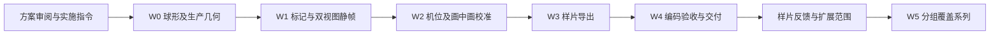

# 感觉瞄准视频系列：角袋方案 v1.9 与中袋扩展

> 2026-09-27新增中袋扩展，独立方案见[中袋r2版PLAN](../output/feel-aiming-middle-20260927/r2/PLAN.md)：目标位于两中袋连线上，距袋口约55cm，两球距60cm，左75°→0°→右75°，5°/s，32秒/2K60；数据栏下移避让袋口。下方v1.9参数仅适用于保留的角袋r10，不覆盖中袋。

## r10 当前裁定与参数（场景继承r7）

1. 红柱删除，假想球中心只留台呢红点（直径12mm/厚0.3mm），无假想球圆。白瞄准线、黑进球线不变；线名与侧向长引线仅在第三人称显示。
2. 第一人称为全宽直角视口(0,0,1440,640)，无外框；第三人称(0,644,1440,1636)；中间仅4px金色分隔线，无“感觉瞄准练习”标题带。视角名标签保留。主场景裁掉顶部280px背景，最终高度2280，保留球/桌原比例。
3. 两球球心距75cm；目标T=(0.9370253,0.8285750,0.1820253)m及原袋A=(1.312,0.8,0.677)m保持r6（世界+X短库位移12cm）。片内切角0°→75°，不是与库边的37.15°夹角。
4. 主机位高1.10m/后退1.65m/FOV44°，关注母球在台呢的投影；第一人称高0.18m/后退0.90m/FOV26°，关注C/G中点。全程参数固定、水平光轴沿C→G，无侧偏和袋口偏转。主镜头扩大视野用于全程袋口可见。
5. 俯视框(36,1500,444,620)，56px独立标题条；内容(36,1556,444,564)，正交scale0.13m，垂直向下/屏幕上沿C→G。
6. 原生1440×2280、60fps、1320帧、22秒、无声；0—1秒0°，1—21秒3.75°/s扫至75°，21—22秒停留。炭黑桌、绿台呢、墨龙杆、真实生产场景。

7. “第三人称”标签正下方增加角度、横移mm、薄度三行，白色40px，坐标x56/172、y754/816/878；薄度使用相邻八分之一范围，低于1/8写＜1/8球，准确标准薄度写单值。横移=57.15sinθ毫米，薄度=1−原厚度=sinθ，0°时为0。r9由r7成片逐帧叠字，1440帧同步/避让及完整解码通过；下方生产几何/采集测试为r7既有证据。

坐标契约：SceneKit X–Z台面、Y向上、米单位。G=T−2R·normalize(A−T)，距离固定为母球至目标球球心距。点/两线贴台呢，瞄准线穿目标球后虚线。

r10只裁去r9首尾各1秒，原中段速度不变；1320帧时间映射及编码参数已核对。以下几何/叠字检查为既有r7/r9证据。

## 验证与交付

- 751点生产几何、8关键帧、1440帧同轴/球距/实际切角/标注避让/袋口范围和编码检查通过。袋口包络为孔心周围70mm及台呢至高60mm，两个透视窗口全程留边≥24px；实际可见性结合编码抽帧。
- 三个定向采集测试各Executed 1 test、0 failures；桌面连续播放至24秒及门禁通过，详情见报告。用户观感/真机/平台裁切待验。
- [当前视频](../output/feel-aiming-20260924/feel-aiming-v014-r10-hold1s-2k60.mp4) · [报告](../output/feel-aiming-20260924/REPORT.md) · [参数](../output/feel-aiming-20260924/manifest.json)。旧r6完整参数/报告存于output/feel-aiming-20260924/r6/。
- 未批量扩展系列、无配音、未发布，不改变App默认设置。封面候选已生成：`output/feel-aiming-20260924/cover-r7-v2/cover.png`；生成式排版，待用户确认。

---

## 历史规划与研究（r1—r5，以下数字不再作为当前制作参数）

## r5 当时的用户裁定

- 第一人称后退并重新校准为更接近出杆观感；主画面与第一人称继续沿球杆轴线。
- 最新纠正：瞄准线为白色，与母球对应；进球线为黑色，与8号目标球对应。三视图标签移到线的侧面，拉长引线，不压住几何线。穿过目标球后的瞄准线保持虚线。
- 红色细柱和中心点，不画假想球圆；目标球旁新增局部正俯视小窗，原第一人称PIP保留。
- 本条角度限定0°—75°；原生1440×2560（竖屏2K）、60fps、24秒、无声。
- r3文件留档；本次只修改V014，不批量扩展系列，不改变App默认设置。

## 样片执行记录（2026-09-24，r5）

- 当前文件：[V014 r5 2K60样片](../output/feel-aiming-20260924/feel-aiming-v014-r5-2k60.mp4)，24秒、原生1440×2560、60fps、无声。旧r3同轴版保留。
- [报告](../output/feel-aiming-20260924/REPORT.md) · [参数](../output/feel-aiming-20260924/manifest.json) · [1440帧验证](../output/feel-aiming-20260924/r5/verification.json)。
- W0：F01/Q70/D60在0°—75°的751点生产几何预检通过；全系列90候选仍未正式制作。
- W1/W2：双透视沿杆方向，新增正俯视局部窗；红柱/白瞄准线/黑进球线、三视图线名完成。第一人称三组×三角度比较；8个关键角含29.9/30/30.1°检查通过；r5按最新配色、侧向长引线重新导出。
- W3：导出1440帧，testExport Executed 1 test、0 failures；原生2K并faststart重封装。
- W4：编码规格、完整解码、逐帧几何/机位/两小窗/文字/两线避让、编码抽帧与390px预览通过；全仓verify-gate通过。桌面连续播放到24秒已确认；用户观感、真机和平台裁切待验。
- W5：未批量制作或发布。

## 1. 需求回显与边界

### 1.1 用户明确要求

| 编号 | 原意及约束 | 对应章节 |
|---|---|---|
| U01 | 做感觉瞄准法视频系列，通过观看练习瞄准 | §2、§3 |
| U02 | 角度在一条视频内连续变化，最新裁定为 0°—75° | §4、§8 |
| U03 | 母球、目标球位置形成不同期的球形；固定目标球后，母球随角度移动 | §3、§4 |
| U04 | 不画假想球的圈，保留假想球中心点，并在该位置立一根细圆柱 | §7 |
| U05 | 白色瞄准线经过母球中心、圆柱中心并延伸至库边，贴着台呢；r4追加进球线 | §7 |
| U06 | 如果线穿过球，球后面的线用虚线 | §7.2 |
| U07 | 两种视角随角度变化；摄像头高度、距离是核心参数 | §5 |
| U08 | **主视频第三人称，第一人称放画中画** | §5、§6 |
| U09 | 先系统规划球形、机位等，再实施；使用 issue-collection 技能 | 全文、§10 |
| U10 | 即使第三人称，也要沿着球杆方向 | §5；覆盖旧侧偏候选 |
| U11 | 第一人称后退；新增目标球旁的正俯视小窗 | §5、§6 |
| U12 | 白色瞄准线、红柱、线名文字；2K、60fps | §6、§7 |

### 1.2 本方案建议，不冒充用户已拍板

- 基础篇先做两球直线进袋的几何瞄准画面；翻袋、勾球、组合球、加塞补偿分支另排。
- 单片固定目标球、目标袋和两球球心距，只连续改变切球角度；基础系列统一相机模板。
- 样片不击球，只移动摆位，不把绕行当作母球实际滚动轨迹；不加滚动自转或击球音效。
- 两视图全程同步，点、柱、线全程保留；“隐藏提示自测”是后续可选版本，不在首片擅自加入。
- 默认无声、无旁白、无音乐；添加进球线与两线标注；不画角弧、接触点、轨迹、厚度圆示意或旧版参数框。
- 采用当前视频外观：炭黑木纹球桌、绿台呢、墨龙球杆、真实球房和生产灯光。球杆是否出镜见 D04；不改变保存的 App 偏好。
- 几何基准不是所有杆法的最终进球解；速度、旋转、碰撞摩擦修正属于后续物理篇。当前不声称视频效果已由真人训练验证。

## 2. 覆盖目标：区分几何、观看条件与击球条件

“所有瞄准情况”不是有限几个点位的穷举。按以下三层覆盖，并保留缺口记录：

1. **基础几何**：切角、两球距离、目标球至袋口距离、入袋方向、左右切球。
2. **视觉与位置限制**：近库/贴库、很近的两球、远台、袋口出现在视野边缘、低视角遮挡。
3. **击球修正**：杆法、速度、加塞、贴库特殊碰撞、障碍/翻袋/勾球等。与基础几何分期，不把它们压进同一条角度扫描。

屏幕旋转、换球号、换袋但几何和视角完全等价，不自动算一种新训练内容。左右镜像虽几何对称，仍应真实重算和渲染，不能水平翻转成片导致球号、文字、球房与杆纹反向。

## 3. 球形体系与选片顺序

### 3.1 三个距离定义

- `D`：母球球心 C 到目标球球心 T 的水平距离，**单片固定**。
- `Q`：目标球球心 T 到指定袋口名义中心 P 的水平距离，用来生成候选；正式账本另记到有效入袋点 A 的距离 `Qeff`，不能混用。
- `L`：母球球心 C 到假想球中心 G 的水平距离。保持 D 不变时 L 随切角改变，不能固定 L 后仍声称“球距固定”。

基础档位建议：D = 0.30 / 0.60 / 1.00 m；Q = 0.35 / 0.70 / 1.00 m。用数值命名，不将 1 m 宣称为覆盖全部远台距离。

### 3.2 五类目标球位置

下面是可重算的**初始候选**，不是验收通过的球形。SceneKit 水平 XZ、米单位；角袋取 index 3，中袋取 index 5。`β` 是目标球→名义袋口方向相对世界 +X 的角度，不是切球角度。

| 类别 | 内容 | 袋号 | β | Q=0.70 m 时 T=(X,Z)，米 |
|---|---|---:|---:|---|
| F01 | 角袋正面斜线 | 3 | 45° | (0.817025, 0.182025) |
| F02 | 角袋偏长库侧 | 3 | 20° | (0.654215, 0.437586) |
| F03 | 角袋偏短库侧 | 3 | 70° | (1.072586, 0.019215) |
| F04 | 中袋正面 | 5 | 90° | (0, -0.024035) |
| F05 | 中袋斜入 | 5 | 45° | (-0.494975, 0.180990) |

生成式：`T = P - Q*(cosβ, sinβ)`。上述袋心来自当前代码，正式瞄准方向必须重新调用 `effectivePocketAimPoint`，不能一直使用名义袋心。

### 3.3 覆盖矩阵与数量口径

| 层次 | 候选范围 | 候选数 | 制作目的 |
|---|---|---:|---|
| S0 样片 | F01、Q=70 cm、D=60 cm、一个切球方向 | 1 | 验证点柱线、主镜头和第一人称画中画能否一起看清 |
| S1 基础 | 五类 × Q=70 cm × 三档 D × 两个方向 | 30 | 覆盖基本方向与球距，逐条筛选可用角度区间 |
| S2 袋距扩展 | 五类 × Q=35/100 cm × 三档 D × 两个方向 | 60 | 补近袋、远袋及不同台面背景 |
| S3 特殊 | 见下方专组 | 待筛选 | 补基础矩阵的极近、极远、近库与遮挡缺口 |

**90 是基础与袋距扩展的候选组合数，不是承诺交付 90 条，更不是 90 条都可扫满 0°—90°。** 一个候选若只有很短区间，不单独凑一期；与相邻球形互补或淘汰。系列正式数量以覆盖表和视觉可读性筛选后确定。

S3 规划：

- 极近两球：球面间隙 1/3/10 cm，即 D=2R+gap；与 D=30 cm 的普通近球区别。过近时出杆是否合法、标记是否可辨单独核验。
- 远台补充：D=1.5/2.0 m 候选，只使用桌面容许的方向和角度区间；不强求完整扫描。
- 母球近库与贴库：按球面到库鼻间隙 0/2/10 cm 分档；球杆抬升和被库边遮住的视觉单列。
- 目标球近库与贴库：同样按球面间隙区分，真实贴库不简单标成普通自由球的等价副本。
- 袋口极斜入与极薄切球分别登记：前者是目标球→袋的入射关系，后者是母球→假想球与目标球→袋的夹角。
- 障碍球限制的瞄准通道作为后续分支；首批保持两球画面简洁。

### 3.4 已进行的数学草稿与限制

本轮对 90 个候选各采样 0°—90°、步长 0.1°，只检查**名义袋心几何、两球球心距和母球矩形内框边界**：39 个全区间在框内、45 个只有部分采样在框内、6 个没有合法采样。部分候选的合法区间还可能断开，不能用最小角到最大角直接连成一段。

例：F01/Q70/D60 两方向均可通过这一粗检；F04/Q70/D60 的粗检起点约 15.4°，0°时母球已越出允许球心边界；F03/Q70/D100 一侧无采样通过。因此不能把“每期必从0到90”设成强制条件。

证据：[数学草稿账本](feel-aiming-v1/geometry-draft.json)。该草稿**未验证生产有效入袋点、库颚、球杆、相机、实际渲染和进球物理**，不能作为正式 fixture 或成片验收。W0 必须重做生产路径预检并输出连续合法区间与拒绝原因。

## 4. 几何契约与角度扫描

### 4.1 坐标与高度

- SceneKit 世界 XZ 为水平面，Y 向上；X 沿长边，Z 沿短边，单位米；数值基线见 `.kiro/steering/table-geometry.md`、`BTPhysicsConstants`、`AngleSceneCalculator`。
- 内框 2.54×1.27 m、球半径 R=0.028575 m，当前两处代码数值相同。球心高度用当前 `scene.surfaceY+R`。
- 摄像头高度统一记录为**高于台呢基准面的高度**，不与离地高度混用。
- 物理 `surfaceY`、USDZ 实测台呢、渲染台呢可能因校准路径不同有毫米级差异；贴线和立柱根部应对齐实际显示台呢，不能把球心 Y 当台呢 Y。
- 正式方案始终按世界坐标与 pocket index 定义球位；“屏幕右上角袋”等词随相机转动失效。

### 4.2 固定球心距的生成式

设 T=目标球、A=生产有效入袋点，均取 XZ；`n=normalize(A-T)`，`s=(-n.z,n.x)`，`q=2R`，`G=T-q*n`。

```text
u(θ, side) = n*cosθ + side*s*sinθ          side ∈ {-1,+1}
L(θ) = -q*cosθ + sqrt(D²-q²*sin²θ)
C(θ) = G-L(θ)*u(θ)
```

每帧独立从绝对时间计算 θ/C/u，禁止累加旋转造成漂移。`side` 是数学符号；用户可见“左切/右切”须由沿瞄准方向的真实投影核对后命名。

复用生产 `cutAngle(C,T,A)` 复算角度；D、T、A、G、球半径全段不变。旧 `AngleAimingVideoCaptureTests.setAngle` 固定 L=0.52 m，不直接复用；`SeparationIntroVideoCaptureTests.setAngle` 已有正确固定 D 公式，但它是私有且带特定方向/相机断言，只复用思路和生产几何，不绕过这些断言硬套新片。

### 4.3 75°上限与合法区间

- 最新用户要求本条只扫 0°—75°。此前90°端点方案已被覆盖；不改变生产 `maxCutAngle=89`。
- 扫描先得到所有连续合法区间，再选择本期区间。不能把两个被越界隔开的区间直接接起来，也不能夹住球位让角度标签继续增长。
- 本条F01/Q70/D60通过0°—75°生产几何预检。其他系列候选仍须单独筛选，不能沿用本条的可行区间。
- 正式预检包括球体而非仅球心的桌面包含、无两球重叠、路径对库颚的关系、目标至袋可达性、正常出杆空间、相机不穿资产。显示无击球不等于已验证能进袋。

## 5. 双摄像头系统

### 5.1 共用原则

两套镜头共享同一个世界状态和时间戳，**各自使用独立透视摄像头**。第一人称不是裁切放大的主画面，也不是正交接触特写。

各模板显式存储高度 h、沿瞄准方向后退 b、横向偏移 e、垂直 FOV、look-at 定义、视口宽高比、近远裁面。h/b/FOV 单片固定；基础系列也固定。相机只按规则跟随位置、方向和确定性关注点，不做逐帧自动缩放、自动抬高或横向躲避。

俯角由位置和 look-at 推导，不能同时随意指定“固定高度、固定距离、固定俯角、永远看同一点”四个互相制约的条件。账本记录实际俯角、水平距离和空间距离。

### 5.2 第三人称主画面：建议起始模板 M0

主画面从球杆正后方较高位置观察，两球、圆柱和瞄准线为核心。用户最新裁定要求与球杆同轴，不能侧移或朝袋口偏转；极薄角度时目标袋允许自然出画，不为保留袋口缩小球形或逐帧变焦。

| 参数 | 建议基线 | 比较候选 |
|---|---:|---|
| 高出台呢 h | 1.10 m | 0.85 / 1.10 / 1.35 m |
| 沿瞄准方向后退 b（相对母球） | 1.40 m | 1.10 / 1.40 / 1.70 m |
| 横向偏移 e | **0 m** | 用户已确定正后方；不再比较侧偏 |
| 垂直 FOV | 50° | 若统一模板不满足入镜，再整组比较45/55° |
| 关注点 K | `0.25*C+0.75*G`，高度为球心平面 | 用于稳定保持球形主体，不跟随屏幕袋口改方向 |

相机平面位置 `C-b*u+e*v`，其中 `v` 是沿 u 的水平垂线；Y=`surfaceY+h`。M0 相对母球的水平距离1.40 m，台呢投影到相机的空间距离约1.780 m；“1.40 m”明确只是沿轴后退量。

主画面机位绕行时必须能看清关键几何。PIP遮挡或球/柱/线端出框时，先在 W2 为整条片选择合适的固定构图参数；不能在成片里突然拉远。必要时增加一个明确编号的“远台主镜头模板”，单独成组，不悄悄改变基础篇的观看条件。

### 5.3 第一人称画中画：建议起始模板 P0

| 参数 | 建议基线 | 比较候选 |
|---|---:|---|
| 高出台呢 h | **0.30 m** | r4比较旧0.20m/0.45m、低位0.20m/0.75m与当前0.30m/0.75m |
| 沿瞄准方向后退 b（相对母球） | **0.75 m** | 旧0.45m镜头已被用户要求后退 |
| 横向偏移 | 0 | 不模拟偏眼，不为了显示袋口偏离瞄准轴 |
| 垂直 FOV | 40° | 必要时整组比较35/45°，不能逐帧变焦 |
| 关注点 | G，球心高度 | 光轴水平投影始终与 C→G 同向 |

P0 相机平面位置 `C-b*u`；Y=`surfaceY+h`。它是初始视觉候选，不宣称适合所有人的真实站姿或主视眼。球距由30变100cm时，允许目标球自然变小，不通过逐期变焦把差异抹掉。

画中画须看清母球前部/轮廓、目标球、圆柱和附近瞄准线；球杆出镜时至少保留杆头与前节。库边线端由主画面负责；袋口在两视图中均允许随角度自然出入画，不为了保留袋口偏转光轴。

历史V009的45cm高、65cm后退、80°FOV只作对照：旧镜头朝“瞄准方向与朝袋方向的混合方向”看，旧画中画是正交接触特写，均不直接等同于本次第一人称方案。

### 5.4 校准顺序，避免参数全组合失控

1. 在S0的0°/30°/75°状态，分别比较主镜头三档高度，固定其余参数；选一个高度再比较三档后退量，共5套唯一组合。
2. 同法比较第一人称5套唯一组合，初始约30张单视图静帧；FOV只在构图/可读性不满足时追加。
3. 将选定两套镜头合成，检查0°/15°/30°/45°/60°/75°/85°/90°，再看 D=30/100cm 的合法极值状态。
4. 先使用统一模板；不可满足时明确列出失败球形和原因，重新选全组模板或建立独立档。不得只用60cm中间角度的好看截图宣布整个系列机位已定。
5. 参数冻结写入同一份 manifest；高度、距离、FOV、PIP大小中任何一项改变，都使相应的视觉证据失效。

## 6. 合成构图与画中画

- r4原生渲染并交付1440×2560、9:16、60fps。r3的1080p只作历史留档。
- 第三人称铺满全幅；PIP固定在右上区域，候选矩形为母版 `(528,128,864,648)`，4:3、宽度60%，约占全画面15.2%。1080版对应 `(396,96,648,486)`。
- 位置/大小是校准起点，不是已验证安全区；PIP不在视频中跳边或跟球移动，内部镜头正常跟随。
- PIP使用细白边，无大标题栏；三个视图均有“瞄准线”“进球线”文字，屏幕空间投影跟随贴地线段，侧向长引线定位，文字避开两条线与球/柱。参考V009简洁标注，未复制旧假想球圆。
- 新增正俯视小窗480×400，位于主画面目标球左侧；左上角=(目标球屏幕X−590,目标球屏幕Y−200)。独立正交相机垂直台面，orthographicScale=0.12m，屏幕向上沿C→G；同一世界状态放大目标球、红柱顶点及两条贴地线。
- 主画面关键对象的整个运动包围范围加边距，必须避开PIP及平台预留区；检查母球、目标球、圆柱、目标袋、瞄准线关键段和库边终点，不只检查球心。
- 无法同时满足时，优先调整整段固定主机位/构图或PIP尺寸。全桌六袋、完整球杆后把、全部环境不属于每帧强制内容，不为它们把目标球缩得过小。
- 1080交付版候选可读性门槛：主画面目标球直径≥24px，PIP目标球直径≥28px；细柱可见段宽度宜≥2px。阈值需W2实际手机尺寸检查后冻结，不能以母版像素数替代最终缩小后的可读性。
- 先看清球形，再看装饰；画中画遮挡主画面或目标球过小时，禁止用放大球体、加粗到失真、取消深度遮挡来达标。
- 手机预览检查整个画面以约390px宽显示时的辨识度。模拟器/桌面缩略检查不等于真机或抖音/小红书/微信实际裁切验收。

## 7. 红色中心点、细圆柱与两条辅助线

### 7.1 点柱

- 用户所说假想球“中心点”在台呢上表示 G 的垂直投影；柱轴穿过G的XZ，向上通过假想球球心高度。绝不挪到目标球接触点。
- 初始候选：柱直径3mm，高80mm；点为实心圆点直径6mm。可比较柱直径2/3/4mm、高60/80/100mm，不同时排列所有组合。
- 点与柱同用红色，白色瞄准线；不闪烁、不呼吸、不发光泛晕，不画球大小的圈，不加粗底座。柱可有轻微立体明暗，但不投长阴影造成“第二条线”。
- 柱是视觉辅助，没有碰撞体、不参与物理、自动选球或球杆避障。点/柱与线的材质仅属于导出场景，不修改全局训练配色。
- 点被母球遮住时允许柱的上段提供参照；不能关闭深度测试强行穿球显示。若整根柱都不可见，先调整统一机位/柱高并重新核验。

### 7.2 线的完整语义

1. 白色瞄准线为 C→G 的台呢投影，并沿同方向延伸到真实台呢/库边边界；从母球投影中心起，母球下方自然被球遮挡。
2. 判断“穿过球”采用瞄准射线与目标球半径R的水平投影圆相交，**不是2R碰撞圆，也不是随相机变化的屏幕遮挡**。当前 `aimRayTargetEntry` 已有这一定义。
3. 推荐实虚规则：从母球到目标球投影圆入口为实线；从该入口到库边为虚线，球遮住的部分保持深度遮挡，自球后露出的部分即为虚线。若不相交，则全段实线。
4. 在无摩擦假想球几何里，中心线到目标球心的垂距为2R·sinθ，因此是否穿过R圆的分界约为30°，不是“只要母球能碰目标球，就一定有虚线”。30°切线附近须单独检查，避免实虚边界闪烁。
5. 虚线表示这条瞄准方向的延长，不是目标球进袋路线，也不是碰撞后的母球轨迹。无击球样片保持该含义；后续击球版另设物理轨迹。
6. 瞄准线全宽3mm；虚线同宽、段长18mm/间隔12mm，同为白色。新增T→A黑色虚线进球线，同宽同节距；三个视图是同一份世界几何。0°时两条线在目标球后重合，黑色进球线叠加显示。取最终编码后可读性定稿，不各自造线。
7. 复用 `addLine(...placement:.table)` / `addDashedLine(...placement:.table)` 和 `TableAssistSurface` 的台呢裁剪；禁止用球心高度的空间圆柱假装贴线。
8. `rayToInnerRail(inset:0)`只是内框射线端点初值。落在袋口缺口时，按真实台呢轮廓裁剪，不能把辅助线画到袋洞或皮革上；不得默认端点总有完整直库。

### 7.3 其他元素

隐藏生产默认假想球环、进球线、接触点、垂线、角弧、文字标签和额外袋口标记，导出器重建本片需要的两条贴地线与两线名。保留实际袋口/库边瞄准点和球号。球杆推荐保留前节方向感，使用生产自动抬杆；不可硬设零仰角穿库。首片不发生击球，圆柱无需临时消失。

## 8. 时间轴与单片参数账本

推荐完整扫描样片24秒、60fps、1440帧：

| 时间 | 画面 |
|---|---|
| 0—2 s | 0°起点停留，三个视图同时出现 |
| 2—22 s | 0°→75°，每秒3.75°匀速变化 |
| 22—24 s | 75°端点停留 |

段间角度连续；需要缓入缓出时在整条时间函数内明确，并保留测量记录，不用视频插帧伪造中间几何。合法区间不足时单独生成该片时间轴，不能照搬0—90标签。

manifest至少包含：主题/期号/修订号、球形F/Q/D/side、P与A、目标/假想球/母球位置、实际切角、合法区间、目标球号、桌/布/杆外观；每帧两套camera matrix、h/b/e/FOV/俯角/视口、PIP矩形、球径像素、标记大小、射线入口/端点、时间与帧号；git HEAD/dirty快照、源码资源哈希、Runtime、输出规格与文件哈希。

左右样片初期分开成片，不让一条视频中途从90°瞬移回0°或跨侧；主画面/PIP永远使用同一帧号。

## 9. 现有能力、复用点与实施边界

核实基线：2026-09-24，HEAD `a2c42d0e`，大量已有未提交修改，且其他任务在进行每日清台构建。行号仅为此时快照，执行前按符号重定位。

| 需求 | 当前能力与限制 | 本系列处理 |
|---|---|---|
| 生产球房/球桌/球杆 | `AngleTrainingScene`已有 | 单独导出实例，显式设置外观 |
| 固定D扫角 | Separation采集已有公式，但私有且与原图谱耦合 | 新增专用配置/薄采集器，复用生产计算，不改旧片默认 |
| 去环留点加柱 | 默认ghost包含环；已有hideAllVisualization | 用导出专用标记层，仅保留本片元素 |
| 贴台呢实虚线 | 已有台呢裁剪、R圆射线入口与实虚续线 | 复用能力；检查边界，不另造悬空空间线 |
| 同时双透视机位 | 旧片有双renderer合成，但画中画是正交接触近景 | 两个独立透视camera，共享同一帧状态，重做构图验收 |
| 第一人称沿轴 | 旧V009混合朝袋方向；App默认另有配置 | 本片独立明确沿C→G，不更改App相机默认 |
| 第三人称观察 | Sequence导出有站立与自动全桌适配 | 参考实现，不能直接套会改变半径/FOV的自动fit |
| 编码 | `VideoWriter`已有铺黑缓冲、H.264编码 | 同版本双视图合成后逐帧写入，输出faststart兼容文件 |

实施建议新增 `QiuJiTests/FeelAimingVideoCaptureTests.swift` 和专用采集/验证脚本（**拟新增，当前不存在**），通过项目正常生成入口接入测试target。此时不继续向已很长且已dirty的X1文件追加整个新系列。仅出现多个消费者确实需要的通用缺口时，才最小调整生产共享层，并补对应回归。

与每日清台相机改造、球桌材质v64并行时必须固定读取版本。只读本方案不要求停止其他任务；后续导出用专用模拟器/DerivedData/输出目录，不终止别人进程、不切别人的模拟器窗口。不能把别的任务新通过的测试或新截图记成本系列验收。

## 10. 批次、依赖与完成标准

下列按单次会话可执行到验收的粒度组织；当前用户已授权执行样片W0—W4。批次无需多智能体，并行仅指无冲突时可分会话安排。

| 批次 | 范围 | 量级 | 依赖 | 产物 |
|---|---|---|---|---|
| W0 | 球形定义、生产几何预检、样片fixture与候选覆盖表 | 中 | 实施指令与方案审阅 | fixture、合法区间、拒绝原因、需求选择记录 |
| W1 | 专用点柱线、单状态双透视渲染与静帧采集 | 中 | W0 | 最小导出器、标记与同步证据 |
| W2 | 两套机位、PIP构图、最终像素可读性校准 | 中 | W1 | 机位比较图、推荐定稿manifest、极值合成帧 |
| W3 | 确定性时间轴与一条完整样片导出 | 中 | W2 | 无声MP4、逐帧账本、编码配置 |
| W4 | 编码后视觉/同步/几何复核、交付与台账 | 小至中 | W3 | verification、REPORT、当前视频链接 |
| W5 | 代表球形扩展、特殊情况补缺与分批交付 | 按5类分组，不一次塞满 | W4样片反馈与系列扩展指令 | 覆盖矩阵、各期manifest/成片/验收 |



### W0 完成标准

- 从当前生产函数计算A/G/切角，按≤0.1°扫描并保留全部连续合法区间，另检查最终视频每帧；拒绝状态有原因，不静默裁剪。
- 几何误差建议：D误差≤1e-5m、实测切角误差≤0.01°；接近0°/90°需验证浮点稳定性，不拿clamp后的读数掩盖错误方向。
- 主动验证0°共线、30°实虚分界、左右镜像、远台越界、贴库出杆等断言前提；不改现有生产可行性阈值。
- 更新S0正式fixture与“候选→选用/局部/淘汰”覆盖表，标明首片实际范围。只有矩形粗检不能勾完成。

### W1 完成标准

- 实际模拟器内生产场景静帧显示第三人称+透视第一人称；无假想球环/第二条辅助线/旧标注。
- 点/柱轴与G投影一致，柱不参与物理或cue障碍；台呢线上每段高度来自显示表面路径，球/库正常遮挡。
- 验证0/29.9/30/30.1/60/90°的相交语义与端点裁剪；非相交状态不强行画球后虚线。
- 两视图在一次状态设置后渲染，中间不推进球形或改变目标；确认相机相关阴影/反射委托不会串用前一个renderer状态。
- 若改生产共享层，补命中该改动的调用方回归；不把导出成功代替App行为验收。

### W2 完成标准

- 按§5.4输出可比较静帧，不在比较高度时同时换FOV/球形；提交参数推荐和实测投影结果。
- 两视图目标球、柱等关键内容完整可辨；PIP不盖住主画面关键范围，全运动扫描通过。
- 高度/后退/FOV全段稳定；第一人称横向不偏轴；相机不穿库/墙/灯等资产；球杆不穿库或球。
- 在最终1080规格与约390px宽预览下检查；柱/线太细、目标球太小必须记录处理，不只看2K原图。
- 参数冻结后继续已授权的样片制作；如需改变用户确定的主次视图/标记含义，先说明具体冲突，不自动更换方案。

### W3 完成标准

- 使用 `scripts/Makefile test` 运行显式opt-in导出，兼容环境变量有无 `TEST_RUNNER_` 前缀；普通测试无变量时跳过，不自动写媒体到产品资源。
- 帧i使用t=i/fps；每帧共享几何、两次快照、合成、铺黑写缓冲，不卡住宿主主循环；失败时不交付未封口文件。
- 主画面/PIP相同帧号、角度与球位；几何和投影账本与实际视频帧数量匹配。
- XCTest必须有正确选中方法与 `Executed N tests`、N>0、零失败；仅TEST SUCCEEDED不够。改源码/资源后重建本片，不混用前后版本。

### W4 完成标准

- ffprobe核验尺寸、60fps、帧数、时长、H.264及无音轨；完整解码无错误，1080版等比缩小而非裁切或拉伸。
- 从编码后的实际MP4抽起点、实虚分界前后、30/45/60/75/85/90°和末帧；看两视图同时对应、无残影、无闪线、柱无突然消失、PIP无跳位。
- 连续播放检查慢变过程、镜头跟随、分段速度及端点停留；静帧检查与完整播放分别报告，未完成部分明示。
- 定向测试/导出之外，所需静态门禁和文档链接检查通过；不要求为无关脏工作区运行全量写盘测试或保证全仓零diff。
- 写报告、更新视频台账与进度，交付真实文件。真机播放/平台裁切/发布分开记录，没有做就不称完成；不自动上传发布。

### W5 完成标准

- 每类先一条代表片，验证统一镜头对该类成立后才批量；按F01→F04→F02/F03/F05→袋距扩展→特殊组推进。
- 覆盖矩阵逐格记录D/Q/方向/可用角度/所用机位；等价重复可合并，未覆盖原因必须留下。
- 每条有自己的编码验收、manifest和本地地址；不得把某一条样片通过扩张为整个系列通过。

## 11. 审阅选择与风险

| 编号 | 尚未拍板内容 | 本方案推荐 | 解决阶段 |
|---|---|---|---|
| D01 | 母版比例与PIP尺寸 | 9:16；右上4:3、宽60%，以避让及手机可读性校准 | W2 |
| D02 | 两套机位数值 | M0主画面1.10m高/后退1.40m/侧偏0m/50°；P0画中画0.20m高/后退0.45m/40° | W2 |
| D03 | 是否显示角度读数及视图名 | 首片无参数框；角度写入账本，视图名可小字显示 | W0/W2 |
| D04 | 球杆是否保留 | 推荐保留，提供出杆方向感；必须自动避库，不以杆身代替辅助线 | W1/W2 |
| D05 | 柱/点/线的颜色与尺寸 | 黄点黄柱、细白线，按§7候选校准 | W2 |
| D06 | 样片节奏及是否出杆 | 24秒、无声、只扫角度不击球；完整0—90以正式预检为准 | W0/W3 |

上述是用户可审阅的推荐选择，不是逐项强制审批关卡；后续若授权按推荐执行，直接开展校准并完成样片。当前最新指令已授权一条样片；按推荐项继续校准。

主要风险：①90个组合并不全可摆；②第一人称缩进PIP后不可读；③用旧正交接触窗冒充第一人称；④球心/台呢高度混淆导致悬线；⑤为了显示袋口改变瞄准光轴；⑥另一个任务修改共享材质/相机导致两次导出不同版本。各项分别由W0、W2、W1、W1、W2、W3解决并留证。

## 12. 已核实锚点索引

核实日期2026-09-24；以下符号均已读代码。行号可能随其他任务变化，执行前重新定位。

| 文件与行号 | 已核实内容 |
|---|---|
| `QiuJi/Core/Physics/BTPhysicsConstants.swift:22` | 球直径/半径常量 |
| `QiuJi/Core/Physics/BTPhysicsConstants.swift:68` | 角袋/中袋孔心偏移与当前中袋校准 |
| `QiuJi/Core/Scene/AngleSceneCalculator.swift:9` | 内框尺寸、球半径及坐标变换 |
| `QiuJi/Core/Scene/AngleSceneCalculator.swift:35` | ghostBallPosition，沿进袋反向退2R |
| `QiuJi/Core/Scene/AngleSceneCalculator.swift:179` | effectivePocketAimPoint，不等于固定孔心 |
| `QiuJi/Core/Scene/AngleSceneCalculator.swift:710` | cutAngle与紧接的maxCutAngle/isFeasible |
| `QiuJi/Core/Scene/AngleSceneCalculator.swift:1146` | aimRayTargetEntry，以R圆相交 |
| `QiuJi/Core/Scene/AngleSceneCalculator.swift:1162` | rayToInnerRail，inset=0延至内框 |
| `QiuJi/Core/Scene/AngleTrainingScene.swift:46` | applyClothColor及后续applyTableStyle |
| `QiuJi/Core/Scene/AngleTrainingScene.swift:548` | updateCueStick，生产requiredElevation避障 |
| `QiuJi/Core/Scene/AngleTrainingScene.swift:1385` | TableAssistLayer、实际显示台呢高度路径 |
| `QiuJi/Core/Scene/AngleTrainingScene.swift:1487` | addLine，placement=.table |
| `QiuJi/Core/Scene/AngleTrainingScene.swift:1527` | addDashedLine，台呢虚线入口 |
| `QiuJi/Core/Scene/AngleTrainingScene.swift:2151` | hideAllVisualization及后续updateVisualization |
| `QiuJi/Core/Scene/MobileClothAlignment.swift:40` | measuredBedY，真实网格测高 |
| `QiuJi/Core/Scene/TrajectoryRenderer.swift:163` | TableAssistSurface，load/ribbon台呢裁剪 |
| `QiuJi/Features/AngleTraining/ViewModels/AngleDynamicViewModel.swift:58` | setupScene会添加默认袋口标记 |
| `QiuJi/Features/AngleTraining/ViewModels/AngleDynamicViewModel.swift:331` | updateCalculations有生产可行性与可视化行为 |
| `QiuJiTests/X1_CameraAndAngleArcTests.swift:458` | 旧角度视频场景、固定3D机位 |
| `QiuJiTests/X1_CameraAndAngleArcTests.swift:511` | 旧角度setAngle固定L=0.52m |
| `QiuJiTests/X1_CameraAndAngleArcTests.swift:898` | contactInset，旧正交接触窗及固定屏幕矩形 |
| `QiuJiTests/X1_CameraAndAngleArcTests.swift:1035` | first-person预览，后退65cm、80°FOV、混合朝袋方向 |
| `QiuJiTests/X1_CameraAndAngleArcTests.swift:1303` | 图谱setAngle已有固定两球球心距公式及专用断言 |
| `QiuJi/Core/Media/SequenceVideoExporter.swift:898` | moveToObservation，站立及全桌自动适配分支 |
| `QiuJi/Core/Media/SequenceVideoExporter.swift:951` | moveToAim及独立aimingFieldOfView |
| `QiuJi/Core/Scene/AimingCameraConfig.swift:21` | App现有瞄准半径/高度/俯角配置，不直接改成视频候选 |
| `QiuJi/Core/Media/VideoWriter.swift:24` | AVAssetWriter初始化、append铺黑及帧时序 |
| `scripts/video/capture-angle-aiming.sh:1` | 旧opt-in采集脚本，选择性测试/独立目录 |
| `scripts/Makefile:161` | 构建与测试统一入口 |
| `docs/视频台账.md` | V014新系列规划登记；此前V009/V013为不同主题 |

## 13. 版本记录

| 版本 | 日期 | 变更与状态 |
|---|---|---|
| v1.2 | 2026-09-24 | 用户进一步确定第三人称也沿球杆方向；撤销r2侧移/朝袋口偏转，双机位同轴，袋口允许随角度自然出画。 |
| v1.1 | 2026-09-24 | 用户授权样片；开始W0—W4，独立模拟器、专用采集器；首轮1080原生预览校准。 |
| v1.0 | 2026-09-24 | 按用户最新主次视图要求系统规划；建立五类球形、90候选分层、固定D公式、双透视机位候选、PIP构图、标记/时间轴/验收及W0—W5依赖。仅规划，未制作。 |

后续修改升版本并同步正文，特别是PIP布局、镜头参数、球距定义和角度终点；不得同时保留两套互相冲突的“最终方案”。
