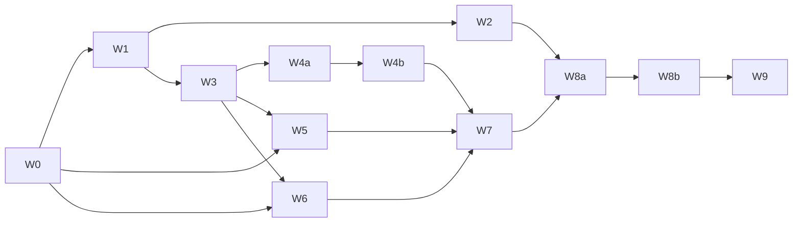

# 每日清台交互、相机与规则完整方案 v1

> **本文件是本轮需求真源。** 日期：2026-09-24。状态：**方案已整理，待审阅；未开始实现**。
> 来源：用户原始 25 项问题、两张参考截图，以及追加的“使用 issue-collection 整理完整方案；中八和追分须覆盖合理规则提示”。
> 工作方式：按 `.cursor/skills/issue-collection-restructure/SKILL.md` 对照真实代码拆批。用户要求先分析、先展示规则再实现，本次只写方案和进度入口。
> 本文覆盖本轮每日清台交互与规则需求；不覆盖或撤销 `问题集合_每日清台持续性能_v2.md` 的性能验收义务。本文中用户明确提出的新行为，在实施获准后覆盖 DR-320～324 中相冲突的旧行为。
> **排期前置**：W0 确定待拍板项与实施范围；不能把本文件中的“建议”当成已批准需求。准备通用能力供全部适用场景采用，按 W8 的调用方清单逐页接入，禁止永久停留在每日清台私有分支。

## 1. 需求回显与边界

### 1.1 用户明确要求（U01～U25 保留原编号）

| 编号 | 需求原意 | 方案位置 | 实施批次 |
|---|---|---|---|
| U01 | 2D 球库按 3D 的高度；释放空间适当放大 2D 球桌 | §3.1 | W1 |
| U02 | 2D/3D 按键及右上设置按钮稍大 | §3.1 | W1 |
| U03 | 球库、2D/3D、设置按钮统一高度 | §3.1 | W1 |
| U04 | 开球三角图标内增加几颗球 | §3.1 | W1 |
| U05 | 取消力度条松手击球，只保留击球按钮 | §3.2 | W1 |
| U06 | 打点盘按参考图：四向按钮环绕，红点半径减半，面板底边到下库内侧，不挡库边；2D/3D 相同样式位置 | §3.3、D03 | W2 |
| U07 | 开球完成后的选项文字更突出 | §3.4 | W1、W7 |
| U08 | 瞄准条增加类似力度条的触感反馈 | §3.2 | W1 |
| U09 | 开球后或击球中点开球，只出现“重新开球 / 继续击球” | §3.4、§8 | W1、W7 |
| U10 | 打完一杆的“继续清台”改为“继续击球” | §5 | W3、W5、W6 |
| U11 | 默认进袋模式 | §4 | W3 |
| U12 | 瞄准特写默认关闭 | §3.5 | W1 |
| U13 | 瞄准条向下加长，“微调”改“方向”，置于外框内底部 | §3.2 | W1 |
| U14 | “力度”和数值置于力度条外框内底部 | §3.2 | W1 |
| U15 | 返回箭头、每日清台标题稍大 | §3.1 | W1 |
| U16 | 球库按玩法过滤、始终居中 | §3.1 | W1 |
| U17 | 3D 场景铺满屏幕，控件和球库作为上层悬浮层 | §3.1 | W1 |
| U18 | 力度条左侧两个图标：俯身第一人称、站立第三人称；位置以靠近库边为准，参考 Shooterspool | §7 | W4a、W4b |
| U19 | 缩小时不让球桌过小，放大时可观察远台球 | §7.2 | W4a |
| U20 | 点目标球改变瞄准方向，取消现有不合适的查看球行为；转到当前瞄准第三人称，镜头及球杆转动稍慢 | §7.3、D02 | W3、W4b |
| U21 | 优先最近可进袋口；无解临时自由模式；换可进球或下一杆自动恢复进袋模式，有文字提示 | §4、§5 | W3 |
| U22 | 3D 开球不自动切侧面，保留原视角 | §7.3 | W4b |
| U23 | 当前瞄准第一人称击球后转同杆第三人称；第三人称保留；其他用户观察位保留 | §7.3 | W4b |
| U24 | 3D 与 2D 真正统一选球，显示假想球、轨迹、目标袋口 | §4 | W3 |
| U25 | 中八轮流打两组，按规则换手和结束；调研并展示中八、追分规则，适配一个用户后再实现 | §5、§6、§8 | W0、W5、W6、W7 |

追加要求 U26：中八、追分的错误选球及其他规则交互必须有合理提示。§5 给出触发条件、文案、动作和提示优先级；W3/W5/W6/W7 均须验收，不能只补一条 toast。

### 1.2 已确认与尚未确认

- 已确认：上述用户诉求；本轮整理文档；后续通用能力需考虑所有适用 2D/3D 场景。
- 尚未确认：CBSA 或 WPA Heyball 的具体规则版本；追分计分及单人终局；U20 的相机语义；自由观察下打点盘锚点；旧存档迁移选择。
- 本轮不修改 Swift、资源、测试、产品规格、设计组件规范，不构建安装或发布；不把已有 dirty changes 计为本方案实现。
- 参考图用于用户明确指定的视觉意图，不将图内其他内容视作额外指令。

## 2. 事实、根因及现有实现边界

核实基线：2026-09-24 当前工作区，含大量已有未提交修改。行号是快照，执行前应按符号重新定位，保留其他任务的变更。

1. `FreePlayView.dailyLandscapeBody` 为顶部 44pt、左右各 52pt 的布局；场景宽度先减 120、高度减 44。黑边来自分区和裁剪，删除黑色背景不足以全屏。
2. `dailyLandscapeHeader` 仅对 2D 球库做额外向下偏移；球库固定 16 个槽。去偏移后仍需重新计算 2D 取景，不能宣称球桌自然变大。
3. 每日显式关闭方向尺触感；进袋模式又禁用方向尺。启用默认进袋需同时定义手动调方向行为。
4. 力度松手包含立即击球、求解完成后补发击球、辅助功能击球入口，必须一起移除。
5. 每日 3D `handleTargetTap` 调 `ShotPlayCamera.inspectBall` 后返回，绕过合法目标检查和 `selectTarget`。
6. `selectBestPocket` 已找最近可行袋口，但无解回退最近任意袋口；`autoSelectTarget` 没有每日当前回合合法候选注入。
7. 每日进入时强制 `aimMode = .free`；`showAimCloseup` 无存储值时默认为 true。
8. 打点盘紧凑分支为左右分栏；红点尺寸与皮头尺寸相关。仅改变显示半径，禁止改物理皮头、有效击球范围或滑杆模型。
9. 相机以母球为瞄准中心；每日使用较窄 FOV 和补偿距离；实际更新有台面上方至少 0.3m 的高度下限。低姿态不能只改配置。
10. 开球进入计算/击球阶段即请求全桌观察镜头，不能只删停稳回调。
11. 每日规则只有 assignedGroup/status，没有双方回合；普通对局引擎也含简化假设，不能直接作为完整标准复制。
12. 普通 `ZhuifenRules` 累加球号分，每日 4/5/6/9 使用另一套简化规则。两者不等于本轮待确认的追分规则。
13. `handleShotSettled` 连续发送裁决消息、自由球消息，后者可能覆盖犯规原因和换手信息。
14. `replayCurrent` 恢复盘面参数但没有同步每日规则、统计。重开请求可先改控制器状态，实际开球又被 `isPlaying` 拦截，需事务式处理。

视觉证据：用户两张截图；历史截图 `build/daily-camera-intent-20260923/standard/landscape-3d-overview.png`、`landscape-3d-cue-view.png`。本轮未重新运行模拟器；历史截图只辅助理解，不作为新实现验收证据。

## 3. 界面与操作规范

### 3.1 顶栏、球库与场景

- 2D/3D 共用顶栏尺寸来源；统一可见外框高度与垂直中心，不能只统一透明 hit frame。
- 初始设计候选：可见顶栏控件约 40pt、触摸区至少 44pt；标题/箭头/设置图标适度增大。具体字号在小屏、常规屏和 iPad 实页对照后固定为共享 token，不硬编码分散尺寸。
- 球库按实际球数居中，进袋球保留槽位并变暗；不能因球被打进而整排漂移。球少时不无限放大球径。
- 中八白球+1～15；9 球白球+1～9；6 球白球+1、2、3、4、5、9；5 球白球+1、2、3、4、9；4 球白球+1、2、3、9。目标球数不含白球。
- 2D 利用释放空间重新拟合完整球桌，保留合理边距和左右操作位置；方向与现有横屏一致。
- 3D 改为底层全屏场景、上层 HUD；场景延伸到边缘，按钮服从安全区域。不得通过拉伸画面或裁掉交互区域伪造全屏。
- HUD 命中优先于场景，不允许点击按钮穿透成选球/拖球；相机手势不穿过正在操作的尺子或打点盘。
- 复用已存在 `BreakRackGlyph` 的带球三角图标。
- 顶部状态提示不能挤掉或移动居中球库；窄屏排布单独验收，不静默隐藏关键规则状态。

### 3.2 方向、力度及击球

- 外框采用共同视觉规范，轨道上方/中部、文字区在框内下方；方向显示“方向”，力度显示“力度”和当前数字。
- 方向尺向下延长到操作按钮上方，保留间距；文字区不参与拖动值映射，避免轨道有效长度变化引发跳值。
- 力度拖动只调数值/轨迹预览；松手、移出、切 2D/3D、离页、后台、求解迟到、辅助功能调整均不出杆。仅点击击球按钮或其等价辅助功能激活可以出杆。
- 正常击球和手动开球都遵守上述约束；取消现有 `powerReleasePending` 自动提交语义。其它消费者迁移时按能力明确选择，不能残留不易发现的自动出杆通道。
- 方向尺轻触感参照力度尺；方向连续调整，震动节奏与滑动距离/刻度解耦，不将方向粗粒度吸附。
- 边界、快拖、慢拖、连续拖、取消都验证；节流防止密集振动。模拟器只能证明事件调用，真实触感须手机确认。
- 操作唤醒、松手休眠沿用已有性能策略；禁止为了触感增加常驻 DisplayLink 或降低帧率替代优化。

### 3.3 打点盘

- 四按钮分别居上/下/左/右，底部状态与回中，2D/3D 共用组件。
- 红点显示半径为现状 0.5 倍；绑定值、步进、触摸面积、物理参数保持原语义。迷你图标是否同步视觉比例在 W2 对照确认。
- 响应式计算盘径与按键位置，优先保证按键有效命中区；不能直接将现有非紧凑分支塞入横屏造成溢出。
- 2D 锚定下库内沿在屏幕中的投影；禁止将竖屏旋转用的 `ShotStageProxy` 直接用于横屏透视。
- 3D 锚点遵循 D03。建议基于面板横向覆盖范围内的库边投影选择不遮库位置，隐藏/斜切/出屏时有明确回退；不能以固定 8pt 偏移冒充对齐。
- “2D/3D 相同位置”至少保证相同语义锚点和视觉尺寸；若要求固定相同屏幕坐标，须在 D03 明确与任意视角库边重合的取舍。
- 验收含双模式、小屏高度、横竖切换、远近缩放、面板打开时转镜头、字幕提示共存。

### 3.4 双选项与文字对比

- 开球完成以及进行中请求重开，统一呈现“重新开球 / 继续击球”；不再出现第三个“完成/取消/放弃并重开”按钮。
- “继续击球”为主操作；“重新开球”为次操作并清楚表达重开，文字不能被绿色背景染成低对比。
- 球尚未停稳时，继续只是关闭面板、保留进行中的一杆；不会提前结算或允许连续出杆。
- 选择重开后按 §8 取消旧局并建立新局；不能只关闭弹窗再等待旧回调改变新局。
- 已结束局不出现无效的继续入口；U09 针对有效进行中的局，终局显示结果及相应重开操作。
- 弹窗期间动态状态变化不重复弹出、不切换按钮含义；开球交付幂等，不重复统计。

### 3.5 默认偏好

- 每日初始偏好进袋模式；自动开球阶段无选球辅助不等于永久切自由模式。
- 无显式保存值时，瞄准特写默认关闭；用户保存的 true/false 保留。新装、升级、清除设置、跨页面入口都验证。
- 共享偏好变更覆盖使用该偏好的适用页面；专用教学/导出镜头不读取 UI 默认值来改变输出。

## 4. 选球与模式状态

### 4.1 单一选择流程

`交互状态允许 → 识别桌上球 → 校验当前规则首碰目标 → 提交选择 → 选择可行袋口或临时自由 → 刷新辅助线 → 执行相机策略`。

- 2D/3D 共享同一结果；禁止 3D 提前 return 绕过规则。
- 不合法选择仅提示，保留原目标、袋口、方向、打点、力度和镜头，不扣分、不判犯规；真正出杆的犯规由实际物理事实裁决。
- 点选母球不将它设为目标球；自由球时用于合法摆球，平时不再暗含“切第一人称”（已有两个明确相机按钮）。此母球行为属于实施建议，W0 一并确认。
- 已进袋球/球库状态球不能成为桌上目标；球库不新增拖球入场功能。
- 自由手动瞄准允许组合、解球和防守，不能仅因预览首碰风险禁止出杆；但显式选首碰目标仍遵守规则。组合进 9 的策略不能被误写成“9 号永远不能进”。
- 异步求解携带选择/球局版本，过时结果不得覆盖新目标；计算中不能误报无解。计算完成与自动选球不得抢走用户手动镜头。

### 4.2 模式转换表

概念字段（设计名，尚未实现）：`preferredAimMode`、`effectiveAimMode`、`temporaryFreeReason`。

| 前态/事件 | 结果 | 提示 |
|---|---|---|
| 偏好进袋，选合法且可直进球 | 最近可行袋口、进袋辅助 | 仅从自由恢复时提示“进袋模式” |
| 当前球所有直进袋口不可行 | 临时自由，保留合理初始方向 | “暂无可直进袋口，已切换自由模式” |
| 临时自由换选可进球 | 自动恢复进袋 | “进袋模式” |
| 临时自由一杆结束 | 按新回合合法球重评；能解则恢复，否则临时自由 | 按结果合并到杆末提示 |
| 用户主动选自由 | 自由偏好持续 | “自由模式” |
| 用户主动选进袋 | 重评当前合法目标 | “进袋模式”或上述无解提示 |
| 进袋时拖方向尺 | 建议进入本杆临时自由，方向连续 | “自由模式：手动调整方向” |
| 开球/回放/终局 | 不进行不合时宜的自动选球和模式提示 | 使用对应状态提示 |

“最近”是目标球到有效袋口的距离，在几何可行和路径不被阻挡的候选中比较。用户显式指定的有效袋口不被普通参数刷新强行替换；球位/目标变化使其失效时说明原因再调整。无解仅指当前辅助直进解，不宣称所有打法无解。

## 5. 规则提示与交互矩阵

### 5.1 统一呈现契约

- 常驻短状态表示“开放局 / 全色 / 花色 / 黑八 / 当前 3 号”等，并显示必要的自由球状态；不能只藏在 accessibility value。
- 短提示用于操作反馈，建议普通 2～3 秒、犯规/换手 3～4 秒；这只是初始候选，支持较长文案与辅助功能朗读。
- 优先级：终局 > 犯规与自由球 > 换手/定组 > 非法选择 > 模式切换 > 普通续打。同一杆合成一条完整消息，避免后一条覆盖前一条。
- 同一对象重复误点合并提示，合法新操作可替换旧普通提示；球局版本变化清除旧消息。不能清空仍有效的常驻状态。
- 禁用控件必须有可读原因；VoiceOver 有标签、当前值、禁用原因及必要 announcement。不依赖红绿颜色区分。
- “自由模式”是方向操作；“自由球”是摆球权。消息与业务状态分开生成，不靠中文字符串决定换手或计分。
- 2D/3D 同一事件返回同一提示模型，避免两份手写判定。以下文案为方案候选，可在保持原因和操作指引的前提下精简。

### 5.2 中八：选择前与摆球

| ID | 触发条件 | 文案示例 | 操作/状态结果 |
|---|---|---|---|
| M01 | 全色回合点花色 | 当前打全色，请选择 1～7 号球 | 拒绝目标变更；不切镜头；不记犯规 |
| M02 | 花色回合点全色 | 当前打花色，请选择 9～15 号球 | 同上 |
| M03 | 本组未清空点 8 | 先打完全色球，再打黑八（花色同理） | 保留原选择 |
| M04 | 开放局点 8 | 当前尚未定组，请先选择全色或花色球 | 保留开放局，不切视角 |
| M05 | 本组清空仍点其他组 | 本组已清空，请击打黑八 | 拒绝变更，保留 8 的合法辅助 |
| M06 | 开放局点普通目标 | 可瞄准；必要时显示“开放局，进球后定组” | 不因点击锁定球组；不每次重复播报 |
| M07 | 正常回合尝试拖母球 | 当前不是自由球，母球不能移动 | 不改球位；点选与拖动阈值区分 |
| M08 | 全台自由球摆到重叠/台外 | 此处不能放球，请移到台内空位 | 保持最后合法位置；未完成摆球不得误出杆 |
| M09 | 线后自由球拖出合法区 | 开球犯规后，请在线后摆放母球 | 显示合法区；不默许全台摆放 |
| M10 | 点已进袋或不存在球 | 这颗球已进袋（必要时） | 球库仅状态反馈，不重新放球 |
| M11 | 选不可直进袋口 | 该袋口暂不可直进，请换袋口或使用自由模式 | 不展示虚假的可进轨迹；按 §4 处理 |

### 5.3 中八：实际击球结束

| ID | 事实/裁决 | 文案示例 | 结果 |
|---|---|---|---|
| M12 | 开放局合法定全色/花色 | 已定组：全色，继续击球 | 保存双方球组；常驻“全色” |
| M13 | 合法打进本组球 | 继续击球 | 当前方继续；不抢镜头 |
| M14 | 未进且无犯规 | 未进球，轮到花色（全色同理） | 换方、刷新合法目标 |
| M15 | 开放局未进 | 未进球，换手；球局仍开放 | 换逻辑回合，不强行分组 |
| M16 | 首碰错误 | 犯规：先碰到花色球。轮到花色，自由球 | 一次合成消息；按对手球组输出 |
| M17 | 空杆/无进球且接触后无碰库 | 犯规：未碰到目标球／触球后无球碰库。轮到…，自由球 | 原因准确，不混为未进球 |
| M18 | 白球落袋 | 犯规：白球落袋。轮到…，自由球 | 合法恢复母球并进入摆球权 |
| M19 | 打进本组且带进对方球，无犯规 | 继续击球 | 双方落袋事实均保留；不误判换手 |
| M20 | 合法首碰但只进对方球 | 未进本组球，轮到… | 不把任何目标球进袋都算续打 |
| M21 | 本组最后一颗合法进，8 仍在桌 | 全色已清空，下一杆击打黑八 | 合法目标改为 8 |
| M22 | 合法进 8 | 全色完成清台（花色同理） | 每日完成一次；常驻结果替代回合 |
| M23 | 提前进 8 / 最后一颗本组与 8 同杆进 | 黑八提前落袋，本局结束 | 单人训练失败，不误计完成 |
| M24 | 打 8 白球落袋而 8 留桌 | 犯规：白球落袋。轮到…，自由球 | 不因“打黑八时白球进袋”一概判负 |
| M25 | 8 落袋同时犯规 / 8 飞台 | 黑八落袋同时犯规／黑八离台，本局结束 | 终局优先，不再弹自由球或自动选球 |
| M26 | 开放局跨组传进 | 跨组传进，尚未定组，换手 | 仅按批准规则版本启用，不按先落袋颜色定组 |
| M27 | 同杆进两组的复杂定组 | 按首碰和批准条款生成定组或选择提示 | 不由 pocketedKeys 时间先后武断定组；若需选择，用全色/花色明确选项 |

### 5.4 追分/九球：选择与击球

| ID | 触发条件 | 文案示例 | 结果 |
|---|---|---|---|
| Z01 | 最小号为 3，点其他球作首碰目标 | 当前应先打 3 号球 | 拒绝替换首碰目标；不判犯规或切镜头 |
| Z02 | 尚有小号时点 9 | 请先碰 3 号球；合法传进 9 号可以结束本局 | 仅在需要解释时用长提示；不禁合法组合线路 |
| Z03 | 仅剩 9 | 最后打 9 号球 | 选 9，更新袋口辅助 |
| Z04 | 合法进球、9 未进 | 继续击球；当前 4 号 | 本次上手继续，更新最小号 |
| Z05 | 合法未进 | 本次上手结束，继续击球 | 记录本次上手；单人进入下一次上手，母球原位 |
| Z06 | 错误首碰 | 犯规：应先碰 3 号球，自由球 | 结束上手、计一次犯规，按规则摆球 |
| Z07 | 白球落袋/空杆/接触后无碰库 | 犯规：白球落袋／未碰球／触球后无球碰库，自由球 | 原因按实际事实生成 |
| Z08 | 合法组合进 9 | 9 号合法落袋，本局完成 | 按版本判完成类型；不要求所有小号已入袋 |
| Z09 | 犯规同时进 9 | 犯规：9 号已重置，自由球 | 不计完成，先安全重置再允许继续 |
| Z10 | 系统开球后一次上手完成 | 一杆清台（系统开球） | 不冠名用户“大金” |
| Z11 | 用户合法开球并完成符合条件的大金 | 大金：开球清台 | 类型及分值须 D04 通过；不能仅检查 shotCount |
| Z12 | 达到小金/接清条件 | 小金／接清 | 按选定规则区分传 9、干开、后续接手，不随意混名 |
| Z13 | 单人连续多次犯规 | 犯规…；累计 N 次犯规 | 默认建议不套用双方三犯判负；若采用须事前明示及第二犯警告 |

### 5.5 开球、通用状态与消息冲突

| ID | 场景 | 文案/表现 | 约束 |
|---|---|---|---|
| C01 | 正在求解 | 正在计算… | 不误报无解；击球可用性与对应结果版本一致 |
| C02 | 球仍在运动时尝试操作 | 请等待球停稳 | 不允许新击球/选球；开球按钮的重开选择仍可用 |
| C03 | 普通杆末＋模式恢复 | 轮到花色 · 进袋模式（示例） | 组合一次提示；不覆盖换手消息 |
| C04 | 犯规＋模式恢复 | 先显示犯规原因和自由球 | 模式通过常驻状态表达，不抢提示 |
| C05 | 开球合法进 8 | 黑八已重置，继续击球（CBSA 候选） | 不是自动失败或盲目重试 |
| C06 | 开球犯规 | 开球犯规：…，线后自由球／规则规定的处理 | 根据游戏和具体犯规，禁止统一写“任意拖放” |
| C07 | 不满足开球碰库条件 | 开球未满足碰库要求 | 按 D01 选择规则路径，不假装只是无进球 |
| C08 | 开球合法进 9 | 按 D04 显示完成/小金等结果 | 不沿用当前终局球入袋一律重试 |
| C09 | 点重新开球 | 正在重新开球…（需要等待时） | 旧结算不得写入新局；不重复弹确认 |
| C10 | 重打 | 已恢复上一杆，可重新击球 | 球位、规则、提示、计分、镜头同步恢复 |
| C11 | 回放 | 回放中 | 不定组、不换手、不加分、不重复完成 |
| C12 | 旧存档恢复 | 本局沿用旧规则，重新开球后使用新规则（候选） | 不静默把旧状态套新裁决 |
| C13 | 规则禁止摆球但用户处于自由瞄准 | 当前不是自由球，母球不能移动 | 不因 effectiveAimMode=free 放开摆球 |

## 6. 规则依据与单人适配草案（待用户确认）

### 6.1 来源和版本

| 来源 | 本轮用途 | 限制 |
|---|---|---|
| [CBSA 中式台球竞赛总则，2017-01 修订](https://cbsa.cssf.net.cn/annoucement/2017/0120/142126.html) | 中八球组、开放局、开球、犯规和黑八判定基准候选 | 是明确日期的公开版本，不宣称 2026 最新统一赛事规则 |
| [WPA Heyball，2025-08](https://wpapool.com/wp-content/uploads/2025/08/250816-Rules-of-Heyball.pdf) | 对照开球进 8、开放局等版本差异 | 不与 CBSA 有差异的条款任意拼接 |
| [WPA Rules of Play，生效 2025-09-15](https://www.wpapool.com/wp-content/uploads/2026/01/2026.01.02-WPA-Rules.pdf) | 九球首碰、续打、9 号重置、普通犯规和三犯 | 九球基础不等于全部追分计分约定 |
| [乔氏“决金”，2019-05-23](https://www.joy147.com/newsinfo/1195137.html) | 追分大金、小金及 6/4/2 结果分的可核实实例 | 历史赛事版本，不能代表所有民间 4/5/6 球追分 |
| [Shooterspool 官方展示](https://www.shooterspool.net/) | 人眼观察与俯身视角的视觉参考 | 未查到可直接采用的官方相机高度/距离参数 |

以上来源已在前一轮分析中查阅。本文件不复制完整规则；实施 W0 须按选定版本建立条款编号与测试映射。仓库旧 `docs/research/20260707-中八追分规则调研.md` 含 App 约定，不可代替上述正式来源。

### 6.2 中八拟采用方式

- 建议以 CBSA 上述版本为基础；由一个用户操作双方。开放局合法定组后，双方分别持有全色/花色，未进或犯规时轮换。
- 点球仅表示瞄准意图；不凭点击正式定组。用户原话“第一颗球选择全色”与标准定组时机的差异须 D01 拍板。
- 任一方合法完成本组和黑八，算本次清台完成；提前黑八等判负算训练失败，不以逻辑对手获胜偷换为训练成功。
- 正常首碰、碰库、白球进袋、黑八等裁决使用物理事实；实际没有模拟的行为不得伪造检测，例如双脚离地、球员手碰球等现实赛事条款不适用于本 App 输入。
- 开球后保持开放；开球合法进 8 按版本重置；不同开球犯规区分线后/全台摆球及继续/重开选择。
- CBSA 开放局跨组传进不关闭球局并换手；同杆双组不能按先落袋事件直接定组。具体版本的同时首碰处理须在 W0 条款映射中钉死。
- 合法首碰本组并进本组可续打；只进对方球不获得本组续打资格；球的去留以规则裁决为准。
- 最后一颗本组球与 8 同杆进不能当作正常清台；打 8 时白球进但 8 留桌不能一律判负。
- 8 重置点占用、贴库球离开再回库、目标球飞台、同时首碰、多个犯规原因的主次均需边界测试。现有 ShotFacts 不足的项先补事实，不能猜。

### 6.3 追分拟采用方式

- 9 球基础：先碰最小号，合法进球继续，合法进 9 完成；犯规进 9 重置，其他球去留按批准规则；不使用球号累加计分。
- 4/5/6 球是本 App 缩减球数的训练变体，保持现有球集合；不能宣称这些集合及计分均为全国统一标准。
- 单人按“上手”记录：从开始连续击球到第一次未进/犯规为一次上手；未进后从原位开始下一次，犯规后按摆球权开始下一次。没有虚构对手或自动替用户出杆。
- 建议主要成绩：球数玩法、系统/用户开球、上手次数、杆数、犯规、完成类型；不同球数不混排。
- 乔氏 2019 实例采用大金 6、小金 4、普通胜 2，并对开球进 9、特定传 9 有单独归类。是否采用该套及其定义由 D04 决定，不只取分值忽略条件。
- 系统自动开球产生的成绩标明来源，不计为用户亲自开球的大金；如希望每日可练大金，保留用户手动开球入口。
- 单人犯规扣分、三犯结束、推杆（push-out）、让球、强制进攻/禁止防守等不是自动继承项。建议首版保留正常防守，单人不开放对手选择型 push-out，不把双方三犯规则直接套成三次累计犯规失败；均在 D04 作为适配条款确认。
- D04 未确认前，积分和“大金/小金”最终分类不得上线；不以文案模糊掩盖缺少定义。

### 6.4 待拍板清单

| ID | 需要确定的语义 | 推荐草案 | 依赖批次 |
|---|---|---|---|
| D01 | 中八版本、点击/进球定组、单人胜负、开球特殊处置 | CBSA 公开版本＋合法进球定组＋一人轮换两方；合法完成记完成，规则判负记失败；开球选择按原条款提供规则专用处理 | W0、W5、W7 |
| D02 | U20“不进行视角变动”与“切第三人称”如何兼容；点母球行为 | 取消查看球镜头，真正选球后平滑到对应第三人称；点母球不隐式切视角，使用两个明确按钮 | W3、W4b |
| D03 | 任意 3D 视角中固定屏幕位置与库边重合的冲突 | 固定视角按库边投影；自由观察允许避让/安全回退，样式一致 | W2 |
| D04 | 追分版本、计分、金的定义、自动开球和三犯/push-out | 先记录上手与完成类型；如计分采用明确结果分版本；系统开球独立标记，单人不自动套用双方三犯与 push-out | W0、W6、W7 |
| D05 | 旧局恢复与重打成绩 | 旧局保留旧规则直至重开；重打完整回滚未终局一杆，终局是否允许撤销须明确，不得留下完成记录与盘面矛盾 | W7 |

D01 的规则专用选择不是 U09 的“主动点击开球”弹窗第三按钮；若希望所有开球异常也只用相同两按钮，需要明确接受相应比赛选项的单人简化，不能静默删条款。

## 7. 相机与几何契约

### 7.1 机位

- 实施前加载 `geometry-spatial-reasoning`，以 `.kiro/steering/table-geometry.md` 为几何真源。3D XZ 为台面、Y 向上、米；2D 屏幕点与世界坐标通过实际投影转换。
- 从母球沿出杆方向反向求出杆侧库边位置，基于库边外侧确定人眼机位；不能固定距母球一个半径导致贴库球/中台球站位失真。
- 第一人称模拟俯身；第三人称模拟同侧站起。原型候选台面上方 0.10～0.20m / 0.75～0.90m，均非 Shooterspool 官方参数或已定稿值。
- 审查 CameraRig 两处 0.3m 高度下限、近裁面、球杆/库边遮挡和 FOV。高度变化不改球桌/球/球杆物理几何。
- 机位按钮仅图标，在力度条左侧上下排列；语义标签“第一人称瞄准 / 第三人称观察”，活动状态可见；不靠图标形状猜测功能。
- 无有效目标时以当前有效杆向构造机位，缺少母球则禁用并说明原因；不能用零向量制造突跳。

### 7.2 缩放及屏幕占比

- 分第一人称、第三人称、自由观察约束；最远不超过合理全桌观察范围，最近能观察远台球与袋口且不穿模。
- W4a 在固定场景/设备记录最远桌面投影占比、最近球像素直径、近裁问题，交付前后截图和最终参数表；具体阈值先用原型实测确定，不凭脑算固定倍率。
- 小屏/iPad/横屏安全区域分别拟合；取消冗余重复的距离补偿，保持 FOV 与距离变化关系可解释。
- 用户捏合或旋转后转入手动观察所有权，后续普通参数刷新不重置。

### 7.3 相机状态与时间线

概念状态：当前杆第一人称、当前杆第三人称、手动观察；另存所关联杆/目标的版本。不是已存在的类型名。

| 事件 | 镜头行为 |
|---|---|
| 选合法目标 | 按 D02 转当前瞄准第三人称；基于真实击球方向，不只看目标球中心 |
| 选非法球 | 保持镜头、球杆和原选择；仅提示 |
| 点击第一/第三人称图标 | 同一出杆侧平滑切换；按钮高亮对应状态 |
| 第一人称点击击球 | 球杆完成出杆，接触/发球后平滑站起到同一杆第三人称 |
| 第三人称击球 | 保留第三人称 |
| 手动观察位击球 | 保留用户视角 |
| 开球 | 原机位保留，删除强制侧面/全桌重取景 |
| 杆末自动推荐下一个球 | 更新辅助信息；不因此强制转到新球镜头 |
| 2D/3D 往返 | 保存/恢复有效镜头和同一业务选择，不重复执行点击选球动作 |
| 用户在自动过渡中开始手势 | 接管相机，取消过期过渡；不在松手后继续旧动画 |

球杆与镜头共享过渡时序，角度走连续合理路径；建议 0.8～1.2 秒起调，按转角与减少动态效果设置调整。插值只影响显示，不用中间方向改写物理解；快速连续点球只执行最新选择。击球期间不得出现“镜头已转新方向而实际球杆仍用旧方向”的不一致。

## 8. 规则接入、生命周期和存档

- 纯裁决层产生结构化结果：合法目标、当前方/上手、犯规原因、摆球范围、重置球、终局原因；页面再映射 §5 文案。类型名实施时复用/调整既有模型，不预先虚构新文件。
- 补足事实：开球身份、首次接触及同时接触语义、开球不同目标球碰库集合、离台球、按时间发生的入袋/碰库、杆前台面。若物理引擎当前不提供可靠事件，标为缺口并补事件链，不能从最终球位推断碰库次数。
- 重开原子顺序：使旧局版本失效 → 停止旧物理展示/动画/音效/求解并清回调 → 新建规则和盘面 → 保存 → 放开交互。重复点重开只产生一个新局。
- 弹窗“继续击球”只恢复现有过程；不能改变杆数、计分、开球交付状态。
- 重打快照包含：盘面/姿态、力度打点方向、合法目标/袋口、双方分组与轮次、上手/犯规/杆数、摆球权、模式偏好及临时原因、相机意图、规则版本。是否跨重启保留撤销历史在 W7 明确；可不持久化，但禁用时不能假装可重打。
- 回放完全只读；暂停/恢复、前后台和离页不得重复裁决。最终一次完成有幂等标识，旧异步任务不能回写。
- 存档增加规则/数据版本并解码兼容；新字段不得使旧档静默解码丢失。D05 建议旧局沿用旧规则，新开局启用新规则；提供可理解提示。
- 当前完成记录只含汇总，不足以恢复完成局；终局后若允许重打，必须先设计完成记录撤销并保证统计一致，否则明确禁用终局撤销。
- 仅自由球/线后摆球允许移动母球，正常回合和进球动画中禁用；几何合法性与权限双重检查。
- 正式裁决完成后再按下一方合法集合自动选球；无合法目标时根据终局/缺球事实处理，不回退选择任意球。

## 9. 共享能力与全部适用场景

适配分能力，不用全局开关强制所有页面同一行为。以下组件调用方已通过搜索核实；每页的具体能力取舍在 W8 阅读宿主后填证据，不因本表存在就宣称已接入。

| 调用方 | 计划审查/采用能力 | 必须保留的原约束 |
|---|---|---|
| FreePlayView（每日/普通） | 仪表、打点、选球、相机、提示；每日规则单独适配 | 普通玩法规则不被每日单人回合替换 |
| ShotSimulationView、SolverStageChrome | 方向/力度/打点、适用的相机状态和辅助选择 | 求解器输入与求解目标语义 |
| AimPointSceneTrainingView | 通用控件、适用的镜头 | 题目、答案、评分与合法操作阶段 |
| CushionEnglishAtlasView、SeparationAngleAtlasView | 控件视觉/打点按能力使用 | 理论页面锁定杆法/角度等教学约束 |
| PositionPlayComposerView、BatchAuthoringView | 可编辑控件、相机 | 编排/录制保存和回放语义 |
| PlanThreeView、SiluTrainerView | 通用操作与镜头 | 多杆计划、训练回合和结果 |
| SnookerTacticsView | 通用仪表/打点/相机能力 | 斯诺克球集及规则，不套中八/九球 |

W8 补查其他相机消费者（含 SceneAimingView 等）、设置预览、只读动作演示、导出器；每个登记“采用/不适用+原因/证据”。`SequenceVideoExporter` 等输出链路不能因 UI 机位默认改变而无意重构历史视频构图。

不重复创建“Daily”版本的球库/尺子/打点盘；可采用共享配置与能力参数，但不为每个页面增加一串无意义布尔开关。共用规则校验、提示和镜头意图也不应散落为十几份页面 if 分支。

## 10. 会话批次与依赖

量级按“代码阅读、实现、定向验证、截图/录屏、回写”估计，不等于工期承诺。W0 为审阅冻结；其余每行是一会话验收单元。相机几何与行为分开；消费者分两组，避免单会话横跨全部页面。

| 批次 | 范围 | 量级 | 依赖 | 完成标准与证据 |
|---|---|---|---|---|
| W0 | 版本/语义冻结、D01～D05、规则条款和测试案例表 | 小～中 | 用户审阅 | 每个决定有批准/保留状态；同杆双组、开球特殊情况、追分分类没有未定义分支；无代码实施 |
| W1 | 共享顶部/HUD、球库、全屏3D、方向/力度尺、击球入口、默认特写、双按钮外观 | 中～大 | W0 实施授权 | U01～05/07～09/12～17 静态与入口部分；构建、布局与无自动出杆定向测试；标准机+小屏2D/3D截图；实际手动开球只由击球按钮触发 |
| W2 | 打点盘十字布局、红点半径、投影锚点与避让 | 中 | W1、D03 | SpinPad/Layout 定向测试；小屏/常规/iPad双模式截图；近库/转镜头不越界、不改物理打点；构建通过 |
| W3 | 选球统一、合法候选接口、模式恢复、提示基础设施与选择前矩阵 | 中～大 | W1、D02 | 真实场景2D/3D点球结果一致；非法球不改变目标/镜头；异步过期不覆写；默认进袋与临时/主动自由转换定向测试；界面提示截图与AX检查 |
| W4a | 库边第一/第三人称几何、FOV/高度/缩放边界 | 中 | W1、W3 | Camera 单测；长短库/四象限/贴库/远台/薄球机位；前后截图与数值表；清除0.3m限制冲突但不破坏其他配置；构建 |
| W4b | 两图标、镜头所有权、球杆跟随、点击/击球/开球策略 | 中 | W4a、D02 | U18/20/22/23完整录屏；过渡被手势接管/连续点球/2D3D往返；实际出杆物理解一致；相关单元及UI测试 |
| W5 | 中八纯裁决、轮换、定组、黑八、开球、结构化规则提示 | 中 | W0、W3 | M01～M27 对应规则测试；开球与事实缺口补足；独立规则用例通过；不依赖场景才能判定；未接入存档前不宣称全功能完成 |
| W6 | 九球基础与单人追分、上手/完成类型、重置9、规则提示 | 中 | W0、W3、D04 | Z01～Z13；4/5/6/9球集合；正常/组合/犯规进9；系统开球不冒充大金；批准计分用例通过 |
| W7 | 控制器接入、真实物理事实、重开/重打/回放、旧档和终局幂等 | 中～大 | W4b、W5、W6、D05 | 全提示矩阵真实页面验证；击球中重开无旧回调污染；完整重打恢复；旧档可恢复；实际每日完整中八/九球局至少各一；Controller/Store/UI测试 |
| W8a | 普通FreePlay、ShotSimulation/Solver、瞄准点/理论图谱共享迁移 | 中 | W2、W7 | 每页能力登记，双模式可操作截图/状态测试；教学限制保留；公共默认修改无回归；构建 |
| W8b | 编排台、批量制作、PlanThree、思路、斯诺克及剩余相机消费者审计 | 中 | W8a | 全部消费方闭环，无遗漏/无仅grep宣称通过；录制回放与斯诺克语义保留；只读/导出列不适用理由和隔离检查 |
| W9 | 跨设备、真机触感、相机录屏与持续性能回归、文档收口 | 中 | W8b | §11 全矩阵有证据；缺真机则明确未验收；阶段结论区分代码/模拟器/真机；产品及设计规范按最终实现同步 |

依赖图表示逻辑关系，不表示本轮授权并行智能体。默认串行执行，共享文件禁止未隔离并行修改。W1 的进行中重开外观不代表其完整生命周期已验收，须到 W7 闭环。批次过大时允许在保持验收边界的前提下升版拆分，不能省略未完成项标绿。

## 11. 验收矩阵与既有测试调整纪律

### 11.1 必验场景

| 维度 | 覆盖 |
|---|---|
| 设备 | 小屏iPhone、常规iPhone、iPad；最低受支持及当前Runtime；手机真机触感/性能 |
| 状态 | 自动开球、手动待开球、计算、出杆、球运动、停稳、自由球、重开弹窗、回放、完成/失败 |
| 玩法 | 中八开放/全色/花色/黑八；4/5/6/9球最小号与9终局 |
| 操作 | 合法/非法选球、球库点击、摆球、拖方向/力度/打点、切模式、相机图标、捏合/旋转、离页/后台 |
| 竞态 | 快速连点、求解乱序、过渡中拖动、出杆中重开、重复停稳、保存后重启、旧档恢复 |
| 布局 | 2D/3D顶部同高、球库真正居中、球桌尺寸前后对比、全屏场景、打点盘库边关系、文字不遮轨道 |
| 辅助功能 | 控件标签与值、规则播报、禁用原因、字号增大、减少动态效果、文字对比 |
| 回归 | 首次操作唤醒延迟、静止休眠、真实开球帧率/温升；不以模拟器替代真机结论 |

### 11.2 现有测试入口

`QiuJiTests/DailyClearanceRulesTests.swift`、`DailyClearanceControllerTests.swift`、`DailyClearanceStoreTests.swift`、`BilliardRulesEngineTests.swift`、`PositionPlayFreeAimTests.swift`、`X1_CameraAndAngleArcTests.swift`、`ShotTableLayoutTests.swift`、`SpinPadLayoutTests.swift`、`AimWheelGainWiringTests.swift`；实页入口 `QiuJiUITests/V52DailyClearanceUITests.swift`。均是已存在的文件，本轮未执行。

构建/测试入口以 `scripts/Makefile` 和当前 scheme 为准；实施时先读 `make help`，按批次选择测试。必须记录实际 `Executed N tests`，N=0 不算通过。每批仅补有行为意义的测试，不为简单文案复制实现式断言。

### 11.3 必须调整的旧预期及失败机理

| 现有用例/断言 | 改动后的机制 | 正确处理 |
|---|---|---|
| `testLandscapePowerCancelAndRelease`：`XCTAssertTrue((hud.value as? String ?? "").contains("3 杆"), "Release fires exactly one actual shot")` | U05 后松手不出杆，仍为2杆，且不会进入 playing 导致 disabled | 改为松手与迟到求解均保持2杆，再点击球后恰增1；保留取消/后台覆盖，不能删掉整项测试 |
| `testLandscape3DCameraAndShot` 在拖动力度后等待状态含“3 杆” | 同上；旧点球测试主要观察 yaw，未证明业务选择 | 显式点击击球按钮；点合法目标验证selectedTarget/袋口/辅助线和相机语义，不只验证yaw变化 |
| `test_chineseEight_wrongFirstContactIsFoulWithoutRotation`：`XCTAssertEqual(engine.state.assignedGroup, .solid)` | 新状态若assignedGroup代表初始方归属，该断言仍可能成立；不能凭函数名推断它必错 | 保留归属稳定性，新增currentTurn/activeGroup换到对方的断言；测试名按最终模型改，禁止删断言求绿 |

其它测试逐项按真实失败前提核对，不预先大面积重写断言。全量测试可能写盘，本方案不要求“运行后全仓库零diff”；只核对本批授权文件与测试产物。若后续新增零diff门禁，须按 PD-027 先盘点所有写盘测试与 scheme 默认执行集。

### 11.4 交付证据

各批在 `build/daily-clearance-interaction-v1/<batch>/` 留构建/测试日志、截图/录屏、设备与启动参数、规则版本、已完成/未完成清单。路径是计划约定，本轮不创建虚假证据文件。视觉对比必须同设备、同球形、同状态；相机动态不以单帧截图代替录屏。最终报告不得混淆“文档已完成”“实现完成”“模拟器通过”“真机体验通过”。

## 12. 已核实代码锚点索引

以下均于 2026-09-24 对照工作区真实符号核实；相对路径以仓库根目录为基准。行号会随其它任务修改变化，下游按符号定位。

| 文件 | 行/符号 | 用途 |
|---|---|---|
| QiuJi/Features/PositionPlay/Views/FreePlayView.swift | 236 onAppear；496 handleTargetTap | 默认自由覆盖、3D绕过选择 |
| 同上 | 1091 dailyLandscapeBody；1253 dailyLandscapeHeader；1336 dailyLandscapePalette | 场景预留空间、球库偏移、16槽、仪表和开球入口 |
| 同上 | handleShotSettled、breakRunner phase onChange | 提示覆盖和强制全桌镜头；执行时重定位 |
| QiuJi/Features/PositionPlay/ViewModels/PositionPlayViewModel.swift | 121 endPowerDrag；583 selectTarget；790 autoSelectTarget；810 selectBestPocket | 延迟松手击球、目标与袋口选择 |
| 同上 | 1360 finishStrike；1514 replayCurrent；2254 startBreakFlow；2359 ShotPlayCamera | 杆末、重打、重开保护及相机动作 |
| QiuJi/Core/Components/BTAimWheel.swift | 16 BTAimWheel | 方向尺与触感开关 |
| QiuJi/Core/Components/BTShotInstrumentColumn.swift | 14 BTShotInstrumentColumn | 力度手势、数值布局与AX击球入口 |
| QiuJi/Core/Components/BTSpinPad.swift | 11 BTSpinPad；223 BTSpinPadCard；350 BTSpinPadOverlay | 红点比例、紧凑布局、底部锚定 |
| QiuJi/Core/Components/ShotTableLayout.swift | 154 ShotStageProxy | 现有旋转正交几何，不能直接用于任意透视 |
| QiuJi/Core/Components/BTShotPageChrome.swift | 271 BreakRackGlyph | 已有带球开球图标 |
| QiuJi/Core/Scene/CameraRig.swift | 385 handlePinch；497 enterAiming；642/776 高度下限 | 缩放、母球中心机位与最低高度 |
| QiuJi/Core/Scene/AimingCameraConfig.swift | 相机默认配置 | 共享配置与导出影响，按符号定位 |
| QiuJi/Core/Scene/CueStick.swift | updateModel/update | 球杆朝向显示，按符号定位 |
| QiuJi/Core/Scene/AngleSceneView.swift | TableProjector/投影与手势入口 | 3D投影和场景命中，按符号定位 |
| QiuJi/Core/Rules/DailyClearanceRulesEngine.swift | 4 DailyClearanceGame；66 RuleState；135 judgeChineseEightBall；176 judgeNineBallFamily | 当前每日玩法/简化裁决 |
| QiuJi/Core/Rules/BilliardRulesEngine.swift | 25 ShotFacts；234 ZhuifenRules；294 points | 当前事实字段、球号计分 |
| QiuJi/Features/PositionPlay/ViewModels/DailyClearanceController.swift | 162 handleShotSettled；195 requestRerack；263 handleBreakOutcome | 每日结算、重开、开球交付 |
| QiuJi/Data/Services/DailyClearanceStore.swift | 10 Draft；25 Completion | 旧存档和完成记录 |
| QiuJi/Data/Services/UserPreferences.swift | 275 showAimCloseup 初始化 | 共享特写默认值 |
| QiuJi/Core/Rack/BreakFlowRunner.swift | 7 BreakOutcome | 开球事实与交付 |
| QiuJi/Core/Rack/RackLayout.swift | 24 RackGame；172 assignNumbers | 玩法球集合 |

## 13. 状态与版本记录

| 版本 | 日期 | 变更 | 执行状态 |
|---|---|---|---|
| v1 | 2026-09-24 | 将25项问题重组为共享交互/相机/规则/生命周期/推广批次；追加U26，建立中八、追分和通用状态提示矩阵；区分已确认要求与D01～D05建议 | 仅文档，未实施 |

后续语义调整须升版记录；同主题高版本覆盖低版本，不覆盖独立性能方案或其它任务。批次状态初始全部待执行，W0待审阅。实施期间每批填写真实变更、验证、剩余项，并按最终结果更新进度；未确认的规则不得偷偷写成既定产品规格。
