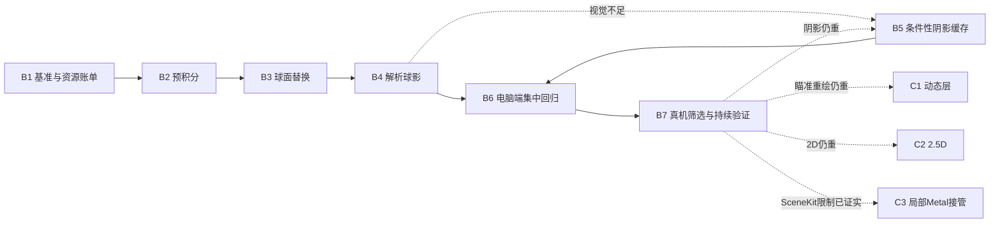

# 问题集合：每日清台 2D／3D 持续性能优化 v2

> **本文件是本轮需求真源。** 日期：2026-09-21。状态：**v2 执行中，B1 基准冻结**。
> 用户最新授权（2026-09-21）：开始执行直到方案完成；连续完成电脑端实现与验证，真机负载仍遵守未充电、冷却及停止门槛。
> 本文件覆盖 v1，作为当前唯一执行版本；v1 仅作历史留档。本文件覆盖后续性能优化的排期与验收口径；历史诊断报告保留为证据，不覆盖产品规格、几何真源或用户后续指令。未来修订升版本号，高版本覆盖低版本；不得用修改目标掩盖未达标。
> 排期前置：实现期重新读取项目适配器及对应规则；几何工作读取 geometry-spatial-reasoning 与 table-geometry.md，真机阶段读取 ios-device-performance。无手机不阻塞电脑端批次；持续功耗／热表现最终仍需真机。

## 0. v2 决策与执行顺序

用户已认可的顺序：**现有 SceneKit 内完成反射／球影算法替换 → 电脑端集中完成可切换候选和回归 → 一次协调的真机筛选阶段 → 只对赢家进行持续验收 → 依据剩余成本决定后续架构分支。**

- 主线不再要求先比较所有可能算法。先交付 A（参考）、R（反射）、S（解析球影）、RS（组合），保持原生分辨率、MSAA4和运动60 FPS目标。
- “集中真机阶段”不是热机连续跑完所有版本：冷却、交错基准、必要复测仍遵循§5；不在每个小改动后反复要求用户操作。
- B1先完成可在电脑核查的资源／pass清单，硬件capture和计数在B7集中补齐。手机不可用不阻断B2～B6的电脑工作。
- 阴影缓存B5、瞄准动态层C1、2.5D C2和Metal局部接管C3均是**有证据才启动的条件项**，不是默认全部实施。不得因“缺手机数据”就把所有高成本候选先做一遍。
- 正式默认配置仍须经过真机成本、持续体验及最终普通启动包验证。当前已启动 B1；正式默认仍等待完整验收。

## 1. 需求回显与边界

### 1.1 用户已经明确的要求

1. 目标是让玩家在手机上获得接近电脑端的台球体验，解决每日清台正常瞄准、击球及 3D 操作时持续发热的问题。
2. 2D、3D 都要覆盖；不能只测静止或只测翻袋，也不能只以物理引擎解释发热。
3. 优先减少 CPU／GPU 的实际工作量，不能把自动降帧、锁 30 FPS 当作主要解决方案。运动和交互以 60 FPS 为目标，保持响应与帧间隔稳定。
4. 用户后来允许**轻微画质损失换取明显性能提升**；这不是允许任意降低画质。球边缘、号码、瞄准线、主要反光、接触感、材质差异和整体灯光风格是保护项。
5. 先详细分析再实施，尽量把可独立完成的工作做完整，减少反复要求用户切模式、操作、冷却。
6. 默认局域网连接真机，温升对照不充电。不得把模拟器表现、编译通过或采样次数减少冒称手机降温证据。
7. CPU、GPU、内存／带宽、帧间隔和持续热表现需分开说明；收益必须有方法、指标、对照和适用范围。

8. 用户已认可 v2 的效率原则：先交付可比较、可归因的反射／球影组合原型，避免继续泛泛调研或先重写渲染器。

### 1.2 当前工作假设与不确定点

- 假设：主要场景仍为少量标准球体、固定台面和少量灯板，灯光／房间风格可切换但通常不会每帧改变；相机、球、球杆和入袋表现是动态的。
- 已有证据支持直接球影和球体着色是重要成本，**不证明它们是全部成本**。带宽、寄存器、draw call、其他材质和预测负载仍有未量化项。
- 未知：最终算法在 A18 Pro 的净收益、持续温升、所有风格／近景下的视觉取舍是否可接受。
- 不以“手机绝不发热”作为承诺；目标是相同体验与条件下显著降低持续负载、避免明显烫手及热降频。环境、亮度和设备散热条件必须记录。
- 本文件中的数值验收线是**建议工程目标**，不是用户已确认的产品指标，也不是已测收益；执行时先冻结口径，再测试，不得见结果后随意放宽。

### 1.3 不在本轮范围

- 不改变物理求解精度、球路、速度、碰撞、入袋规则或训练统计语义。
- 不重新设计页面、资产、灯光风格；不新增默认低帧率模式。
- 不全面迁移 SceneKit，不引入神经网络、ReSTIR、硬件光追或第三方渲染引擎作为前置。
- 不提交、推送、发布；不清除用户手机数据。共享渲染层的改动必须回归其消费页面。

## 2. 已知事实、历史证据与现有缺口

| 项目 | 已核实状态 | 不能据此声称 |
|---|---|---|
| 静止调度 | AngleSceneView 已有 DisplayLink 暂停与 SceneKit 失效唤醒；已有模拟器动作／页面回归 | 已在最终正常手机构建中证明温升解决 |
| 参数提交 | 既有真机固定场景 CPU 渲染调用墙钟 2D −7.28%、3D −9.15% | 纯 CPU 执行时间等比例减少，或 GPU／整机功耗改善 |
| 直接球影隔离 | 相邻基准均值 15.901 ms → 12.131 ms，GPU 命令跨度约 −23.71%，基准漂移约 1.95% | 替代阴影必然获得同等收益、整机降温 23.71% |
| 球体着色隔离 | 整套球 shader 替换后约 −19.92%，相邻基准漂移约 10.42% | 64 次反射独占 19.92%，或与球影收益相加 |
| 平衡采样候选 | 反射 32／近区阴影 4×4 仅 Debug 显式预览；默认及 Release 仍 reference | 用户普通启动已经在使用它，或真机收益已经通过 |
| 平衡采样手机实验 | Fair 起始后进入 Serious，基准漂移严重；严格 Nominal 门控已补 | 样本可作候选优劣结论 |
| 几何／反射常量缓存旧候选 | 真机掉帧且有漂移，已拒绝作为生产优化 | 可因减少计算而重新默认启用 |
| 房间探针 | 已按风格缓存，已有 SH9 漫反射；纹理仅生成普通 mipmap | 已完成粗糙度对应的镜面预积分 |
| 接触遮蔽 | 当前 inverseDistance³ 公式无严格有限支撑范围 | 简单裁剪球周区域与原图严格等价 |

证据入口：

- [事件驱动与缓存边界](DAILY-CLEARANCE-EVENT-DRIVEN-20260921.md)
- [分项真机归因](DAILY-CLEARANCE-RENDER-FOLLOWUP-20260921.md)
- [平衡采样与失败实验](DAILY-CLEARANCE-BALANCED-SAMPLING-20260921.md)
- [完整审计](DAILY-CLEARANCE-COMPLETE-AUDIT-20260921.md)

新实验必须记录源码指纹、构建配置、安装产物与实际启用的 profile。上述历史百分比只作为排查依据，不作为新构建基准。

### 2.1 新深度研究报告的采用口径

研究输入：[deep-research-report.md](../docs/deep-research-report.md)，由用户提供的 ChatGPT 深度研究报告。保留原文，不擅自修改研究结论；本方案负责适配真实代码。

| 研究建议 | v2处理 |
|---|---|
| 反射预积分、解析投影＋penumbra拟合 | 纳入主线B2～B4；当前64-tap是外观参考，不是物理ground truth |
| pass／attachment／带宽清单 | 前置B1盘点、B7硬件验证；不预设内存带宽已经是主要瓶颈 |
| 静止零3D提交 | 验证现有按需路径，不重复宣称新实现；App合成器活动与本场景提交分开 |
| 球高度固定 | 仅静置／台面滚动成立，拟合增加高度／入袋边界 |
| 球影32采样／约24%GPU收益 | 每灯板8×4；历史指标为命令跨度，不能作为严格whole-frame收益上界 |
| 删除SSAO | 当前移动路径已有关闭代码；仅查实际启用状态，无则标不适用 |
| 瞄准overlay、独立2.5D | 分别设C1/C2最小原型，需要剩余成本证据后进入 |
| memoryless／encoder合并 | 先确认SceneKit实际行为与可控API，不能当几行配置即可完成 |
| 一周／一个月排期、每variant30分钟 | 不沿用未经估算的承诺；短测筛选后才长测赢家 |
| 研究引用 | 原文内部引用标记缺URL映射；本方案已核实来源见§8，其他引用标待溯源，不补造网址 |

## 3. 技术策略与选择原则

### 3.1 总体分工

```text
房间／灯光配置变更 → 预积分资源、静态照明资源失效与重建
球位置／高度／透明度变更 → 动态球影与接触数据更新
相机变化 → 视角相关高光重算；台面坐标中的遮蔽尽量复用
每个活动帧 → 原生球轮廓／号码／瞄准线／材质细节 + 廉价光照查询
全部静止 → 沿用按需渲染，不建立新的持续 15／30 FPS 循环
```

缓存按物理依赖失效，不按随意时间间隔刷新。省 ALU 的同时核算额外纹理读写、render pass、峰值内存、初始化卡顿及 CPU 更新成本。

### 3.2 反射：完整替换 64 次积分，而非只换一张纹理

- 主线 R1：预过滤环境贴图＋材质响应 LUT／解析近似，保留单独的低成本灯板高光和局部台呢／地板反射。
- 当前循环每次还执行灯板、台呢相交与材质响应。验收必须证明昂贵循环整体退出候选路径；环境查询降到 1～2 次不代表整个球材质只有 1～2 次运算。
- 粗糙度定义、GGX 分布、能量归一化、HDR 线性空间、采样方向与接缝需要一致。普通 generateMipmaps 不能代替预积分。
- 探针缓存键至少覆盖实际影响输出的风格／灯光／算法版本等输入，确切字段由 B1 盘点，不凭空新增状态；台呢局部贡献优先保留动态参数，避免每次颜色变更无谓重烘整个房间。
- 灯板用解析／查表面光源近似；LTC 是候选，不是预先指定赢家。LTC 不自动提供遮挡，高光极窄时必须验证精度与稳定性。
- R2 备选：SHE（HPG 2025）用于更粗糙材质／低频环境，不作为近镜面台球默认。其容量与粗糙度适用范围需验证，论文省内存不等于我们更快。

### 3.3 台呢与球影：先拆耦合，再比较两条路线

先将未遮挡漫反射、视角相关高光、直接球影、接触遮蔽分开。现有 8×4 循环是每灯板采样，且同时累计 E／S；只替换 SHADOW 段不等于删除整段开销。

**S1：直接解析近似（优先小原型）**

- 根据球位置、高度与灯板几何估算软阴影；保留近接触区，限制视觉贡献很低的远尾。
- 先维持现有动态接触 AO，避免同一阶段同时改变全部遮蔽来源。
- 支持多球、两灯板、贴库、腾空和入袋；不能用固定高度黑色圆斑代替所有状态。
- 主要收益假设：消除逐灯光样本重复检查球的内层循环，无额外全屏中间贴图。

**S2：台面坐标中的遮蔽贴图（条件性对照）**

- 将柔和遮蔽单独计算为台面纹理，最终材质读取；原生分辨率保留球、线和台呢细节。
- 可复用相机无关的直接光可见性／接触项；**不得缓存后直接复用视角相关高光**。以同一遮蔽值乘漫反射和高光是一种近似，需要独立图审。
- 阴影层的分辨率与格式由近景误差／带宽决定，不固定为“半分辨率必然足够”；最多比较少量有明确动机的档位。
- 第一版先证明正确性与收益，再考虑脏区域更新。区域更新覆盖旧／新球影范围，并重算所有与区域相交的贡献，避免残影和多球遗漏。
- AO 原公式无有限支撑：保留全局廉价 AO 或定义显式误差预算与平滑截断；不能将经验裁剪包装为等价优化。
- 同帧消费 presentation 位置／高度／透明度；更新与绘制同步，不出现球先动、阴影下一帧才动。
- 检查台面／库面／袋口接收范围；不向库顶、袋洞等错误表面投影台面结果。
- 决策：S1 已达到目标且画质合格时，不为凑候选继续完成高成本 S2；否则实现最小 S2 对照。无论选哪条都记录另一条暂缓／淘汰理由。

### 3.4 pass／attachment／资源审计

B1建立账单，B7用真实设备补证。每一项记录“实际值、证据、是否由SceneKit管理、可控入口、优化候选、未验证原因”，不把建议配置当作当前配置。

| 审计项 | 必须记录／判断 |
|---|---|
| Frame graph | render／compute／blit pass及依赖；球、台呢、房间、resolve、tonemap对应draw／pass；内联球影无法独立计时就用隔离实验，不编造分项ms |
| MSAA／depth | 格式、尺寸、采样数、storageMode、load/store、resolve目标；检查是否确需跨pass保存 |
| HDR中间资源 | 数量、大小、生命周期、重复写入；不能因为HDR存在就删除它 |
| 纹理与缓存 | 环境探针当前为2D等距柱状纹理，并非已经是cubemap；格式、mip、shared/private、压缩支持、读写与生成成本 |
| GPU限制因素 | ALU／texture／memory／寄存器等可用计数，记录捕获扰动；不可用项如实标注 |
| CPU与提交 | 预测、场景更新、编码、资源等待分开；记录实际活动／静止提交与分配 |

memoryless只适用于不需跨pass保留的attachment。若动态overlay需要缓存深度，则须核算持久深度的存储／读取；不能同时承诺“不保存深度”和“后续读取同一深度”。private存储本身也不保证更省电；压缩格式需验证HDR范围、画质及设备支持。

### 3.5 着色器资源与画质取舍

- 颜色、权重等可评估 half；坐标、距离、接触判断和低粗糙度高光敏感量保留 float，禁止批量机械替换。
- 检查寄存器、分支、复杂数学、纹理等待，避免大数组预装载造成新瓶颈。旧缓存候选失败不能忽略。
- 小范围降低柔和阴影精度优先于整个画面降采样。原生分辨率／MSAA4 初期保持统一，保证归因。
- 全场景 90%／85%／80% 分辨率及 MSAA2 属后备取舍，只有主线不足才进入独立实验。瞄准线当前在 SceneKit 内，若要原生线层需单独处理深度、遮挡、坐标和抗锯齿，不能默认免费分离。
- MetalFX、全面 Metal 重写、神经阴影、ReSTIR 不列为当前必做。需要时另出有证据的 ADR／方案修订。

## 4. 批次表与依赖图

批次是可独立验收的工作单元，不意味着每批要求用户再次确认或重新开会话。后续获得实施授权后，可连续完成独立电脑工作；真机不可用只挂起依赖手机的条目。默认当前 agent 执行，不自动委派。

| 批次 | 范围／交付物 | 量级 | 前置 | 状态 |
|---|---|---|---|---|
| B1 | 冻结基准、候选契约及pass／attachment资源账单 | 小～中，一会话 | 实施授权 | 🔄 |
| B2 | 反射预积分资源与缓存生命周期 | 中，一会话 | B1 | ⏳ |
| B3 | 球面反射完整替换与视觉验收 | 中～大，一会话 | B2 | ⏳ |
| B4 | 台呢照明拆分＋解析球影 S1 | 中～大，一会话 | B1；排期在B3后 | ⏳ |
| B5 | 条件性台面遮蔽缓存 S2 对照 | 中～大，一会话 | B4存在不可接受视觉误差，或B7证明S1仍贵 | ⏳ 非主线 |
| B6 | A/R/S/RS候选组合与电脑端集中回归 | 中，一会话 | B3、B4；仅触发时纳入B5 | ⏳ |
| B7 | 真机短时筛选、持续验收、默认配置交付 | 分短测／长测两窗口 | B6，手机就绪 | ⏳ |



主线顺序 B1→B2→B3→B4→B6→B7，B3/B4同文件顺序实施。B5不是手机暂不可用时的默认替代工作；触发后结果回到B6/B7相同门槛。条件项若实际超出一会话，应在实施前将其拆成明确产物并更新排期，不无限扩展原型。

### B1：基准与证据契约

- 读取当前差异，保护无关物理／内容／资产变更。记录源码指纹和现有 profile、渲染尺寸、材质／资源清单。
- 冻结 A 参考：相同事件驱动调度、原生分辨率、MSAA4、目标 60 FPS。既有 32／4×4 仅对照，不混入 A。
- 定义 R 反射、S 阴影、RS 组合四组；实际启用状态写入采样元数据，避免测试宿主与用户普通包混淆。
- 固定同一真实场景、合法盘面、相机、风格、确定性正常击球轨迹；计量段外完成物理准备、资源预热与截图。
- 完成§3.4资源账单：源码可核查项当场填值，硬件计数／内部pass挂到B7；不为此提前让用户测试。
- 整理真实生产调用链与全部共享消费者；确定资源安装／移除／切风格／重开局的失效条件。
- **DoD**：基准 manifest、场景清单、成本记录 schema 和消费页面清单落盘；如新增诊断入口，构建成功且执行所选测试数大于 0；参考路径未启用候选。不得为了对齐测试去删既有断言。

### B2：预积分资源

- 在 RoomReflectionProbe 的实际资源路径上增加候选预积分；生成工具／文件名为待实现产物，不冒充现存 API。
- 保留 reference，缓存有界；避免在每帧或反复创建材质时生成。共享设备资源、处理风格切换和资源失败，有可诊断日志与参考路径回退。
- 对常量环境、方向性亮源和不同粗糙度检查能量、接缝、线性空间与归一化；必要时使用高样本离线参考，不能只与有噪声的 64 次版本比较。
- **DoD**：目标系统构建通过；数值／资源测试有实际方法数；生成耗时、资源字节数、缓存命中和重复切换后存活数量可查；静止／每帧不重烘，失败能明确定位。

### B3：完整球面替换

- 接入预积分＋材质响应，独立近似灯板／台呢，处理掠射角与入袋地板切换。
- 将原 64 次积分从候选运行路径移除；避免仍在新路径里偷偷执行旧循环或重复加灯板能量。
- 逐视角／粗糙度／风格对照，保护号码／白球／花色的亮度与识别性。动态看滚动、镜头绕行和高光扫过球边缘。
- **DoD**：B2 测试及球面静态／动态视觉集通过，iOS17与当前可用 runtime 编译和渲染验证；近景裁剪图与完整帧均人工审阅，记录已知误差。性能只标“待真机筛选”，不得按循环数给百分比。

### B4：照明拆分与 S1

- 分离 E／S／visibility；未遮挡照明采用已有解析能力或有明确依据的近似，保持台呢法线／粗糙度作用。
- 建立实际矩形灯×球体的高样本离线参考，扫描台面位置与球高，拟合penumbra／接触形态；记录样本收敛与误差，方向光椭圆只作初始近似，不能直接代表矩形面光源。
- 解析阴影先覆盖单球／双灯，再覆盖多球重叠、高度和袋口；保留现有接触项作为独立对照。
- **DoD**：几何／坐标契约、边界数值和多球视觉通过；运动阴影同帧，无残留／异常黑块／接收面泄漏；证明昂贵内循环已退出候选路径。输出 S1 与 reference 成本结构差异和是否需要 B5 的理由。

### B5：S2 条件性原型

- 先做有限分辨率的台面遮蔽资源与最终查询，再做必要的重用；不先堆复杂脏区域管理。
- 测量完整帧：新增 pass、GPU 生成＋查询、读写量、CPU 更新、内存和同步等待都算入，不只报告最终 shader 更快。
- 明确选择保持全局接触 AO 或截断误差方案；局部更新检查旧影擦除、多球交叠和初始化清空。
- **DoD**：同一视觉集过关，缓存生命周期／同步用例通过；S1/S2 在同条件下择优或标待真机；失败原型不留默认执行的分配和后台更新。未选 S2 可用有证据的“不采用”结案，不强迫交付无收益算法。

### B6：组合与共享回归

- 整理A/R/S/RS同构建可切换版本，完成电脑端能发现的全部必要问题后再协调手机；不将粗糙原型反复交给用户图审。
- 合并通过视觉门槛的 R/S；再做有诊断依据的 half／资源优化，每步保持可独立开关和归因。
- 检查首进、重开、结算、2D↔3D、拖动／瞄准、普通击球、相机阻尼、SceneKit 动作与后台恢复；确保静止后实际回调和绘制回到基准状态。
- 对 B1 找出的共享消费者至少验证受影响的材质安装、相机模式、样式切换；视频导出路径若共用材质应做代表帧，不能自动改其参考配置。
- **DoD**：相关单元和页面测试有实际执行数；iOS17及当前 runtime、代表 iPhone／iPad尺寸视觉通过；资源反复创建销毁无持续增长趋势；构建／diff／文档门禁结果分列。全仓历史 gate 故障必须保留，不计作本批通过。

### B7：真机与正式默认交付

- 集中采集§3.4中需要真机的代表性frame capture／counter；与低扰动温升段分开，输出成本账单和剩余top limiter。
- 短测使用 A/R/S/RS 相同条件，基准穿插并交换顺序，至少两组有效配对，先筛掉无净收益候选；只对赢家做持续测试。
- 2D、3D 都包含真实正常瞄准／击球，不以压力夹具代替真实页面。固定轨迹回放用于可重复 GPU 对照，真实交互用于应用完整链路，两种证据分开。
- 真机门槛与报告见 §5。无法采集某硬件指标时标不可用，不用命令跨度或 GPU frame time 冒充利用率／瓦数。
- 只有视觉、短测和持续门槛通过后，才将赢家设为产品默认，并重建**供用户普通启动**的最终配置。不能拿 Debug 开关包冒充 Release 默认。
- **DoD**：安装版本和实际 profile 可核验；用户普通入口的画面／流畅度确认；最终包有烟测，交付实际收益、适用设备、剩余风险与回退方式。温升没通过则仍是候选，不标“发热已解决”。

### 第二阶段：仅按剩余成本触发

这些分支不是重新降帧的替代说法，也不是本轮提前承诺重写；B7输出对应证据后决定进入哪一项，不必全部实施。

| 分支 | 触发依据 | 最小范围／量级 | 完成标准 |
|---|---|---|---|
| C1 瞄准动态层分离 | 优化后Aim-Only仍反复执行昂贵静态场景着色，且占用显著 | 一代表页面，球杆＋瞄准／预测图形的动态层原型；中～大一批，超限先细分 | 遮挡、深度、透明度、曝光、同帧同步、相机失效正确；完整合成成本低于优化后的统一路径，无残影；否则不采用 |
| C2 2.5D俯视原型 | 优化后2D仍有显著的可删减绘制／着色成本，超过实验噪声 | 一合法盘面，烘焙桌背景＋球面impostor，复用真实位置／旋转／纹理；中～大一批 | 号码滚动、缩放平移、高度／袋口、2D↔3D切换一致；对比优化后的3D俯视而非旧重shader，GPU／带宽净收益明确；原型通过后再规划生产化 |
| C3 局部Metal接管 | 真实capture证明具体pass／attachment成本，现有公开SceneKit路径无法有效控制 | 先评估SCNRenderer接入Metal的窄原型，记录API兼容边界；中～大一批 | 用完整帧证明净收益和行为一致；需跨模块架构变更先写ADR及修订方案，不直接全面重写 |

分支共用B6/B7质量与持续验收；淘汰时移除默认更新／分配。C1依赖缓存深度时承担带宽成本；C2球面quad若仍保留昂贵反射循环，不能仅凭三角形减少判定成功。生产化不在最小原型DoD里偷渡。

## 5. 验收协议

### 5.1 视觉和行为

最小场景矩阵：2D全桌、3D全桌、球近景、低角度掠射；白球／全色／花色；稀疏盘面／合法密集球堆／近邻双球；球贴库、靠角袋／中袋、腾空和落袋；当前所有实际影响照明的风格逐一检查代表帧。

- 先保留分辨率、MSAA、曝光和相机一致。导出参考／候选同帧、球与阴影 ROI，不能用大面积不变背景稀释差异。
- 数值报告包含 ROI MAE、差异像素比例、峰值差异；它们只用于定位，不代替视觉判断。
- 必须检查连续运动，不仅截图：高光跳动、阴影条纹／拖尾、球边缘闪烁、模式切换亮度跳变。
- 可接受：柔和阴影远尾、低频房间反光有轻微差别且不引人注意。不可接受：接触漂浮、阴影晚一帧、号码模糊、瞄准线降清晰度、明显高光丢失、落袋穿帮、球路改变。
- 用户只需在最终候选做一次集中视觉取舍确认；电脑可发现的问题不转嫁给用户反复测试。

### 5.2 性能建议门槛（实施前冻结）

| 层级 | 建议目标／判定 | 证据要求 |
|---|---|---|
| 单项候选 | GPU 净改善超过配对噪声与基准漂移；不足以分辨则不宣称获益 | 配对原始样本、均值／中位数／p95、相邻基准与执行顺序 |
| 组合候选 | 代表性 2D／3D 活动场景 GPU 执行成本中位数以 ≥25%下降为工程目标；未达则报告实值并继续定位，不自动降帧 | 相同口径完整工作成本，至少两组有效配对；该百分比不是预期承诺 |
| 帧间隔 | 稳态目标 60 FPS；建议 p95呈现间隔≤18 ms，>25 ms比例≤1%，并不得比参考退化 | 排除已明确标注的加载段；均值 FPS 不能掩盖卡顿 |
| CPU | 真实忙碌时间与墙钟等待分开，候选不得引入可重复回归 | Time Profiler／可用等价证据，主线程、预测、提交分项 |
| 内存／带宽 | 记录新增常驻和峰值资源，无反复切换后持续累积；检查额外 pass 和读写 | 资源字节数／生命周期，硬件计数可用则报告 |
| 静止 | 无活动时不因候选新增周期渲染／更新；允许真实 UI 失效触发 | 实际绘制与 DisplayLink 计数，非仅 HUD“静止”文案 |
| 持续体验 | 未充电正常游戏目标20分钟，记录10分钟检查点；无Serious／Critical、明显烫手或热降频引起的持续掉帧 | 同条件起点、热状态时间线、帧间隔、用户体感；失败立即结束并保留数据 |

GPU 命令可能重叠，逐 buffer 时间不能简单求和当整帧时长；原测“命令跨度”只能与同口径比较。功耗、能量、热状态、体感和表面温度不是同一指标。没有功率传感器就不能给瓦数，没有温度读数就不能给摄氏度。

### 5.3 真机实验有效性

- 默认局域网、拔线、无无线充电；记录型号／系统／电量／低电量模式／亮度／环境／是否带壳，以及构建优化与诊断开关。
- 起始需系统 Nominal 且用户确认恢复正常温度；Nominal 本身不等于外壳已冷却。
- 候选与参考使用相同工作量、相机和盘面。基准短测穿插，不能一口气先测原版再热着测全部候选。
- 建议相邻基准中位数漂移超过5%即标为不稳定，不能据此给精确收益；先分析来源再重复。该5%是实验质量警戒线，不是硬件准确度承诺。
- Serious／Critical或用户明显烫手即停止，保存部分结果。不得为了凑20分钟继续；停止／跳过不能记通过。
- 最终持续体验采用低扰动记录；高开销 GPU capture／录屏用于分开的诊断段，不混入温升对照。
- LAN失败先修连接／记录链路；有线可在用户明确同意后做成本诊断，但带充电干扰的数据不用于热收益结论。
- 各轮结果保存独立目录，先导出再开启可能覆盖结果的下一轮。Mac读取／导出失败先解决，不能继续积累无法分析的手机负载。

## 6. 风险、回退与研究停止条件

| 风险 | 应对／回退 |
|---|---|
| 反射近似损失灯板形态／能量 | 保留独立高光分量，检查掠射角；失败退回参考或重做近似，不靠整体曝光补偿掩盖 |
| 台面缓存增加带宽反而更热 | 测生成＋消费完整成本；淘汰S2，选择S1或更小工作范围 |
| 粗糙度／half导致数值溢出 | 敏感计算保留float，检查HDR亮源和低粗糙度边界 |
| 初始化或切风格卡顿 | 有界缓存、避免主线程重复烘焙，分别记录首次／稳态成本 |
| 新路径破坏iOS17或SceneKit绑定 | 最早在B2/B3验证旧系统，控制参数绑定数量；保留reference可诊断回退 |
| GPU更快但仍热 | 不宣称完成；检查CPU预测、其他材质、带宽、屏幕及测试扰动，按实际新瓶颈修订方案 |
| 候选有回归／无净收益 | 开关退回reference，移除默认分配与更新；记录不采用，不让失败研究变成常驻复杂度 |

每条新路线最多先做一个可比较的最小原型；既无结构性优势、又无可测净收益时停止扩展。若需要大规模自定义渲染管线／第三方依赖，必须独立说明投入、预期与证据，并修订方案和ADR，不能夹带在本轮优化里。

## 7. 已核实锚点索引

核实日期：2026-09-21，当前工作区有大量既有未提交改动。以下行号用于定位，执行时按符号复核，禁止依赖行号盲改。

| 文件／行 | 符号／真实作用 | 批次 |
|---|---|---|
| `QiuJi/Core/Scene/MobileReferenceLighting.swift:137` | SamplingProfile／samplingShader；默认reference，Debug预览 | B1/B3/B6 |
| 同文件`:170` | applyBall 安装球材质与探针 | B2/B3 |
| 同文件`:278` | directShadowShader，候选球mask与逐光源样本遮挡 | B4/B5 |
| 同文件`:504` | v62Room／v62Reflection，环境／台呢／灯板反射 | B3 |
| 同文件`:578` | 球面64次GGX循环 | B3 |
| 同文件`:597` | clothShader，E／S和球影耦合采样 | B4/B5 |
| `QiuJi/Core/Scene/RoomReflectionProbe.swift:162` | 纹理构建、普通mipmap生成 | B2 |
| 同文件`:214`、`:261`、`:278` | install／probe按风格缓存／bake | B1/B2 |
| `QiuJi/Core/Scene/MobileTableRendering.swift:152`、`:242` | MobileContactOcclusion，动态AO与presentation参数更新 | B4/B5/B6 |
| `QiuJi/Core/Scene/AngleSceneView.swift:91`、`:316` | MSAA4、updateFramePacing按需调度 | B1/B6 |
| `QiuJi/Core/Scene/AngleTrainingScene.swift:1975` | pocketLine／strikeLine为SceneKit几何体 | 后备分辨率方案 |
| `QiuJi/Features/PositionPlay/Views/FreePlayView.swift:387`、`:419` | 实际AngleSceneView消费、显式动画状态 | B1/B6/B7 |
| `QiuJi/Features/PositionPlay/ViewModels/PositionPlayViewModel.swift:200` | setupScene实际渲染入口 | B1/B6 |
| `QiuJiTests/RenderQualityV62Tests.swift:71` | 事件驱动休眠与动作唤醒测试 | B6 |
| 同文件`:8812`、`:8840`、`:8844`、`:8856` | 既有平衡画质图像／成本入口及共享计量器 | B1/B3/B4/B7 |
| 同文件`:9201` | 正常3D击球分阶段诊断 | B1/B7 |
| `QiuJiUITests/V52DailyClearanceUITests.swift:107`、`:198`、`:202` | 模式往返、真实页面击球／平衡预览；重置夹具仅模拟器 | B6 |
| `QiuJi/Features/PositionPlay/ViewModels/PositionPlayViewModel.swift:1194` | updateCueStickAiming实际更新球杆，Aim-Only并非只有线变化 | C1 |
| `QiuJi/Core/Scene/AngleTrainingScene.swift:1134` | transitionToTopDown，透视到正交过渡与缩放衔接 | C2 |
| `QiuJi/Core/Scene/MobileTableRendering.swift:40` | applyLighting显式关闭移动相机SSAO | B1 |
| `scripts/Makefile:160`、`:356` | test与verify-doc-size入口 | 全批 |
| `.kiro/steering/table-geometry.md:10` | 世界X长边、Y向上、Z短边，米制；尺寸以代码真源为准 | B4/B5 |

新增 LUT、离屏阴影资源、同步管理器的文件／符号尚不存在，具体落点在相关批次确定。无需为了方案先创建空模块。

## 8. 调研依据与适用边界

资料核查日期：2026-09-21。只把作者论文／演示、厂商官方文档作为技术依据；文献设备上的速度不作为本项目收益。

1. [HypeHype：Stochastic Tile-Based Lighting，SIGGRAPH 2025](https://advances.realtimerendering.com/s2025/content/s2025_stb_lighting_v1.1_notes.pdf)：借鉴阴影与着色分离、紧凑数据、共享计算；不照搬多灯随机采样与TAA，作者亦披露降噪问题。
2. [SHE，HPG 2025论文](https://diglib.eg.org/items/581aa76a-4ecb-4f4e-a8aa-30fbc814706d) 与 [演示](https://highperformancegraphics.org/untracked/2025/presentations/Pa5_1_hpg_2025_slides.pdf)：紧凑视角相关反射表示；低阶容量和粗糙度范围有限，非近镜面台球即插即用方案。
3. [Filament PBR](https://google.github.io/filament/main/filament.html)、[Three.js PMREM](https://threejs.org/docs/pages/PMREMGenerator.html)：反射预积分与材质响应的成熟实现依据，不等于普通mipmap。
4. [LTC原作者论文与实现](https://eheitzresearch.wordpress.com/415-2/)：面光源积分近似；不自动解决动态遮挡。
5. [Kernel Predicting Neural Shadow Maps，SIGGRAPH 2025](https://doi.org/10.1145/3721238.3730645)：神经滤波阴影；RTX4090／TensorRT实验不能外推iPhone功耗，暂缓。
6. [ReSTCV，SIGGRAPH 2026作者页面](https://hercier.github.io/restcv/)、[LOD-aware ReSTIR，SIGGRAPH 2026](https://research.nvidia.com/labs/rtr/publication/wang2026levelofdetail/)：路径采样复用研究；当前不引入其整套基础设施。
7. [Apple Metal着色器实践](https://developer.apple.com/videos/play/tech-talks/111373/)：精度、寄存器与资源占用；按实际数值范围选择half。
8. [Apple WWDC25 Metal4](https://developer.apple.com/videos/play/wwdc2025/254/)：编码与pass组织改进；不构成迁移后自动消除fragment成本的证据。
9. [Google移动端照明实践](https://developer.android.com/games/optimize/lighting-for-mobile-games-with-unity?hl=en)：烘焙／探针／简化动态阴影；台面坐标缓存是本项目候选设计，不冒充该资料已验证的实现。

10. [Apple SCNRenderer](https://developer.apple.com/documentation/scenekit/scnrenderer)：现有SceneKit接入Metal工作流的接口依据，不证明可以控制全部内部pass。
11. [Apple WWDC25 Power Profiler](https://developer.apple.com/videos/play/wwdc2025/226/)：设备端低扰动功耗记录作为B7可用手段；power impact不是GPU瓦数。

## 9. 交付记录与版本

每批结果记录：范围、实际修改文件、源码／构建指纹、候选状态、运行命令、Executed N tests、证据目录、静态／动态目视结论、未验证项、下一批输入。无需重新讲述全部历史。

最终必须分别标记：代码完成、模拟器验证、真机成本验证、持续体验验证、最终普通包安装验证。缺任何一层，保留其缺口；不能用“全部优化完成”代替明确状态。

| 版本 | 日期 | 变更原因／状态 |
|---|---|---|
| v1 | 2026-09-21 | 根据用户确认的轻微画质取舍、现有源码与诊断证据、近期论文和工业实践，首次形成7批方案；仅编写方案，未启动实施。 |

| v2 | 2026-09-21 | 吸收用户深度研究并按源码校正；冻结先算法替换、电脑集中回归、真机统一筛选主线；前置资源账单、补阴影离线拟合；B5及C1/C2/C3按证据触发。仅更新方案，未实施。 |
