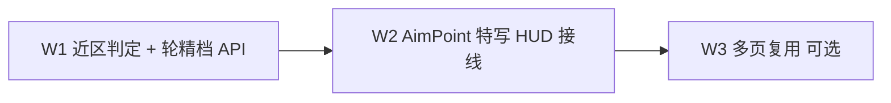

# 问题集合 v23 — 近球瞄准特写 + 瞄准轮精档

> **真源声明**：本文件是「近球瞄准特写 HUD + 瞄准轮精档」这一轮需求的**真源**，供 `plan-batch-execution` / `plan-delegated-execution` 执行。高版本覆盖低版本。
>
> - **版本**：v23.0
> - **日期**：2026-07-28
> - **状态**：⏳ **立项（文档）** — 待拍板 D-v23-1～6 后开工 W1
> - **来源**：2026-07-28 会话——用户担心全景球占比太小、瞄准需精准微调、瞄准条最小刻度不足；决定**显示（特写）与控制（精档）成对解决**；指令 `/issue-collection-restructure`
> - **排期前置**：
>   - `tasks/HUMAN-REQUIRED.md` 无 ⏳ `[BLOCKING]` 项（已核实）。
>   - 与 v22 ✅ / v18 ⏸ / P8 人工项 / DR-031 点验 **互不阻塞**；几何改动须遵循 `geometry-spatial-reasoning`。
> - **与既有方案关系**：
>   - 研究稿 #10-e「贴近球放大镜」（拖球时球心距 < 3R）为**同族不同触发**——本轮做**瞄准近区特写 + 轮精档**，不做摆球 loupe；外壳/倍率可借鉴，不强制先抽 `BTLoupe`。
>   - 不改物理引擎、不改 DR-031 验证杆速口径。
> - **锚点核实日期**：2026-07-28（§五全部逐条读代码确认）
> - **编号约定**：条目 **E1–E4**；批次 **W1–W3**；拍板项 **D-v23-N**

---

## 一、需求回显（语义基准，不增删）

### 1.1 用户原始诉求

1. 移动瞄准点到目标球上时，或瞄准线在任意目标球中心约两倍半径内，滑动左侧瞄准条时，增加 HUD（放大镜一类），辅助看清再瞄准。
2. 主要担心：球在屏幕中占比太小；瞄准需要精准微调；现有瞄准条存在最小刻度问题。
3. **两个一起解决**（特写显示 + 精档控制，不成对不做）。

### 1.2 验收语义（条目）

| # | 条目 | 验收语义 |
|---|---|---|
| **E1** | 近球判定 | 以目标球心到瞄准线的**垂距**为据（`AimPointGeometry.offsetDistance`）；进入近区可触发辅助；enter/exit **滞回**防闪烁；多球锁定首碰/当前目标，不叠多个 HUD |
| **E2** | 瞄准轮精档 | 近区（及约定手势）下调 `°/pt`，使中距目标球处横向位移约 **0.3–0.6 mm/pt**；粗档保持现有 `0.15°/pt`；触感不强化「最小单位 = 1°」 |
| **E3** | 几何特写 HUD | 近区且正在改瞄准时显示；内容 = 目标球 + **用户**瞄准关系（线 / 假想球 / 瞄准点）；**训练态不泄正解**；跟手 1:1（打磨基准 B2） |
| **E4** | 首接入页 + 文档 | 至少瞄准点场景训练 2D/3D 闭环；SPEC Changelog + DR；`make build` + 几何单测 + 可截图验收 |

### 1.3 主控理解 / 假设 / 不确定点

**理解的需求**：全景台面下「看不清接触几何」与「调不稳瞄准」是两条独立瓶颈；放大镜只解显示，固定 `0.15°/pt` + 整度触感限制控制。产品目标是微调时能稳定分辨约毫米级接触偏差。

**假设**（不符请在 D-v23-* 纠正；推荐默认见 §四）：

| ID | 假设 |
|---|---|
| A1 | HUD = **正交几何特写**（`BTTableFigure` closeup 系），**非** SceneKit 截图像素放大 |
| A2 | 进入阈值 ≈ **3R**，退出 ≈ **4R**（用户口中 2R 偏紧，作讨论起点写入拍板） |
| A3 | 触发 = **近区 ∧ 正在改瞄准**（轮 / 点台 / 拖线）；松手短延迟收起 |
| A4 | **首批只接 AimPointScene**；共享 API 一次做好，自由击球/编排台放 W3 |
| A5 | 精档约 **0.05°/pt**（粗档约 1/3）；精档减弱/关闭整度震 |
| A6 | 与 #10-e 划界：本轮不做摆球贴近 loupe |

**不确定点 → §四拍板项。**

### 1.4 明确不做

| 不做项 | 依据 |
|---|---|
| SceneKit 每帧 snapshot 像素放大镜 | 贵、糊；与教学几何目标不对齐 |
| 训练态 HUD 显示正解假想球 / 金点 | 泄题 |
| 改物理引擎 / DR-031 验证杆速 | 本轮无关 |
| 瞄准轮画 0.1° 数字刻度 | 既有设计：看台面效果不看数字（`BTAimWheel` 注释） |
| 本轮强制全量 `BTAimWheel` 页接入 | 除非 D-v23-1 = C |
| 摆球拖动贴近 loupe（#10-e） | 同族不同触发；本轮划界 |

---

## 二、问题结构（为何成对）

| 瓶颈 | 现状（事实） | 只做一边的结果 |
|---|---|---|
| 显示 | 全景球占比小；1mm 接触常为亚像素 | 精档「调了看不见」 |
| 控制 | `BTAimWheel` 固定 `0.15°/pt`；整度触感 | 特写里「一抖就偏」 |

数量级估算（W1 须用单测钉死，禁止脑算当验收）：

| 母球→假想球距离 \(d\) | `0.15°/pt`（现状） | `1°` 触感 | 目标精档 ≈`0.05°/pt` |
|---|---|---|---|
| 0.5 m | ≈ 1.3 mm/pt | ≈ 8.7 mm | ≈ 0.4 mm/pt |
| 1.0 m | ≈ 2.6 mm/pt | ≈ 17 mm | ≈ 0.9 mm/pt |

产品叙事：

> **靠近目标球 → 出几何特写窗（看清）→ 同时瞄准轮切入精档（调准）**

---

## 三、批次表

| 批次 | 范围 | 量级 | 依赖 | 模型 |
|---|---|---|---|---|
| **W1** | E1+E2 共享层：近区几何、滞回、`BTAimWheel` 可变增益/精档触感、单测 | M | 无 | 待 D-v23-6 |
| **W2** | E3+E4：AimPointScene 特写 HUD + 接线精档 + SPEC/DR + build/截图 | M | W1 | 待 D-v23-6 |
| **W3** | FreePlay / Composer / SolverStage 等复用（仅当 D-v23-1 ≠ A） | M | W2 | 待 D-v23-6 |

### W1 完成标准

- [ ] 近区谓词：垂距口径 + enter/exit 滞回；AimPoint 单目标球；多球路径预留首碰锁定 API
- [ ] `BTAimWheel` 支持粗/精 `degreesPerPoint`（或等价增益）；**无近区时默认仍为 `0.15`**（零回归）
- [ ] 精档触感策略按 D-v23-4 落地
- [ ] 单测：近区边界/滞回；给定 \(d\) 时增益 → 目标球处 mm/pt 数量级；无近区 delta 与旧式一致
- [ ] `make build` 绿；相关单测绿
- [ ] **几何任务**：动码前按 `geometry-spatial-reasoning` 回显 XZ 契约；垂距用 `AimPointGeometry.offsetDistance`，禁止脑算

### W2 完成标准

- [ ] AimPointScene（2D+3D）近区且改瞄时出特写 HUD；内容仅用户侧几何
- [ ] 特写与轮精档 **同时** 生效（成对验收）
- [ ] 跟手：拖轮时特写内线/假想球无 ease 滞后（对照 ui-polish F-SA-04）
- [ ] 提交 / 击球 / 限免阶段 HUD 与精档关闭
- [ ] `tasks/UI-IMPLEMENTATION-SPEC.md` Changelog + `tasks/IMPLEMENTATION-LOG.md` DR
- [ ] `make build`；截图：远区无 HUD / 近区+拖轮有 HUD 且线移动；2D 与 3D 各 ≥1 组
- [ ] 训练态无正解标记进 HUD（目检）

### W3 完成标准（仅 D-v23-1 含扩展时）

- [ ] 拍板列出的页复用同一近区 + 精档 + HUD API
- [ ] 多球：`freeAimFirstContact` 锁定首碰球
- [ ] 不回归现有厚度 readout（FreePlay / Composer）
- [ ] `make build` + 抽样截图

---

## 四、待拍板（D-v23）

| # | 问题 | 选项 | 推荐 |
|---|---|---|---|
| **D-v23-1** | 接入范围 | A 仅 AimPointScene（W3 backlog） B AimPoint + FreePlay/编排台 C 所有 `BTAimWheel` 页 | **A** |
| **D-v23-2** | HUD 形态 | A 正交几何特写 B 像素截图 loupe C 特写 + 厚度/切角读数（训练态仍无正解） | **A**（读数可 W2 小加或后续） |
| **D-v23-3** | 近区阈值 | 进入/退出用几倍 R（建议 3R/4R；原话 2R） | **3R / 4R** |
| **D-v23-4** | 精档增益与触感 | 精档 `°/pt`；触感 0.25° / 减弱整度震 / 精档无震 | **0.05°/pt + 精档减弱整度震** |
| **D-v23-5** | HUD 锚点 | 追球旁 / 固定 chrome 角 / 安全空区自动 | **固定右上 chrome 附近** |
| **D-v23-6** | 执行方式 | 主控亲做 / 委派 `cursor-grok-4.5-high-fast` / 分批模型 | 待指定 |

拍板回复示例：`D-v23 全按推荐` 或逐条改选项。拍板后升 v23.1，批次表「模型」列填实，再开工 W1。

---

## 五、锚点索引（2026-07-28 核实）

| 能力 | 锚点 | 现状 |
|---|---|---|
| 瞄准轮灵敏度 | `QiuJi/Core/Components/BTAimWheel.swift` L17–18、L70–71 | 写死 `0.15°/pt`；整度触感 L73–77 |
| 厚度重叠图标 | 同文件 `ThicknessOverlapIcon` | D-v23-2=C 时可挂 HUD |
| 瞄准点场景微调 | `AimPointSceneTrainingView.swift` `nudgeAim` ~L118；轮 L653/L668 | 直接吃 delta，无精档 |
| 垂距 / 瞄准点 | `QiuJi/Core/Geometry/AimPointGeometry.swift` | **E1 真源**（`offsetDistance` / `aimPoint`） |
| 首碰 / 切角 | `AngleSceneCalculator.freeAimFirstContact` ~L1042 | 多球 W3；走廊 2R |
| 台面拖瞄增益 | `AngleSceneCalculator.aimNudgeDegrees` ~L1105 | 注释对比轮 0.15；粗调分工 |
| 特写取景 | `BTTableFigure` + `TableFigureRenderer` closeup | 学区 / AimPointTraining 已用 |
| 2D 特写训练页 | `AimPointTrainingView.swift` closeup `r*2.7` | 构图参考，本轮非改页主体 |
| 像素 loupe（参考） | `BallExtractionView.swift` ~L673 private 2.6× | #10-e 素材；本轮优先几何特写 |
| FreePlay 厚度条 | `FreePlayView` ~L299 + `freeAimContact` | W3 复用点 |
| Composer 厚度条 | `PositionPlayComposerView` ~L520 | W3 |
| Solver 轮接线 | `SolverStageChrome.swift` / `ShotSimulationView` | W3 if C |
| 研究稿近亲 | `docs/research/20260703-发布前系统优化方案.md` #10-e | 拖球贴近；本轮划界 |
| 既有拖瞄测 | `QiuJiTests/PositionPlayFreeAimTests.swift` aimNudge* | 台面拖；W1 另补轮/近区测 |
| 球半径真源 | `BTPhysicsConstants.radius`（≈0.028575 m） | 阈值倍数的 R |

### 5.1 坐标契约（E1 / E3，动码前必回显）

- 系：**SceneKit 世界**，水平面 **X–Z**，**Y 朝上**；单位米。
- 垂距：XZ 平面内，目标球心到瞄准线（过母球、沿 `aimDir`）的距离。
- `AimPointGeometry` 平面无关，但输入点/方向须在同一平面系（XZ 投影后喂入）。
- 禁止把屏幕 pt 当世界 mm；增益换算须显式带距离 \(d\)。

---

## 六、代码现状摘要（事实）

1. **`BTAimWheel` 无增益参数**——`degreesPerPoint` 为 private 常量；所有接入页（AimPointScene / FreePlay / Composer / Break / SolverStage 等）共用同一手感。
2. **AimPointScene 已有用户瞄准几何**——`redrawLines` / `aimLineResolution` / `AimPointGeometry`；特写 HUD 可消费同一数据，不必再截场景图。
3. **FreePlay 已有近球语义雏形**——`freeAimFirstContact` + `ThicknessOverlapIcon` 读数；缺特写窗与轮精档。
4. **学区已有 closeup 范式**——`BTTableFigure(closeup:)`；AimPointTraining 特写页与场景页是两条产品路径，本轮增强场景页而非替换特写页。

---

## 七、版本记录

| 版本 | 日期 | 变更 |
|---|---|---|
| v23.0 | 2026-07-28 | 立项草案：E1–E4 / W1–W3；成对解决特写+精档；待 D-v23-1～6 |
