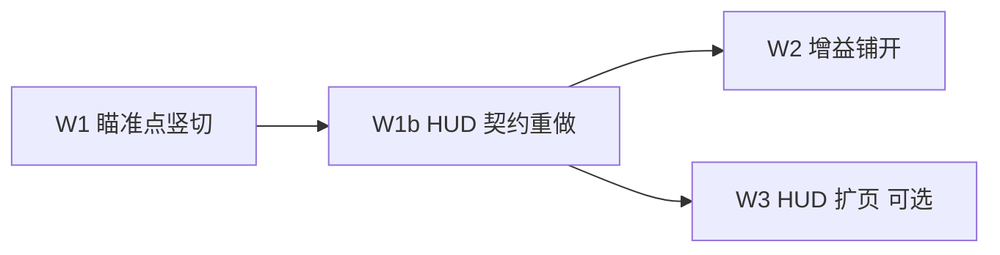

# 问题集合 v23 — 近球瞄准特写 + 瞄准轮精调

> **真源声明**：本文件是「近球瞄准特写 HUD + 瞄准轮精调」这一轮需求的**真源**，供 `plan-batch-execution` / `plan-delegated-execution` 执行。高版本覆盖低版本。
>
> - **版本**：v23.13
> - **日期**：2026-07-29
> - **状态**：🔄 **W1b / W2 / W3 + 5.1（空象限对角 + 瞄准线 keepout）代码落地；待模拟器抽样点验** — 点验通过即 v23 收官
> - **来源**：2026-07-28 会话——用户担心全景球占比太小、瞄准需精准微调、瞄准条最小刻度不足；决定**显示（特写）与控制（精调）成对解决**；指令 `/issue-collection-restructure`。v23.1 复核；v23.2 拍板齐；v23.3 W1 代码；**v23.4** 用户反馈「要局部放大、按实际情况展示、共享组件、背景与位置有逻辑」+ 确认「同步画同一几何仍有放大（紧取景）」
> - **排期前置**：
>   - `tasks/HUMAN-REQUIRED.md` 无 ⏳ `[BLOCKING]` 项（已核实）。
>   - 与 v22 ✅ / v18 ⏸ / P8 人工项 / DR-031 点验 **互不阻塞**；几何改动须遵循 `geometry-spatial-reasoning`。
> - **与既有方案关系**：
>   - 研究稿 #10-e「贴近球放大镜」（拖球时球心距 < 3R）为**同族不同触发**——本轮做**瞄准近区特写 + 轮精调**，不做摆球 loupe；外壳/倍率可借鉴，不强制先抽 `BTLoupe`。
>   - 不改物理引擎、不改 DR-031 验证杆速口径、不改 `rotatedUnifiedScale` 跨页统一取景契约（见 §2.3）。
> - **锚点核实日期**：2026-07-28（§五、§六逐条读代码确认；v23.1 追加 §5.2 三条实现约束）
> - **编号约定**：条目 **E1–E4**；批次 **W1–W3**；拍板项 **D-v23-N**（范围拆为 1a/1b）

---

## 一、需求回显（语义基准，不增删）

### 1.1 用户原始诉求

1. 移动瞄准点到目标球上时，或瞄准线在任意目标球中心约两倍半径内，滑动左侧瞄准条时，增加 HUD（放大镜一类），辅助看清再瞄准。
2. 主要担心：球在屏幕中占比太小；瞄准需要精准微调；现有瞄准条存在最小刻度问题。
3. **两个一起解决**（特写显示 + 精调控制，不成对不做）。

### 1.2 验收语义（条目）

| # | 条目 | 验收语义 |
|---|---|---|
| **E1** | 近球判定 | 以目标球心到瞄准线的**垂距**为据；须带「球在前方」判据（`proj > 0`，见 §5.2-③）；**2R = 接触边界**（垂距 < 2R ⇔ 会碰到该球），近区 = 接触带 + 擦身带；enter/exit **滞回**防闪烁；多球锁定首碰目标，不叠多个 HUD |
| **E2** | 瞄准轮精调 | 使中距目标球处横向位移约 **0.3–0.6 mm/pt**；粗档保持现有 `0.15°/pt` 等效手感；**不引入手势中途换档的速度突变**（锁档或连续增益，见 D-v23-4）；触感不强化「最小单位 = 1°」 |
| **E3** | 几何特写 HUD | 近区且正在改瞄准时显示；**同源几何紧取景放大**（非截图像素、非简化示意卡）；内容 = 主场景用户瞄准 chrome 的**按层子集**（有则画：目标球/瞄准线/假想球/进球线/辅助线/母球…）；仅瞄准线时只画线；擦身「打空」；**训练态不泄正解**；台呢色底；位置相对焦点球避让（非钉死右上）；跟手 1:1（B2） |
| **E4** | 首接入页 + 文档 | 瞄准点场景训练 2D/3D 闭环；SPEC Changelog + DR；`make build` + 几何单测 + 可截图验收 |

### 1.3 主控理解 / 假设 / 不确定点

**理解的需求**：全景台面下「看不清接触几何」与「调不稳瞄准」是两条独立瓶颈。产品目标 = 微调时能稳定分辨约毫米级接触偏差。

**假设**（不符请在 D-v23-* 纠正；推荐默认见 §四）：

| ID | 假设 | v23.1 变更 |
|---|---|---|
| A1 | HUD = **同步画同一几何 + 更紧正交取景** ⇒ 放大感来自米→像素比例（球占比变大），**非** bitmap 拉伸；用 `BTFigureBall` / `FigureLine` / `BTGhostCircle` 等与插图同源组件，**不复用** `BTTableFigure` 静态底图（§5.2-①），**非** SceneKit 截图 | **v23.4 修订** |
| A2 | 阈值按语义定：**2R = 接触边界**（几何硬边界，非手感参数）；近区 enter ≈ **3R** / exit ≈ **3.5R** 仅为滞回带 | 修订 |
| A3 | 触发 = **近区 ∧ 正在改瞄准**（轮 / 点台 / 拖线）；松手短延迟收起 | 保留 |
| A4 | 增益与 HUD **范围不同**：增益宜全部轮页（改共享组件参数，接线近零成本）；HUD 先只瞄准点（自由击球/编排台已有切角读数，边际收益低） | 新增（原 A4 单一范围假设作废） |
| A5 | 「最小刻度」**不是量化 bug**——代码中 delta 连续（§2.2）；瓶颈 = 固定增益 + 1° 触感/刻度的心理暗示 | 修订 |
| A6 | 与 #10-e 划界：本轮不做摆球贴近 loupe | 保留 |
| A7 | 3D 页无正交台面矩形 ⇒ HUD 是 3D 下的**主读数通道**，不是可选补充 | 新增 |

**不确定点 → §四拍板项。**

### 1.4 明确不做

| 不做项 | 依据 |
|---|---|
| SceneKit 每帧 snapshot 像素放大镜 | 贵、糊；与教学几何目标不对齐 |
| 训练态 HUD 显示正解假想球 / 金点 | 泄题 |
| **推近 2D 相机替代 HUD** | 违反 `rotatedUnifiedScale` 跨页统一取景契约（§2.3） |
| 改物理引擎 / DR-031 验证杆速 | 本轮无关 |
| 瞄准轮画 0.1° 数字刻度 | 既有设计：看台面效果不看数字（`BTAimWheel` 注释） |
| 摆球拖动贴近 loupe（#10-e） | 同族不同触发；本轮划界 |

---

## 二、问题结构

### 2.1 为何成对

| 瓶颈 | 现状（事实） | 只做一边的结果 |
|---|---|---|
| 显示 | 全景球占比小；1mm 接触常为亚像素 | 精调「调了看不见」 |
| 控制 | `BTAimWheel` 固定 `0.15°/pt`；整度触感 | 特写里「一抖就偏」 |

数量级估算（W1 须用单测钉死，禁止脑算当验收）。\(d\) = 母球→假想球距离，目标球处横向位移 ≈ \(d\cdot\delta_{\text{rad}}\)：

| \(d\) | `0.15°/pt`（现状） | `1°`（一格触感） | `0.05°/pt` | 恒定毫米档 0.4 mm/pt 所需增益 |
|---|---|---|---|---|
| 0.5 m | ≈ 1.31 mm/pt | ≈ 8.7 mm | ≈ 0.44 mm/pt | ≈ 0.046°/pt |
| 1.0 m | ≈ 2.62 mm/pt | ≈ 17.5 mm | ≈ 0.87 mm/pt | ≈ 0.023°/pt |

### 2.2 「最小刻度」的真实成因（事实，读码确认）

`BTAimWheel` 的拖动增量是**连续量**，代码中**不存在离散步长**：

```swift
// BTAimWheel.swift L68–71
let dy = v.translation.height - lastHeight
let delta = Float(-dy) * degreesPerPoint   // 连续，无 round / stride
```

⇒ 用户感知的「最小刻度」来自三处，须分别对症：

1. **固定增益**：`0.15°/pt` 在输出空间不一致（同样 1pt，远台偏移是近台 2 倍，见 §2.1 表）。
2. **1° 触感**：每越整度一震（L73–77），强化「最小单位 = 1°」心理预期。
3. **刻度语法**：1°/5°/10° 三级线（L45–54）是度数尺，非毫米尺。

**红线**：执行者不得把本条当量化 bug 修（如去掉不存在的 `round`），也不得声称「已修最小步长」。

### 2.3 为何不推近相机（决策留档）

2D 页球小是**刻意契约**，不是疏漏：

```120:135:QiuJi/Core/Scene/CameraRig.swift
    /// 跨页统一球桌大小（#10）的统一正交 scale 下限。各 2D 球桌页的可视区高度受各自
    /// 顶/底控件影响而不同，纯自适应取景会让球桌「能多大就多大」⇒ 跨页大小不一。用一个
    /// 不低于常见视口自适应值的统一 scale 作为下限：常规页一律取此值 ⇒ 球桌呈现一致大小
    static let rotatedUnifiedScale: Double = 1.50
```

- 推近相机会破坏 ADR-P11-08 一脉的「整台完整可见 + 跨页统一大小」，且瞄准需同时看袋口/进球线（丢全局上下文）。
- 3D 透视页无正交台面矩形，相机方案更不成立。
- ⇒ **加独立特写窗**（保全局 + 给局部）是本轮的结构性理由，非「顺手加个放大镜」。

### 2.4 产品叙事

> **靠近目标球 → 出几何特写窗（看清）→ 同时瞄准轮进入精调（调准）**

---

## 三、批次表

**拆批原则（v23.1 修订）**：竖切优先——先在一页把「近区 + 增益 + HUD」端到端跑通，再把被验证过的东西抽出去铺开；避免先造无消费方的共享 API 导致形状不合用。



| 批次 | 范围 | 量级 | 依赖 | 模型 | 状态 |
|---|---|---|---|---|---|
| **W1** | E1+E2+E3+E4 AimPointScene 端到端（近区+毫米增益+初版 HUD） | M–L | 无 | 主控亲做 | ✅ 增益/近区保留；HUD 形态被 W1b 取代 |
| **W1b** | **重做 E3**：同源几何分层特写 + 台呢底 + 焦点避让定位；AimPoint 喂完整用户层；点验热修 mapRotated；**v23.7** 滞回模糊带 + blockedSide；**v23.8** `center` 相对焦点偏移（0.92×d）+ 扁平实测台呢 | M | W1 | 主控亲做 | ✅ 代码 + 像素/合成图（v23.8）；模拟器点验待 |
| **W2** | 增益铺开：全部 `BTAimWheel` 页（D-v23-1a=C；BatchAuthoring 排除）+ 手势内锁档 | M | W1 | 主控亲做 | ✅ 代码 + build 绿 + 单测 31/0（含逐页接线实证）；抽样点验待 |
| **W3** | HUD 扩页（`AimCloseupBuilder` + `BTAimCloseupOverlay` → FreePlay / 编排台 / 分离角 / 翻袋·反射自由模式） | M | W1b | 主控亲做 | ✅ 代码 + build 绿 + 单测 12/0；抽样点验待 |

### W1 完成标准

- [ ] 近区谓词：垂距 + **`proj > 0` 前方判据**（§5.2-③）+ enter/exit 滞回；2R 接触边界与擦身带语义分明
- [ ] 轮增益按 D-v23-4 落地；**未启用近区/精调的页行为与现网逐值一致**（零回归）
- [ ] 手势内无速度突变：连续增益，或手势开始时锁档（参照 DR-027 `elevationOverride` 冻结手法）
- [ ] 特写 HUD：自绘 Canvas（不踩 §5.2-① 静态底图坑）；内容仅用户侧几何；擦身带显示「打空」
- [ ] 跟手：拖轮时 HUD 内线/假想球无 ease 滞后（对照 ui-polish F-SA-04）
- [ ] 提交 / 击球 / 限免阶段 HUD 与精调关闭
- [ ] 单测：近区边界（含球在身后用例）/滞回；给定 \(d\) 的增益 → mm/pt 换算；旧行为等价
- [ ] `make build` 绿 + 相关单测绿；截图：远区无 HUD / 近区+拖轮有 HUD 且线移动；2D 与 3D 各 ≥1 组
- [ ] `tasks/UI-IMPLEMENTATION-SPEC.md` Changelog + `tasks/IMPLEMENTATION-LOG.md` DR
- [ ] **几何任务**：动码前按 `geometry-spatial-reasoning` 回显 XZ 契约；禁止脑算断言
- [ ] 训练态无正解标记进 HUD（目检）

### W1b 完成标准

- [ ] `AimCloseupSnapshot` 改为**可选层**（目标球 / 瞄准线 / 假想球 / 进球线 / 辅助线 / 母球 / 标记）；页只填主场景已有的用户侧层
- [ ] HUD 用 `BTFigureBall` + `FigureLine` + `BTGhostCircle` 等同源组件；台呢色底（非死深绿示意卡）
- [ ] 放大 = 焦点紧取景（`halfWorld ≈ 3.2R`），与主场景同几何、不同 scale
- [ ] 定位：相对焦点球左右（及上下）避让，拖瞄中象限滞回；不钉死右上；避开轮/提交热区优先
- [ ] AimPoint：喂进球线 + 垂线 + 用户瞄准线 +（接触时）假想球/瞄准点标记；无正解
- [ ] 擦身带「打空」保留；仅线场景可只画线
- [ ] `make build` + 定位单测；DR-032 补记或 DR-033
- [ ] **不做**：截图像素放大；W3 多页接线（本批仍 AimPoint）

### W2 完成标准

- [x] 拍板页面接入同一增益 API；多球目标由 `freeAimFirstContact` 锁定
      （`AngleSceneCalculator.aimLeverMeters` 首碰优先 → 前方最近 → 最近；空桌回落 0.15°/pt）
- [x] 不回归现有切角/厚度 readout（FreePlay ~L299、Composer ~L520 未改；仅传轮参数）
- [x] 未接入页保持旧手感：仅 `BatchAuthoringView:495` 未接（作者向，D-v23-1a 排除），其调用点未改 ⇒ 仍 0.15°/pt + 整度震
- [x] 手势内不换档：`BTAimWheel` 拖动开始锁 `lockedGain`（E2 红线）
- [x] `make build` 绿 + 单测 **31/0**（`build/v23-w2-test.log`）
- [x] **接线实证**（非仅编译）：`AimWheelGainWiringTests` 逐页构造真实场景断言 0.4 mm/pt + 细于旧档——
      走位系（首碰球胜过更近侧球）/ 空桌回落 0.15 / 翻袋 / 反射 / 开球（顶球杠杆）
- [ ] 抽样点验（自由击球 / 编排台 / 分离角 / 翻袋·反射 / 开球各 1 次拖轮手感）——已 `make run` 装好模拟器

### W3 完成标准

- [x] 目标页复用 W1b 已验证的 HUD + layers API（不另起实现）：新增 `AimCloseupBuilder.freeAim`（快照构建单一真源）
      + `AimCloseupGate`（近区 ∧ 正在改瞄准的显隐门）+ `BTAimCloseupOverlay`（定位/开关/滞回一处收口）；
      AimPoint 页同步改用 overlay，去掉页内重复定位代码
- [x] 多球换目标时构图正确切换：`test_aimSwitch_movesFocusToTheNewlyAimedBall` + 首碰优先/接触胜擦身用例
- [x] 层集按实况（D-v23-2′）：自由页 = 瞄准线 + 假想球圈 + 接触点；**不发明**进球线/垂线/瞄准点十字（单测钉死）
- [x] `make build` 绿 + 单测 **12/0**（`build/v23-w3-test.log`）；`QiuJiTests` 全量跑：瞄准/走位/翻袋反射/开球相关**全绿**，
      余 7 例失败为**既有红**（drill 计数 77≠72、试打序列、统计跨日），已用 `git stash` 基线复现确认与本轮无关
      （`build/v23-baseline-unrelated.log`）
- [ ] 抽样点验：5 页近球拖轮出特写、擦身「打空」、换目标切构图、三点菜单可关

---

## 四、已拍板（D-v23）

### 4.1 初拍（2026-07-28「全部按照推荐」）

| # | 决议 | 落地 |
|---|---|---|
| **D-v23-1a** | **C** 增益 → 全部轮页（W1 先 AimPoint；W2 铺开） | W2 |
| **D-v23-1b** | ~~**A** HUD → 仅 AimPointScene~~ → v23.10 执行 W3：扩至自由瞄准四页（见 D-v23-13） | W1b / W3 ✅ |
| **D-v23-2** | ~~示意自绘~~ → 见 4.2 | — |
| **D-v23-3** | enter **3R** / exit **3.5R**；2R = 接触边界 | W1 ✅ |
| **D-v23-4** | **B** 连续毫米口径：目标 **0.4 mm/pt**，增益 ∝ 1/d | W1 ✅ |
| **D-v23-5** | ~~固定右上~~ → 见 4.2 | — |
| **D-v23-6** | 毫米增益页 **关闭整度震** | W1 ✅ |
| **D-v23-7** | **主控亲做** | — |

### 4.2 点验后修订（2026-07-28，用户确认「同步画同一几何」）

| # | 决议 | 落地 |
|---|---|---|
| **D-v23-2′** | HUD = **同步画主场景用户瞄准几何 + 紧取景放大**；层按实况开关；线语言 / 真球面组件同源；无厚度数字读数 | W1b |
| **D-v23-5′** | 位置 = **相对焦点球避让**（左右优先，上下次之；象限滞回）；钳制在场景 inset；不钉死右上 | W1b |
| **D-v23-5″**（v23.7） | 左右不再镜像焦点，而是**钉死在刻度轮对侧**；上下取焦点对半；滞回**只在中线 ±0.08 模糊带内**生效；落底角时为「提交」让位 | W1b |
| **D-v23-5‴**（v23.8） | 位置 = **相对焦点球屏幕锚点偏移**（`AimCloseupPlacement.center`，默认间距 0.92×直径），钳入避轮/提交安全区；不再钉死屏角对齐。圆心须使焦点落在 loupe 圆外 | W1b |
| **D-v23-5⁗**（v23.11） | **进球视线避让**：loupe 不得遮挡主场景进球线段与目标袋口（用户仍须能在全景判断进袋）。硬过滤圆∩线段/袋口盘；全挂则放大 gap → 最小重叠软降级。无进球线/袋口时与 5‴ 等价。keepout 由页填（AimPoint 用 `potLine`） | W1b 热修 |
| **D-v23-5 formal**（v23.12） | 空旷用四边距（过渡） | W1b 热修 |
| **D-v23-5.1**（v23.13） | **空象限对角**：L/R 取较大 × T/B 取较大 → 对角进入「更大空区」；仍 0.92d 靠球。`SightKeepout` 扩瞄准线；硬过滤瞄准线+进球线+袋口；按 free-run 排序候选 | W1b 热修 |
| **D-v23-10**（v23.7→v23.8） | 特写底色 = **实测渲染台呢扁平填充** RGB(25,111,18)；禁止径向变暗与 `btTableFelt`；像素比对单测守住 | W1b / W3 |
| **D-v23-8** | 放大定义：米→像素比例变大（球占比），**不是**截图像素拉伸 | W1b |
| **D-v23-9** | 共享组件 API 预留 `layers`；v23.10 已按此扩页（W3） | W1b / W3 |
| **D-v23-11**（v23.9） | 特写可关：并入三点菜单 §显示「瞄准特写」（`UserPreferences.showAimCloseup`，**默认开**）；与毫米增益**解耦**（关特写不关精调） | W1b |
| **D-v23-12**（v23.9） | 增益杠杆臂真源 = `AngleSceneCalculator.aimLeverMeters`（首碰球 → 前方最近球 → 最近球 → nil 回落 0.15°/pt）；`BTAimWheel` **手势开始锁档**，单次拖动内不换档 | W2 |
| **D-v23-13**（v23.10） | HUD 扩页范围 = **自由瞄准四页**（自由击球 / 编排台·试打 / 分离角与走位 / 翻袋·反射自由模式）；开球页**不接**（对球堆无接触几何可读）。共享三件套：`AimCloseupBuilder`（快照）+ `AimCloseupGate`（显隐门）+ `BTAimCloseupOverlay`（定位/开关）；页内不得再自写定位或层集 | W3 |

---

## 五、锚点索引（2026-07-28 核实）

| 能力 | 锚点 | 现状 |
|---|---|---|
| 瞄准轮灵敏度 | `QiuJi/Core/Components/BTAimWheel.swift` L17–18、L68–71 | 写死 `0.15°/pt`；delta 连续；整度触感 L73–77；刻度 L45–54 |
| 厚度重叠图标 | 同文件 `ThicknessOverlapIcon` | D-v23-2=C 时可挂 HUD |
| 瞄准点场景微调 | `AimPointSceneTrainingView.swift` `nudgeAim` ~L118；轮 L653（2D 贴边）/L668（3D 浮动） | 直接吃 delta，无精调；`redrawLines()` 每次重建线节点 |
| 垂距 / 瞄准点 | `QiuJi/Core/Geometry/AimPointGeometry.swift` | **E1 真源**（`offsetDistance` / `aimPoint` / `signedOffset`）；⚠ 见 §5.2-③ |
| 首碰 / 切角 | `AngleSceneCalculator.freeAimFirstContact` ~L1042 | 有 `proj > 0` 与 2R 走廊判据，可作 E1 参照实现 |
| 台面拖瞄增益 | `AngleSceneCalculator.aimNudgeDegrees` ~L1105 | 绕母球公转、`maxGainDegPerPt` 封顶；注释以轮 0.15 为细调基准 |
| 2D 取景契约 | `CameraRig.fitRotatedTable` L130–136 / `rotatedUnifiedScale = 1.50` L125 | 跨页统一大小；§2.3 决策依据 |
| 特写取景组件 | `BTTableFigure` L37–44 + `TableFigureRenderer` closeup | ⚠ 底图静态，见 §5.2-① |
| 2D 特写训练页 | `AimPointTrainingView.swift` closeup `r*2.7` | 构图参考，本轮非改页主体 |
| 像素 loupe（参考） | `BallExtractionView.swift` ~L673 private 2.6× + 十字准星 | #10-e 素材；本轮优先几何特写 |
| 轮接入页（6 处） | `AimPointSceneTrainingView` / `FreePlayView:129` / `PositionPlayComposerView:252` / `ShotSimulationView:111` / `SolverStageChrome:253` / `BreakFlowRunner:477` / `BatchAuthoringView:495` | D-v23-1a 范围候选（Batch 为作者向，可排除） |
| FreePlay / Composer 厚度条 | `FreePlayView` ~L299 / `PositionPlayComposerView` ~L520 | 已有切角+厚度读数 ⇒ HUD 边际收益低（A4 依据） |
| 研究稿近亲 | `docs/research/20260703-发布前系统优化方案.md` #10-e | 拖球贴近；本轮划界 |
| 既有拖瞄测 | `QiuJiTests/PositionPlayFreeAimTests.swift` aimNudge* | 台面拖；W1 另补轮/近区测 |
| 球半径真源 | `BTPhysicsConstants.radius`（≈0.028575 m） | 阈值倍数的 R |

### 5.1 坐标契约（E1 / E3，动码前必回显）

- 系：**SceneKit 世界**，水平面 **X–Z**，**Y 朝上**；单位米。
- 垂距：XZ 平面内，目标球心到瞄准线（过母球、沿 `aimDir`）的距离。
- 几何恒等式：接触时垂距 = \(2R\sin\theta\) ⇒ **垂距 ∈ [0, 2R) 才有切角**；垂距 → 2R 即 θ → 90°（极薄）；> 2R 无接触。
- `AimPointGeometry` 平面无关，但输入点/方向须在同一平面系（XZ 投影后喂入）。
- 禁止把屏幕 pt 当世界 mm；增益换算须显式带距离 \(d\)。

### 5.2 已核实的实现约束（v23.1 新增，执行前必读）

**① `BTTableFigure` 的 closeup 不可动态变更。**

```swift
// BTTableFigure.swift L37–44
.onAppear {
    guard backdrop == nil, ... else { return }
    backdrop = TableFigureRenderer.backdrop(..., closeup: closeup)
}
```

底图仅 `onAppear` 离屏渲一次，且 `guard backdrop == nil` ⇒ **`closeup` 变化不触发重渲**。学区各页 closeup 均为写死常量故未暴露。若 HUD 需跟随目标球换构图，直接复用会静默拿到过期底图。
⇒ **W1 采用自绘 Canvas**（毛毡底 + 球 + 线）；100pt 窗内 USDZ 台呢纹理无信息量。若坚持复用组件，须先改造其重渲触发（属额外范围，需另拍板）。

**② HUD 不得依赖每帧场景截图。** `redrawLines()` 已在每次 nudge 重建线节点；再叠 snapshot 会放大开销。HUD 应消费与 `redrawLines` 同源的几何量（母球位、`aimDir`、目标球位）。

**③ `AimPointGeometry.offsetDistance` 无前后判据。** 它返回垂足距离，垂足**可落在母球身后**（参数 t 可为负）。近区谓词若只用它，母球背后的球也会判进近区。须补 `proj > 0`（`freeAimFirstContact` 已有该闸，L1050）。

---

## 六、代码现状摘要（事实）

1. **`BTAimWheel` 无增益参数**——`degreesPerPoint` 为 private 常量；6 处接入页共用同一手感 ⇒ 加参数是「一处改、多页受益」的高杠杆点（D-v23-1a=C 依据）。
2. **AimPointScene 已有用户瞄准几何**——`redrawLines` / `aimLineResolution` / `AimPointGeometry`；HUD 可直接消费，无需截场景图。
3. **FreePlay / Composer 已有近球读数**——`freeAimFirstContact` + 切角 + `ThicknessOverlapIcon`；缺的是精调增益，不是读数 ⇒ 增益范围宜宽、HUD 范围宜窄。
4. **2D 全景球小是契约结果**——`rotatedUnifiedScale = 1.50`（§2.3），故走 HUD 而非相机。
5. **3D 页无台面矩形**——轮/按钮走浮动布局（`AimPointSceneTrainingView` L668），HUD 在 3D 下是主读数通道（A7）。

---

## 七、版本记录

| 版本 | 日期 | 变更 |
|---|---|---|
| v23.0 | 2026-07-28 | 立项草案：E1–E4 / W1–W3；成对解决特写+精档；待 D-v23-1～6 |
| v23.1 | 2026-07-28 | 主控二次读码复核修订：① §5.2 三条实现约束；② 2R 接触边界语义；③ 「最小刻度」非量化 bug；④ 范围拆 1a/1b；⑤ 连续毫米增益推荐；⑥ 竖切优先；⑦ 不推近相机留档 |
| v23.2 | 2026-07-28 | 拍板齐（全按推荐）+ 开工 W1（主控亲做）；D-v23-1a=C / 1b=A / 2=A / 3=3R·3.5R / 4=B·0.4mm/pt / 5=右上 / 6=关整度震 / 7=亲做 |
| v23.3 | 2026-07-28 | W1 落地：`AimProximityMath`/`AimWheelGain`/`BTAimCloseupHUD` + `BTAimWheel` 可配 + AimPointScene；DR-032；build 绿；单测 9/0 |
| v23.4 | 2026-07-28 | 用户点验修订：HUD≠示意卡；同源几何紧取景放大（D-v23-8）；分层按实况（D-v23-2′）；避让定位（D-v23-5′）；新开 **W1b** |
| v23.5 | 2026-07-28 | W1b 落地：`AimCloseupSnapshot` 可选层 + `BTFigureBall`/`FigureLine`/`BTGhostCircle` + 台呢底；`AimCloseupPlacement` 对焦点避让+滞回；AimPoint 同步用户线/进球线/垂线/标记（无 ghost 发明）；DR-033；build 绿；单测 12/0 |
| v23.6 | 2026-07-28 | 点验热修：`AimCloseupCoords.mapRotated`（screen-up=+X）；HUD 隐藏时 `previous=nil` 重选角；loupe 亮台呢；单测 14/0（`build/v23-w1b-hotfix-test.log`） |
| v23.7 | 2026-07-28 | 返修：滞回模糊带 + blockedSide + 实测台呢径向渐变；轴向契约测试 |
| **v23.9** | 2026-07-28 | ①特写并入三点菜单 §显示「瞄准特写」（默认开，D-v23-11）；②**W2 增益铺开**（D-v23-12）：`aimLeverMeters` 杠杆臂真源 + 5 页接入（FreePlay / Composer / 分离角走位 / 翻袋·反射 `SolverStageChrome` / 开球 `BreakInstrumentsOverlay`），BatchAuthoring 按拍板排除；`BTAimWheel` 手势开始锁档。证据：`make build` SUCCEEDED；单测 **31/0**（`build/v23-w2-test.log`，含 `AimWheelGainWiringTests` 逐页真实场景接线实证 5 例） |
| **v23.13** | 2026-07-29 | **D-v23-5.1 空象限对角**：主方向 = 开边水平×开边垂直对角；keepout 含瞄准线；AimPoint 传 cue。证据：Placement **19/0**（`build/v23-open-quadrant-test.log`） |
| **v23.12** | 2026-07-29 | **D-v23-5 formal 四边空旷方位**（过渡）：单轴最大边距；后由 5.1 取代为象限对角 |
| **v23.11** | 2026-07-29 | **D-v23-5⁗ 进球视线避让**（DR-036）：`SightKeepout` + 硬过滤不盖进球线/袋口；AimPoint 用 `potLine` 同源接线。证据：`build/v23-w1b-sight-keepout-test.log` |
| **v23.10** | 2026-07-28 | **W3 HUD 扩页**（D-v23-13）：抽出 `AimCloseupBuilder.freeAim`（快照真源）+ `AimCloseupGate`（近区 ∧ 正在改瞄准）+ `BTAimCloseupOverlay`（定位/开关/滞回），接入自由击球 / 编排台 / 分离角 / 翻袋·反射自由模式，四页三点菜单同步加「瞄准特写」开关；AimPoint 页改用同一 overlay。证据：`make build` SUCCEEDED；新单测 **12/0**（`build/v23-w3-test.log`）；`QiuJiTests` 全量瞄准/走位/翻袋/开球全绿，余 7 例既有红已用 stash 基线复现（`build/v23-baseline-unrelated.log`） |
| **v23.8** | 2026-07-28 | 用户复报位置/颜色仍不对 → 二次返修（D-v23-5‴ / D-v23-10）：①定位改 **相对焦点偏移**（0.92×直径，避轮/提交；旧 0.58×d 边隙仅 ~10pt 仍显贴球）；②底色改**扁平**实测台呢 RGB(25,111,18)，去径向变暗。证据：felt 像素 **逐通道一致**；单测 14/0（`build/v23-w1b-v238-test3.log`）；合成图 `build/v23-evidence/w1-position-color/composite.png` |
