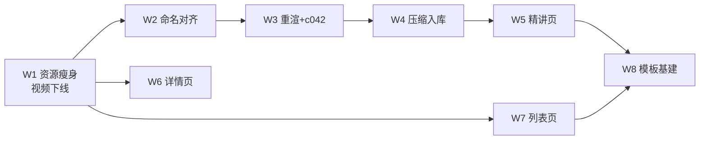

# 问题集合 v25 — 动作库重设计：资源收口 + 配图修复 + 页面改造 + 精讲统一

> **真源声明**：本文件是「动作库（Tab 2）功能、美观性、内容展示方式重新设计」这一轮需求的**真源**，供 `plan-delegated-execution` / `plan-batch-execution` 执行。高版本覆盖低版本。
>
> - **版本**：v25.0
> - **日期**：2026-08-03
> - **状态**：⏳ 待开工（W1 可立即启动）
> - **来源**：2026-08-03 会话——用户提出重新设计动作库各页面与功能，要求先截图再结合具体动作内容分析；过程中因模拟器装不上 App（旧产物 13G）先做了视频摘除，由此牵出资源与配图两条主线；用户拍板视频下线与配图进 git 后指令 `/issue-collection-restructure`。
> - **排期前置**：
>   - `tasks/HUMAN-REQUIRED.md` 无 ⏳ `[BLOCKING]` 项（2026-08-03 核）。
>   - 工作区当前有未提交改动（`BatchDrillStudio`、`PositionPlayViewModel`、大量 `DrillBoards/*.json` 增删），**开工前需先处理干净**，否则批次验收的 git diff 不可读。
>   - v24（缩略图裁桌 + 列表大球）已收官，本轮**不重做**静帧契约与 `ballScale`。
> - **与既有方案关系**：
>   - 静帧契约底稿：`docs/research/20260729-drill缩略图静帧契约.md`（W3 若改取景需同步修订）。
>   - 试打模式方案：`docs/research/20260709-动作库试打模式方案.md`（本轮 E1 依赖其结论「试打与视频示范同源」）。
>   - **不做**：动作库以外的 Tab；`AngleGridCard` 海报封面；Drill 内容本身的教学正确性复核（除 E7 单点）。
> - **锚点核实日期**：2026-08-03（§五逐条读代码/读文件核实）
> - **编号约定**：条目 **E1–E23**；批次 **W1–W8**；拍板项 **D-v25-N**

---

## 一、需求回显（语义基准，不增删）

### 1.1 用户原始诉求

1. 对动作库里**每个动作的相关页面和功能**重新设计——功能、美观性、内容展示方式都有需要调整的地方。
2. 要求先截图，再**结合具体动作的内容**分析，不要空谈。
3. 精讲现在有新版和旧版，**后面都要统一到新版**。
4. 需要子智能体时用 **cursor grok 4.5**。
5. 中途追加：模拟器起不来是因为视频都打进包了，**先把视频拿掉**。
6. 中途追加：视频和详情页图片**都太大**，问有没有办法解决。
7. 中途追加提议：**视频干脆拿掉**，因为已经有「上手试打」。

### 1.2 已拍板结论

| 编号 | 结论 | 状态 |
|---|---|---|
| **D-v25-1** | 彻底拿掉引擎渲染视频；`schema` 保留 `videos` 字段位，标注为**预留真人示范** | ✅ 用户拍板 |
| **D-v25-2** | 精讲配图先压成 HEIC/JPEG（约 85 MB），再**全量纳入 git** | ✅ 用户拍板 |
| **D-v25-3** | 详情页「训练维度」启发式进度条**删除**，换成真实的「我的练习记录 / 最好成绩 / 达标率」 | ✅ 用户拍板 |
| **D-v25-4** | 本轮范围 = 详情页 + 精讲页 + 列表页**全都改** | ✅ 用户拍板 |
| **D-v25-5** | 子智能体统一用 `cursor-grok-4.5-high-fast` | ✅ 用户拍板 |

### 1.3 拍板项（2026-08-03 全部确认，均按主控推荐）

| 编号 | 结论 | 影响批次 | 状态 |
|---|---|---|---|
| **D-v25-6** | 配图命名统一方向＝**改回填脚本、去掉磁盘文件的 `_still`**；JSON 引用不动。与 `content-engineering/SKILL.md:202-203` 既有约定一致 | W2 | ✅ |
| **D-v25-7** | `Resources/Previews`（520 MB / 988 张）**排除出包**；`BTDrillPreviewPlayer` 标为未接线组件，保留代码，随时可恢复 | W1 | ✅ |
| **D-v25-8** | 精讲模板定为**三类**：单杆技术课 / 多杆应用课 / 规则流程课（依据见 §2.7） | W8 | ✅ |
| **D-v25-9** | 41 条 legacy **本轮只做基建 + 3 条试点**，全量迁移另立 v26 | W8 | ✅ |
| **D-v25-10** | 574 张孤儿 PNG（2.08 GB）**保留磁盘、不进包不进 git**；W3 重渲后再判断能否清理 | W4 | ✅ |

---

## 二、问题条目（E1–E23）

### 2.1 资源与打包（E1–E4）

| 编号 | 问题 | 实测依据 |
|---|---|---|
| **E1** | 引擎渲染视频占 11 GB 且与「上手试打」信息重复。183 个 mp4 中 **152 个**是本项目引擎出片（`full.mp4` / `manualNN_full*.mp4` / `Snipaste_*_full*.mp4`），仅 31 个是 ShooterSpool 录屏（其中 24 个未被 JSON 引用）。同一份轨迹在详情页出现三次：顶部 live `DrillSceneView`（`shotIntent` 覆盖 **77/77**）、视频示范、上手试打 | 拿掉后 **0 个 drill 变空**（77 条全有 `shotIntent`，67 条有试打序列） |
| **E2** | 精讲配图 591 张 PNG 共 **2.14 GiB**，无损 PNG 存渲染图纯属浪费 | 实测 `drill_c042_initial.png` 3.7 MB → JPEG q80 333 KB / HEIC q70 148 KB / 长边 1200 JPEG 75 KB |
| **E3** | `Resources/Previews` 988 张 / 520 MB，`BTDrillPreviewPlayer` 在生产代码零调用（只出现在自身 `#Preview`）。且该目录原先既未声明 folder reference 也未 exclude，`xcodegen` 重生成后 `frame_NN.png` 平铺到包根**直接构建失败** | 已临时按 folder reference 修复构建；处置待 D-v25-7 |
| **E4** | 591 张里 **574 张（97.1%）是孤儿**，未被任何 JSON `image` 引用，占 2.08 GiB | 361 张属于「JSON 无 `image` 字段」的 drill；213 张是已回填但未写进精讲的多余帧 |

### 2.2 配图正确性（E5–E7）

| 编号 | 问题 | 实测依据 |
|---|---|---|
| **E5** | JSON `image` 引用 98 处，**81 处失效**（22 个 drill），其中 **47 处可机械修复**。根因是三套命名约定分叉：JSON 写 `_sNN`、引擎出片写 `_sNN_still`、回填脚本原样保留 stem 不做重命名 | 子类：`_sNN`↔`_sNN_still` 36 处；`manual0N` 前缀缺失 9 处（c013/c025/c026）；Snipaste 时间戳 token 2 处（c022） |
| **E6** | 34 处失效属于**素材套数不足**，多球形 JSON 要 N 套图、磁盘只回填了 1 套（多序列被当单序列处理，`fN` 塌缩） | c005 缺 f2–f4、c010 缺 3 套、c012 缺 1 套、c014 缺 1 套、c030 缺 4 套。另 `fN` 位置不统一：c005/c010/c022/c030 用中缀 `_f1_initial`，c012/c014 用后缀 `_initial_f1` |
| **E7** | `drill_c042` 开局图内容错误：图上**三颗彩球一颗都没渲染**，只有母球且位于中下方；图注却写「三颗球沿中线排开，母球右上」 | 原图 `drill_c042_initial.png` 肉眼可验；该图在精讲页「开局与击球顺序」节展示 |

### 2.3 精讲页呈现（E8–E13）

| 编号 | 问题 | 依据 |
|---|---|---|
| **E8** | 导航栏材质模糊不足，滚动时正文穿透「精讲」标题栏叠字，可读性受损 | `c042-04/05/06/08` 四张滚动截图均复现。对照：`DrillDetailView.swift:89-91` 已按 UR-20260529 U-06 加了 `.toolbarBackground(.visible/.ultraThinMaterial)`，精讲页缺同等处理 |
| **E9** | 配图为**竖向整台 4:8**，一张吃掉整屏高度，有效信息集中在中间一小块；详情页球台却是横向。方向与取景两套标准 | 图源 1440×2720 / 1440×2560 |
| **E10** | 轨迹图无图例、无杆号、无袋口标注、无方向箭头；白线/黄线/紫线含义靠猜 | c042 三杆图均如此 |
| **E11** | 打点参数把引擎浮点直接上屏（「高 43% · 右 1%」）。「右 1%」是噪声，教学上应为档位 | 与 FL-027「元数据须教学可执行、非引擎内部值」同类 |
| **E12** | 三杆内容需滚 5 屏，无逐杆锚点导航；只有多球形才有分段 Picker | `DrillTutorialView` `formations` 才走 Picker 分支 |
| **E13** | 精讲与试打割裂：读完某一杆无法「就这一杆去试打」 | 试打入口只在详情页底栏与顶部胶囊 |

### 2.4 详情页（E14–E17）

| 编号 | 问题 | 依据 |
|---|---|---|
| **E14** | 「训练维度」5 条进度条是按 `category` + `difficulty` 硬编码的启发式值，代码自带免责声明「示意倾向，非测评数据」，占近一屏而信息价值≈0 | `DrillDetailView.swift:403-450` `trainingDimensions(for:)`；文案在 `:378` |
| **E15** | 从动作库**没有任何路径**把动作加入今日训练或自定义计划——`F-DL-02` 因「空 CTA」把「加入训练」删掉后未补回 | `DrillDetailView.swift:534` 注释明示 |
| **E16** | 顶部 live 场景右上角浮标（如 `1.3`）无标签、含义不明；左下 ▶ 与右下「上手试打」胶囊争抢注意力 | `c042-01` / `06-drill-detail-top` 截图 |
| **E17** | 「达标标准」与「默认 N 组 × M 球」分两处，且无「我的最好 / 上次」对照，用户看不到离达标多远 | `DrillDetailView.swift:310-337` `criteriaSection` |

### 2.5 列表页（E18–E20）

| 编号 | 问题 | 依据 |
|---|---|---|
| **E18** | 缺等级筛选（L0–L3）。训练 Tab 有等级 chip，动作库只有球种 chip + 8 类侧栏 + 搜索，两处不一致 | `DrillListViewModel` 只有 `searchText` / `ballTypeFilter` / `categoryFilter` 三个筛选态 |
| **E19** | 卡片无「有精讲 / 有视频 / 已完成 / 我的进度」角标与筛选；41 条 legacy 与 36 条新版精讲在列表上完全无法区分，迁移进度不可视 | `BTDrillGridCard` 现有叠加只有等级徽章 + PRO/收藏 |
| **E20** | 77 条卡片封面高度雷同（绿台 + 一两个小点），扫视时区分不出「练什么」；副标题「通用 · 推荐 3 组」信息价值低 | `05-drill-library` 截图 |

### 2.6 内容统一基建（E21–E22）

| 编号 | 问题 | 依据 |
|---|---|---|
| **E21** | 新旧版靠**启发式猜**（有没有 `items`/`image`）区分，无显式字段，分批迁移与验收没有可靠依据 | `DrillTutorialView` 只按 `formations`/`sections` 分支；`DrillContent` 无 `tutorialKind` |
| **E22** | 「统一到新版」缺模板定义真源。现有 `tutorial-authoring/SKILL.md` 只覆盖多杆应用课模板 | 见 §2.7 |

### 2.7 legacy 迁移（E23）与三模板依据

**E23**：41 条 legacy（四段纯文本）需迁移到统一 schema。素材盘点：**35 条已有可复用素材**（31 条有试打序列、30 条有预览帧、34 条有示范视频），仅 6 条从零补。

但这 6 条恰好证明「两类模板不够」：

- `drill_c008 手架练习`、`drill_c043 高级手架稳定性` 是**纯身体动作**，需要手型照片/姿势示意图，球台渲染帮不上。强套球台图＝为填模板而填。
- `drill_c065 Ghost Game`、`drill_c067 9球标准清台`、`drill_c068 五球连打走位`、`drill_c070 全台清台挑战` 是**开放式挑战**，每次开局都不同，写「第 N 杆」在教学上就是错的。

故 **D-v25-8 推荐三类模板**：

| 模板 | 适用 | 结构 | 配图要求 |
|---|---|---|---|
| **单杆技术课** | 基础功、准度、杆法、控力 | 原理 → 动作要领 → 常见错误 → 进阶 | 允许无图；姿势类用照片而非球台渲染 |
| **多杆应用课** | 走位、分离角、综合球形 | 现 c042 结构：技术原理 → 开局与击球顺序 → 第 N 杆 | 每杆一图 + 开局图 |
| **规则流程课** | 开放式挑战（Ghost Game、清台类） | 怎么摆 → 怎么计分 → 失败判定 → 进阶变体 | 开局示意 + 计分示意 |

三类共用同一 schema（`items` / `params` / `image` / `caption`），**渲染层无需改动**——`DrillTutorialView` 已全部支持。这是本轮最大的低风险利好。

---

## 三、批次表

| 批次 | 范围（条目） | 量级 | 依赖 | 模型 |
|---|---|---|---|---|
| **W1** 资源快速瘦身 | E1、E3 | 代码 3 文件 + 77 JSON + 配置 2 | 无 | `cursor-grok-4.5-high-fast` |
| **W2** 配图命名对齐 | E5 + 回填脚本修复 | 47 处引用 + 1 脚本 | W1 | `cursor-grok-4.5-high-fast` |
| **W3** 多球形重渲 + c042 修正 | E6、E7 | 5 drill 重出片 + 1 图修正 | W2 | `cursor-grok-4.5-high-fast` |
| **W4** 配图压缩与入库 | E2、E4 | 591 图 + 1 加载器 + gitignore | W3 | `cursor-grok-4.5-high-fast` |
| **W5** 精讲页呈现改造 | E8–E13 | 1 View + 出片取景参数 | W4 | `cursor-grok-4.5-high-fast` |
| **W6** 详情页改造 | E14–E17 | 1 View + 训练记录查询 | W1 | `cursor-grok-4.5-high-fast` |
| **W7** 列表页改造 | E18–E20 | 1 View + 1 VM + 1 卡片组件 | W1 | `cursor-grok-4.5-high-fast` |
| **W8** 模板基建 + 迁移试点 | E21、E22、E23（3 条试点） | schema + 2 SKILL + 3 drill | W5、W7 | `cursor-grok-4.5-high-fast` |

> **模型说明**：用户已统一指定 `cursor-grok-4.5-high-fast`（D-v25-5），按 `01-subagent-model-selection` 视为已指定，后续会话不再重复询问。**例外建议**：W3（涉及几何取景与球形重渲，判断密集）与 W8（模板定义横切）若首轮验收不达标，主控可提请改派强推理模型。

### 依赖图

W6 / W7 与 W2→W5 主链**互不相交，可并行**（不同文件域）。W1 是全局前置：包体从 2.8 GB 降下来后，后续每批的构建+截图验证都会显著加速。

---

## 四、各批次完成标准

### W1 — 资源快速瘦身（E1、E3）

**范围**
1. `project.yml`：`Resources/Videos` folder reference 保持注释（已改），补 exclude 说明；按 D-v25-7 处置 `Resources/Previews`。
2. `DrillDetailView.swift`：移除 `videoSection`（:455-486）、`emptyVideoPlaceholder`（:488-500）、`videoThumbnail`（:502-518）、`VideoThumbnailCache`（:572-612）、`VideoThumbnailView`（:614-660）、`DrillVideoPlayerSheet`（:664-716）、`playingVideo` state（:27）、`.sheet(item: $playingVideo)`（:131-133）、body 内 `videoSection(drill)` 调用（:73）、`import AVKit`（:3，确认无其他使用后）。
3. `DrillContentService.swift`：`videoURL`（:296-301）删除或标注保留；`DrillVideo`（:70）与 `videos` 字段（:21）**保留**（D-v25-1 预留真人示范）。
4. 77 个 drill JSON：清空 `videos` 数组引用。
5. `QiuJi/Resources/Drills/schema.md:25`：`videos` 描述改为「预留真人示范位，当前无内容；引擎渲染视频已于 v25 下线」。
6. `scripts/import-videos-to-app.py`：文件头标注归档状态与原因，不删除。

**完成标准（可验证）**
- [ ] `make xcodegen && make build` 通过，无 error、无 duplicate output warning。
- [ ] `du -sh build/DerivedData/Build/Products/Debug-iphonesimulator/球迹.app` ≤ **2.4 GB**（当前 2.8 GB；若 D-v25-7 选排除 Previews 则 ≤ 2.3 GB）。
- [ ] `rg -n "videoSection|DrillVideoPlayerSheet|VideoThumbnail" QiuJi --glob '*.swift'` 无结果。
- [ ] `python3` 校验 77 个 drill JSON 的 `videos` 全为空或缺省。
- [ ] 跑 `testDrillLibraryOnly` + `testDrillC042TutorialDemo`，详情页截图**无视频示范区**、其余区块无位移错乱。

### W2 — 配图命名对齐（E5）

**范围**：按 D-v25-6 选定方向修复 47 处；同步修 `scripts/import-engine-export-to-app.py:113-122` 的落位命名逻辑，使其与文档约定一致（`content-engineering/SKILL.md:202-203`）。c013/c025/c026 需明确「默认取 manual01」的约定并写进 schema。

**完成标准**
- [ ] 校验脚本输出：JSON `image` 引用失效数 从 81 降到 **34**（剩余为 W3 的素材缺口）。
- [ ] 回填脚本对同一份导出目录重跑，产出文件名与文档约定一致（幂等）。
- [ ] `content-engineering/SKILL.md` 与实现分叉消除，二者描述一致。
- [ ] 截图验证任取 3 个已修复 drill（建议 c001 / c023 / c031）精讲页配图正常显示。

### W3 — 多球形重渲 + c042 修正（E6、E7）

**范围**：c005（缺 f2–f4）、c010（缺 3 套）、c012（缺 1 套）、c014（缺 1 套）、c030（缺 4 套）按球形重新出片回填；统一 `fN` 位置约定（中缀 vs 后缀二选一并写进 schema）；修正 c042 开局图三球未渲染与图注不符。

**完成标准**
- [ ] 校验脚本输出：JSON `image` 引用失效数 = **0**。
- [ ] 5 个多球形 drill 的每个球形拥有**独立**的 `initial` + 各杆图，不共用同一张。
- [ ] c042 开局图上三颗彩球可见，且母球位置与图注「右上」一致（几何类任务，动手前按 `geometry-spatial-reasoning` 钉死坐标契约）。
- [ ] 截图验证 c005 / c030 多球形切换，各球形配图不同。

### W4 — 配图压缩与入库（E2、E4）

**范围**：591 张 PNG 转 HEIC（推荐 q70，保持原始像素尺寸以保证全屏查看清晰）；`DrillTutorialImageStore`（`DrillTutorialView.swift:5-18`）扩展名硬编码改为多扩展名回退；`.gitignore` 放行；按 D-v25-10 处置孤儿。

**完成标准**
- [ ] `du -sh QiuJi/Resources/DrillTutorials` ≤ **150 MB**（当前 2.14 GiB）。
- [ ] `git ls-files QiuJi/Resources/DrillTutorials | wc -l` = 实际入库图数（当前仅 8）。
- [ ] App 包体 ≤ **500 MB**。
- [ ] 精讲页全屏查看配图（`TutorialMediaViewer`）无可见画质劣化——截图对比 c042 三杆图。
- [ ] 加载器对 `.heic` / `.png` 均能命中（保留回退，避免遗漏文件时静默失图）。

### W5 — 精讲页呈现改造（E8–E13）

**完成标准**
- [ ] E8：滚动截图中标题栏不再被正文穿透（对照 `DrillDetailView.swift:89-91` 的处理）。
- [ ] E9：配图取景改为有效区域，单图高度不超过屏高 **60%**；方向与详情页一致。
- [ ] E10：轨迹图含图例、杆号、袋口标注、方向箭头。
- [ ] E11：打点由浮点改为教学档位，`params` 原值保留在 JSON 供追溯，**不上屏**。
- [ ] E12：多杆精讲有逐杆锚点导航，可直达任意杆。
- [ ] E13：每杆节提供「试打这一杆」入口，进入 `PositionPlayComposerView` 时定位到对应 step。
- [ ] 截图巡游 c042 全程复检，六条逐项对照。

### W6 — 详情页改造（E14–E17）

**完成标准**
- [ ] E14：`trainingDimensions(for:)`（:403-450）及其 UI 删除；替换为真实练习记录（练习次数 / 最好成绩 / 达标率），**无数据时显示空态而非造数**。
- [ ] E15：恢复「加入训练」入口且不是空 CTA——能真正把动作加进今日训练或自定义计划，并有落库验证。
- [ ] E16：live 场景浮标加标签；▶ 与「上手试打」视觉层级区分。
- [ ] E17：达标标准与我的成绩合并对照展示。
- [ ] 截图对比改造前后，页面总高度下降且信息密度提升。

### W7 — 列表页改造（E18–E20）

**完成标准**
- [ ] E18：等级筛选（L0–L3）可用，与训练 Tab 交互一致。
- [ ] E19：卡片角标可区分「有精讲 / 精讲版本 / 已完成」；提供对应筛选。
- [ ] E20：封面能体现动作差异（取景或标注方案二选一，需在批内说明理由）。
- [ ] 筛选组合（球种 × 分类 × 等级 × 搜索）无冲突，空态正确。
- [ ] 截图覆盖：默认态、等级筛选态、组合筛选态、空态。

### W8 — 模板基建 + 迁移试点（E21、E22、E23 部分）

**完成标准**
- [ ] E21：`DrillContent` 新增 `tutorialKind` 显式字段，77 条 JSON 全部标注；`DrillTutorialView` 与列表角标改读该字段，不再启发式猜。
- [ ] E22：三类模板定义写入 `schema.md` 与 `tutorial-authoring/SKILL.md`，各附一个完整范例。
- [ ] E23 试点：选 3 条 legacy 迁移，须覆盖三类各一条（建议 `drill_c032` 单杆技术课 / `drill_c064` 多杆应用课 / `drill_c065` 规则流程课）。
- [ ] 试点 3 条精讲页截图，与新版 c042 观感一致。
- [ ] 输出 v26 全量迁移方案骨架（剩余 38 条的分批建议）。

---

## 五、锚点索引（2026-08-03 逐条读代码核实）

### 5.1 视图层

| 锚点 | 路径 | 行号 |
|---|---|---|
| 详情页 body 区块装配 | `QiuJi/Features/DrillLibrary/Views/DrillDetailView.swift` | 41-134 |
| 顶栏材质处理（精讲页应对照） | 同上 | 89-91 |
| 顶部 live 球台 | 同上 | 138-151 |
| 试打入口 | 同上 | 153-215 |
| 训练要点 + 查看精讲 CTA | 同上 | 259-306 |
| 达标标准 | 同上 | 310-337 |
| 训练维度 UI | 同上 | 341-387 |
| 训练维度启发式算法 | 同上 | 403-450 |
| 视频示范区 | 同上 | 455-486 |
| 视频空态 | 同上 | 488-500 |
| 视频缩略图 | 同上 | 502-518 |
| 底栏（含 F-DL-02 注释） | 同上 | 522-549 |
| 视频缩略图缓存 actor | 同上 | 572-612 |
| 视频播放 sheet | 同上 | 664-716 |
| 精讲配图加载器（硬编码 `.png`） | `QiuJi/Features/DrillLibrary/Views/DrillTutorialView.swift` | 5-18 |
| formations / sections 解析 | 同上 | 29-38 |
| 配图调用点 | 同上 | 236、413 |
| 列表页搜索栏 / 球种 chip | `QiuJi/Features/DrillLibrary/Views/DrillListView.swift` | 56、233 |
| 分类侧栏 | 同上 | 94-156 |
| 网格与卡片 | 同上 | 180-183 |
| 列表筛选态 | `QiuJi/Features/DrillLibrary/ViewModels/DrillListViewModel.swift` | 32-36 |
| 预览播放器（生产零调用） | `QiuJi/Core/Components/BTDrillPreviewPlayer.swift` | 11、114、154 |

### 5.2 数据与内容层

| 锚点 | 路径 | 行号 |
|---|---|---|
| `DrillContent.videos` | `QiuJi/Data/Services/DrillContentService.swift` | 21 |
| `DrillVideo` | 同上 | 70 |
| `DrillTutorial`（sections/formations 二选一） | 同上 | 75-85 |
| `TutorialSection`（含 clip 说明） | 同上 | 99-124 |
| `videoURL` | 同上 | 296-301 |
| tutorial clip 解析 | 同上 | 303-306 |
| schema `videos` 定义（写着 real-person takes） | `QiuJi/Resources/Drills/schema.md` | 25 |
| schema sections/formations | 同上 | 37-52 |
| schema 视频导入说明 | 同上 | 77 |

### 5.3 管线与脚本

| 锚点 | 路径 | 行号 |
|---|---|---|
| 静帧名生成（`initial` / `s%02d_still` / `final`） | `QiuJi/Core/Media/SequenceVideoExporter.swift` | 239-266（248 / 256 / 264） |
| 静帧写出 | `QiuJiTests/PositionPlaySequenceExportRunnerTests.swift` | 85-88 |
| 回填落位命名（命名分叉根因） | `scripts/import-engine-export-to-app.py` | 63-76、113-122 |
| 文档期望（未落实） | `.cursor/skills/content-engineering/SKILL.md` | 202-203 |
| JSON 侧命名约定 | `.cursor/skills/tutorial-authoring/SKILL.md` | 73-74 |
| 视频导入脚本（待归档） | `scripts/import-videos-to-app.py` | 全文 |
| 打包配置 | `project.yml` | 41-80 |
| 构建与截图目标 | `scripts/Makefile` | 59-106、230-238 |

### 5.4 验证资产

| 用途 | 路径 |
|---|---|
| 动作库截图巡游 | `QiuJiUITests/ScreenshotTourUITests.swift:820` `testDrillLibraryOnly` |
| c042 精讲巡游 | 同上 `:786` `testDrillC042TutorialDemo` |
| 动作库断言测试 | `QiuJiUITests/P3_DrillLibraryUITests.swift` |
| 截图落盘开关 | `UI_POLISH_SHOT_DIR` 环境变量或 `/tmp/qiuji-uitest/shot_dir` 文件 |
| 本轮基线截图 | `build/review-shots/`（2026-08-03 摘除视频后所摄） |

---

## 六、红线与注意事项

1. **诚实交付**：任何「完成 / 通过」必须附真实 build/test 输出。视频下线后详情页若出现布局塌陷，如实报告，不得用占位块掩盖。
2. **禁止喂绿**（FL-027）：配图修复以**实际渲染结果**为准，不得靠改 JSON 引用指向一张不相干的图来让校验脚本变绿。多球形共用一张图**不算修复**。
3. **几何类强制**（`geometry-spatial-reasoning`）：W3 的 c042 开局图修正与 W5 的取景改造，动代码前先钉死坐标契约，与 `.kiro/steering/table-geometry.md` 交叉核对，禁止脑内断言。
4. **元数据实测**：W5 的打点档位化必须由实测轨迹派生，不得直接量化种子值。
5. **范围纪律**：本轮不碰动作库以外的 Tab；不重做 v24 静帧契约；不做 41 条全量迁移。
6. **磁盘资源不删**：11 GB 视频与 574 张孤儿图只做「不进包、不进 git」处理，不执行 `rm`。

---

## 七、版本记录

| 版本 | 日期 | 变更 | 原因 |
|---|---|---|---|
| v25.0 | 2026-08-03 | 首版：E1–E23 条目化，W1–W8 批次化，锚点全量核实 | 用户指令 `/issue-collection-restructure`，综合 2026-08-03 会话全部讨论 |
| v25.1 | 2026-08-03 | D-v25-6～10 全部拍板（均按主控推荐）；W1 开工 | 用户确认五项待决问题 |
