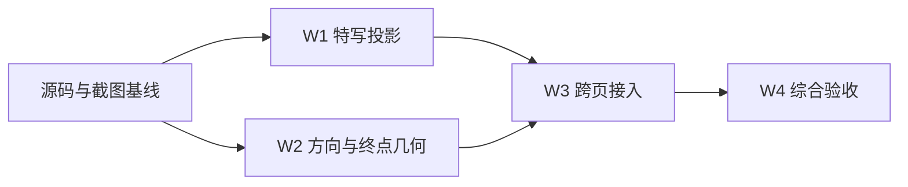

# 问题集合 v61：瞄准特写视角与自由瞄准实时方向反馈

> **本文件是本轮需求真源。** 日期：2026-09-10；版本：v61.3；状态：W1–W4 已完成本地实施与定向验收；真机未验，未提交发布。
> 用户于 2026-09-10 明确「好的，开始吧」，授权按本方案实施；各批完成仍以实证为准。后续 v61.x 覆盖本专题低版本，不替代 v59/v60 等其他专题。
> 排期前置：每批开始检查当前 HEAD、工作区差异、相关组件 API 与其他任务占用；保存本批文件基线，保留 `output/`、`tmp/` 及无关改动。共享文件不得被多个任务同时修改。几何实现遵循 `geometry-spatial-reasoning` 和 `.kiro/steering/table-geometry.md`。

## 1. 需求回显与授权边界

### 已确认

1. 修正 3D 瞄准特写与主场景朝向、可见角度不一致的问题。采用当前视角的局部放大，跟随主相机投影，不用固定角度补偿。
2. 自由瞄准时，在完整物理预测返回之前，实时展示目标球的理想初始移动方向。依据首碰时母球球心（假想球球心）到目标球球心的方向计算，不等待复杂物理模拟。
3. 使用浅灰虚线，**不加箭头**，沿理想方向延伸到第一次吃库或进袋，不绘制反弹和后续物理路径。
4. 主场景与特写使用同一几何结果；瞄准点练习不增加该预览线，但其 3D 特写投影需要修复。
5. 新意图使旧物理轨迹失效；最新物理结果返回后接替灰色预览。实时预览不改变既有击球、评分和物理预测参数。
6. 按批次执行并保留可验证证据，不提交或发布。

### 解释口径

- “打点”在此预览中指瞄准方向和碰撞厚薄。仅调整高低杆或左右塞，不应伪造几何方向变化；实际偏移交由原物理预测表达。
- 灰线为理想几何方向，不保证以当前力度能到达终点，也不表示必然进球；不把几何终点写进正式进球统计或物理事件。
- “第一次吃库”包括真实直库和袋口边缘接触；“进袋”需走现有袋口几何判定，不能把矩形边界命中当进袋。
- 多球时，确定被母球首先碰到的目标球，不能用当前选中球代替。

### 未拍板建议（不作为默认实施要求）

- 目标球理想方向前方还有球时，是否在首次碰球处截断：此前由助手建议，用户尚未单独确认。默认遵循用户“延伸到第一次吃库或进袋”的原话，作为忽略后续碰球的理想延长线；不新增其他球的运动预测。若后续采用截断，先更新本节及对应测试口径。

## 2. 场景范围

| 场景 | 特写 | 理想方向线 |
|---|---|---|
| 3D 瞄准点训练 | 修复相机投影和避让 | 不增加 |
| 2D 瞄准点训练 | 俯视方向、尺寸和避让回归 | 不增加 |
| 自由击球 | 跟随可用相机模式 | 自由瞄准、非开球、非播放时增加 |
| 每日清台 | 共用自由击球入口，独立验证 | 非开球阶段自由瞄准时增加 |
| 自由走位／编排台 | 跟随可用相机模式 | 仅自由模式增加 |
| 动作详情试打、球形提取后的编排台 | 共用编排台，核对入口状态 | 同上；不影响序列播放 |
| 分离角与走位 | 跟随可用相机模式 | 仅自由模式增加 |
| 翻袋解球器、反射解球器 | 当前固定竖屏 2D，检查不退化 | 仅自由模式增加 |

排除：开球、正式击球/回放/演示、进袋自动求解模式、序列播放、其他静态教学图，以及不使用该特写的角度训练页面。关闭特写开关只隐藏特写，不关闭主场景理想线。保留既有轨迹显隐选项语义，实施前核对各档是否涵盖瞄准辅助，禁止顺手新增设置项。

## 3. 现状与实现约束

### 3.1 特写

`BTAimCloseupHUD.map` 固定调用 `AimCloseupCoords.mapRotated`，即屏幕右=世界 +Z、屏幕上=世界 +X；snapshot 仅存 XZ 平面点，没有主相机投影信息。瞄准点训练的 `focusNorm` 和避让走廊也由固定俯视坐标产生。因此只旋转线条不够，焦点、标记、位置避让及透视压缩都必须同源。

优先复用 `AngleSceneView.bindProjector` 的真实 SCNView 投影桥。局部映射采用“世界点投影到当前主视图 → 相对焦点平移 → 统一屏幕放大”，不可对各方向分别缩放。须验证球体轮廓、球心/接触点高度及线条绘制高度的关系；若现有平面 snapshot 不能表达，应补必要信息，不靠偏移常数掩盖。2D 保持原方向契约。相机运动本身须触发可见特写更新，不能等到下一次瞄准输入才刷新；特写隐藏时避免无意义的持续 SwiftUI 发布。

### 3.2 方向线

共享纯几何计算，结果为“首碰目标身份、起点、终点、终点类型”，字段/API 名称由实现期确定。用既有首碰/假想球结果推导单位法向，绘制从目标球前缘到终点的直虚线，避免穿过球面文字。所有计算在 SceneKit XZ 米制坐标、Y 向上；球半径与库袋常量取现有真源。

`rayToInnerRail` 只求矩形交点，不能独立满足袋口要求。终点应复用现有 TableGeometry 的直线段、圆弧、袋口数据进行有限半径球的射线首次事件求交；检查袋角、贴库、喉口与进袋边界。不得为了预览调用整杆 simulateFree，也不得另建不一致的库袋常量。

### 3.3 调度

PositionPlayViewModel 已有纯几何刷新、交互静止 0.5 秒去抖、单飞及 predictGeneration 代际保护；沿用这些机制，补齐离散输入/参数变化时旧轨迹清理与预览接替，不另起第二套求解任务。灰线不依赖特写近区门是否打开。

BankShotViewModel / DiamondSystemViewModel 自由模式使用独立刷新路径，通常在击球时才模拟；无正式预测可接替时灰线保留至击球，不能被固定计时器提前隐藏。模式切换、打空、删球、恢复球形、取消、退出和播放起止须清理/重建预览。

## 4. 批次与依赖

| 批次 | 范围 | 量级 | 依赖 | 状态 |
|---|---|---|---|---|
| W1 | 真实投影特写、相机更新、焦点与避让，跨调用点接入 | 中偏大，1 会话 | 源码基线 | ✅ 2026-09-10，定向验证完成 |
| W2 | 首碰理想方向与库袋终点共享几何，纯函数测试 | 中，1 会话 | 源码基线；可与 W1 换序 | ✅ 2026-09-10，几何定向验证完成 |
| W3 | 三条 ViewModel 路径的灰线/特写接入、状态与预测接替 | 中偏大，1 会话 | W1、W2 | ✅ 2026-09-10，状态与跨页验证完成 |
| W4 | 跨页功能、几何渲染与实际 UI 综合回归及文档收尾 | 中，1 会话 | W3 | ✅ 2026-09-10，标准/紧凑/iPad定向验收完成 |

批次可跨会话连续执行；无需每批重新批准。W1/W2 相对独立不等于授权并行智能体。用户已授权连续推进；执行结果见各批记录和最终验收报告。

### W1 完成标准

- 保存截图对应 3D 瞄准点训练的改前实际页面，记录球位和相机；用户 IMG_3355.PNG 作为问题参照，不代替可复现基线。
- 对同一世界点，特写位置等于真实主视图投影相对焦点的统一放大；覆盖多个 yaw、俯仰、缩放及 2D，给出数值断言和截图，不只验单一视角。
- 球、接触点、瞄准线、进球线不相互错位；相机变化及时更新，特写不盖目标球/关键瞄准走廊，靠近屏幕边缘仍可见。
- 2D 图形不镜像；现有拖住暂停仍显示、松手收起、离开近区隐藏行为回归。
- 定向测试与构建通过；打开改后完整页面原图审查。记录设备、状态和未验范围。

### W2 完成标准

- 正撞、左右薄切、打空、身后球、多球首碰顺序、近零方向、贴库和边界起点测试；几何值不得 NaN/倒射。
- 六袋分别覆盖进袋方向、袋角擦碰、靠袋直库；直库和圆弧接触考虑球半径。对称球形终点对称，与真源几何作独立事件核对。
- 灰线直至首次库/袋事件，无箭头、无反弹；目标前方有其他球按 §1 默认口径，不擅自截断。
- 代表球形出图并打开核对；定向测试及构建通过。记录运行耗时，确认输入路径未进入整杆物理预测。

### W3 完成标准

- §2 所有自由模式接入同源结果；主场景与特写一致；瞄准点练习绝不获得新方向层。
- 连续拖动、停顿、离散点选、拖球、增删球、力度/旋转参数变化均覆盖；新意图立即更新，旧任务晚返回不能覆盖当前状态。
- 有新物理结果时灰线接替正确；无结果/失败时不把旧路径当当前路径；两个解球器不依赖 PositionPlay 的预测回调。
- 开球/播放/回放/序列/模式切换/恢复球形/退出无灰线残留；关闭特写仍有主场景几何反馈。
- 保留白色瞄准线及 6/14 训练进球线规则，不改球体配色、球半径、击球方向、物理参数和评分。
- 构建、适用的定向状态/集成测试及代表页面原图检查通过。

### W4 完成标准

- 逐行核验 §2；实际 UI 至少覆盖 3D 与 2D 瞄准点训练、自由击球、每日清台非开球、编排台自由/试打、分离角自由、两个解球器自由；模式排除项须有状态证据。
- 标准 iPhone 完整关键流程；紧凑 iPhone、iPad 复验特写避让与仪表遮挡；相机旋转/俯仰/缩放按页面实际支持范围验证。真机未跑即明确未验。
- 灰线在台呢上清晰、无箭头、不超出首次库袋终点；截图原图必须逐张打开，测试绿不能替代视觉验收。
- 最终源码构建、定向回归、`git diff --check`、`make -f scripts/Makefile verify-doc-size`；涉及路由/其他门禁契约变动再跑对应门禁，不无条件改路由指纹。
- 证据置于 `output/aim-preview-v61/`，包含基线、源码指纹、命令/退出码、原始日志、截图和审查结论。更新 PROGRESS、UI 规格、实施记录；不提交或发布，除非另获授权。

## 5. 已核实锚点索引

核实日期：2026-09-10。行号是当前快照，执行前按符号重新定位。

| 文件 | 行号/符号 | 作用 |
|---|---|---|
| QiuJi/Core/Geometry/AimCloseupCoords.swift | mapRotated | 固定竖屏俯视映射 |
| QiuJi/Core/Components/BTAimCloseupHUD.swift | BTAimCloseupHUD.map / BTAimCloseupOverlay / AimCloseupSnapshot | 特写图形、位置与数据结构 |
| QiuJi/Core/Geometry/AimCloseupBuilder.swift | freeAim | 自由瞄准首碰及特写层集 |
| QiuJi/Core/Scene/AngleSceneView.swift | 108 bindProjector；260 附近 displayLink | 真实投影桥及相机逐帧更新生命周期 |
| QiuJi/Features/AngleTraining/Views/AimPointSceneTrainingView.swift | 390 updateAimAssistState；584 overlay | 独立练习路径，固定俯视焦点与避让 |
| QiuJi/Features/PositionPlay/ViewModels/PositionPlayViewModel.swift | 608 refreshFreeAimOverlay；650 updateCloseup；753 recompute；2029 SolveDebounceScheduler | 多页面共用几何与异步状态 |
| QiuJi/Features/AngleTraining/ViewModels/BankShotViewModel.swift | 610 updateCloseup；639 refreshFreeAim | 翻袋自由路径 |
| QiuJi/Features/AngleTraining/ViewModels/DiamondSystemViewModel.swift | 589 AimCloseupBuilder.freeAim | 反射自由路径 |
| QiuJi/Features/PositionPlay/Views/FreePlayView.swift | 245 overlay 非开球门 | 自由击球/每日清台 |
| QiuJi/Features/PositionPlay/Views/PositionPlayComposerView.swift | 343 overlay | 编排台及试打 |
| QiuJi/Features/AngleTraining/Views/ShotSimulationView.swift | 143 overlay | 分离角与走位 |
| QiuJi/Features/AngleTraining/Views/SolverStageChrome.swift | 298 overlay；420 固定相机 | 两个解球器共用壳 |
| QiuJi/Core/Scene/AngleSceneCalculator.swift | 1151 rayToInnerRail；freeAimFirstContact | 矩形边界与现有首碰，不可直接作为袋口终点 |
| QiuJi/Core/Physics/TableGeometry.swift | 240 TableGeometry；254 chineseEightBallCushions；373 chineseEightBall | 真实直库、袋角圆弧及袋口数据 |
| QiuJiTests/AimCloseupBuilderTests.swift | 28 test_contact_buildsAimLineGhostAndContactDot_noPotOrAuxLine | 既有层集与首碰测试 |
| QiuJiTests/AimCloseupPlacementTests.swift | 8 test_mapRotated_matchesCameraContract | 2D 坐标契约回归 |
| QiuJi/App/MainTabView.swift | 181–205 相关路由分发 | 角度/瞄准点/解球器/自由入口的区分 |

### 既有断言处理纪律

现有 `XCTAssertNil(snap.potLine)`、`XCTAssertNil(snap.auxLine)` 表示自由模式不提供指定袋口答案线/垂线，**仍然有效**。建议新方向层使用独立语义字段，而非复用 potLine 导致颜色和含义混淆；保留上述断言，新增方向层断言。若实现选择改变既有字段语义，必须先写明原断言、变化后的失败机制和替代验收，不得删断言求绿。

本方案不要求测试后全工作区零 diff；测试写入的截图、报告应进入专用证据目录，保留其他任务产物。

## 6. 版本记录

| 版本 | 日期 | 变更 |
|---|---|---|
| v61.0 | 2026-09-10 | 按用户需求及实际共享/独立代码路径拆为 W1–W4；明确无箭头、库袋终点、练习排除；把其他球截断列为未确认建议。仅方案。 |
| v61.1 | 2026-09-10 | 用户授权实施，W1 已接入真实相机投影，数值与 UI 验证进行中。 |
| v61.2 | 2026-09-10 | 实施核对：生产库袋真源为 chineseEightBallQiuJi；两个解球器自由预览隐藏旧解参考以免与新灰线混淆，求解模式保留原行为；minimal 档仅瞄准线，灰线同步隐藏。需求终点语义不变。 |
| v61.3 | 2026-09-10 | W1–W4实施完成；真实相机投影、实时理想方向、两侧控件和小屏球距避让；45单测及标准/SE/iPad定向UI通过，保留真机等未验边界。 |

### W1 执行记录（2026-09-10）

真实 SCNView 投影接入全部现有 overlay 调用点；仅可见时 TimelineView 刷新，位置避让使用投影点。构建及10项单测、2项真实按住/松手 UI 测试通过（w1-raw.log）；2D/3D 原图已打开核对，线条朝向与主场景一致。改前按住截图 before-hold.png，改后 w1-aimpoint2d-wheel.png / w1-aimpoint3d-wheel.png。使用独立17Pro/iOS26.3，跨尺寸综合验收留给W4；当前随机题目截图不作同球形像素对拍，投影几何由固定输入数值测试覆盖。

### W2 执行记录（2026-09-10）

复用生产 chineseEightBallQiuJi 和 CollisionDetector 的零加速度求交；没有修改库袋真源。3项测试通过，包含六袋入口、桌心到角袋先碰jaw、180方向对称/共线扫描和耗时；1000次约29ms（约0.029ms/次，单模拟器测量）。六袋原始渲染图已审。首轮误将桌心到角袋孔心视作必进袋，8断言失败；依据有限半径球和袋口入口角纠正fixture，保留原射线为先碰库断言，不改生产算法讨好测试。证据 w2-raw.log / w2-r2-raw.log / w2-attachments。

### W3 执行记录（2026-09-10）

三条ViewModel接入独立理想方向层，ViewModel显式传轨迹档位；生产库袋几何零加速度求交。自由输入立即清旧轨迹、最新物理结果接替灰线；两解球器自由模式隐藏旧解参考层。瞄准点练习不增加灰线。final-root 中26项定向单测通过、8页常规UI及C042试打流程通过；连续拖动测试首次因未切自由模式失败，修正入口后standard-r3两项UI通过，拖动中原图实际捕获灰线并与特写一致。compact新增参数/拖球/增删球/开球清理覆盖，6项集成单测通过。保留失败日志，不把失败批次标为全绿。

3D右轮避让根据控件实际宽度补齐，standard-r3/aimpoint3d-wheel 原图确认特写位于左侧且不覆盖瞄准轮。W4跨尺寸记录以最终审查报告为准。

### W4 执行记录（2026-09-10，最终）

最终45项功能/几何/布局单测通过；标准17Pro/iOS26.3完成10项UI（8页、连续自由瞄准、C042试打）；SE3/iOS17与iPad mini/iOS26.3各3项UI通过。最终标准17张、SE/iPad各5张按住原图已逐张打开检查。3D真实旋转后的主场景/特写同向；慢拖中浅灰单段无箭头，松手预测接替；小屏仪表及母球遮挡均完成返修。构建、diff与文档体积门禁通过，源码指纹复核通过。

证据：output/aim-preview-v61/{standard-final,compact-final,ipad-final}/；详细边界与失败保留记录见tasks/ui-reviews/UR-20260910-aim-preview-v61.md。未进行真机、完整VoiceOver、横屏或全部动态字号矩阵，不提交发布。无在本范围内已知未解决阻塞。
