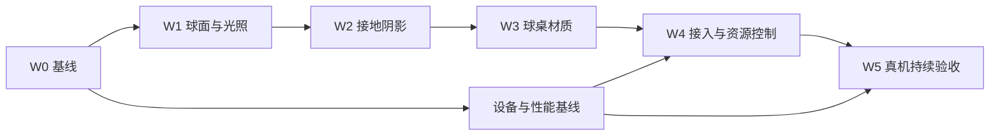

# 问题集合 v62：手机端 3D 球桌质感与持续 60fps

> 最新状态：用户已否决v62.2画质，先前“达标”结论撤回。当前按v62.3逐轮截图对照返工，目标未完成。

> **本文件是本轮需求真源。** 日期：2026-09-11；版本：v62.3；当前状态：用户否决后返工，S95仅为视觉候选；模拟器最终画质与W0–W5均未全部验收。
> 依据：本会话两张用户截图、后续纠正和当前源码。按 `issue-collection-restructure` 技能组织。v62.x 覆盖本专题低版本，不覆盖 v59/v60/v61 等其他专题。
> 用户2026-09-11授权执行全部批次。实施按本文件开展必要试错；每批以真实证据验收，不以目标创建、配置值或模拟器帧率代替完成。后续用户已设置持续目标“先在模拟器上达到效果”；不提交或发布。
> 排期前置：复核 HEAD、工作区及共享文件占用；保存相关文件和资产基线，保留 `output/`、`tmp/` 与无关改动。当前核实 HEAD：`591fb9ecea5538fb4cfdca5b2d43e9de8742af99`。不因无关人工项停止方案工作；真机缺失影响性能验收，不影响只读盘点与候选研究。

## 1. 需求回显与目标

### 用户已确认

1. Shooterspool 是电脑端参考，我们是手机端；追求可控资源消耗下尽可能好的真实质感，不照搬桌面特效配置。
2. **现有纯黑背景、镜头与操作方式不改**；不能靠背景、机位、缩小渲染区域美化对比。
3. 改善球面反射、球体材质、台呢、库边和接触阴影。允许必要试错，保留可比较证据。
4. 动态操作及击球/回放流畅度 **至少 60fps**；不能把 30fps 定为低档验收标准。
5. 由实施方制定合理的性能预算，用户不需要自行选择技术参数。
6. 先写详细方案。本次文档不等同于实施完成或性能承诺已兑现。

### 本轮目标表述

在保持背景、相机投影与行为、球桌几何和训练语义不变的条件下，以固定场景对照证明球与台面的材质、反射和接地感有明显改善；在现有支持范围内，以真机持续 60fps 为最低动态体验门槛，选择成本最小的合格组合，并保留独立回退路径。

### 范围边界

- 首个集成页面是截图对应的「3D 角度训练」；共享层采用显式选择配置，先保持其他消费者原样。其他 3D 页在 W4 逐项核验后接入同一合格方案，不按页面另调一套风格。
- 本轮不改背景、FOV、机位、缩放曲线、相机约束、瞄准坐标、球径、库袋网格或物理/评分/回放时间轴；不新增景深、动态反射捕获、多灯投影、实时全局光照或引擎迁移。
- 首轮固定当前曝光和色调映射设置；不调用会顺带改相机参数的整套旧增强入口。若确证曝光设置阻碍材质校准，先写证据与范围修订，不能借灯光任务悄悄改变相机。
- 保持白球红点、球号与花色、辅助线、6/14 号进球线白色规则、六袋皮革选中/双角色分区、特写和球杆方向语义。
- 不重做整个 USDZ、不改原始资源文件；优先材质参数和独立小资产。若必须调整资产，只在副本中验证，保留原件及哈希。
- 截图只提供视觉参照，不用于反推 Shooterspool 的具体引擎参数、贴图或性能。商业化新增贴图须记录来源与使用权，不提取对方游戏资产。

## 2. 当前事实、假设与改进顺序

以下源码于 2026-09-11 核实。截图 App 版本未与当前 HEAD 对齐，先建立当前版本画面基线。

| ID | 已确认事实 | 待验证假设与处理方向 |
|---|---|---|
| R1 | `SceneAimingView` 给 3D 入口传 `enhanced: false`；简化管线为 ambient 450、主方向光 820、辅方向光 200 | 缺少环境反射与受光层次可能是球发粉/发平的主要原因；独立比较小型静态 IBL 与现有光照，不直接恢复旧增强整包 |
| R2 | 球统一 PBR、roughness 0.10、metalness 0；清空 normal 并设置 fragment 修饰器 | 附加清漆代码对最终颜色做角度相关压暗/叠白，不采样环境；先做开/关对照，再比较少量粗糙度候选，不预判必删 |
| R3 | 简化主光 shadowSampleCount=4；SSAO radius=3.0；旧增强为 0.04 | 球底暗斑可能由投影/SSAO/几何接触共同形成；分层开关定位，数值差异不是根因证据 |
| R4 | 台呢粗糙度纹理被标量替代；plain 乘色为 (0.54,0.73,0.54)；有法线纹理/程序后备 | 丢失局部变化、乘色偏绿和贴图尺度可能损害布感；先检查运行时实际通道、色彩空间、UV与mipmap，再调色，禁止只加噪点 |
| R5 | 材质识别部分依赖名称/颜色；皮革另有 surface 修饰器保留原色并混合高亮 | 增强可能漏掉真实材质或覆盖高亮；生成实际节点—材质—通道清单，不根据函数名判断命中 |
| R6 | IBL 为 256 面尺寸程序生成 8 位图，RGB 截到 0…1；可见背景与 IBL 分开 | 对照预计算小型 HDR IBL，可改善反射动态范围；HDR 不保证更好，解码格式/驻留内存/启动预滤波成本须实测 |
| R7 | SCNView 请求屏幕最高刷新率；CADisplayLink 范围最低30、首选最高刷新率 | 请求值不证明实际帧率；先检查重复更新和持续空转。动态最低策略应60，不盲目把所有设备锁成60或强求120 |
| R8 | `PerformanceProfiler` 标注 DEBUG 生效，记录函数计时；模型有缓存，材质/几何有副本 | 现有计时不能证明 Release 的 GPU 或屏幕呈现；新增最小必要测量，查多场景缓存和重复纹理占用 |

顺序：先建立 W0 基线 → W1 灯光/球面 → W2 接触阴影 → W3 台呢/库边 → W4 集成与资源收敛 → W5 真机持续验收。更换引擎不是本轮候选。

## 3. 性能预算（本项目制定，尚未实测）

### 3.1 测试设备与支持边界

`project.yml` 最低 iOS 为17.0，不擅自提高部署版本或收窄机型支持。

| 层级 | 计划验收设备 | 用途 |
|---|---|---|
| 老设备底线 | iPhone XR + XS Max 优先；至少覆盖此代较低内存及较高像素负载，确切库存在W0登记 | 检查基础画质下60fps、内存与温升；不能用SE3或新Pro代替这一代性能证明 |
| 主流设备 | iPhone 13，或实际可用的相邻主流机型并记录差别 | 默认画质、完整真实页面流程 |
| 高刷设备 | iPhone 13 Pro或更新的实际Pro设备 | 最低60fps、现有高刷顺滑度、刷新率切换与资源余量 |
| iPad兼容 | 若共享改动影响iPad，至少一台真实iPad；具体型号W0登记 | 高像素负载、布局/共享渲染回归；iPhone结果不能替代 |

以上是测试计划，不宣称已连接/拥有设备。W0核对项目实际设备资格与可用设备；若缺少底线机，其他工作可继续，但底线性能项保持待验，不能声称全支持机型60fps。老设备失败须先优化/降低效果成本，不能擅自改为30fps或取消支持。

### 3.2 硬门槛与工程余量

60fps一帧预算约16.67ms。CPU与GPU流水执行，分别测量，**不能把两者耗时直接相加当帧时长**。所有统计按设备、配置、场景分别报告，禁止混合平均掩盖最差场景。

| 指标 | 预算/验收规则 |
|---|---|
| 动态刷新策略 | 动态输入、惯性相机、球杆动画、击球和回放至少请求60；不得自动降到30。Pro可在有余量时保留更高刷新率 |
| 实际呈现 | 以60Hz节拍核查至少99.9%的到期帧按时呈现；平均仅作辅证。任何连续失约、可复现卡顿或稳定落到60以下均不通过；0.1%仅为孤立系统抖动容差，不是批准低于60的运行档位 |
| CPU关键路径 / GPU | 各自P95 ≤12ms、P99 ≤15ms，给16.67ms截止留余量；不含线程等待的CPU实际工作与等待分别报告；热稳态也需满足 |
| 长帧 | 动态区间内无可归因本次改动的≥33.33ms帧；单次系统打断原始数据保留、单独标注并重跑，不静默剔除 |
| 新增资源预算 | 打包新增资产≤8MiB；同场景暖机后进程物理内存增量≤32MiB且≤基线10%（取更严者）；新增GPU纹理/渲染目标估算与实测驻留≤16MiB，不与统一内存进程数值重复相加 |
| 内存稳定 | 往返进入/退出20次，缓存稳定后末5次无持续阶梯增长；无新增泄漏/内存警告/异常退出。总内存绝对值W0必报，不能只报增量 |
| 进入可交互时间 | 相同冷/热条件，候选P95增量≤100ms；首次IBL上传/编译不在拖动或击球时发生。原版等待问题独立登记，不把加载区间藏进动态统计 |
| 温升与持续性 | 标准条件连续20分钟，最后5分钟重复动态门槛；不出现serious/critical热状态，不持续掉帧。系统热状态不等于摄氏度，无法测表面温度时不编温度数字 |
| 能耗 | 同设备同60fps诊断条件，采用可用工具的同一能耗指标，候选相对基线≤10%增幅；若只能取Energy Impact级别，则不得持续升档，百分比标未测。最终生产刷新策略另测，不能用限60的实验掩盖生产120成本 |

以上是筛选预算，不是硬件理论上限或Apple强制指标。W0可根据仪器噪声细化采样方法，但不得为保留候选放宽60fps、温升和内存门槛。若基线已超预算，先记录并解决瓶颈；超标的原版不是新方案通过依据。必要的大范围性能修复另列依赖，不能偷偷修改求解精度和训练逻辑。

### 3.3 测量协议

- 真机Release/Profile优化构建，基线与候选使用相同工具/系统/分辨率/屏幕亮度（固定50%）/设备状态；室温目标22–25℃，记录实际值；移除厚壳、关闭低电量模式、测量时不充电，电量起点40–80%。无法满足时标偏差并做匹配对照。
- Instruments Game Performance / Metal System Trace为呈现、CPU/GPU、热状态的主要证据；Metal HUD仅作辅助。CADisplayLink回调次数或`preferredFramesPerSecond=60`不能当呈现证据。
- 每个动态场景预热60秒、测量60秒、独立3次，所有运行均保存；基线/候选交替并冷却到相同起始热状态。只在计时/温升验证时关闭录屏；画面录像另跑。
- 持续20分钟混合负载：拖动瞄准/原相机手势、普通回放、合法最多球数回放、辅助/特写开关循环；分阶段记录，不能以长时间静止拉低均值。
- 不把首次加载、后台/系统弹窗等计入稳定动态窗口，但必须另外列出启动、恢复和打断日志；高开销工具运行与低开销复核分开，保留工具开销说明。
- 未取得精确GPU或能耗数据时明确待测，不用CPU函数耗时/电池百分比短时变化换算。模拟器仅证明布局、图像与功能，不证明手机性能或发热。
- 静止省电只在确认所有视觉动画停止时启用按需更新；有输入、回放、球杆、辅助脉冲即恢复动态刷新。不能漏首帧、冻结动画或增加响应延迟。是否需要实施由W0测量决定。

## 4. 视觉验收与固定场景

W0生成确定性的fixture清单，记录来源、球位/球号/姿态、原相机矩阵和投影、视口像素、曝光、辅助状态、时间点、资产哈希。后续只重放这些固定条件，不改生产相机。用户截图原件保留于本地证据目录并记录哈希，不纳入App Bundle。

| 编号 | 场景 | 重点 |
|---|---|---|
| V1 | 截图对应3D角度训练当前版本，两球，默认原镜头 | 真实入口、总体质感，不拿独立球体图代替页面 |
| V2 | 白球、1/3/6/8/9/14号，原高/中/低视角分别固定 | 白球红点/暗面、黑球层次、彩球饱和度与号码清晰 |
| V3 | 球贴库、近角袋/中袋、两球相邻，全部合法位置 | 接触阴影、漏光、自阴影、皮革与库边层次 |
| V4 | 瞄准辅助/答案/特写、六袋选中及双角色皮革 | 语义色、虚线/文字可读，修饰器不互相覆盖 |
| V5 | 普通击球、快速球、慢速滚动、旋转花色、最多球数合法回放 | 高光闪烁、纹理摩尔纹、球影跟随、动态帧时 |
| V6 | 2D页面、动作预览、球面缩略图、教学图、视频导出 | 未接入消费者不变；不批量重烘已有资产 |

五项质量检查：①球高光有形状且不过曝、暗部保留底色、无灰雾白环；②台呢远看干净、近看细密、运动无闪烁、不像塑料或砂纸；③阴影紧贴接触处且随光方向合理、无漂浮/脏斑；④木框/皮革与布有可辨反光差异；⑤原球号/标记/辅助可读性不退化。

采用原始像素并排图 + 等尺度细节图 + 独立动态短片。每项记0=不合格/明显缺陷、1=可用但弱、2=目标达到，并写具体观察；不把主观评分伪装成自动测试。最终要求五项均≥1、球面/接地/台呢三项达到2、无新增严重缺陷。主控独立检查后交用户审阅最终对比；技术通过与用户审美认可分别记录。

## 5. 受控试错与选型

### 候选策略

1. 保留原版B0；同一实验只改变一个因素，之后才组合。固定资产/灯光方向/曝光等其他变量。
2. W1：先清漆修饰开/关，再现有光照/小型静态IBL，再少量粗糙度与主辅光比例。IBL从128/256面尺寸起，确有可见收益和预算才试512；先查格式、mipmap、实际预滤波行为，不把分辨率升高当质量保证。
3. W2：投影/SSAO分别开关确认贡献；保留一个投影光源，优先紧凑阴影覆盖和正确偏移，再试1024/2048阴影图与少量采样档。更便宜的接触阴影仅在有证据时试，必须随球移动、离台/进袋隐藏、不叠成双影，不动真实球位置。
4. W3：恢复/校准实际贴图通道，保持细微粗糙度变化、正确法线方向与尺度；色图和数据图按各自色彩空间核查。优先复用纹理，小范围补图，不增加无收益的几何细分。
5. 基础/标准两档以内，先共用色彩、材质身份和球面反射，差异限阴影/SSAO质量。只有实测说明一档无法覆盖设备才引入第二档；无用户设置菜单扩张。热状态下降档有滞回且不能每帧重建资产，恢复条件W4实测确定。

### 试错账本与停止规则

证据目录建议 `output/render-quality-v62/`，每轮保存 `manifest.json`、原始截图/短片、性能原始文件、`metrics.csv` 和 `decision.md`。记录父候选、改动因素、参数、构建/源码/资产哈希、设备/OS/运行条件、视觉优缺点、性能是否实测及接受/拒绝理由。

每批最多两轮，每轮最多三候选；第二轮只处理第一轮已定位的主要缺陷。没有新证据不反复调参。预算失败即淘汰或降低效果成本，不用“更好看”抵消性能失败。未有真机数据的候选只标视觉候选，不能进入性能合格排序。

同等视觉质量取耗时/内存更低者；只有放大图可见的微小差异，不值得突破预算。达到本批DoD即收敛。两轮仍不合格，保留最佳证据与原版，记录阻碍、最小后续实验和批次修订；状态保持待解决，不谎称完成，也不以试错次数为由降低目标。

## 6. 批次与依赖

| 批次 | 范围 | 量级 | 依赖 | 交付状态 |
|---|---|---|---|---|
| W0 基线与预算落地 | 消费者/材质清单、固定fixture、测量协议、设备清单、原版基线 | 中，1会话；真机采集缺失单列 | 无 | 🟡 代码/图像基线部分完成，真机基线待验 |
| W1 球面与光照 | 显式隔离配置、小型IBL、清漆/粗糙度/灯光对照 | 中，1会话，最多两轮 | W0视觉与代码基线；性能决策需真机基线 | 🟡 两轮6候选，最终画质/性能未通过 |
| W2 接地与阴影 | 分层诊断、投影与遮蔽成本收敛 | 中，1会话，最多两轮 | W1固定灯光候选 | 🟡 两轮6候选，接地仍需解决 |
| W3 球桌材质 | 台呢/木框/皮革通道与参数、最终材质组合 | 中，1会话，最多两轮 | W1、W2固定 | 🟡 两轮5候选，动态/最终画质待验 |
| W4 页面接入与资源控制 | 共享消费者分批接入、缓存/刷新策略、功能与视觉回归 | 中大，1会话；若负载过大按页面域拆W4a/W4b并升版本 | W1–W3候选与已取得性能证据 | ⏸ 前置未通过，仅诊断预览入口 |
| W5 持续性能与最终验收 | 底线/主流/Pro设备、热稳态、最终图像、交付清单 | 中，1会话组织与汇总；物理设备操作可另时段 | W4；必需真机 | ⏸ W4及真机条件未就绪 |

### W0 完成标准

- [ ] 完整调用点与消费者清单，区分实时3D/2D/离屏；节点材质清单包含实际贴图、尺寸、类型、通道与修饰器。
- [ ] 固定V1–V6复现记录，保留原图与当前源码基线；无需匹配截图的未知旧版本像素。
- [ ] 登记真实设备与缺口；底线/主流至少取得原版真实呈现、CPU/GPU、总内存及温升基线后才可称W0全部完成。
- [x] 确认现有Profiler的Release局限和最小测量方式；若新增诊断入口，不进入正常产品流程。
- [ ] 若有诊断代码，构建与针对性运行通过；若仅文档/测量，检查文档与证据即可。缺机时W0拆记“代码/视觉完成、性能待验”，W1–W3仅可继续视觉研究。

### W1 完成标准

- [x] 黑背景、相机参数与固定球位逐项不变；不直接调用旧增强管线以免带入地面/曝光/辉光。
- [ ] 清漆、反射和粗糙度对照可复现，选中结果在白球/黑球/花色及原三视角均有依据。
- [ ] 缺资源时退回原版可用；材质副本不污染缓存或其他场景；首帧编译/上传成本有记录。
- [ ] 构建、目标实际页面截图/动态复核通过，附性能增量；缺真机只标视觉候选。

### W2 完成标准

- [ ] 明确黑斑来源，保留各层单独开关图，不用猜测偏移补偿几何错误。
- [ ] 静止/移动/贴库/近袋/入袋/相邻球无明显漂浮、漏光、自阴影或双影；灯光方向不随相机假转。
- [ ] 比较至少原阴影与一个低成本候选，给出画质/耗时决定；不默认投影与SSAO都加大。
- [ ] 构建、定向动态证据与测量记录完整；触及空间计算先读几何技能和真源。

### W3 完成标准

- [ ] 台呢/木框/皮革实际命中清单齐全，材质处理不丢失球号、红点、皮革高亮等原语义。
- [ ] 台呢/库边达到第4节质量门槛，正常显示尺度和动态均可读；新增纹理在包体/内存预算内。
- [x] 资源来源、哈希、打包入口正确；不把实验图/母版打包进App；未动原始USDZ。
- [ ] 构建、相关渲染/皮革行为回归与并排图通过；无需为标量常量写镜像测试。

### W4 完成标准

- [ ] 先接3D角度训练，再按消费者表处理其他实时3D；默认旧消费者安全，2D/离屏出口没有无意改色、增加耗时或批量重烘。
- [ ] 确有需要才实现两档/按需刷新；输入立即恢复、球杆/脉冲/回放不停、前后台/页面销毁正确，无重复display link。
- [ ] 动态最低60策略与SCNView/更新循环协调；保留基于时间的回放，不修改物理时间步以追帧率。
- [ ] 正常入口/辅助/特写/多球回放及重进页面定向测试通过；关键实际页面原图已审，既有无关失败单列。
- [ ] 真机短测已满足预算再选正式默认；缺真机保留候选配置，不以生产默认发布方式绕过W5。

### W5 完成标准

- [ ] 第3节按设备与场景逐格验收，全部原始数据可追溯；冷态及20分钟热稳态均满足60fps与资源门槛。
- [ ] 最终版本而非早期候选通过第4节画质检查，完整页面、原三视角、动态及共享出口复核；用户审阅状态单列。
- [ ] `make -f scripts/Makefile build`、`verify-gate`、`verify-doc-size`、`git diff --check` 和改动对应的定向测试通过；若默认模拟器不可用，记录实际有效destination，不伪报成功。
- [ ] 提交报告含最终候选、设备/OS、预算实测、已知限制、回退位置、未验矩阵及下一步；不自动commit/push/发布。

## 7. 已核实锚点索引

核实日期：2026-09-11；行号仅为当前定位，实施前按函数名复核。新API/诊断文件名在实施时确定，不将建议名当现存组件。

| 文件 | 行号/符号 | 作用与范围 |
|---|---|---|
| `QiuJi/Features/AngleTraining/Views/SceneAimingView.swift` | 93、116–120 | 目标页面身份、2D/3D共用入口且enhanced=false |
| `QiuJi/Features/AngleTraining/ViewModels/AimingQuizViewModel.swift` | 146 / setupScene | 渲染配置传递，不改训练语义 |
| `QiuJi/Core/Scene/AngleTrainingScene.swift` | 96 / setupScene；143 / enhanceClothMaterials；324 / enhanceBallMaterials；423 / setupCamera；536 / setupPlainLighting；570 / setupStudioLighting | 共享场景、光照、材质与相机副作用隔离 |
| `QiuJi/Core/Scene/MaterialFactory.swift` | 42 / applyBallMaterialRecursive；73 / clearcoatFragmentShader；101 / enhanceClothMaterials | 球面、台呢、库边和皮革材质处理 |
| `QiuJi/Core/Scene/EnhancedEnvironment.swift` | 22 / apply；43 / cubeMapSize；generateIBLCubeMap、imageFromRGBA | IBL与背景分离、程序图像与缓存 |
| `QiuJi/Core/Scene/AngleSceneView.swift` | 81 / preferredFramesPerSecond；260 / startRenderLoop；renderUpdate、stopRenderLoop | SCNView与CADisplayLink调度、销毁 |
| `QiuJi/Core/Scene/TableModelLoader.swift` | 44 / cacheLock；loadTable、deepCopyGeometryAndMaterials | USDZ缓存及实例材质副本，禁止跨实例污染 |
| `QiuJi/Core/Scene/PocketLeatherAppearance.swift` | 6 / material(from:tint:) | 皮革原纹理/混色与surface修饰器 |
| `QiuJi/Core/Physics/PerformanceProfiler.swift` | 5 / DEBUG声明；PerformanceProfiler | CPU诊断辅助，不能证明GPU与Release呈现 |
| `QiuJi/Core/Scene/DrillSceneView.swift` | 81 / setupScene | 动作实时场景的共享消费者 |
| `QiuJi/Features/AngleTraining/Views/AimPointSceneTrainingView.swift` | 78 / setupScene | 另一组2D/3D训练，必须区分相机模式 |
| `QiuJi/Core/Scene/DrillThumbnailRenderer.swift` | 21–22 / render | 既有离屏缩略图消费者 |
| `QiuJi/Core/Scene/TableFigureRenderer.swift` | 83–84 | 教学图背景消费者 |
| `QiuJi/Core/Scene/BallFaceRenderer.swift` | 17–18 / renderAll | 球面图标先加载共享球，后自设离屏材质 |
| `QiuJi/Core/Media/SequenceVideoExporter.swift` | 548–550 | 视频出口studioLook分支，保持输出契约 |
| `QiuJiTests/ShotScenarioRenderTests.swift` | 133 / test_render_canonicalLayouts；170 / test_render_cushionAndPocketProximity | 可借鉴固定场景和近库袋证据；不是性能验收 |
| `QiuJiTests/BallFaceRenderDiagTests.swift` | 27 / test_renderAll_producesVisibleBallFaces | 球号贴图回归入口，写盘行为执行前核对 |
| `project.yml` | 13–14；sources资源定义 | 最低iOS17、资源打包真源；新增资产时同时核对生成工程 |

另已检索到PositionPlayViewModel、PlanThreeViewModel、SiluTrainerViewModel、BankShotViewModel、DiamondSystemViewModel、AngleDynamicViewModel、CushionEnglishAtlasViewModel、SeparationAngleAtlasViewModel、BallExtractionViewModel、SnookerTacticsViewModel、BallFeelView调用场景初始化。其完整页面路由与模式在W0逐一读代码确认，当前只确认调用存在，不宣称已完成全页影响审计。

## 8. 风险与交接规则

- 共享类影响实时页面、离屏图和导出，配置必须明确传递且保留旧默认；不可全局改材质后只验截图目标页。
- 启用IBL可能重新引起台呢发灰，须隔离直接光/环境光/材质响应；不能重新叠加曝光、乘色、泛光补丁掩盖根因。
- 降低粗糙度可能产生闪烁，高分辨率贴图可能增大启动和显存；候选必须动态比较。
- 首帧加载、求解线程、辅助UI更新也会影响60fps；记录CPU/GPU瓶颈归属，不把所有卡顿归因渲染。
- 高温、系统强制节流、低电量等异常条件无法承诺每一帧；标准20分钟测试必须通过，异常条件单列恢复行为，不用它们豁免常态失败。
- 缺真机时交付界限是“方案/视觉候选/模拟器回归完成，真机60fps待验”。不自动安装应用或冒充已接设备；后续连接后按协议续测。
- 试错失败不需每个参数向用户提问；触及背景/镜头/几何/交互、降低60fps、扩大支持边界或改变发布范围时，先记录具体证据和方案修订。
- 每批结束更新本文件状态、证据目录和下一批入口，同步`tasks/PROGRESS.md`。测试写盘须先查目标用例及登记，保留原有output/tmp，不要求全仓零diff。

## 9. 参考依据与版本记录

性能方法参考Apple官方资料，下面资料支持测量方法，不代表Apple给出了本项目12ms/内存/温升预算：

- [Analyzing the performance of your Metal app](https://developer.apple.com/documentation/xcode/analyzing-the-performance-of-your-metal-app/)：帧时、Instruments与热状态分析。
- [Improving your game’s graphics performance and settings](https://developer.apple.com/documentation/metal/improving-your-games-graphics-performance-and-settings)：按目标帧率分别分析CPU/GPU预算。
- [Understanding the Metal Performance HUD metrics](https://developer.apple.com/documentation/xcode/understanding-metal-performance-hud-metrics)：GPU时间与监控指标。
- [SceneKit lightingEnvironment](https://developer.apple.com/documentation/scenekit/scnscene/lightingenvironment)：环境光照用途；本项目背景/IBL独立关系另有源码确认。

| 版本 | 日期 | 变更原因 | 状态 |
|---|---|---|---|
| v62.0 | 2026-09-11 | 根据用户固定背景/镜头、手机资源约束、至少60fps要求，建立代码锚点、六批次、有限试错、真机预算与验收边界 | 方案完成，未实施 |

| v62.1 | 2026-09-11 | 用户授权执行全部批次；可连接iPhone16Pro，其余设备缺口保留 | W0部分完成；W1–W3候选已试；整体未验收 |

## 10. 2026-09-11 执行检查点

完整执行记录、截图与复测入口：[tasks/render-quality-v62/README.md](tasks/render-quality-v62/README.md)。UI审查：[UR-20260911-render-quality-v62](tasks/ui-reviews/UR-20260911-render-quality-v62.md)。本节只更新实证状态，不改变上述目标/预算/试错限制。

- 已保存原版与用户参考、18调用点、材质/纹理清单；W1灯光球面6候选、W2阴影6候选、W3球桌5候选；H0+S3+C3作为隔离视觉候选，**尚未达到第4节最终画质标准**。球底分离、黑球暗部和木框层次仍弱，后续需针对证据修订实验，不能直接标完成。
- `mobileRendering`默认false，仅3D角度训练诊断构建显式启动参数可用；正常Release/其他消费者保持旧默认。缺资源自动走旧管线。新增原创HDR约512KiB，源文件可逐字节重建，USDZ未改。
- 当前iPhone17Pro/iOS26.3的15单测+2UI、iOS17的1单测+2UI、补充3单测均通过，实际页面/辅助与七球三视角、静态近袋/贴库/相邻球原图已检查；不是全页动态或真机证据。
- iPhone16Pro可连接但要求密码解锁；没有底线/主流/iPad真机。真机呈现、CPU/GPU、总内存、首次上传、20分钟热态/能耗均未测。W4正式默认/共享消费者接入/最低60刷新策略及W5尚未完成；没有提交发布。

## 11. v62.2 模拟器画质优先（用户2026-09-11新指令）

用户要求先在模拟器达到效果，继续原画质目标，真机缺失不再作为本阶段停止点。原W1/W2两轮已定位接触阴影和暗部不足，授权继续基于证据的定向迭代：S6阶段先测真实球底/台面顶高度及阴影覆盖精度，再对照修正；随后材质层次与真实动态验证。每次最多三个变量明确的候选，审图后再决定下一轮，仍不无依据重复调参。保持黑背景/镜头/几何/训练语义和移动资源约束。模拟器阶段达标后可作为可运行视觉版本验收，真机60fps、热/内存和正式发布状态继续独立待验，不相互替代。

| v62.2 | 2026-09-11 | 用户指定先在模拟器达到效果，继续定向视觉迭代，真机性能分开验收 | 执行中 |

S6实测补充：球底约0.800m，五处台呢平面均为0.794737637m，差5.262mm。为实现用户“模拟器达到效果”的要求，候选新增**仅渲染台呢和台面印记向既有物理台面共面校准**；按实际网格计算量，不写死视觉offset，不改原USDZ/球径/球位/碰撞/库袋或镜头。此为对原“不改几何”范围的最小视觉校准细化，物理与库袋几何仍锁定。单独保留几何与图像证据，其他消费者不启用。

## 12. v62.2 历史验收记录（2026-09-11，画质结论已撤回）

> 以下保留历史记录。所有画质评分、“阶段完成”及相关勾选均不具有当前验收效力；只保留当时构建/测试/资产核验在其实际范围内的证据。当前以v62.3返工状态及S96验收审计为准。

- [x] 固定背景/镜头，完成台呢实际高度校准、球面环境反射、台呢响应、顶灯接触投影与木框漆面；原USDZ/物理/球位/训练语义保持。
- [x] 当前iPhone/iOS26.3最终17单测+2UI，iOS17的2单测+2UI，iPad的2UI通过；无损原图已审，七球三视角、贴库/近袋/相邻球、辅助/答题/下一题覆盖。
- [x] 真正物理回放慢滚/旋转、16球碰撞、入袋/消失，以及实际页面手势录像；模拟器主控画质评分2/2/2/1/2，达到本阶段门槛。用户审美认可尚待审阅。
- [x] 最终build、verify-gate、verify-doc-size、diff-check通过；生成资源可重建、原资产哈希一致、候选隔离测试通过。证据与复测指纹见执行记录S21。
- [ ] 真机持续60fps、CPU/GPU/内存/能耗/启动/20分钟热态与支持机型矩阵。
- [ ] 通过真机预算后完成W4共享消费者正式接入/刷新策略决策及W5整体验收。

本节只完成用户新增的“先在模拟器达到效果”目标，不把W0–W5全勾完成。正式默认继续原版；候选通过Debug诊断参数可运行，无提交/发布。效果对比：[原图与录像](output/compare.html)。

2026-09-11临时真机预览：用户要求直接构建即看到新效果，Debug的3D角度训练现在默认启用候选（真机和模拟器一致），无需启动参数；加`-v62.legacyRendering`可回原版。UI对照测试原版显式加此参数，候选走无参数默认。普通Release仍保留原版，其他页面范围不变；此变更不代表真机性能验收。

## v62.3 用户否决后的返工（2026-09-11）

用户真机审阅明确认为距离Shooterspool参考很远，已否决v62.2画质结论。撤回“模拟器画质达标/阶段完成”和2/2/2/1/2的验收效力；既有构建、功能测试、5.26mm数值审计保留为各自范围内的事实。当前状态为视觉目标未完成、持续返工，不能把测试通过或相对原版改善替代参考质量。

每轮必须保存同条件上一版与候选截图，同时展示Shooterspool用户参考；先审图再保留参数。固定黑背景/镜头/物理与手机至少60fps目标继续有效。S22从宽面环境反射与台面反弹光对照开始，使用与旧环境相同512×256尺寸；在图像证明收益前不改真机默认候选。最终视觉审阅与真机性能均未通过。

## S96 当前验收审计

当前S95仍是视觉候选，整体未达参考。需求逐项证据与缺口见[tasks/render-quality-v62/ACCEPTANCE-AUDIT.md](tasks/render-quality-v62/ACCEPTANCE-AUDIT.md)。不将已通过的模拟器测试、素材体积或60Hz请求值替代用户画质认可、手机真实呈现和热稳态验收。

### S207 输出链校准后的诊断范围修订

当前iOS26.3模拟器独立灰阶诊断：复制当前相机HDR/曝光设置（HDR=true、自动曝光=false、EV=-.45、whitePoint=1），线性片元输入1→222/255，2/4/8/16→255；+1EV对照.5→222，与曝光生效一致。原始26图及逐点数据见output/render-quality-v62/S207-tone-response，S207-tone.log通过。该证据仅说明当前输出链高值截白，不等于已定位全部真实感问题。

允许下一轮在独立渲染fixture比较统一高亮rolloff，保持中暗值与RGB比例，不改App机位/FOV/手势/曝光和基础配色。此前球体已有单独肩部曲线，试验需去除其重复作用。生产接入仍须实际页前后图、跨角度/功能色和预算验证；不因灰阶实验通过就采用，不增加自动曝光、景深或引擎迁移。
