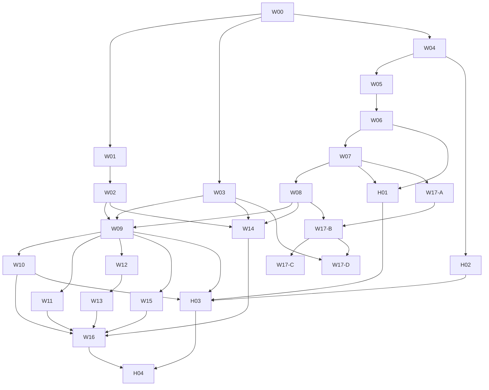

# 问题集合 v63：现有功能正式接入 2D / 3D、辅助线与局部空间物理

> **本文件是本轮需求真源。** 日期：2026-09-12；版本：v63.13。
> **状态：用户已授权持续实施至全部任务完成；W00–W06 本地验收完成；W07返工（FL-070；DR-292 内衬耗能体后原 10 失败方法 9 个转绿）；W08–W10/W16继续验收，H01仅独立冲量验证；**用户 2026-09-14 裁定新增 W17：求解裁定回归平面判据、空间物理只做袋内呈现与确定性落位；W17-A 已本地完成（DR-293，性能 10–250×）；W17-B/D 以脚本化网兜落位本地完成（DR-294，偏离原「空间求解器呈现」写法，见批次表）；W17-C 文档表述已更新，遗留跨杆保留 / 分歧夹具 / 用户实看**。** 授权来源：本任务“好的，开始吧，直到完成所有任务”。仍逐批验证技术选择，不预支验收结论。
> 排期前置：实施前重新确认工作区基线，协调正在进行的渲染专项。本文只覆盖本轮交互、页面接入、辅助线、进袋和高度物理；不覆盖或撤回 v62 及后续渲染专项的材质、灯光、帧率目标。
> 编制方式：按 `.cursor/skills/issue-collection-restructure/SKILL.md`，结合模拟器审查与当前源码，拆为可单会话执行和验收的批次。物理探索批次先提交验证结论，再按实际复杂度细分实现，不能因一次会话结束而宣布物理验收完成。

## 1. 需求回显与决策状态

### 1.1 用户已明确的范围

| ID | 原始意图 / 本方案保留的要求 |
|---|---|
| R1 | 目前讨论方案和涉及范围，先测试当前实际效果，再确定方案。 |
| R2 | 当前相关页面正式支持 2D / 3D；覆盖 UI、不同场景交互、摄像头、击球和视角切换。 |
| R3 | 动作库的序列展示必须纳入，功能以现有 App 为准。 |
| R4 | ShootersPool 只参考交互与摄像头，不借此扩展成另一套游戏产品。 |
| R5 | 修复当前进袋效果，引入重力和高度方向，使球能按物理自然进袋。 |
| R6 | 高度能力要考虑跳球、扎杆；不必把所有现有物理引擎都改为全空间积分。 |
| R7 | 手机是主要使用环境，需要结合小屏、触控、遮挡和性能设计。 |

用户提出“各种线是不是贴在桌面上比较好”是待分析的问题。下文采用“平面辅助线投影台面、真实空间信息保留高度”作为**建议方案**，须经 W03 样片验证，不写成已获用户拍板。

### 1.2 本方案建议采用、仍可讨论的选择

- 2D 与 3D 是同一业务状态的两种观看方式；共享击球结果、回放时钟和规则事件。
- 台面辅助线默认贴台面；球面接触点、真实杆轴、空中轨迹不压平。
- 普通台面运动保持现有平面解析 / 事件求解；袋口附近局部空间求解；未来腾空段复用空间状态和碰撞衔接。
- 自然进袋目标包含失去支撑、下落、袋沿/袋壁碰撞及可能返回台面。只在旧“进袋成功”之后加重力下落，可作为内部过渡验证，**不能作为 R5 最终交付**。
- 先打通共享层与两页试点，再接入其余已有页面。跳球、扎杆分开验证物理与输入，不作为首批 3D 浏览的上线前置。
- 普通击球默认稳定镜头；自动袋口特写不设为默认。主动查看球/袋与一键返回瞄准优先。

## 2. 已有证据与仍须补充的验证

### 2.1 当前证据足以编制方案

详见 [模拟器审查报告](output/3d-scope-audit-20260912/REPORT.md)、[执行结果](output/3d-scope-audit-20260912/results.json)、[证据清单](output/3d-scope-audit-20260912/evidence-manifest.json)。

- 专用标准 iPhone、SE 紧凑屏和 iPad 模拟器；30 次用例执行，29 次通过，1 次为脚本按钮预期错误，修正后补测通过。不是“30 个独立产品功能全部验收”。
- 覆盖两页试点击球/开球、相机和模式切换、代表性动作库序列，以及其他相关页面巡查。巡查不等于完整功能回归。
- 稳态图确认打点面板覆盖近端球杆/母球，SE 更明显；沿杆取景不适合全部散局；竖滑与捏合的空间作用耦合；3D 观察姿态往返不能独立恢复。
- 曾捕获自动下一题后母球不可见的一次画面；随后三设备复查没有稳定复现。作为风险保留，不能把断言通过等同于视觉缺陷消失，也不能直接断言已有稳定根因。
- 进袋远景截图无法验证袋内运动细节；源码确认实时与导出存在分离的进袋表现。这是必须建立近袋固定样例的原因。
- 审查使用当时工作区快照。当前渲染专项继续变化，旧截图是交互问题证据，不能充当当前材质版本的视觉验收。

### 2.2 前置补充只聚焦四件事

1. **袋口几何**：以当前生产几何、实际加载模型和稳定 pocket ID 对齐，测出台面支撑边界、倒角、袋口壁及下方可见结构。不要照抄旧报告偏移量或用扩大捕获圈掩盖问题。
2. **局部物理可行性**：角袋/中袋各选近袋固定球形，验证失去支撑到下落、撞沿返回的全过程；明确哪些碰撞几何确实存在，哪些须拟合简化代理。
3. **手机可读性**：同一球形和相机下比较现有球心高度线与台面投影线，包含低角度、远端、近袋、密集球与展开打点面板。
4. **状态稳定性**：固定自动下一题、序列换杆、重播与 2D/3D 往返的业务状态和相机状态；给偶发母球不可见建立可重复场景与可见性观测。

上述工作放入 W00 / W03 / W05，不再以继续全面调研为由搁置方案。真机触控、性能/发热、VoiceOver、最大字号和最低支持系统仍要正式验收；模拟器不替代这些结论。

## 3. 产品与交互契约

### 3.1 统一切换和控件职责

- 同类球桌页将 2D/3D 放在一致的球桌工具区域，不在底部主要击球按钮附近反复换位置。是否合并独立 2D/3D 训练入口，须保持原有题目和导航语义；首轮不擅自删入口。
- 模式切换保留球位、当前杆、目标/袋口、方向、打点、力度、答案、播放时间和编辑草稿。不得重新求一杆、重复计分、复活已进袋球。
- 同一杆返回 3D 时恢复最近有效观察姿态；“回到瞄准”明确恢复沿杆视图。新杆/新题的默认构图由业务状态驱动，不沿用已经失效的旧焦点。
- 观察态单指绕焦点旋转/俯仰，捏合调距离；距离、俯仰与 FOV 在内部独立。手机首版不提供复杂 FOV 参数面板。双指平移是待触控验证的补充，不能成为唯一换焦点方式。
- “查看此球/此袋”只改观察焦点；“选择目标球/袋口”才改击球目标。3D 看球形不隐式改出杆方向。保留现有方向微调操作。
- 摆球/目标区编辑首版允许继续在 2D 完成，3D 可查看并明确提示返回编辑。若以后支持 3D 拖球，须投影到约束平面并处理遮挡，不能把手势直接映射为任意空间位置。
- 打点、力度、抬杆角按当前操作渐进展示；展开面板时保证母球与杆头可见，必要时可恢复地调整构图。相机俯仰与球杆抬角必须有不同语义和标签。
- 支持主要控件左右手镜像；紧凑屏优先收起次要信息，避免缩小触控目标。图标提供可访问名称。

### 3.2 摄像头状态表

| 业务场景 | 默认镜头与输入 | 退出 / 衔接 |
|---|---|---|
| 准备瞄准 | 沿杆；保证母球、目标/关键接触关系可读；方向控件与相机拖动独立 | 主动观察保留本杆参数 |
| 全桌 / 局部观察 | 全局或围绕指定球/袋；限位防穿桌、过低与过近 | 一键返回瞄准；可恢复最近观察姿态 |
| 出杆接触瞬间 | 稳定构图，锁定本杆击球输入；防重复触发 | 镜头切换不触发第二次出杆 |
| 球运动 / 回放 | 默认保持机位；可手动观察和切 2D/3D | 用户操作后自动镜头让出控制 |
| 开球 / 散局 | 全局优先，覆盖开球后主要球形 | 继续击球时再转沿杆 |
| 杆结束 / 重打 | 显示真实落点；重打恢复击球前快照 | 下一杆按新母球重建瞄准位 |
| 序列换杆 | 显示本杆结果，按现有杆间暂停规则等待 | 用户继续后切下一杆构图；不偷改暂停含义 |
| 训练答题 / 反馈 | 关键球、辅助与答题区共存 | 相机不修改已提交答案或理论评分 |

自动镜头若增加，需有可预测触发点和取消机制。多球同时入袋时不逐袋抢镜；学习母球走位的场景不能被目标球特写打断。相机避障使用适合移动端的简化边界，不能仅靠缩放掩盖穿模。

### 3.3 现有页面接入边界

| 页面族 | 3D 的职责 | 必须保留 |
|---|---|---|
| 自由击球、分离角与走位 | 正式化两页试点：瞄准、观察、击球、回放、开球构图 | 玩法、合法选球、打点/力度、重打/继续、自由球规则 |
| 动作库详情 / 球形 / 试打 | 预览、逐杆展示与试打的同一球形；当前杆和文案清楚 | 当前杆间暂停；切自由恢复原试打球形的既有语义；不能擅自改成继承末杆残局 |
| 自由走位 / 编排 | 2D 精确编辑，3D 检查与播放；编辑草稿无损往返 | 保存、重命名、序列作者意图 |
| 思路训练、打一走二想三、斯诺克 | 目标区、球序与落点的空间观察 | 既有选球/规划/判定；玩法差异不能被统一 UI 抹掉 |
| 角度训练、瞄准点训练 | 统一观察规则与答案演示 | 理论误差决定原有评分；物理演示不反向改判 |
| 角度与瞄准、分离角图谱、加塞吃库图谱 | 2D 默认做精确比较，3D 为可选空间解释 | 多条路线、颜色、打点与标签一一对应，不新增未经验证的教学结论 |
| 每日清台 | 复用已验收自由击球基础，再覆盖完整开球/续打/结算 | 原有日记录、计分、结束/恢复规则；入口巡查不当整局验收 |

动作库第一阶段只增加观看能力，不要求批量改写既有序列内容。缩略图保持可读与轻量；不为列表中每张卡常驻一个 SceneKit 场景。序列实时、重播、逐杆定位和导出读取同一条运动记录，镜头可以不同，球的世界状态不能不同。

## 4. 3D 辅助线：台面投影为默认，空间信息按语义保留

### 4.1 各类线的放置

| 信息 | 建议呈现 | 原因 / 例外 |
|---|---|---|
| 瞄准方向、母球碰前路线 | 台面投影 | 稳定阅读平面方向；实际球杆轴线独立保持真实高度 |
| 目标球进球线 / 理想进袋方向 | 台面投影，按真实可见台面/袋口边界裁剪 | 不让辅助线横穿袋内空洞，也不把投影误当完整下落轨迹 |
| 母球分离方向 / 分离角线 | 台面投影，保留碰撞点语义 | 角度计算仍读取原始物理向量，不从透视画面测角 |
| 普通球运动预测 / 历史路径 | 台面投影；保持已有实虚线与球号颜色约定 | 实际运行球体始终按真实球心位置显示 |
| 目标区、选球圈、平面标注 | 贴台面；标签可采用屏幕文字与台面锚点 | 避免小字随远近变得不可读、密集标签互盖 |
| 假想球、真实球面接触点 | 保留真实球体/球面高度；可附独立落地参考 | 压到台面会改变“碰哪里”的含义 |
| 杆轴、杆头与母球接触关系 | 真实空间位置 | 不因线样式统一而弯曲/压平杆轴 |
| 跳球的腾空轨迹 | 真实高度轨迹＋可选较淡台面投影＋落点 | 台面投影不能冒充飞行路径；清楚区别预测和已经发生的轨迹 |
| 自然入袋的下落段 | 按真实空间路径；常规辅助默认在袋口停止 | 需要教学/诊断时单独显示，不能在实心台框上强制穿透绘线 |

### 4.2 渲染约束

1. 从原始路径生成**显示副本**，按语义投影到 `surfaceY + ε`；ε 是视觉抗闪烁偏移，经相机和设备样片校准，不参与物理。不能全局把 `addLine` 的所有输入 Y 清零。
2. 区分路线角色、放置方式、颜色/实虚线、深度策略、可见区域与粗细。拟新增共享线描述结构，名称实施时决定；不是声称已有该组件。
3. 台面线与球/库边正常遮挡。不能全局关闭深度测试实现“永远看得见”；诊断透视叠加应独立开关，不能混为正常场景。
4. 常规线可采用贴面带状网格/适合的覆盖方式，避免球心高度圆柱在低角度形成悬浮管道。技术选型由 W03 对照画面、闪烁和开销决定。
5. 线宽、虚线节距需要控制近远可读性，同时防止远处线过粗遮球。物理世界宽度与屏幕最小可读宽度之间的策略须实测，不能无限放大。
6. 平面路径按投影弧长分段；真正空间路径按空间弧长分段。当前 `addDashedPolyline` 的水平距离逻辑不能直接代表垂直下落段。
7. 保留已有特殊球号线色规则、极简/完整辅助层级和训练开关。首版不增加一页复杂的“每根线”配置。

验收重点：同一球形下视觉高度正确；球面标记没被压平；低角度不闪烁；近袋不跨洞铺线；暗色/绿色球路径不失读；选择和相机操作不改变原始预测数据。

## 5. 高度物理的使用方式

### 5.1 现状：缺的是约束切换和碰撞过程，不是坐标容器

现有 `BallState` 已用 `SCNVector3` 保存位置、速度、角速度；`TablePhysics.gravity` 已存在，平面滑动/滚动摩擦已经用到重力。已有状态是 stationary / spinning / sliding / rolling / pocketed，没有完整的局部空间运动阶段。

目前 `EventDrivenEngine.resolvePocket` 在捕获圈命中后将 XZ 吸到袋心，置 pocketed 并清零线速度、角速度。通用回放补平面入袋路径；导出另加固定下沉。仅给渲染节点减 Y 无法恢复已经丢失的真实入口状态，也不能决定撞袋沿是否弹回。

### 5.2 建议的混合求解

| 运动区域 / 状态 | 求解方式 | 高度含义 |
|---|---|---|
| 台面有支撑 | 保留现有平面解析和事件求解 | 球心 `centerY = surfaceY + R`；法向支撑抵消重力，无需每步模拟竖直微跳 |
| 袋口局部接触区 | 局部空间接触求解，含重力和经测量的支撑/袋沿/袋壁代理 | 可失去支撑、下降、碰壁、返回；此阶段进袋结果未必确定 |
| 已不可返回台面的捕获区 | 确认规则进袋事件，继续必要的下落/可见运动 | 不再把位置吸到袋心；物理运动与可见结束各有时间 |
| 未来腾空段 | 空中解析运动与空间碰撞；近接触处使用连续检测或受控子步 | 真正的竖向速度、重力、落地与弹跳；落稳后交回平面 |

坐标统一使用 SceneKit 世界系 XZ 台面、Y 向上、米为单位。若接口暴露相对高度，规定 `h = centerY - (surfaceY + R)`：正常台面 h=0，跳起 h>0，入袋下落可 h<0。h 不是球底到任何局部表面的间隙；接触间隙必须由实际碰撞几何计算。不要在不同模块混用球心高度、球底高度和归一化二维坐标。

无接触的空间运动段使用 `p(t)=p0+v0·t+(0,-g,0)·t²/2`，速度同步演化。碰到袋沿/壁时按接触法线、恢复和摩擦更新线/角速度。重力不会自动提供碰撞几何、解决穿模或识别进袋。

### 5.3 三个边界必须分开

**进入局部求解区 → 失去台面支撑 → 确定进袋** 不能默认同一件事。

- 局部区应在可能出现支撑变化或三维袋沿接触之前接管，按连续检测求首次进入时间；不能等球穿过洞壁后再补救。
- 失去支撑由球与有限台面/袋口支撑几何决定，不直接拿旧“球心进入捕获圈”替代已经验证的空间接触判断。
- 确定进袋使用可验证的捕获边界与运动条件；在仍可能撞沿返回时不提前计分/移除。若简化几何不能保证“不可返回”，就继续模拟到足够明确的状态。
- 旧圈判据可以用于候选区加速或对照，不能继续作为未经校准的最终答案，同时让显示球自行弹回。
- 平面区域的兜底进袋、越界处理、缓存预测都须走同一接管入口，避免一条路径自然下落，另一条路径仍吸袋清零。

这会改变部分临界袋口的旧模拟结果，是物理模型变化，必须做案例差异审查；不能承诺所有旧进袋结果逐项不变，也不能通过扩大孔洞去追平旧结果。理论瞄准点评分等独立教学契约仍保留。

### 5.4 跨求解器衔接与统一时钟

拟新增局部运动段/接管事件数据，记录 ball ID、pocket ID、绝对模拟时间、接管前真实位置/线速度/角速度、几何/模型版本及阶段。记录必须在旧逻辑吸球和清零之前生成，不能从上一显示帧反推，也不能靠“最近袋口”猜 ID。

- 一条权威时间线协调平面事件与局部空间事件；处理最早有效事件后，使受影响球的旧事件失效并重算。
- 局部球仍可能碰到台面球或另一颗正在入袋的球。台面球拥有隐式真实球心高度；跨区域球球接触要用空间关系，不能在球尚能接触时就将其排除。
- 返回台面必须完成接触与竖向稳定判定，再根据当前速度和自旋恢复滑动/滚动等状态。保留 p/v/ω 连续性，避免反复切换导致能量增加；阈值与滞回由案例标定，不写死未经证实的数值。
- 不同时让 SceneKit 自动刚体和自定义引擎各算一次碰撞。SceneKit 负责显示；是否借用其几何查询需要验证，但物理结果只有一个真源。
- 局部求解步长不跟显示帧率绑定。优先解析自由运动＋碰撞时间检测；必要子步应可重复、有误差界和预算。极端输入的超时须显式报告，不能静默吞球。
- 性能策略是缩小活动区域、简化静态代理和休眠离场球，不是跳过会改变进袋结果的接触。

### 5.5 进袋后的显示、规则与播放结束

同一运动记录提供三个不同概念：规则确认进袋时间、运动段结束时间、可见表现结束时间。整杆规则完成与页面允许继续的时机由现有业务核对后明确；既不能在球还可见时突然换杆，也不能让袋底长期滚动无限阻塞下一杆。

实时、回放、序列、导出统一查询世界状态。2D 显示同一结果的台面投影，必要时用简洁离场表现；3D 按真实 Y 下落并被袋沿/袋壁遮挡。不可见后的资源回收是显示生命周期，不是新的进袋物理。播放倍率只重映射时钟，不改重力或碰撞参数。

当前导出专用固定下沉与通用平面尾段应在新链路覆盖后退役；不能让两个收尾叠加。慢放、暂停、任意时间定位和导出帧率变化必须获得相同状态。

**W17 之后的口径（2026-09-14，DR-293/DR-294）**：裁定同源于平面记录——进袋时刻、`objectPocketed`、规则结果只读 `pocketEntries`（球心入落袋圈）；呈现段从该记录派生、只能追加运动区间（`PocketCollectionTail`），不得改写任一裁定字段。3D 默认路径的呈现段是 `PocketNetPresentation` 的脚本化网兜下落（同一套重力/内衬常量 + 资产实测网兜剖面），球最终停在确定性槛点并保持可见；同袋容量 2，第 3 球进时最早球淡出回收（先进先出）。空间袋口求解器仅在显式 `spatialPockets` 下运行，其 tail 仍按「停顿→淡出」呈现。

### 5.6 跳球与扎杆分阶段使用高度能力

**跳球**：需要抬杆角、打点、杆头速度到初始冲量/自旋的可信映射，包含杆头向下击球及台面反作用；不能简单把现有水平速度分解出正向 vy 就宣称真实跳球。接下来处理空中球球/库边碰撞、落地弹跳、回到台面滚滑和出界。真实设备录制/可信实验数据与边界样例用于校准。

**扎杆（massé）**：核心是抬杆击球后的自旋与台呢摩擦造成弯曲路线，并非一定需要明显腾空。可以主要沿台面演化，必要微跳才进入空间段。将抬杆角、打点、自旋和速度的耦合单独验证；不能靠画一条弧线实现。

**数据边界**：既有 `BoardSnapshot` 是静止二维球形，继续保持二维；不为普通内容批量增加高度。`PlannedShot` 未来可增加向后兼容的抬杆参数/能力标记，缺省维持旧击球行为；临时高度、竖向速度属于运行时运动记录。旧内容、云同步和导出版本的解码兼容须独立测试。涉及新训练内容和评分的扩展另行确认，不自动生产跳球/扎杆课程。

### 5.7 高度能力具体影响哪些模块

本节补充方案边界，不表示相应能力已经实施。是否需要空间求解取决于球的物理状态，不取决于页面选择 2D 还是 3D；切换观看方式不能改变一杆结果。

| 模块 / 用途 | 高度采用方式 | 保留的边界 |
|---|---|---|
| 普通台面滚动、滑动与静止 | 维持受台面约束的现有求解；对外提供一致的球心 Y | 不把每颗台面球改成逐帧重力积分，不重写已适用的解析运动 |
| 事件调度、袋口进入与返回 | 识别局部空间接管，统一绝对时间和事件失效；涉及空间球的接触要升级 | 即使平面公式不变，调度入口也必须接入，不能完全隔离成显示插件 |
| 普通击球预测、走位求解与批量候选评估 | 最终被展示、计分或采用的结果使用同一物理权威；候选粗筛可保留平面近似 | 若粗筛近似可能排除临界进袋解，须记录有效范围并验证召回；不能把未经空间复核的候选标为精确进袋 |
| 几何瞄准、理论角度与既有理论评分 | 继续使用既有几何定义 | 不让袋沿弹回、摩擦校准或相机透视改写理论答案 |
| 实时、回放、序列、视频导出 | 均能查询同一时刻的完整空间状态；2D 取其台面投影 | 不再让每个消费者自行猜袋口、构造不同下沉尾段；显示帧率不改变物理结果 |
| 静止球形、旧动作库内容与编辑草稿 | 保留二维数据；运行时补默认球心高度 | 不批量给旧内容增加 Y，不为观看 3D 复制一份序列 |
| 跳球与扎杆输入 | 抬杆角进入击球模型；跳起时进入空间段，受支撑的弯曲运动仍可在台面求解 | 不能把相机俯仰当抬杆角；缺省输入保持旧内容语义 |

建议按“台面受约束 → 局部接触/腾空 → 返回台面或确认入袋”组织运行阶段。每球任一时刻只有一个运动状态真源；阶段切换保留球 ID、位置、速度、自旋和绝对时间。多球可处于不同阶段，但仍由同一事件时间线协调。

**袋内模拟的停止边界**：正式自然进袋至少计算到结果不可逆且必要可见运动完成。通常无需模拟整套隐藏回球轨道、袋底长期堆球或不可见的每次碰撞；但在球仍可能返回台面、接触其他在场球或改变规则结果时不能提前停止。进入休眠或回收必须由明确边界触发，与淡出动画分开。

**2026-09-13 用户反馈后的实施选择**：优先交付可影响击球结果的硬质袋口物理与必要可见运动。袋网采用吸收能量的收集边界：球心低于硬质接触面最低点减球半径、进入实际袋网截面、向下运动且与未捕获球无接触时，成为确认候选；提交前由统一时钟复核邻球。捕获后保留入口位置/速度/自旋并衔接短可见收尾，终态固定或回收。袋底长期堆积不再作为W07正式接入前置；既有探索失败仍记失败。此为明确的软袋近似，不能宣称复现真实网绳弹性；临界吐袋/近袋多球、统一预测与回放、真机可见效果仍须验收。当前显式混合验证入口已接入捕获与共享收尾，角/中袋普通近景、临界支撑/失撑与高速吐袋已验；正式App调度、参数与预测规则仍待统一。

**方案可先完整，参数必须后验证**：现在可以确定模块、依赖、验收案例和数据契约；袋口支撑代理、接触参数、局部求解预算、远端线宽等作为 W03/W05/W06 的实测产物。不得预先写一个未经验证的毫米偏移、碰撞步长或性能数字作为正式结论。

## 6. 参考使用边界

ShootersPool 官方教程说明支撑“观察焦点可换、旋转/俯仰/缩放、返回击球、运动与回放时观察”等交互参考。上一轮读取的是说明文本，没有实机操作或完整逐帧观看，不声称掌握其内部相机算法或物理实现。

- [官方基础控制](https://www.youtube.com/watch?v=RKlqDBkHF_Q)
- [官方环桌观察](https://www.youtube.com/watch?v=cpBGOqHQrs4)
- [官方 FOV 说明](https://www.youtube.com/watch?v=1KvHDg9QTMA)

事件驱动求解与在同一运动模型上重建连续状态，可参考 [pooltool 官方文档](https://pooltool.readthedocs.io/en/stable/autoapi/pooltool/index.html)。本文局部袋口/空间衔接是针对本项目的设计建议，**不是断言 pooltool 或 ShootersPool 已按此实现**。桌面鼠标/键盘操作不照搬手机；参考产品的联网、竞赛等功能不进入本轮范围。

## 7. 批次与依赖

量级是相对会话负载，不是工期承诺。中等批次只处理一个共享契约或一组强相关页面；探索结果超过可单会话完成范围时，先在本文升版拆批，禁止把未完成项塞进“已验收”。批次实证状态见 [执行台账](tasks/3d-v63/README.md)。

| 批次 | 范围与交付 | 量级 | 前置 |
|---|---|---|---|
| W00 | 锁定实施基线、页面状态表、固定球形与近袋几何测量计划 | 小 | 开始实施获授权；渲染工作协调 |
| W01 | 业务/观看状态契约与统一 2D/3D 切换基础 | 中 | W00 |
| W02 | 共用相机：观察、焦点、沿杆复位、开球构图 | 中 | W01 |
| W03 | 按语义投影的辅助线基础与手机样片 | 中 | W00 |
| W04 | 运动段、接管事件、绝对时钟及记录兼容契约 | 中 | W00 |
| W05 | 单袋局部空间求解原型与几何校准报告 | 中/探索 | W04 |
| W06 | 接管/返回及跨区域球球接触，事件调度接入 | 中 | W05 |
| W07 | 全部进袋入口、预测与规则使用统一结果 | 中 | W06 |
| W08 | 实时/重播/序列/导出的统一高度回放 | 中 | W07 |
| W09 | 自由击球、分离角与走位正式接入和紧凑布局 | 中 | W02、W03、W08 |
| W10 | 动作库详情、试打与序列观看 | 中 | W09 |
| W11 | 角度与瞄准点训练接入、换题可见性 | 中 | W09 |
| W12 | 自由走位 / 编排的编辑与观看往返；✅ 2026-09-13本地批次，见tasks/3d-v63/W12-acceptance.md | 中 | W09 |
| W13 ✅本地验收 2026-09-13 | 思路 / 打一走二想三 / 斯诺克规划页面；证据见 tasks/3d-v63/W13-acceptance.md | 中 | W12 |
| W14 ✅本地验收 2026-09-13 | 角度、分离角、加塞吃库图谱；证据见 tasks/3d-v63/W14-acceptance.md | 中 | W03、W02、W08 |
| W15 | 每日清台完整流程 | 中 | W09 |
| W16 | 正式 3D 阶段跨设备、兼容、性能与可访问性验收 | 中 | W10–W15 |
| H01 | 跳球接触模型与空中/落地段验证 | 中/探索 | W06、W07 |
| H02 | 扎杆输入到自旋/弯曲路线验证 | 中/探索 | W04；涉及腾空依赖 H01 |
| H03 | 抬杆 UI、数据兼容、空间轨迹与现有页面能力接入 | 中 | H01、H02、W09、W10 |
| H04 | 高度功能独立回归、真机验收与阶段结论 | 中 | H03、W16 |
| W17-A | 求解裁定层切回平面判据：`appDefault = .planarReference`，空间袋口模型改为显式 `spatialPockets`；全部求解/评分/规则跟随 | 中 | W07 DR-292 |
| W17-B | 袋内单球呈现：判进后的下落段写回同一记录，替代平面「吸到袋心」视觉腿。**实施偏离（2026-09-14，DR-294）**：未调用 `LocalPocketSimulation`，改为与 W17-D 合并的脚本化下落（同一套重力/内衬常量 + 资产实测网兜剖面），原因：空间求解器袋底双接触停滞未闭合、平面默认下不再加载 USDZ 资产（首载 2 s）。空间 B 可作后续替换 | 中 | W17-A、W08 |
| W17-C | 测试与文档收口：v63 空间袋口断言改为显式模型回归；ADR「裁定平面、呈现空间」；契约表述更新；W07 收窄为呈现段验收 | 小 | W17-A、W17-B |
| W17-D | 进袋后停留于网兜的确定性落位：触网后脚本化下落→`restingCenterY` 阻尼落位；每袋落位表按网兜环自下而上；同袋多球按进袋顺序取位，超容量按先进先出（最早进的球隐藏回收）；重打清表、序列跨杆保留 | 中 | W17-B、W03（裁剪例外） |

依赖图表示逻辑前置，不授权自动多智能体并行。共享文件写入和模拟器操作必须协调；相同 UDID 不并行执行 UI 测试。W16 可以先交付正式 3D 与自然进袋；H04 完成后才可宣称跳球/扎杆能力验收。

## 8. 各批完成标准

通用：代码批次运行相关单测/UI 流程与仓库适用构建、gate；对实际变更做 diff 审核。保留原始截图、日志和写盘证据，不要求整个已有脏工作区“零 diff”。不删除断言求绿。任何需修改的既有断言必须先列原文、适用前提、模型变化造成失败的机制与替代验证，经审查后处理。

- **W00**：记录当前版本/工作区差异，确认本轮写入范围；输出所有页面的业务状态、相机职责和数据流清单；角袋/中袋建立稳定 ID 的测量样例；列出自动下一题可见性固定输入。仅基线工作，不要求全量重跑上一轮巡查。
- **W01**：模式切换不改变击球参数、球形、答案、杆序和播放时间；快速往返/前后台恢复的状态测试通过；明确每页哪些控制在准备/播放/结束态可用。
- **W02**：同一球形验证旋转不改杆向、距离与俯仰独立、焦点不改击球目标、返回瞄准稳定；沿杆/全局/近袋/开球截图可比；低角度与贴库不穿桌；用户拖动后自动镜头不夺权。
- **W03**：提供原样与投影样式同机位对照；覆盖六类平面线、球面标记和空间线例外；验证不修改预测坐标；SE/标准/iPad 的低角度、密集与近袋样片通过，截图解释遮挡策略。
- **W04**：入口 p/v/ω/time/pocketID 无损记录；运动段查询可重复；旧记录/旧二维内容继续可读；本批不冒充已经实现自然进袋。
- **W05**：单角袋与单中袋分别证明慢进、正入、高速撞沿/壁、临界悬袋和返回台面；轨迹/接触时间日志配近袋慢放；检查穿透、重复碰撞、机械能变化和步长收敛。空间段能量检查计入重力势能；下落时动能增加本身不是错误。几何或参数证据不足必须标出，不用美观动画代替数值结论。
- **W06**：通过平面→局部→平面、连续重入、局部球撞台面球、两球近同时入袋；没有丢事件/重复事件；不额外制造能量；重复运行一致。高速度下连续检测或子步误差有测量记录。
- **W07**：捕获圈、越界兜底、正常预测、批量求解走统一入口；规则事件与真实轨迹一致；整理旧袋口基准中保持/合理改变/疑似回归案例，逐类解释；普通远离袋口的平面行为保留；理论评分不被物理修订改变。
- **W08**：同一杆同一时间点实时、重播和导出世界位置一致；普通/慢放/不同导出帧率结果不变；袋沿遮挡、下落、透明度与回收无突跳；暂停定位不复活球；整杆结束不截断可见尾段。旧平面尾段与导出固定下沉不重复执行。
- **W09**：自由击球至少覆盖 15/9 球开球、散局观察、继续/重打/取消、母球入袋后的原有处理；分离角与走位覆盖自由/进袋、打点、方向、播放往返。SE/标准/iPad 展开面板不挡母球与主要操作，2D 回归通过。
- **W10**：固定多杆动作验证进入预览、每杆播放/暂停/继续/重播、文案避让、切自由与返回；当前杆无歧义；导出与实时同球形同事件。列表滚动不累积 3D 场景资源。
- **W11**：理论答案/评分既有测试通过，演示可用；自动下一题至少三循环并检查母球节点、投影、可见性与相机状态；无法复现旧现象时保留诊断记录，不宣称已修复其未知根因。
- **W12**：摆球、选球、目标区、保存/重命名、撤销/返回按实际已有能力逐项核对；2D 编辑→3D 查看→2D 不丢草稿，禁止新增未有的编辑功能来凑统一。
- **W13**：三个页面各选一个完整规划/演示流程，验证目标区、杆序与切换状态；分别记录规则差异；其中一页完成不代表整组验收。
- **W14**：多路线与打点一一对应；透视下标签不误指，线条不混淆；2D 比较默认与辅助开关保留；每个图谱至少一组多轨迹固定样例。
- **W15**：完整开球→续打→结束/结算及中断恢复；重复切换不重复写记录/计分；母球入袋和合法球处理依现有玩法；验证实际业务结果而非仅台面截图。
- **W16**：标准/紧凑/iPad，Light/Dark 外层 UI，最低支持系统、最大字号、VoiceOver；真机触控、内存、场景退出回收、复杂开球/多球袋口与持续使用发热。性能沿用当前渲染专项目标并记录实际达成设备，不能用模拟器帧率或降低已有目标换通过。
- **H01**：抬杆击球→腾空→落地/弹跳→滚滑的可测样例，含障碍球、库边、出界和无跳起边界；记录模型有效区间与参考数据；不以“球画面离台”作为物理正确依据。
- **H02**：不同抬杆角/打点/力度的扎杆样例，包含无塞/近水平边界；曲率与速度衰减、自旋演化相容；需要微跳的样例接入 H01，平面弯曲不用强制腾空。
- **H03**：相机俯仰与杆抬角独立；现有无抬杆内容保持旧默认；旧 JSON/本地存储/同步解码和导出回归；空间轨迹与落点可读；只在已支持的现有试打/击球入口开放能力。
- **H04**：真机验证输入容错、误触、近台面视角与空间辅助；全阶段物理与播放回归；明确不支持的极端姿态/几何范围，不能在未知模型区域展示误导性“精确预测”。
- **W17-A**：`PhysicsEngineTests` 在默认模型下全绿（v63 前绿态）且失败方法集合为空；`ScoringOnlyConsistencyTests` 不改契约通过（搜索与最终同模型）；防守模拟器 / 走位评分 / 开球用例记录耗时并与 v63 前量级对照（参考 2026-09-13 计时报告：平面 4.3–4.9ms vs 空间 150–370ms/样本）；`ReflectionSolverCore`、`BreakSimulator`、`simulateFree` 无需改调用即跟随默认；显式 `spatialPockets` 仍可被测试请求且原空间回归可运行。不删除任何断言求绿，改断言须列原文/前提/机制。
- **W17-B**：裁定（捕获事件、`objectPocketed`、规则）100% 来自平面记录，呈现段不得改写任一裁定字段；六袋 × 直入/偏入 × 1.6/3.3/5.8 呈现帧核对：球撞内衬后下落、末端球心在洞口轮廓内；实时与导出同一时间点世界位置一致（沿用 W08 两帧率对照）；单球局部模拟 <10ms/次并记录；异常（穿透/超时/返回台面）退回 `PocketCollectionTail` 并打印资源名 + 原因（FL-029），有构造性用例证明退回路径生效。
- **W17-C**：所有以 `.appDefault` 断言空间袋口行为的 v63 测试改为显式模型并列出清单；ADR 记录分层决定及与 B4 的关系；`content-data-contract` / v63 §5.5、§10「进袋与轨迹同源」表述更新为「裁定同源平面记录，呈现段派生且不可改裁定」；W07 台账收窄说明。
- **W17-D**：单袋一球样片（观察焦点相机）经用户实看后再铺六袋；落位球加入 W03 空间裁剪例外并有截图证据；同袋 2–4 球按进袋顺序落位、第 N+1 球触发先进先出（最早球隐藏）有固定用例；重打清空落位、八杆序列跨杆保留有用例；落位段写入同一记录，实时/导出一致；规则层零改动（落位坐标不得被任何裁定读取）。

## 9. 已核实的代码锚点

核实日期：2026-09-12。行号为本次工作区快照，后续变动以函数/类型名重新定位。下列均为已存在代码；本文提到的局部运动段、空间接管器和线描述结构为拟新增能力。

| 现有文件与锚点 | 当前事实 / 对应批次 |
|---|---|
| `QiuJi/Core/Scene/AngleTrainingScene.swift:1094` `addLine` | 现用 3D 圆柱线；不能全局压 Y。W03 |
| 同文件 `:1174` `addDashedPolyline` | 分段依赖水平距离，空间轨迹需区分。W03/H03 |
| 同文件 `:1300` `addSeparationAngleLine`、`:1704` `setIdealObjectLine` | 当前使用球心高度。W03 |
| `QiuJi/Core/Scene/CameraRig.swift:196` / `:203` | 竖滑与捏合同改 targetZoom。W02 |
| `QiuJi/Core/Physics/BTPhysicsConstants.swift:99` | 已有 gravity。W04–W07/H01 |
| `QiuJi/Core/Physics/PhysicsEvent.swift:46` `BallState` | 已有三维位置/速度/角速度。W04 |
| `QiuJi/Core/Physics/BallMotionState.swift:11` | 现有台面与 pocketed 状态。W04/H01 |
| `QiuJi/Core/Physics/EventDrivenEngine.swift:934` `resolvePocket` | 捕获后吸袋心、清零速度；还须审计同文件兜底入口。W04/W06/W07 |
| `QiuJi/Core/Physics/TableGeometry.swift:10` `Pocket` | 当前袋口中心/半径等描述不是完整空间支撑几何。W00/W05 |
| `QiuJi/Core/Physics/TableGeometry+QiuJi.swift:29` | 生产工厂与袋口 ID / CAD 几何衔接。W00/W05 |
| `QiuJi/Core/Physics/TrajectoryPlayback.swift:142` `solvePocketEntry`、`:271` `stateAt` | 旧平面进袋收尾与高度处理。W08 |
| `QiuJi/Core/Media/SequenceVideoExporter.swift:430` | 导出另算入袋并固定下沉，需统一。W08/W10 |
| `QiuJi/Core/PositionPlay/PositionPlayModels.swift:43` / `:77` | 二维 BoardSnapshot 与 PlannedShot，无完整抬杆数据契约。H03 |
| `QiuJi/Features/PositionPlay/ViewModels/PositionPlayViewModel.swift:1653` `exitSequenceMode` | 切自由还原语义；相邻杆间暂停链路须保留。W01/W10 |
| `QiuJi/Features/PositionPlay/Views/FreePlayView.swift:17` | 自由击球试点入口。W09/W15 |
| `QiuJi/Features/AngleTraining/Views/ShotSimulationView.swift:9` | 分离角与走位试点入口。W09 |
| `QiuJi/Features/AngleTraining/Views/SceneAimingView.swift:9` | 角度训练。W11 |
| `QiuJi/Features/AngleTraining/Views/AimPointSceneTrainingView.swift:538` | 3D 瞄准点训练。W11 |
| `QiuJi/Features/PositionPlay/Views/PositionPlayComposerView.swift:13` | 编排页面。W12 |
| `QiuJiTests/PhysicsInvariantTests.swift:174` / `:208` | 现有重复运行确定性测试可复用；空间模型另补接触与能量验证。W06/W07 |
| `QiuJiTests/TrajectoryPlaybackSettleTests.swift:73` | 不截断自然停稳尾段的已有验证。W08 |

图谱、规划和每日清台的全部叶级处理函数，由 W00 建立页面状态表时进一步定位；已有巡查证据不能替代对每条写入路径的确认。现有 `PhysicsInvariantTests` 中“球心入孔圈即 pocketed”等断言属于旧模型前提：本计划不预先删除或改写，W07 必须按通用断言纪律逐条审查。

## 10. 风险、验收口径与方案版本

### 本次投入纠偏（2026-09-13）

- 用户再次要求聚焦常见问题和固定终态的简单解法。沿用 v63.10 的吸收收集边界：确认捕获前处理影响进袋/吐袋结果的接触，确认后短重力收尾、固定并隐藏。不再把袋内长期接触、堆积或不可见细节作为页面接入前置。
- 当前代码 `TrajectoryRecorder.swift` 的 `PocketCollectionTail` 已有重力段和固定终态；`TrajectoryPlayback.swift` 已消费同一记录并淡出。这是源码事实，不代表所有消费页面已验收；本次不重新设计该收尾。
- W08/W10 真实序列消费一致性：原“导出有预测时仍套用保存的 `step.after`”缺陷已由当前 `placePredictionRest` 路径修正；实时 `applySequenceRest` 与导出均采用预测终位，无可行解时保留明确提示的保存结果跳过分支。已有完整八杆起终状态/事件对照记录见 `tasks/3d-v63/W08-working.md`，不再重复列为待实现。下一杆恢复作者保存的 `before` 仍须保持教学语义，不能通过强制进袋或批量重写内容消除物理差异。
- 将“旧序列与当前物理结果如何兼容”与“特定袋口碰撞是否正确”分开验收。前者按同一输入、运动记录、杆末球形和下一杆入口核对实时与导出；后者保留 c039 固定失败作边界证据，禁止无依据调接触参数。独立页面的控件、相机与状态接入不因袋内探索等待；W07–W16/H01–H04 完整验收范围不变。

- **几何优先**：重力正确但支撑边界错误仍会提前下落/悬空。袋口物理代理必须有测量依据，与视觉标记盘偏移分开。
- **一套结果**：不能预测线说进、规则说进、3D 球却弹回。演示、求解、规则使用同源运动结果；理论教学评分保留原契约。
- **兼容性**：保持普通静止球形二维数据；动态高度不扩散进全部内容和存储。高度新字段必须缺省兼容，旧视频不可无说明地套用新物理版本重算。
- **性能**：局部空间求解并不保证自动便宜，密集开球与多球同袋是压力案例；求解时延、渲染帧率分别记录，服从现行渲染专项预算。
- **范围**：不新增联网竞技、排名、新课程；不借此改计费/账号；不要求手机首版横屏，当前竖屏布局独立验收。
- **旧约定的窄范围替代**：旧 ADR/规则中“落袋即吸球心到袋心”的显示机制已在默认路径被 W17-D 网兜落位替代（ADR-P10-14/15）；“进袋与轨迹同源、不用虚假放大孔洞掩盖问题”的约束继续有效，并细化为「裁定同源平面记录，呈现段派生且不可改裁定」。
- **完成定义**：W16 完成＝现有页面正式 2D/3D＋自然入袋阶段验收；H04 完成＝跳球/扎杆高度阶段验收。仅完成界面切换、下沉动画或一页试点，都不等于本轮整体完成。

### 裁定与呈现分层（2026-09-14，用户裁定，W17）

- 用户决定：求解器（含反解搜索、走位评分、防守、开球、翻袋/吃库、规则判定）一律沿用旧判据「球心进入袋口圈即进」，理由是既有大量工作基于此、袋内严格物理成本过高。空间袋口物理**不再是默认裁定路径**，只用于已判进球的袋内呈现（下落）与确定性落位。
- 物理依据：DR-292 内衬耗能体后，空间模型的进袋结论 ≈「球心越过洞沿」（触内衬即不可逆、慢球失支撑即下落），平面判据成为其合理代理；已知分歧带为擦边入袋与库鼻 rattle 边界，由平面库鼻模型（`pocketNoseRestitution` 0.70，2026-07 标定）裁定，接受其真实感。
- 与 B4 的关系：搜索与最终同为平面模型，不存在双景观错位；B4 否决仍有效。
- 呈现层约束：呈现段只能读取裁定记录、只能追加运动区间，禁止改写捕获/进袋/规则字段；呈现异常一律退回固定收尾并可定位记录，不得反向影响裁定。落位（W17-D）采用确定性脚本，不模拟网绳与堆积（沿用 ADR-P10-10 取舍），超容量先进先出。
- 对既有批次的影响：W05–W08 面向空间袋口的调度/接管/续算/收集边界降级为呈现层依赖与显式模型回归；H01–H04 腾空域需「平面袋口 + 空间腾空」组合模型，列为 H03 设计项，不在 W17 内。

| 版本 | 日期 | 状态 / 变更原因 |
|---|---|---|
| v63.15 | 2026-09-14 | W17-B/D 本地完成（DR-294 / ADR-P10-15）：`PocketNetPresentation` 脚本化网兜落位（剖面 vs 资产 24 环门禁、144 次下落不变量、FIFO 容量 2），`PocketCollectionTail` 采样/`fadeStart` 扩展，回放挂尾；W17-A 留下的三处默认路径呈现断言补回；41 项相关回归 0 失败。W17-B 偏离方案（脚本替代空间求解器，见批次表）。DR-295 附带修掉空间求解器 dt≈1e-15 舍入族 3 条。**未做**：跨杆保留（页面层 8 处 `isHidden` 仍在停球瞬间隐藏网兜球）、W03 裁剪例外与截图、用户实看样片、`testExportSettledFrames…` 长期 skip。W17-C 文档表述已更新（§5.5、§10）。 |
| v63.14 | 2026-09-14 | W17-A 本地完成（DR-293 / ADR-P10-14）：`appDefault = .planarReference`、显式 `spatialPockets`；83 项回归 0 失败，性能 A/B 见 `tasks/3d-v63/W17-working.md`。W17-C 第一/二批测试清单随 W17-A 已改（14 条显式模型、6 条改写、1 条长期 skip），文档/契约表述与分歧夹具仍归 W17-C。全目标 20 条既有失败经 A/B 核实与本次无关，留证不闭合。 |
| v63.13 | 2026-09-14 | 用户裁定新增 W17-A/B/C/D：求解裁定回归平面判据（速度与既有工作优先），空间物理仅做袋内呈现与确定性落位（先进先出）；记录 DR-292 内衬耗能体使平面判据成为空间结论合理代理。仅方案与排期变更，未实施、无新增通过声明。 |
| v63.12 | 2026-09-13 | 按用户再次提出的投入质疑确认已有固定终态实现；停止重复收尾探索，优先实时/导出/换杆兼容与常见页面交互。仅完成源码审计和排期纠偏，不新增通过声明。 |
| v63.11 | 2026-09-13 | 当前默认预测/开球/反射已切局部模式，真实反解/默认捕获/标准3D页面流程通过（DR-234）；W07全面差异与性能、W08及后续范围仍未验完。 |
| v63.10 | 2026-09-13 | 按用户对固定终态和投入的反馈，落实软袋收集/可见收尾边界，保留硬质袋口物理及原完整页面范围；边界/普通入口4测通过，生产接入与视觉仍待验。 |
| v63.9 | 2026-09-13 | W06混合主调度验收：接管/返回/连续再入、跨区支撑、高速同刻组接触、精确续算与静态接触前缀已验证（见W06-acceptance）；W07开始统一捕获/规则/预测，正式App尚未切换，完整范围保留。 |
| v63.8 | 2026-09-12 | W06空间接触基础进行中：真实高度CCD、联合冲量及分离支撑反例六测通过；接管/返回/主调度未完成。完整范围保留。 |
| v63.7 | 2026-09-12 | W05单袋空间原型验收：临界三档/基础6测及完整回归6测通过，84帧与几何/参数报告留证；参数未实物标定、手机预算未验、主引擎未接入。下一批W06，完整范围保留。 |
| v63.6 | 2026-09-12 | W04捕获前入口快照/绝对时间/空间段契约完成，9项测试通过；下一批W05局部空间几何与自然下落原型，完整范围保留。 |
| v63.5 | 2026-09-12 | W03共享辅助显示按同机位/三设备/空间例外/实际页面与门禁证据验收；进入W04运动记录与接管时间契约，后续范围不变。 |
| v63.4 | 2026-09-12 | 方案补充：明确高度按物理状态启用，列出平面公式保留、调度/预测/播放必须衔接的模块边界，以及袋内模拟停止条件；无新增功能范围，无新增实现或验收声明。 |
| v63.3 | 2026-09-12 | W02相机基础验收完成，标准/SE实际流程、独立观察及模型间隙通过；进入W03，全部后续范围保留。 |
| v63.2 | 2026-09-12 | W01共享状态基础验收完成（12单测、真实UI与红控制）；进入W02，整体范围不变。 |
| v63.1 | 2026-09-12 | 用户授权全程实施；W00 完成基线/状态入口/几何样例与换题输入计划，目标与批次范围不变。 |
| v63.0 | 2026-09-12 | 首稿。基于模拟器审查，把现有页面、相机、台面辅助线、局部自然进袋及跳球/扎杆拆为完整批次；替代审查报告中不足以满足当前用户要求的“先做视觉进袋尾段”作为最终机制的建议。 |

同主题后续高版本覆盖本文对应内容；其他主题如 v62 渲染工作不因版本号较小而失效。原审查报告和原始证据保留，不把后续设计建议倒写为当时已经测试通过的事实。
