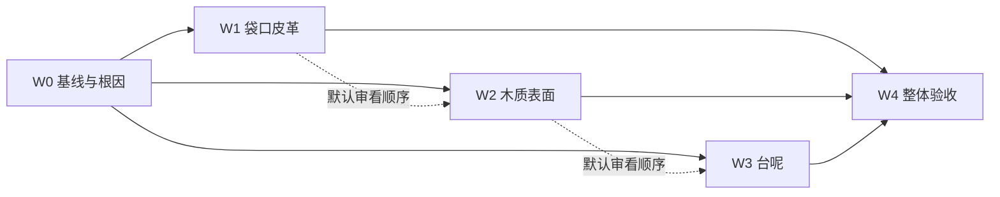

# 问题集合 v64：球桌材质质感提升

> **本文件是本轮需求真源。** 日期：2026-09-24；版本：**v64.3**。
> 状态：**W5 r4用户认可，正式资源及生成默认已固化；真机性能待验（2026-09-24）**。用户随后明确“好的，开始吧”，已授权按本方案实施。用户再次授权“直到完成所有任务”。W1 已接入 Blender 皮革细纹；逐批完成并继续 W2–W4。详见 [W0 诊断报告](tasks/materials-v64/W0-基线与诊断.md)。
> 本轮使用实际技能 [issue-collection-restructure](.cursor/skills/issue-collection-restructure/SKILL.md)。本文件覆盖球桌材质这一主题，不覆盖 v63 物理方案或每日清台持续性能方案；后续同主题修订升版本，高版本覆盖低版本。
> 排期前置：开始实施时重读本方案、项目适配器和最新 `tasks/PROGRESS.md`，核对共享文件当前改动。现有工作区含球杆、灯光、每日清台等未提交修改，当前文件内容才是本次诊断基线，不能只用 HEAD 代表基线。

## 1. 需求回显与本轮边界

### 1.1 用户已明确的要求

| 编号 | 用户原话 | 本方案承接的目标 |
|---|---|---|
| R01 | “现在球桌的袋口皮革材质，看起来太假了，感觉太过光滑，没有一点点质感” | 袋口呈现可辨认的皮革微表面，改善平滑塑料感 |
| R02 | “你觉得球桌呢？感觉好像也是稍微有点没质感” | 检查并改善整桌材质层次，重点是木质库边、桌身及台呢 |
| R03 | “使用issue-collection技能，写一个详细的方案吧” | 形成基于当前代码的方案、依赖批次与可验证验收标准 |
| R04 | “好的，开始吧” | 按本方案开始实施，逐批实证验收与回写 |

### 1.2 建议方向与工作假设（不是用户已拍板的具体效果）

- 保持当前默认“标准”球桌的炭灰木色、米色袋口、绿色台呢搭配，以材质响应改善为主；其余四种球桌风格及六种台呢颜色保持可用。
- 木材呈现克制的漆面柔光与细木纹；皮革呈现细颗粒和轻微不均匀反光；台呢呈现细绒感。近景能分清材质，中景能看到层次，正常全桌视角保持干净、便于判断球路。
- 优先解决袋口，再解决木质表面，最后调整台呢。此顺序依据当前证据和波及面制定，不等于台呢可以漏做。
- 不预先指定最终法线强度、粗糙度、纹理分辨率或皮纹尺寸；从真实参考及现有 App 基线推导并通过对照筛选。
- 不把“更亮、更粗、更旧”当成质感标准。是否需要明显压纹、褶皱或做旧，须有参考依据；本轮建议保持整洁、轻微自然变化。

### 1.3 实施范围与保护项

**核心范围**：`Leather`、`Wood`、`BlackWood`、`TaiNi` 的贴图、材质绑定、必要的局部 shader 响应，以及共享场景中换色、提取袋口和重建后的稳定性。

**关联检查**：桌腿 `MG_Gold`、袋口支架 `Gold/Black`、网兜与颗星 `White`，用于验证材质对比和共材质副作用；不因视觉检查而默认全面重做这些部件。

**保持现有行为**：球桌和袋口几何、UV 拓扑、尺寸、坐标、碰撞及物理；球和球杆外观；相机控制和页面布局；灯板、曝光、房间风格；偏好键、默认选择及历史已保存选择。若证据表明必须越界，先修订方案说明原因，不能在材质批次顺手改掉。

**共享影响口径**：以共享材质层解决，不给每个页面各做一套。每日清台的专属渲染 profile、曝光和镜头保持现有配置，不能借本方案把每日清台性能实验扩散到其他页面。

**视频口径**：检查 `useAppAppearance=true/false` 两条导出路径。跟随 App 外观的后续导出允许体现新材质；旧离线分支以当前基线作为保护对照。既有 MP4、封面和已确认视频不自动重新制作。

## 2. 已核实事实、视觉判断和未决问题

规划时核实日期：2026-09-24。以下 F01–F11 保留规划时证据边界；W0 已新增完整生产场景六机位、线性贴图消融和 Blender UV 测量，见 [W0 报告](tasks/materials-v64/W0-基线与诊断.md)。尚无本轮真机性能数据，尚未完成页面外观验收。

| 编号 | 已核实事实 | 对问题的解释与证据边界 |
|---|---|---|
| F01 | `TaiQiuZhuo.usdz` 内存在 `Leather_basecolor/normal/roughness/metallic.png`；本轮解包查看前三张，均为 2048×2048 | 不是完全没贴图。原底色以色斑、划痕为主，法线视觉变化细弱；这是图像观察，未证明 App 正确采样全部细节 |
| F02 | `MobileReferenceLighting.applySurfaceFinishes` 将 `Leather` 设为 `.constant`、`normal.intensity=0.5`，挂上 `satinShader` | 法线强度被设低属实；`.constant` 不等于无光照，因为自定义 shader 自行计算受光。强度与采样时序分别影响多少，需消融确认 |
| F03 | `PocketLeatherAppearance.material` 普通换色使用 `mix(source,tint,0.65)` | 在该线性混色步骤，源底色变化幅度剩 35%；不能把它说成最终屏幕“只剩 35% 质感” |
| F04 | 目标袋、第一袋、第二袋的保纹理分支，使用按旧 Leather 底色直方图拟合的 RGB gain；同袋双角色也走染色逻辑 | 新底色可能引起过曝、偏色或角色不可辨；主题染色与训练角色必须一起回归 |
| F05 | `TableAppearance.apply` 对非 `.standard` 样式的木材等分支设置 roughness=0.7、specular=0.15，并清掉 normal | 当前默认是 `.charcoal`，所以命中该分支。该行为不是所有原款木材都清法线；材质范围也不能只凭分支名认定 |
| F06 | `Wood/BlackWood` 被设为 `.constant` + `matteWoodShader`；该 shader 只计算漫反射照度和环境底量，没有镜面项 | 木纹有颜色、缺随视角变化的漆面响应有直接代码依据。只改 roughness/specular 数值，不会自动为此 shader 增加镜面反射 |
| F07 | 台呢生产路径保留原法线、粗糙度贴图，法线强度设为 0.65；`MobileTableRendering` 将二者 UV 缩放设为 2×、repeat | 不能断言“台呢没纹理”。实际纤维尺寸、屏幕像素覆盖、过滤和光照贡献需要测量 |
| F08 | `ClothAppearance` 原地更换颜色绑定，刻意保留材质对象，供接触阴影更新使用 | 台呢优化若整体替换材质对象，可能让阴影引用失效；颜色与纤维响应应保持独立 |
| F09 | `PocketLeatherMarker` 提前建立原色、目标、第一、第二、双角色材质；`addPocketMarkers` 使用 `TableAppearance` 保存的源材质 | 修改必须穿过“加载→材质处理→风格快照→提取→高亮→恢复”全链路，不能只在当前可见节点临时贴材质 |
| F10 | 设置页 `AppearanceCombinationPreview` 创建独立 `AngleTrainingScene`，实时套用球桌、台呢和房间偏好；不持续绘制 | 当前设置主预览不是单张 `TableStylePreview_*.png`。只更新静态预览 PNG 不能证明设置页效果已更新 |
| F11 | 当前共享场景由 `AngleSceneView` 套偏好；导出器有跟随 App 和独立离线两分支；每日清台另有专属 profile | 共享修改需覆盖这些消费者，但不能混淆材质改善与既有性能工作的完成状态 |

### 2.1 本轮已查看的视觉依据

- [自由击球实页](output/cue-grain-20260923/r20-app/freeplay.png)：近侧米色皮革表面层次较弱，深灰库边有木纹但受光偏平。
- [每日清台全桌实页](build/daily-camera-intent-20260923/standard/landscape-3d-overview.png)：大面积台呢较均匀，材料之间反光差异不明显；此图不足以判断真实皮纹尺寸和台呢近景质量。
- 原始皮革图从仓库 USDZ 只读解包到 `/tmp/qiuji-leather-audit-20260924/textures/` 查看。临时目录不作为长期交付证据；W0 需重新归档并记录源资产哈希。

### 2.2 W0 必须回答的问题

1. 六个袋口与库边的实际 UV 覆盖各多大？当前贴图在常用镜头下每个可见纹理单元占多少像素？角袋、中袋、侧壁是否发生拉伸或尺度失配？
2. `satinShader` 读取 `_surface.normal/roughness` 时，读到的是否为期望的贴图结果？用完整场景的可见响应验证，不以贴图属性非空作为结论。
3. 法线强度、染色对比度、粗糙度分布分别对皮革改善多少？先恢复现有资源的有效表现，仍不足时才更换贴图。
4. 木材应复用哪张法线/粗糙度？现有 `BlackWood` 有平坦法线的历史处理，不能简单全量恢复；新底色与候选微表面是否在方向、UV、尺度上匹配？
5. 台呢的平整感主要是纹理尺度/过滤，还是其明暗响应？桌面和库边包布能否用一致尺度呈现，而不产生绿胶条感？
6. `MG_Gold` 等非木材是否因主题通用分支被赋予木纹？先列对象—材质—区域映射，再决定是否属于本轮根因。

## 3. 方案目标与材质改法

### 3.1 R01：袋口皮革

**目标**：近看有细密、不规则的皮纹起伏，中景保留柔和的明暗破碎感；皮革仍是完整包覆表面，不变成砂纸、粗石头或湿亮塑料。

**实施顺序**：

1. 以 W0 对照证明当前贴图在运行时是否正确参与渲染；先修复绑定/执行顺序等确定问题。
2. 普通球桌换色保留源皮纹的亮度层次，颜色仍跟随样式。候选可采用受控的亮度重映射或色度替换，不继续靠大量纯色覆盖微细节；禁止把高光和阴影烘进底色冒充起伏。
3. 若现有皮纹仍不够，制作配套底色、法线和粗糙度候选，统一皮纹位置和尺度。允许很轻的细褶变化，不默认新增几何、缝线或破损。
4. 让细颗粒通过法线和局部粗糙度共同影响光线；提高法线强度只是候选变量，不能作为唯一方案。
5. 保留训练高亮语义。重新评估旧 RGB gain 对新底色的适用性；四类角色及清除后均保持纹理、可读颜色和正确区域。

**实现边界**：优先 App 内精确材质副本与打包纹理；不重导整张球桌作为第一步。确需 USDZ 改动时仅在副本验证，额外核对六袋提取、命名、UV、法线和几何不变量。皮革如需独立 shader，不直接改共享 `satinShader` 导致球杆皮头或杆身同步变样。

### 3.2 R02-A：木质库边与桌身

**目标**：当前木色和木纹保持辨识度，表面增加随视角变化的宽、弱、连续柔光；木纹与表层涂装有层次，边缘厚度可读。

**实施顺序**：

1. 按对象和真实可见区域确认 `Wood/BlackWood/MG_Gold` 的使用情况，保护网兜、金属与颗星。
2. 让样式切换保留与底色匹配的微表面通道，替代“一律清空法线、统一常数粗糙度”的处理。
3. 在现有光照下比较原漫反射、低成本柔光候选；原生 PBR 和局部自定义响应是可评估实现方式，不预先锁定。自定义 `.constant` 路径须真正加入正确的镜面贡献，不能只设置不会被使用的属性。
4. 微表面幅度克制，避免木材显得深雕、湿亮或像拉丝金属。不能把旧底色照片直接转强法线，因为颜色变化不等于表面高度。
5. 区分深色库边和桌身各自受光；先在局部材质解决，避免通过提升全场曝光把球、台呢和袋口一起洗白。

**实现边界**：恢复/改进木材响应不等于恢复历史全部渲染算法；保留当前每日清台 profile。未知的采样成本先做账单，避免为弱柔光增加逐像素高采样积分。

### 3.3 R02-B：台呢与库边包布

**目标**：正常全桌视角干净均匀，瞄准近景能感到细绒；掠射角出现轻微方向性层次，球、瞄准线和接触阴影仍清楚。

**实施顺序**：

1. 测量台呢 UV、世界尺度与近/中/远景屏幕尺度；使用实际相机缓慢移动观察过滤，不仅截一张静图。
2. 保留颜色选择独立，只调整有证据的纤维法线、粗糙度尺度和对比。优先复用现有贴图、采样与材质对象。
3. 若当前模型仍无法表现细绒，再评估轻量的掠射响应。不能把普通布料长毛、粗编织格或大面积噪点套到台呢上。
4. 同时检查库边包布与平面相接处：细节尺度一致、拉伸受控，阴影和褶边感来自正确材质/现有形状，不能加黑线掩盖。

**实现边界**：不改变台呢与球的摩擦、球速、轨迹；不替换正在被接触阴影持有的材质引用；不将每日清台仍未验收的台呢算法实验在全站默认启用。

## 4. 批次与依赖

每批按一个独立会话可实施并完成本批验收的粒度安排。量级为相对工作量，不是工时承诺。W4 设备暂不可用时保留未完成项，不能用电脑验收替代真机。

| 批次 | 范围 | 量级 | 依赖 | 主要交付 |
|---|---|---|---|---|
| W0 ✅ 2026-09-24 | 参考、材质链路、纹理尺度与固定基线 | 中 | 实施已获授权；共享源哈希核对一致 | [基线图、映射表、消融结论、候选方向](tasks/materials-v64/W0-基线与诊断.md) |
| W1 ✅ | R01 皮革、主题染色、角色高亮 | 中 | W0 | 皮革候选与共享集成、六袋状态回归 |
| W2 ✅ | R02-A 库边/桌身木材响应 | 中 | W0；默认在 W1 后 | 木材候选、五风格切换与材质隔离 |
| W3 ✅ | R02-B 台呢/库边包布 | 中 | W0；默认在 W2 后 | 纤维尺度和响应调整、六色与阴影回归 |
| W4 | 整桌、消费者、动态画面和真机成本验收 | 中 | W1、W2、W3 | 最终图组、消费者矩阵、设备对照、完成审计 |

W1–W3 技术上有相对独立部分，但共用灯光与材质文件；默认按顺序落地，保持每步影响可归因。方案不要求新建智能体或选择模型。

### W0：可比较基线与根因确认

**范围**：只为材质改善建立足够的证据，不扩成整套渲染重写研究。

- 归档当前源资产/相关贴图 SHA-256、工作区差异、构建配置、设备/Runtime、页面入口、相机、灯光、曝光、房间、球桌与台呢样式。
- 收集少量真实球桌的皮革包口、涂装木质库边、台呢近景参考，记录来源和对应观察点。参考用于确定细节类型与尺度；不直接复刻照片里的整体灯光或使用来源不明贴图。
- 导出运行时材料清单：可见节点、材质名、贴图类型/尺寸、normal intensity、roughness 绑定、UV transform、shader、主题和高亮覆盖顺序。
- 建立“全桌→中景→角袋→中袋→木质库边→台呢掠射”六机位，记录完整场景配置；另观察短段旋转/缩放，检查细纹闪烁。
- 单变量对照皮革染色、法线参与、木材镜面响应、台呢纹理尺度。每次只动候选副本，不将调试结果提前当成正式设置。

**完成标准**：

- [x] 六机位原图、配置清单、源哈希和材料映射可复现；近景不是放大低分辨率截图。
- [x] F01–F11 和 §2.2 各问题有“已证明/未证明/不适用”的结论及证据，明确 custom shader 实际使用了哪些输入。
- [x] 三种材质各形成一个优先实现方向与淘汰理由；没有依据时保留待验证，不填写虚构参数。
- [x] 建立后续性能比较的资源/绘制成本基线；现有性能欠账单独标记。

### W1：袋口皮革

**主要文件**：`PocketLeatherAppearance.swift`、`MobileReferenceLighting.swift` 的 Leather 路径、必要的专用纹理；按根因触及 `PocketLeatherMarker.swift`，不默认改提取网格。

- 实现 §3.1 胜出方案，明确贴图/参数由哪一层持有，防止主题切换和重建覆盖。
- 先做局部材质，再接完整 `AngleTrainingScene` 初始化；改 shader 时隔离球杆共用逻辑。
- 对角色染色保留原色→目标→第一/第二→同袋双角色→清除的闭环。

**完成标准**：

- [x] 同灯光同机位前后图中，角袋和中袋近景均可辨细纹，正常全桌画面不脏、不闪、不明显重复；至少两个观察方向有动态受光差异。
- [x] 六袋原色、选中、第一/第二、双角色、清除及换主题后无串色；袋口命中、洞口通透、原网兜与球优先级保持。
- [x] 完整场景初始化、重复应用、袋口提取前后、场景重建与两个独立场景均稳定；必要时增加针对真实生命周期回归的测试。
- [x] 球杆皮头、杆身、球材质在对照中无非预期变化；相关构建和定向测试通过并记录实际执行数。

### W2：木质库边与桌身

**主要文件**：`TableAppearance.swift`、`MobileReferenceLighting.swift` 的 Wood/BlackWood 路径、`TableStyles` 贴图；确需改生成器时使用 `scripts/blender/build_table_styles.py`，先改为可写候选目录，避免直接覆盖正式图。

- 实现 §3.2 胜出方案，定义底色、微表面、照明各层责任；避免主题 `apply` 覆盖已经校准的粗糙度/法线。
- 明确原款 `.standard` 与默认 `.charcoal` 的差异，保留原款颜色身份；五样式不能被同一套强纹理抹成相同外观。

**完成标准**：

- [x] 默认炭灰近/中景能看出弱漆面柔光和木纹层次，转角高光连续，无硬白斑、黑边、非有限像素或贴花感。
- [x] 五种球桌样式在同配置下审看，浅色不洗白、深色不糊黑；原款切回可恢复本轮定义的源材质，不累积处理。
- [x] 颗星开关不染台内置球点、不隐藏网兜；袋口支架与皮革颜色保持各自材质含义。
- [x] 换样式、重建、设置预览与另一训练场景之间没有材质串用；W1 的皮革表现保持。
- [x] 相关构建及 `TableAppearanceTests` 定向回归通过；GPU/贴图资源增量有记录。

### W3：台呢细绒与包布一致性

**主要文件**：`MaterialFactory.swift` 台呢增强、`MobileTableRendering.swift` 台呢 UV 设置、`MobileReferenceLighting.swift` 台呢响应；`ClothAppearance.swift` 原地换色契约保持。

- 实现 §3.3 胜出方案，记录实际纹理尺度和过滤选择；不直接以“原图 2K 不够”作为升级理由。
- 组合 W1/W2 的结果再看全桌，避免为了台呢更显眼牺牲材料对比和球路可读性。

**完成标准**：

- [x] 近景细绒可读，中远景干净；俯视、低角度、缓慢旋转/缩放没有摩尔纹、闪烁、砂纸颗粒或大块斑驳。
- [x] 六台呢颜色完成同机位图组；绿色、赛事蓝另做低角度运动观察，浅/深色无细节被吞或过强噪点。
- [x] 库边包布与平面尺度合理，球边缘、号码、瞄准线、接触阴影仍清楚。
- [x] 换色、场景重建、移动球影、皮革角色与颗星显示正常；保留台呢材质引用和每日清台 profile。
- [x] `ClothAppearanceTests` 及确实受影响的渲染/阴影定向回归、相关构建通过；记录新增采样、内存和材质状态。

### W4：整体验收与交付

**范围**：核对实际消费者、最终组合和动态表现，完成 §5 的矩阵；不重开已淘汰候选。

- 正常 App 入口验证，而非只用单材质球或无房间离屏场景；检查无实验启动参数时安装的实际效果。
- 核查打包资源及生成配置，更新仍在使用且内容过时的静态预览；设置主预览按实时场景验收。
- 对两个视频外观分支做定向静帧回归，不重新导出既有视频。如果执行中新增短动态验收片，明确它是验收附件，不算视频台账新选题。
- 汇总每批的视觉、生命周期、资源和性能证据；状态分别报告，保留未完成项。

**完成标准**：

- [ ] §5 所有必选项已有证据与结论，用户反馈过的平滑皮革、木材平面感、整桌层次弱逐条对照。
- [ ] 最终真实 App 图、动态观察和机位配置齐全；Blender 图、离屏渲染、App 截图、真机结果分别标注。
- [ ] 真机同条件对照未出现明确 GPU、帧间隔、首次交互或持续热表现回退；设备不可用则整体保留“真机验收待完成”。
- [ ] 相关构建/定向测试、`verify-gate`、文档门禁和本轮 diff 检查有真实输出；既有失败与本轮引入分开，不删除断言求绿。
- [ ] 更新任务状态，交付变更、证据、资源来源、回退方法和剩余问题。视觉最终认可单列，不以测试通过代替用户观感。

## 5. 验收矩阵与测量口径

### 5.1 必选覆盖

| 维度 | 最小覆盖 | 主要检查 |
|---|---|---|
| 基准镜头 | 全桌、中景、角袋、中袋、木质近景、台呢掠射 | 原图对照，参数一致；至少补一次缓慢旋转和缩放 |
| 球桌风格 | charcoal、standard、walnut、ivory、blossom | 默认与保存选择不变；明暗两端、原款恢复、材质差异 |
| 台呢颜色 | 六色静帧；绿/蓝动态近景 | 换色保细绒，接触阴影与球的台呢反光颜色仍匹配 |
| 袋口状态 | 六袋原色/目标；第一、第二、同袋双角色与清除；换主题及重建 | 角色区域、颜色、纹理和命中一致，无残留 |
| 场景/页面 | 自由击球、每日清台、分离角与走位、一个实际袋口角色使用页、设置搭配预览 | 共享材质实际接线；角色页具体入口 W0 从当前调用者确认 |
| 模式 | 2D、3D，3D 瞄准与观察，模式往返 | 不漏绑、不错误拉伸，不改镜头和击球方向 |
| 消费分支 | 正常 mobile、现存 plain/enhanced；导出 useAppAppearance 两分支 | 增强范围和保护范围明确，不偷偷改 legacy 外观 |
| 系统/尺寸 | 标准 iPhone 与小屏 iPhone；iOS17 路径和当前 Runtime；iPad 一轮全桌/近景 | 材质编译、画面正常；不是仅编译通过 |
| 外观/房间 | 设置页 Light/Dark；当前默认房间和差异最大的一种房间 | 不误认 UI 深浅主题等同 3D 灯光；曝光、颜色稳定 |
| 真机动态 | 静止、休眠后首拖/首瞄准、正常击球、实际开球、持续操作 | GPU/帧间隔、资源与热行为，保持原有休眠策略 |

不要求将以上维度全部笛卡尔积相乘。默认组合做全流程，其余样式/系统按风险选配；每一个维度都须有落点和证据，失败后扩展该维度复验。

### 5.2 比较与性能边界

- A/B 固定场景、球位、相机、灯光、曝光、房间、分辨率和抗锯齿；候选与基准只有目标材质差异。近景可以另设观察相机，但两图用相同配置。
- 静图使用原始像素审看，不能靠后期锐化/调色改善验收图；动态观察区分纹理闪烁、几何锯齿与屏幕录制压缩。
- 资源账单包含纹理尺寸/通道/解码内存、缓存实例数、shader 采样和额外 pass；文件压缩体积不等于 GPU 内存。
- 真机沿用独立的 `ios-device-performance` 工作流：同设备、同构建配置、相同起始热状态和亮度，默认无线、不充电，基准与候选交错采样；异常漂移样本作废。
- 数值阈值在 W0/真机基线阶段依据重复性冻结，不先承诺任意百分比，也不见结果后放宽。至少要求未增加静止持续渲染、没有明确超出基准波动的持续成本回退，首拖/首瞄准和实际开球不退化。
- 不以降帧、降分辨率或削弱已有球影换取“材质升级通过”。持续热问题原本未闭合，本轮最多证明相对当前基线未恶化，不能据此宣布旧性能问题解决。

## 6. 已核实锚点索引

行号为 2026-09-24 当前工作区定位点，执行前以符号重新定位；下列路径已读取核实。

| 路径与行号 | 符号/作用 | 批次 |
|---|---|---|
| `QiuJi/Core/Scene/TableModelLoader.swift:72` | `parseModelScene`；USDZ 真正加载入口、缓存与实例隔离 | W0/W4 |
| `QiuJi/Resources/TaiQiuZhuo.usdz` | Leather/TaiNi/Wood 等源材质与几何 | W0–W3 |
| `QiuJi/Core/Scene/AngleTrainingScene.swift:21` | `configureDailyClearanceRendering`；每日专属 profile/曝光/镜头 | W0/W4 |
| `QiuJi/Core/Scene/AngleTrainingScene.swift:46` | `applyClothColor`；台呢与球面反光颜色联动 | W3/W4 |
| `QiuJi/Core/Scene/AngleTrainingScene.swift:64` | `applyTableStyle`；主题与已有皮革 marker 联动 | W1/W2 |
| `QiuJi/Core/Scene/AngleTrainingScene.swift:172` | `setupScene`；材质、照明、外观应用顺序 | 全批 |
| `QiuJi/Core/Scene/AngleTrainingScene.swift:1760` | `addPocketMarkers`；源材质与六袋提取 | W1 |
| `QiuJi/Core/Scene/PocketLeatherMarker.swift:13` | 初始化原色/角色变体、保存与恢复 | W1 |
| `QiuJi/Core/Scene/PocketLeatherAppearance.swift:6` | 主题混色、角色 gain、satin 前置染色 | W1 |
| `QiuJi/Core/Scene/MobileReferenceLighting.swift:351` | Wood/BlackWood 材质改为自定义漫反射 | W2 |
| `QiuJi/Core/Scene/MobileReferenceLighting.swift:542` | `applyHighlightHeadroom`；共用高光余量，保护项 | W0/W4 |
| `QiuJi/Core/Scene/MobileReferenceLighting.swift:607` | `applySurfaceFinishes`；球杆与 Leather 共用 satin | W1 |
| `QiuJi/Core/Scene/MobileReferenceLighting.swift:663` | `satinShader`；自定义皮革/球杆受光 | W0/W1 |
| `QiuJi/Core/Scene/MobileReferenceLighting.swift:685` | `matteWoodShader`；木材只有漫反射响应 | W2 |
| `QiuJi/Core/Scene/MobileReferenceLighting.swift:811` | `clothShader`；台呢受光/直接球影耦合 | W3 |
| `QiuJi/Core/Scene/MobileTableRendering.swift:40` | `applyLighting`；台呢 UV 2×、原 BlackWood 法线处理 | W0/W2/W3 |
| `QiuJi/Core/Scene/MaterialFactory.swift:113` | `enhanceClothMaterials`；法线强度与粗糙度保留策略 | W3 |
| `QiuJi/Core/Scene/TableAppearance.swift:3` | `TableStyle`；默认 charcoal、五种风格与配色 | W0/W2 |
| `QiuJi/Core/Scene/TableAppearance.swift:136` | `apply`；换色覆盖、颗星/网兜保护、材质副本 | W1/W2 |
| `QiuJi/Core/Scene/ClothAppearance.swift:71` | `apply`；原地颜色绑定，不替换材质引用 | W3 |
| `QiuJi/Core/Scene/AngleSceneView.swift:82` | 当前偏好应用到真实 SCNView 场景 | W4 |
| `QiuJi/Features/Profile/Views/AppearanceCombinationPreview.swift:13` | 实时设置预览、独立场景与按需绘制 | W4 |
| `QiuJi/Features/Profile/Views/TableStyleSelectionView.swift:9` | 球桌设置使用实时搭配预览 | W4 |
| `QiuJi/Features/Profile/Views/ClothColorSelectionView.swift:9` | 台呢设置使用实时搭配预览 | W4 |
| `QiuJi/Data/Services/UserPreferences.swift:161` | 台呢/球桌偏好持久化；默认在 253–254 行 | W4 |
| `QiuJi/Core/Media/SequenceVideoExporter.swift:1016` | `useAppAppearance` 两条场景创建路径 | W4 |
| `scripts/blender/build_table_styles.py:1` | 从原木纹生成四种底色，脚本直接写资源目录 | W2 |
| `project.yml:44` | App sources/resource 范围；120 行显式 USDZ 资源 | W4 |

### 6.1 可复用的测试入口与限制

以下是现有入口，不代表本轮已经运行或全部足够：

- `QiuJiTests/TableAppearanceTests.swift:42`：跨 pipeline 切换、恢复和场景隔离；`:86` 五样式渲染，但隐藏房间，不能作为完整 App 观感验收；`:227` 皮革主题/角色；`:251` 提取与场景重建。
- `QiuJiTests/PocketLeatherIntegrationTests.swift:14`：染色路径；`:39` 六区隔离恢复；`:64` 真实命中；`:105` plain/enhanced 与双角色。现有部分断言匹配 shader 文本；若实现改写，需先证明其语义仍被覆盖，禁止机械删断言。
- `QiuJiTests/ClothAppearanceTests.swift:21`：隔离、恢复和阴影绑定；`:65` 六色图；`:69` 参考灯光与台呢反光。
- `QiuJiTests/RenderQualityV62Tests.swift:80`：每日 profile 隔离；`:9971` 外观与袋口；`:10014` 两种导出外观静帧。诊断测试有运行门控，执行前检查前置；skip 或 0 测试不算通过。
- `QiuJiUITests/TableStyleUITests.swift:4`：保存、预览与训练页；`:50` 颗星；`:88` 搭配联动。

只为材质覆盖顺序、角色恢复、引用隔离等真实回归风险补测试，不把每个美术参数值都写成单元测试。材质真实感主要用固定机位/动态证据验收。资源生成和写盘型诊断先确认输出目录，不跑全套渲染诊断覆盖历史证据，也不要求整个脏工作区“零 diff”。

## 7. 风险、回退与证据归档

| 风险 | 预防与回退 |
|---|---|
| 只调属性，custom shader 实际不使用 | W0 实际采样/可见对照；无效方案不进入后批 |
| 改皮革误改共用 satin 的球杆 | Leather 路径隔离；固定球杆对照图/材质状态回归 |
| 新底色配旧 gain 产生高亮溢出 | 重新检查角色与双角色；先限制改动在精确材质副本 |
| 材质名覆盖多个视觉区域 | 对象/面区域映射；保留 FL-061 的 White 颗星与台内点保护 |
| 新纹理太细/太粗，动态闪烁或重复明显 | 原像素近/中/远三尺度审看，慢转/缩放；按尺度与过滤改正 |
| 台呢替换材质后球影失联 | 保持对象引用或显式重绑并测试；禁止仅看静态截图 |
| 纹理内存或采样成本增大，破坏每日性能进展 | 每批资源账单，W4 真机 A/B；候选独立可回退，不恢复持续绘制 |
| 只改生成产物，重生成后丢失资源 | 检查 `project.yml`、生成工程与实际 Bundle；只在确需时改配置 |
| 与现有未提交工作冲突 | 开工记录共享文件差异，局部应用变更；回退本批 hunk/候选资源，不能 reset 整个文件或仓库 |

建议实施证据根目录：`output/table-materials-v64/`（本轮未创建）。每批子目录存 `REPORT.md`、运行配置、资产清单/哈希、前后原图、必要的动态附件、日志和结果摘要。实现测试不得写回源资源作为默认副作用。

每批报告至少回答：改了什么、哪条根因被证明、实际跑了哪些测试及数量、图片来自哪个入口、设备/构建配置、未验项目、下一步。失败候选和失败日志保留，最终只集成胜出方案；不提交临时参考大图或 `.blend` 母版到 App Bundle。

## 8. 当前完成度与下一步

| 项目 | 状态 |
|---|---|
| 用户诉求与共享链路诊断 | 已完成只读检查，事实/假设见 §2 |
| 本方案与代码锚点 | 已整理；实施前需按最新代码复核 |
| W0 基线/参考/消融 | 完成，见 W0 报告；保留基准为 r4 |
| W1 皮革 | 已完成，见 W1 报告 |
| W2 木质表面 | 完成，见 W2 报告 |
| W3 台呢 | 已完成，见 W3 报告；真机连续运动由 W4 验收 |
| W4 整体验收 | 实际页面与跨设备矩阵进行中；真机待就绪 |

**下一步**：完成 W4 最终记录与真机对照。电脑端三设备同版本矩阵各27功能/渲染＋3页面测试通过；最后legacy边界保护另做定向复验。真机热状态和方便占用的询问仍待答复，全仓门禁另有并行页面路由漂移，不能标记全案完成。

## 9. 版本记录

| 版本 | 日期 | 变更原因与内容 |
|---|---|---|
| v64.0 | 2026-09-24 | 按用户要求使用 issue-collection 技能，整理皮革和整桌材质问题；核实共享材质、设置实时预览、角色高亮和导出链路，形成五批实施与验收方案；尚未实施 |

### v64.1 实施检查点（2026-09-24）

W0 完成。源 USDZ 和7个生产材质链路文件哈希未改变；新增 opt-in 诊断 XCTest 与 Blender 只读审计脚本。最终 r5：Executed 1 test，0 failures；皮革原生 normal/roughness 消融无像素响应，显式线性采样有效但原图细节弱；木材直接PBR候选洗白被淘汰；台呢法线有效。角/中袋UV尺度差异已测量。下一批W1依赖就绪，按既有授权继续；W1–W4及真机验证均未完成。

### W1 执行回写

皮革完成；见 [W1 报告](tasks/materials-v64/W1-皮革实施.md)。21 条功能回归通过；最终截图测试单独运行 1 条通过。原 USDZ 未变。当前 W2 木材柔光候选正在验证。

### W2 执行回写

木材柔光完成，见 [W2报告](tasks/materials-v64/W2-木材实施.md)。五主题图组与8条定向测试通过；W3保持原细纹尺度，轻微绒感候选进入联合回归。

### W3/W4 执行回写

[W3报告](tasks/materials-v64/W3-台呢实施.md)、[W4验收](tasks/materials-v64/W4-验收与交付.md)、[资源来源与复现](tasks/materials-v64/资源来源与复现.md)。W1–W3的动态判断限于已归档采样与模拟器，真机连续动态/性能仍由W4关闭。原USDZ不变，冻结基准/候选同代码版本独立构建。未提交发布。

## 2026-09-24 用户反馈修订：W5

原W1视觉结论经用户内壁截图打回（FL-088）。增加颗粒尺度、内壁低位及正常距离验证，详[W5返修报告](tasks/materials-v64/W5-皮革内壁返修.md)。用户已认可r4并授权正式应用；正式资源及生成默认值已固化，重烘焙两张PNG与r4及生产资源SHA256完全一致。W1旧勾选为历史记录，以W5为当前视觉结论；W4真机性能仍待。
